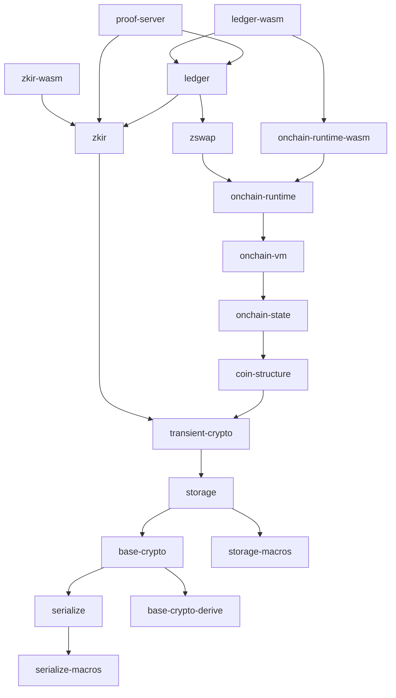

# Midnight Ledger

This repository contains the implementation of Midnight's ledger, as well as
[documents specifying its behaviour](./spec/). It defines the transaction structure and
state of Midnight, as well as providing Rust and WASM TypeScript APIs to
interact with it.

A good starting point to understanding the ledger is [reading the
specification](./spec/).

## Quick Start

The ledger currently requires [Nix](https://nixos.org/) to build and bootstrap.
We use the [flakes](https://nixos.wiki/wiki/Flakes) experimental features for
nix, which can be enable as part of the nix configuration, or by adding
`--extra-experimental-features 'nix-command flakes'` to the below `nix`
commands. Once nix is installed, the development shell of the ledger can be
entered simply with:

```console
$ nix develop
```

This opens a sub-shell with the correct development environment set-up. If you
use [direnv](https://direnv.net/), this should work out of the box with Nix
installed, by running:

```console
$ direnv allow
```

### Building and testing

Once the devshell has been opened, the ledger behaves as a standard rust project, and can be built with

```console
$ cargo build
```

Rust-side tests can be run similarly with

```console
$ cargo test
```

Note that by default, rust-side tests do *not* do proving. To enable this, pass
the `--release --features proving` flags to `cargo test`. `--release` is
strongly recommended for proving-enabled tests.

Running WASM/TS tests is more involved, as it requires first requires a
complete 'formal' build through `nix`:

```console
$ nix build
$ ./run_it.sh
```

Note that `nix build` internally runs the rust-side tests, checks `cargo fmt`,
and produces optimized build targets, so this is an expensive step.

### Generating documentation

Once in the devshell, it *is* possible to generate rust-side documentation
simply with `cargo doc`. However, we also provide a nix-built documentation
command, which uses unstable rust features to provide more information about
features in the generated docs. This may be run with `nix run .#doc`, placing
generated documentation in `target/doc`.

The TS API docs for `ledger-wasm`, `onchain-runtime-wasm`, and `zkir-wasm` can each be generated by running:

```console
$ cd <package>
$ npm install
$ npm run build:markdown-docs
```

## Project Structure

The Midnight ledger is predominantly a rust project, structured as a workspace
with multiple sub-crates. Below is a table explaining the function of each crate.
They are presented here in their direct dependency order, with a table explaining the purpose of each crate below.



| Crate | Purpose |
| ----- | ------- |
| `base-crypto` | Provides basic cryptographic (and a few other) primitives, such as hashing and signatures |
| `base-crypto-derive` | Provides derive macros for representation traits, exposed through `base-crypto` |
| `coin-structure` | Provides structural information about coins, such as address and token type format |
| `generate-cost-model` | Utility crate for generating the ledger's cost model from benchmarks |
| `ledger` | The main implementation of transaction behaviour |
| `ledger-wasm` | Provides WASM bindings to the entire ledger stack |
| `onchain-runtime` | Provides the full runtime for contracts to interact with |
| `onchain-runtime-wasm` | Provides WASM bindings the the contract runtime |
| `onchain-state` | Provides contract state format |
| `onchain-vm` | Provides the VM that contracts may execute on-chain (Impact) |
| `proof-server` | A simple HTTP wrapper of proving |
| `serialize` | Provides serialization traits and top-level methods |
| `serialize-macros` | Provides derive macros for serialization traits, exposed through `serialize` |
| `storage` | Provides the ledger's storage layer and basic stored data types |
| `storage-macros` | Provides derive macros for storage traits, exposed through `storage` |
| `transient-crypto` | Provides proof-system related cryptographic primitives, that may be changed over time |
| `zkir` | Provides the zero-knowledge IR and IR to circuit compiler |
| `zkir-wasm` | Provides wasm-side proving for zkir v2 |
| `zswap` | A shielded token implementation with atomic swaps |

Some of these rust crates use feature flags. For the most part, using default features is the best approach, however the following feature flags may be useful:

| Flag | Purpose |
| --- | --- |
| `binary` | Enables the ZKIR binary target, to avoid polluting downstream dependencies with CLI dependencies. |
| `cli` | Enables CLI features in `base-crypto`, mainly used to provide the `zkir` binary |
| `mock-verify` | Enables a mock  verification mode to allow testing large quantities of transactions without the expensive proving step. Replaces proof verification with one that has comparable performance characteristics, but never fails. |
| `parity-db` | Enables the [parity-db](https://github.com/paritytech/parity-db) storage backend. |
| `proof-verifying` | Enables proof verifications. Enabled by default, except in the wasm targets, as this embeds verifier keys into binary artifacts and artifact size is a concern there. |
| `proptest` | Enables property testing implementations. Enabled by default for crate tests. |
| `proving` | Enables proofs in tests and benchmarks. Note that the library *will* have proving capability, even when not enabled. |
| `stress-test` | Enables expensive storage tests. |
| `sqlite` | Enables the [SQLite](https://sqlite.org) storage backend. |
| `test-utilities` | Enables testing helpers in the `ledger` crate, and loosens some well-formedness checks very slightly. |
| `unstable` | Enabled transitively for unstable feature flags, and refuses to build unless the `MIDNIGHT_LEDGER_EXPERIMENTAL` environment variable is set. |
| `vendored` | A feature of `onchain-runtime` that will skip the build of compact macros that would require scheme dependencies for downstream crates otherwise. Enabled by default. |

In addition to the rust crates, there are some notable directories and files captured in the table below:

| Path | Function |
| ---- | -------- |
| `.tag-decompositions/` | Provides breakdowns of data types used to ensure data formats are not accidentally modified |
| `docs/` | Contains generated TypeScript documentation from wasm/TS outputs |
| `integration-tests/` | Contains TypeScript-side integration tests |
| `scripts/` | Contains disparate scripts that have no other home |
| `spec/` | Contains documents specifying the intended behaviour of the ledger |
| `static/` | Contains zero-knowledge key material that is included in build artifacts to simplify the build process of the ledger as a library |
| `wasm-proving-demos/` | Contains proof-of-concept work demonstrating in-browser proving |
| --- | --- |
| `bagel.nix` | Custom build script for WASM targets |
| `flake.nix` | Nix build specification and devshell specification |

## Advanced Usage

### Running benchmarks

The ledger comes with a suite of benchmarks for various basic operations. These
can be run with `cargo bench`, however be warned that in particular the onchain
VM benchmarks can take over a day to run! It's recommended to only run a subset
of the benchmarks in most cases.

### Making a Release

1. For each crate assess the relevant `CHANGELOG`s and update the versions in `Cargo.toml` for rust only crates, and in `Cargo.toml` and `package.json` for wasm components.
2. Update the `CHANGELOG`s to capture the features of the new versions
3. Commit changes to a release branch, open a PR for review in the ledger repo
4. Run "Publish Ledger Release" against the release branch
5. After the run is successful merge the PR into main, (bug: this requires squashing CI-generated commits are not signed)

### Integration tests

The TypeScript integration tests have [their own README covering more
specialized usage](integration-tests/README.md).
