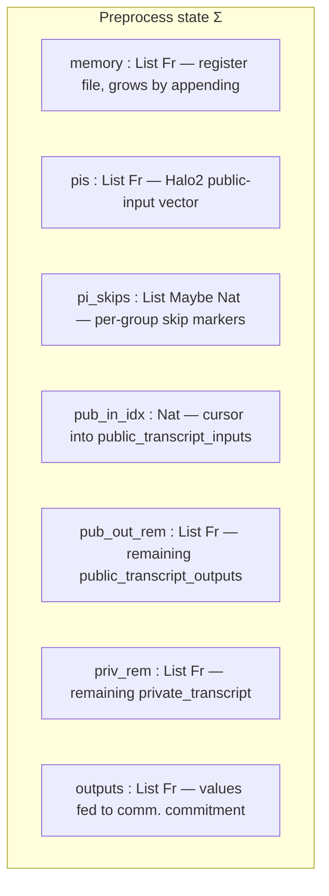
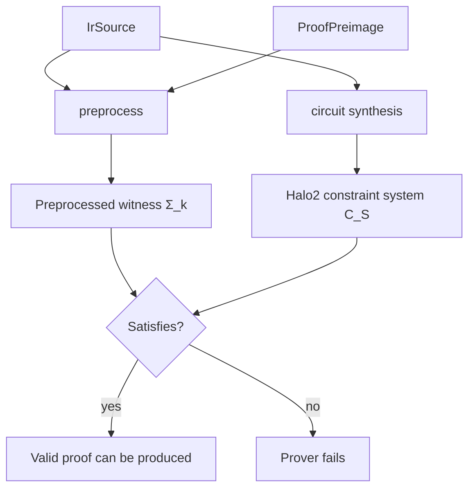

# ZKIR v2 — Language Specification

**Status:** Working draft.
**Source of truth:** the Rust implementation in [midnight-ledger/zkir/src/](../../zkir/src), in particular [ir.rs](../../zkir/src/ir.rs) and [ir_vm.rs](../../zkir/src/ir_vm.rs).
**Mechanisation:** a machine-checked Agda formalisation of §3–§6 accompanies this spec in [src/zkir-v2/](../src/zkir-v2/). It typechecks under `--safe` with **no postulates**; the entire trust base is collected into a single `Assumptions` record (see §6.2). The preprocess semantics (§4), the constraint-emission contracts (§5.2), the producer obligations (§6.4), the operational properties P1–P4, the faithfulness bridge **Property P5** (§6.2), and **statement soundness** (§6.2 — every satisfying witness of a producer-safe circuit arises from a preprocess run) are all mechanised, modulo that trust base.
**Versions covered:** ZKIR major version 2. Two minor versions exist: **V0** (original release; bit-bound constraints enforced by explicit little-endian bit decomposition in-circuit) and **V1** (current default; functionally identical to V0 at the preprocess level but with optimised Halo2 lowerings for `CondSelect`, `ConstrainBits`, and `ReconstituteField`, and more `pow2range` columns). The preprocess semantics (§4) does not depend on the minor version; only the in-circuit lowering does.

This document specifies ZKIR v2: its abstract syntax, the witness-population (*preprocess*) semantics, the Halo2 *circuit* semantics, the relationship between the two, and the correctness and security properties an implementation must satisfy.

### Spec → mechanisation map

| Spec section | Agda module | Contents |
|---|---|---|
| §3.1 Abstract syntax | [`Syntax`](../src/zkir-v2/Syntax.agda) | `Index`, `IrMinorVersion`, `IrSource`, the 26 `Instruction`s |
| §4 Preprocess semantics | [`Semantics`](../src/zkir-v2/Semantics.agda) | preprocess state, `init`, the relational step `R-instr`/`R-instrs`, acceptance `R` |
| §5.2, §5.5 Circuit semantics | [`Circuit`](../src/zkir-v2/Circuit.agda) | `Expr`/`Constraint` vocabulary, `Circuit` syntax, synthesis `circuit`, the `holds`/`satisfies` interpreter |
| §6.4 Producer obligations | [`Obligations`](../src/zkir-v2/Obligations.agda) | O0–O3 as linear-scan checkers; `producer-safe` |
| §6.4 (soundness of obligations) | [`ObligationsSoundness`](../src/zkir-v2/ObligationsSoundness.agda) | the static scans imply the dynamic `is-bit`/`fits-in` facts |
| §6.2 Property P5 | [`CircuitProof`](../src/zkir-v2/CircuitProof.agda) | the program-level induction discharging `circuit-faithful` (both directions) |
| §6.2 statement soundness | [`StatementSoundness`](../src/zkir-v2/StatementSoundness.agda) | `circuit-statement-sound`: every satisfying witness is the canonical witness of a preprocess run; `circuit-witness-characterization`: with P5 (`⇒`), exactly the canonical witnesses |
| §6.2 extraction uniqueness | [`StatementUniqueness`](../src/zkir-v2/StatementUniqueness.agda) | `circuit-statement-unique`: the realising run is unique (for `CommWF` preimages); `circuit-statement-sound-unique`: exactly-one packaging |
| §6.1–§6.2 statements | [`Properties`](../src/zkir-v2/Properties.agda) | P1, P2 (as length monotonicity), P4 as theorems; P3 by construction; re-exports `circuit-faithful` |
| Trust base (§6.2 part b) | [`Assumptions`](../src/zkir-v2/Assumptions.agda) | field/curve/hash primitives + arithmetic axioms, as a module parameter |
| Whole development | [`Main`](../src/zkir-v2/Main.agda) | imports everything; typechecks the development |

---

## Table of contents

1. [Introduction](#1-introduction)
2. [Overview](#2-overview)
3. [Syntax](#3-syntax)
4. [Preprocess semantics](#4-preprocess-semantics)
5. [Circuit semantics](#5-circuit-semantics)
6. [Properties](#6-properties)
7. [Limitations and motivation for v3](#7-limitations-and-motivation-for-v3)
8. [Appendix A — Glossary](#appendix-a--glossary)

---

## 1. Introduction

### 1.1 Conventions

- `Fr` denotes the BLS12-381 scalar field. `FR_BITS = 255`, `FR_BYTES_STORED = 31`. `0` and `1` denote the field's additive and multiplicative identities; we identify booleans with `{0, 1} ⊂ Fr`.
- "Memory" always means the register file `M : Fr*` introduced in §4.1. Indices into `M` are natural numbers.
- `M[i]` is the i-th memory cell; `xs ++ ys` is concatenation; `xs[k:]`, `xs[:k]` are slices.
- "UB" stands for *undefined behaviour* — a precondition the language assumes the producer of the circuit has discharged (§4.6).

### 1.2 What ZKIR is

ZKIR ("zero-knowledge intermediate representation") is the low-level circuit description language that Midnight's Compact contract compiler emits and that Midnight's Halo2/PLONK-based proof system consumes.

At a high level, each ZKIR program defines an **NP relation** `R(x, w)`. The instance `x` and witness `w` are drawn from data flowing through a fixed set of *side-effect channels* (transcripts, public-input vector, communications commitment) — though some of that channel data is also incorporated at the call-transaction level to describe how a circuit call interacts with circuits in other contracts.

> **TODO:** Specify precisely how the data in each side-effect channel maps onto the ZK instance (`x`) and witness (`w`), and what is exposed at the call-transaction level versus consumed internally.

Like all ZK circuits, a ZKIR source has **two semantics that must agree**:

- as a **witness-generation function** (*preprocess*, §4) — given a *proof preimage* (inputs, transcripts, randomness), the circuit executes forward as a register machine to populate the register file and drive the side-effect channels. If execution completes without a constraint violation, the resulting register-file state is the satisfying assignment handed to Halo2. The side-effect channels are part of *this* semantics: they are the mechanism by which instance and witness data flow into and out of the circuit at runtime.
- as a **constraint-system blueprint** (*circuit synthesis*, §5) — the same instructions are lowered to a Halo2 PLONKish constraint system. Here, only the **public-input vector** is visible as the external interface; transcript reads become unconstrained witness wires (which is why the backward direction of P5 is the non-trivial one — see §5.2 and §6.2).

The prover succeeds if and only if witness generation succeeds, i.e. iff `R(x, w)` holds for the supplied `(x, w)`. That this *iff* holds is **Property P5** (§6.2) — the faithfulness bridge and the load-bearing theorem of the mechanisation.

ZKIR is deliberately minimal: the instruction set is a straight-line, untyped sequence of 26 primitive operations over a single register file of elements of `Fr` (the scalar field of BLS12-381), with no structured control flow and single-assignment semantics. This is what makes the two-semantics correspondence tractable to formalise and verify.

ZKIR sits between the Compact compiler and the proof backend: the `zkir` binary compiles a `.zkir` (JSON) or `.bzkir` (tagged binary) source into a prover/verifier key pair; at runtime the protocol layer (Zswap, Dust, the contract runtime) supplies the preimage, the prover runs preprocess and hands the witness to Halo2, and the verifier reconstructs the public-input vector from the public transcript. *(informative)*

### 1.3 Design philosophy

ZKIR v2 takes a deliberately minimal, register-machine view of circuits. Four commitments shape the semantics:

- **Untyped, single-assignment.** Every value is a BLS12-381 scalar (`Fr`). Operands are non-negative indices into a *memory* whose i-th cell is bound exactly once by the instruction that produced it. No named variables, no type annotations, no scopes.
- **No structured control flow.** The instruction stream is straight-line. Conditional behaviour is expressed by computing a boolean and threading it through `CondSelect`, guarded transcript reads, and guarded `PiSkip` markers.
- **UB as unsatisfiability.** Instructions whose precondition implies undefined behaviour (UB) are not a separate failure mode at the language level — they merely make the resulting constraint system unsatisfiable on inputs that would have triggered them in preprocess. This is what makes the two semantics comparable in the first place.
- **Thin layer over `ZkStdLib`.** Each instruction corresponds, roughly, to one chip call in the `midnight-zk` standard library; each such chip call is in turn compiled to polynomial constraints by the Halo2 backend. The soundness of those polynomial constraint encodings is part of the trust base (§6.2). ZKIR exposes only a subset of the available chips; widening this surface motivates v3 (§7).

---

## 2. Overview

### 2.1 An `IrSource` at a glance

A ZKIR circuit is a record:

```
IrSource = {
  version                       : IrMinorVersion,
  num_inputs                    : ℕ,
  do_communications_commitment  : bool,
  instructions                  : List Instruction,
}
```

The smallest non-trivial example, from [test_minimal_proof](../../zkir/tests/proofs.rs):

```json
{
  "version": { "major": 2, "minor": 0 },
  "num_inputs": 1,
  "do_communications_commitment": false,
  "instructions": [ { "op": "assert", "cond": 0 } ]
}
```

This circuit accepts exactly one input cell `M[0]` and asserts it equals `1`. The empty public transcript means no value other than the binding input is publicly bound.

### 2.2 Execution model

At runtime the prover holds a *preprocess state* `Σ`:



Each instruction is a transition over this state. The proof preimage supplies three streams — `inputs` (initial contents of `memory`, length `num_inputs`), `public_transcript_outputs` (public values the circuit *consumes*, read by `PublicInput`), and `private_transcript` (prover-private values, read by `PrivateInput`) — and two pieces of bound metadata: `binding_input : Fr` (always `pis[0]`) and `communications_commitment : Option (Fr × Fr)` (present iff `do_communications_commitment`; first component is `pis[1]`, second is the in-circuit randomness). The circuit *produces* a fourth stream implicitly: the values declared via `DeclarePubInput`, appended to `pis` and (modulo skip markers) checked against the verifier's expected `public_transcript_inputs`. (The expected `public_transcript_inputs` are themselves carried in the preimage — §4.1 — so preprocess can perform this check prover-side.)

### 2.3 Instruction catalogue

The 26 instructions fall into ten categories:

| Category | Instructions |
|---|---|
| Arithmetic (field) | `add`, `mul`, `neg` |
| Boolean / comparison | `not`, `test_eq`, `less_than` |
| Constants & copy | `load_imm`, `copy` |
| Control | `cond_select` |
| Constraints | `assert`, `constrain_eq`, `constrain_to_boolean`, `constrain_bits` |
| Bit/field manipulation | `div_mod_power_of_two`, `reconstitute_field` |
| Elliptic curve (Jubjub) | `ec_add`, `ec_mul`, `ec_mul_generator`, `hash_to_curve` |
| Hashing | `transient_hash`, `persistent_hash` |
| Transcript I/O & PIs | `public_input`, `private_input`, `declare_pub_input`, `pi_skip` |
| Commitment sink | `output` |

All instructions operate on `Fr` values — elements of the BLS12-381 scalar field. The "Boolean / comparison" category is not a distinct type: booleans are `Fr` scalars constrained to `{0, 1}` by convention and, where required for soundness, by explicit `constrain_to_boolean` or `constrain_bits` instructions (§6.3, §6.4). A full reference is in §4.3.

---

## 3. Syntax

### 3.1 Abstract syntax

`ℕ` denotes natural numbers; `Fr` a BLS12-381 scalar; `Alignment` a *field-aligned binary* alignment descriptor, defined externally in [base_crypto::fab](../../base-crypto) and treated abstractly here. This grammar is mechanised in [`Syntax`](../src/zkir-v2/Syntax.agda).

```
Index           ::= ℕ

IrMinorVersion  ::= V0 | V1

IrSource        ::= ⟨ version : IrMinorVersion,
                       num_inputs : ℕ,
                       do_communications_commitment : 𝔹,
                       instructions : [ Instruction ] ⟩

Instruction     ::=
  | Assert              cond : Index
  | CondSelect          bit : Index, a : Index, b : Index
  | ConstrainBits       var : Index, bits : ℕ
  | ConstrainEq         a : Index, b : Index
  | ConstrainToBoolean  var : Index
  | Copy                var : Index
  | DeclarePubInput     var : Index
  | PiSkip              guard : Option Index, count : ℕ
  | EcAdd               a_x : Index, a_y : Index, b_x : Index, b_y : Index
  | EcMul               a_x : Index, a_y : Index, scalar : Index
  | EcMulGenerator      scalar : Index
  | HashToCurve         inputs : [ Index ]
  | LoadImm             imm : Fr
  | DivModPowerOfTwo    var : Index, bits : ℕ
  | ReconstituteField   divisor : Index, modulus : Index, bits : ℕ
  | Output              var : Index
  | TransientHash       inputs : [ Index ]
  | PersistentHash      alignment : Alignment, inputs : [ Index ]
  | TestEq              a : Index, b : Index
  | Add                 a : Index, b : Index
  | Mul                 a : Index, b : Index
  | Neg                 a : Index
  | Not                 a : Index
  | LessThan            a : Index, b : Index, bits : ℕ
  | PublicInput         guard : Option Index
  | PrivateInput        guard : Option Index
```

### 3.2 Concrete representations *(informative)*

Enough to read the examples in this document and the test vectors:

- **JSON (`.zkir`).** `IrSource` serialises to an object; `version` uses `{ "major": 2, "minor": M }`, `M ∈ {0, 1}`, normalised by the loader. Each instruction is tagged by an `op` field holding the snake-case variant name; field names match the abstract syntax. Field elements (`imm`) are lowercase little-endian hex, optionally `-`-prefixed to negate, trailing zero bytes stripped.
- **Tagged binary (`.bzkir`).** A structural tag prefixes the data so the deserialiser refuses the wrong shape. The current tag is `ir-source[v2-generic]`; the legacy tag `ir-source[v2]` is accepted on input and maps to V0.

### 3.3 Well-formedness

An `IrSource` is *well-formed* iff the following structural conditions hold. They are necessary preconditions for the semantic accounts in §4 and §5; they are *not* sufficient for preprocess success, which additionally depends on the preimage. WF1, WF2, and WF3 appear as explicit hypotheses in the P5 mechanisation (§6.2).

- **WF1 — input arity.** `num_inputs` equals `|preimage.inputs|` at runtime (checked dynamically in [ir_vm.rs](../../zkir/src/ir_vm.rs); the well-formed shape requires the producer to know this length).
- **WF2 — bit bounds.** Bit-count fields are bounded per-instruction:
  - `ConstrainBits { bits }`, `LessThan { bits }`: `bits < FR_BITS` (`bits ≤ 254`). Preprocess rejects `bits ≥ FR_BITS` with "Excessive bit bound".
  - `DivModPowerOfTwo { bits }`, `ReconstituteField { bits }`: `bits ≤ FR_BYTES_STORED · 8` (`bits ≤ 248`). Preprocess rejects `bits > FR_BYTES_STORED · 8` with "Excessive bit count".
  - `ReconstituteField { bits }` additionally requires `bits ≥ 1` (else the dual bound `FR_BITS − bits` is excessive).
- **WF3 — `PiSkip` discipline.** Every `DeclarePubInput` must be *covered* by a subsequent `PiSkip` whose `count` accounts for it: the sum of all `PiSkip` `count`s equals the number of `DeclarePubInput`s, and no `PiSkip` may cover more `DeclarePubInput`s than emitted since the previous `PiSkip`. Decidable by a single linear scan (producer obligation [O1](#o1--piskip-discipline) in §6.4). The runtime does not check WF3 directly; violations surface as transcript-mismatch failures (§4.5).

Indices that point past the current memory size are not a well-formedness violation in the abstract syntax, but rather runtime preprocess failures (rule `mem-lookup-fail`) as memory grows during execution. Producers maintain the invariant statically (producer obligation [O0](#o0--operand-index-discipline) in §6.4).

---

## 4. Preprocess semantics

This section is mechanised in [`Semantics`](../src/zkir-v2/Semantics.agda) as a relational small-step semantics (`R-instr` for one step, `R-instrs` for a trace, `R` for acceptance).

### 4.1 State and notation

Let

```
Σ = ⟨ M       : Fr*,           -- memory
      π       : Fr*,           -- pis (Halo2 public-input vector)
      κ       : (Option ℕ)*,   -- pi_skips (per-group active/skipped markers)
      ι       : ℕ,             -- pub_in_idx, cursor over preimage.public_transcript_inputs
      τ⁺      : Fr*,           -- remaining preimage.public_transcript_outputs
      τ⁻      : Fr*,           -- remaining preimage.private_transcript
      ω       : Fr* ⟩           -- outputs (fed to communications commitment)
```

The preimage `P` provides
```
P.inputs                  : Fr*,
P.binding_input           : Fr,
P.comm_commitment         : Option (Fr × Fr),
P.public_transcript_inputs  : Fr*,
P.public_transcript_outputs : Fr*,
P.private_transcript      : Fr*.
```

We write `P ⊢ Σ ─ρ→ Σ'` for the one-step transition, where `ρ` ranges over instructions. The semantics is *partial*: an instruction either has a unique successor state, or *fails* (the rule has no successor for these premises; modelled as `nothing` in a `Maybe`-style semantics). Failure is an expected outcome — it is how the language signals "this preimage does not satisfy this circuit", not a pathology of the abstract machine.

Helpers used in rules:

- `M[i]` — the i-th element of `M` (defined only if `i < |M|`).
- `bool(v)` — `false` if `v = 0`, `true` if `v = 1`, undefined otherwise.
- `χ(b) ∈ Fr` — the field embedding of a boolean: `χ(false) = 0`, `χ(true) = 1`.
- `bits(v, n) : 𝔹*` — the little-endian bit representation of `v` truncated to `n` bits, defined only when `v < 2^n`. Not used directly in the preprocess rules below; primarily relevant to the in-circuit bit-decomposition lowering (§5).
- `eval-guard(M, g)` — `true` if `g = nothing`; `bool(M[i])` if `g = some i`. Undefined (the surrounding instruction fails) if the lookup fails or the value is not a boolean.

### 4.2 Initialisation

Given source `S` and preimage `P`,

```
init(S, P) =
  if |P.inputs| ≠ S.num_inputs       then fail
  else if S.do_communications_commitment then
    case P.comm_commitment of
      some (c, _) → ⟨ P.inputs, [P.binding_input, c], [], 0, P.pub-out, P.priv, [] ⟩
      nothing     → fail
  else
    ⟨ P.inputs, [P.binding_input], [], 0, P.pub-out, P.priv, [] ⟩
```

where `P.pub-out` and `P.priv` abbreviate the public-output and private transcripts. The binding input is *always* the first PI; the communications commitment value, if requested, is the second.

### 4.3 Instruction reference (tabular)

A one-line-per-instruction summary of preconditions and effects. The "Δmem" column gives the number of new memory cells appended. Side-effect channels: `π` (pis), `κ` (pi_skips), `ι` (pub_in_idx), `τ⁺` (pub_out_rem), `τ⁻` (priv_rem), `ω` (outputs). Since memory cells are elements of `Fr`, all arithmetic appearing in the Effect column (`+`, `·`, `−`) denotes the corresponding group operations of `Fr`.

| Instruction | Preconditions | Effect | Δmem | Side effects |
|---|---|---|---|---|
| `assert(c)` | `bool(M[c]) = true` | — | 0 | — |
| `cond_select(b, a, c)` | `bool(M[b]) ∈ {false,true}` | append `M[a]` if `bool(M[b])`, else `M[c]` | 1 | — |
| `constrain_bits(v, n)` | `M[v] < 2^n` | — | 0 | — |
| `constrain_eq(a, b)` | `M[a] = M[b]` | — | 0 | — |
| `constrain_to_boolean(v)` | `M[v] ∈ {0, 1}` | — | 0 | — |
| `copy(v)` | — | append `M[v]` | 1 | — |
| `declare_pub_input(v)` | — | — | 0 | `π ← π ++ [M[v]]`, `ι ← ι + 1` |
| `pi_skip(g, n)` | see §4.4 | — | 0 | `κ ← κ ++ […]`; if guard false, `ι ← ι − n` |
| `ec_add(a_x,a_y,b_x,b_y)` | `(M[a_x],M[a_y])`, `(M[b_x],M[b_y])` on Jubjub | append `(c_x, c_y)` of point sum | 2 | — |
| `ec_mul(a_x,a_y,s)` | `(M[a_x],M[a_y])` on Jubjub | append `(c_x, c_y) = M[s] · (M[a_x],M[a_y])` | 2 | — |
| `ec_mul_generator(s)` | — | append `(c_x, c_y) = M[s] · G` | 2 | — |
| `hash_to_curve(I)` | — | append `(c_x, c_y) = H2C(M[I])` | 2 | — |
| `load_imm(k)` | — | append `k` (introduces `k` as a constant in-circuit wire; see §5.2) | 1 | — |
| `div_mod_power_of_two(v, n)` | `n ≤ FR_BYTES_STORED · 8` | append `(M[v] >> n)`, `(M[v] mod 2^n)` | 2 | — |
| `reconstitute_field(d, m, n)` | `1 ≤ n ≤ FR_BYTES_STORED · 8`, `M[m] < 2^n`, `M[d] < 2^(FR_BITS − n)`, `M[d] · 2^n + M[m] < \|Fr\|` | append `M[d] · 2^n + M[m]` | 1 | — |
| `output(v)` | — | — | 0 | `ω ← ω ++ [M[v]]` |
| `transient_hash(I)` | — | append `H_T(M[I])` | 1 | — |
| `persistent_hash(α, I)` | `M[I]` matches `α` | append `h₁ = SHA-256(bytes_α(M[I]))[31]`, then `h₂ = ∑_{i=0}^{30} 2^{8i} · SHA-256(bytes_α(M[I]))[i]` | 2 | — |
| `test_eq(a, b)` | — | append `χ(M[a] = M[b])` | 1 | — |
| `add(a, b)` | — | append `M[a] + M[b]` | 1 | — |
| `mul(a, b)` | — | append `M[a] · M[b]` | 1 | — |
| `neg(a)` | — | append `−M[a]` | 1 | — |
| `not(a)` | `bool(M[a]) ∈ {false,true}` | append `χ(¬bool(M[a]))` | 1 | — |
| `less_than(a, b, n)` | `M[a] < 2^n`, `M[b] < 2^n` | append `χ(M[a] < M[b])` | 1 | — |
| `public_input(g)` | guard well-typed; `τ⁺` non-empty if active | append next of `τ⁺` (or `0` if inactive) | 1 | possibly `τ⁺ ← τ⁺[1:]` |
| `private_input(g)` | guard well-typed; `τ⁻` non-empty if active | append next of `τ⁻` (or `0` if inactive) | 1 | possibly `τ⁻ ← τ⁻[1:]` |

`H_T`, `H_P`, and `H2C` are the transient (Poseidon-based), persistent (SHA-256-based with FAB decoding), and hash-to-curve primitives from [transient_crypto::hash](../../transient-crypto). `G` is the Jubjub group generator. These are part of the trust base (§6.2).

> **TODO:** WF2 lists `n < FR_BITS` as a bound for `ConstrainBits` and `LessThan`, but not for `div_mod_power_of_two`; the Rust preprocess only checks `n ≤ FR_BYTES_STORED · 8`. Investigate whether an `n < FR_BITS` bound is enforced elsewhere (e.g. in the circuit lowering or a separate validation pass) and whether it should appear as a preprocess precondition for `div_mod_power_of_two`.

### 4.4 Small-step rules

For brevity `Σ = ⟨M, π, κ, ι, τ⁺, τ⁻, ω⟩`. Each rule's premises must hold for the transition to be defined; if any premise is unmet the instruction *fails* and `preprocess` returns no continuation. `M; v` abbreviates `M ++ [v]`, and `M; u; v` abbreviates `M ++ [u, v]`. All values in memory are elements of `Fr` (the BLS12-381 scalar field); arithmetic operations in rule conclusions are the corresponding operations of `Fr`.

#### Arithmetic and boolean

```math
\dfrac{M[a] = u \quad M[b] = v}
      {P \vdash \Sigma \;\xrightarrow{\mathrm{add}(a,b)}\; \langle M; u + v,\ \pi,\ \kappa,\ \iota,\ \tau^+,\ \tau^-,\ \omega\rangle}
```

```math
\dfrac{M[a] = u \quad M[b] = v}
      {P \vdash \Sigma \;\xrightarrow{\mathrm{mul}(a,b)}\; \langle M; u \cdot v,\ \ldots\rangle}
```

```math
\dfrac{M[a] = u}
      {P \vdash \Sigma \;\xrightarrow{\mathrm{neg}(a)}\; \langle M; -u,\ \ldots\rangle}
```

```math
\dfrac{M[a] = u \quad \mathrm{bool}(u) = b}
      {P \vdash \Sigma \;\xrightarrow{\mathrm{not}(a)}\; \langle M; \chi(\neg b),\ \ldots\rangle}
```

```math
\dfrac{M[a] = u \quad M[b] = v}
      {P \vdash \Sigma \;\xrightarrow{\mathrm{test\_eq}(a,b)}\; \langle M; \chi(u = v),\ \ldots\rangle}
```

```math
\dfrac{M[a] = u \quad M[b] = v \quad u < 2^n \quad v < 2^n}
      {P \vdash \Sigma \;\xrightarrow{\mathrm{less\_than}(a,b,n)}\; \langle M; \chi(u < v),\ \ldots\rangle}
```

#### Constants and copy

```math
\dfrac{}
      {P \vdash \Sigma \;\xrightarrow{\mathrm{load\_imm}(k)}\; \langle M; k,\ \ldots\rangle}
```

```math
\dfrac{M[v] = u}
      {P \vdash \Sigma \;\xrightarrow{\mathrm{copy}(v)}\; \langle M; u,\ \ldots\rangle}
```

#### Constraints

```math
\dfrac{M[c] = u \quad \mathrm{bool}(u) = \mathrm{true}}
      {P \vdash \Sigma \;\xrightarrow{\mathrm{assert}(c)}\; \Sigma}
```

```math
\dfrac{M[a] = u \quad M[b] = v \quad u = v}
      {P \vdash \Sigma \;\xrightarrow{\mathrm{constrain\_eq}(a,b)}\; \Sigma}
```

```math
\dfrac{M[v] = u \quad u \in \{0, 1\}}
      {P \vdash \Sigma \;\xrightarrow{\mathrm{constrain\_to\_boolean}(v)}\; \Sigma}
```

```math
\dfrac{M[v] = u \quad u < 2^n}
      {P \vdash \Sigma \;\xrightarrow{\mathrm{constrain\_bits}(v,n)}\; \Sigma}
```

#### Control

```math
\dfrac{M[b] = u \quad \mathrm{bool}(u) = \mathrm{true} \quad M[a] = v_a}
      {P \vdash \Sigma \;\xrightarrow{\mathrm{cond\_select}(b,a,c)}\; \langle M; v_a,\ \ldots\rangle}
\qquad
\dfrac{M[b] = u \quad \mathrm{bool}(u) = \mathrm{false} \quad M[c] = v_c}
      {P \vdash \Sigma \;\xrightarrow{\mathrm{cond\_select}(b,a,c)}\; \langle M; v_c,\ \ldots\rangle}
```

#### Bit and field manipulation

```math
\dfrac{M[v] = u \quad n \leq \mathit{FR\_BYTES\_STORED} \cdot 8}
      {P \vdash \Sigma \;\xrightarrow{\mathrm{div\_mod\_power\_of\_two}(v,n)}\; \langle M;\ \lfloor u / 2^n \rfloor;\ u \bmod 2^n,\ \ldots\rangle}
```

The natural-number `⌊u / 2^n⌋` is well-defined for any `u : Fr` because `u` is canonically represented in `[0, |Fr|)`; the rule treats `u` as that representative.

```math
\dfrac{M[d] = u_d \quad M[m] = u_m \quad 1 \leq n \leq \mathit{FR\_BYTES\_STORED} \cdot 8 \quad u_m < 2^n \quad u_d < 2^{\mathit{FR\_BITS} - n} \quad u_d \cdot 2^n + u_m < |Fr|}
      {P \vdash \Sigma \;\xrightarrow{\mathrm{reconstitute\_field}(d,m,n)}\; \langle M; u_d \cdot 2^n + u_m,\ \ldots\rangle}
```

The final premise `u_d · 2^n + u_m < |Fr|` is the *no-field-overflow* condition: the bit-bound premises alone admit values up to `2^FR_BITS − 1 > |Fr| − 1`, so a strict inequality against the field order is required. The V1 in-circuit lowering (§5.2) does *not* emit this check — it relies on the producer (§6.3, O3). The bit-count premises `n ≤ FR_BYTES_STORED · 8` (and `1 ≤ n`) in this rule and the `div_mod_power_of_two` rule are WF2 runtime rejections.

#### Elliptic curve (Jubjub)

Let `J` be the Jubjub embedded curve over `Fr`, with affine coordinates `(x, y)`, generator `G`, group operations `+_J` and `·_J`.

```math
\dfrac{
  M[a_x] = x_a \ \ M[a_y] = y_a \ \
  M[b_x] = x_b \ \ M[b_y] = y_b \ \
  (x_a, y_a) \in J \ \ (x_b, y_b) \in J \ \
  (x_a, y_a) +_J (x_b, y_b) = (x_c, y_c)
}{P \vdash \Sigma \;\xrightarrow{\mathrm{ec\_add}(a_x,a_y,b_x,b_y)}\; \langle M; x_c; y_c,\ \ldots\rangle}
```

```math
\dfrac{
  M[a_x] = x_a \ \ M[a_y] = y_a \ \ M[s] = k \ \
  (x_a, y_a) \in J \ \
  k \cdot_J (x_a, y_a) = (x_c, y_c)
}{P \vdash \Sigma \;\xrightarrow{\mathrm{ec\_mul}(a_x,a_y,s)}\; \langle M; x_c; y_c,\ \ldots\rangle}
```

```math
\dfrac{M[s] = k \quad k \cdot_J G = (x_c, y_c)}
      {P \vdash \Sigma \;\xrightarrow{\mathrm{ec\_mul\_generator}(s)}\; \langle M; x_c; y_c,\ \ldots\rangle}
```

```math
\dfrac{(\forall i)\ M[I_i] = v_i \quad H2C(v_0, \ldots, v_{|I|-1}) = (x_c, y_c)}
      {P \vdash \Sigma \;\xrightarrow{\mathrm{hash\_to\_curve}(I)}\; \langle M; x_c; y_c,\ \ldots\rangle}
```

#### Hashing

```math
\dfrac{(\forall i)\ M[I_i] = v_i}
      {P \vdash \Sigma \;\xrightarrow{\mathrm{transient\_hash}(I)}\; \langle M; H_T(\vec v),\ \ldots\rangle}
```

```math
\dfrac{(\forall i)\ M[I_i] = v_i \quad b = \mathrm{bytes}_\alpha(\vec v) \quad d = \mathrm{SHA\_256}(b) \quad h_1 = d_{31} \quad h_2 = \sum_{i=0}^{30} 2^{8i} \cdot d_i}
      {P \vdash \Sigma \;\xrightarrow{\mathrm{persistent\_hash}(\alpha, I)}\; \langle M; h_1; h_2,\ \ldots\rangle}
```

`bytes_α(v⃗)` denotes the byte sequence produced by decoding the field-element vector `v⃗` under FAB alignment `α`; if `v⃗` does not validly decode under `α` the instruction fails. The first appended cell holds the high-order byte of the digest; the second holds the remaining 31 bytes as a little-endian field element.

#### Transcripts and outputs

Let `eg = eval-guard(M, g)`.

```math
\dfrac{eg = \mathrm{true} \quad \tau^- = w :: \tau^{-\prime}}
      {P \vdash \Sigma \;\xrightarrow{\mathrm{private\_input}(g)}\; \langle M; w,\ \pi,\ \kappa,\ \iota,\ \tau^+,\ \tau^{-\prime},\ \omega\rangle}
\qquad
\dfrac{eg = \mathrm{false}}
      {P \vdash \Sigma \;\xrightarrow{\mathrm{private\_input}(g)}\; \langle M; 0,\ \ldots\rangle}
```

```math
\dfrac{eg = \mathrm{true} \quad \tau^+ = w :: \tau^{+\prime}}
      {P \vdash \Sigma \;\xrightarrow{\mathrm{public\_input}(g)}\; \langle M; w,\ \pi,\ \kappa,\ \iota,\ \tau^{+\prime},\ \tau^-,\ \omega\rangle}
\qquad
\dfrac{eg = \mathrm{false}}
      {P \vdash \Sigma \;\xrightarrow{\mathrm{public\_input}(g)}\; \langle M; 0,\ \ldots\rangle}
```

```math
\dfrac{M[v] = u}
      {P \vdash \Sigma \;\xrightarrow{\mathrm{output}(v)}\; \langle M,\ \pi,\ \kappa,\ \iota,\ \tau^+,\ \tau^-,\ \omega ++ [u]\rangle}
```

#### Public-input declaration

```math
\dfrac{M[v] = u}
      {P \vdash \Sigma \;\xrightarrow{\mathrm{declare\_pub\_input}(v)}\; \langle M,\ \pi ++ [u],\ \kappa,\ \iota + 1,\ \tau^+,\ \tau^-,\ \omega\rangle}
```

`pi_skip` has two cases. Let `eg = eval-guard(M, g)` and `n = count`.

**Inactive** (skipped group): the prover declared `n` public inputs not bound to the public transcript. They remain in `π` (the Halo2 circuit still receives them) but the transcript cursor is rewound:

```math
\dfrac{eg = \mathrm{false}}
      {P \vdash \Sigma \;\xrightarrow{\mathrm{pi\_skip}(g, n)}\; \langle M,\ \pi,\ \kappa ++ [\mathrm{some}\ n],\ \iota - n,\ \tau^+,\ \tau^-,\ \omega\rangle}
```

(The mechanisation reads `ι − n` as truncated subtraction `ι ∸ n`. Under WF3/O1 every `pi_skip` covers exactly the declares emitted since the previous one, each of which incremented `ι`, so `n ≤ ι` always holds and the two readings agree.)

**Active** (live group): the prover must justify the most recent `n` entries of `π` against the verifier's transcript. With `start = ι − n` and `expected = P.public_transcript_inputs[start : start + n]`:

```math
\dfrac{eg = \mathrm{true} \quad \pi[|\pi| - n :] = \mathrm{expected}}
      {P \vdash \Sigma \;\xrightarrow{\mathrm{pi\_skip}(g, n)}\; \langle M,\ \pi,\ \kappa ++ [\mathrm{none}],\ \iota,\ \tau^+,\ \tau^-,\ \omega\rangle}
```

> **Sidebar — where `pi_skips` is consumed.** `pi_skip` does *not* modify `π` in either case, and the verifier never sees `pi_skips`. Verification accepts `(params, proof, statement: Iterator<Fr>)` and passes the full statement to Halo2; soundness against the verifier therefore rests entirely on the in-circuit constraint that `DeclarePubInput` adds `M[var]` to the PI vector — for both active and skipped groups. The `pi_skips` vector (`Vec<Option<usize>>`: `None` per active group, `Some(n)` per skipped group) is returned only to the *prover-side caller*, so clients (e.g. the Compact compiler's JS target) that rebuild the transcript know which groups were live. The active-group transcript-match check is thus a prover-side self-check that catches mis-built preimages early.
>
> *Naming caveat.* `public_transcript_inputs` are values the circuit declares and that flow *out* of the circuit; `public_transcript_outputs` flow *into* the circuit. These names match the Rust source for historical reasons.

### 4.5 Acceptance

A sequence `ρ₁ … ρₖ` of instructions accepts under preimage `P` from `Σ₀ = init(S, P)` iff there is a chain

```math
P \vdash \Sigma_0 \;\xrightarrow{\rho_1}\; \Sigma_1 \;\xrightarrow{\rho_2}\; \cdots \;\xrightarrow{\rho_k}\; \Sigma_k
```

such that the terminal side conditions hold of `Σₖ`:

- **TC1 — transcripts consumed.** `|P.public_transcript_inputs| = Σₖ.ι` and `Σₖ.τ⁺ = []` and `Σₖ.τ⁻ = []`.
- **TC2 — communications commitment.** If `S.do_communications_commitment` is false, no condition. Otherwise, with `(c, r) = P.comm_commitment`, require `c = transient_commit(P.inputs ++ Σₖ.ω, r)`.

`Σₖ` is the *preprocessed witness*. We write `preprocess(S, P) = Σₖ` when the chain exists.

### 4.6 Failure modes and producer obligations

`preprocess` is a partial function. When it returns `Nothing`, the caller surfaces this as an ordinary (expected) error: the preimage does not satisfy the circuit. The categories below partition along two independent axes. The first — *preprocess-detected* failure — divides into "the preimage genuinely fails the circuit" and "the preimage is structurally malformed". The second — *lowering gap* — is orthogonal: it concerns premises preprocess enforces but the in-circuit lowering does not, so a malicious prover could satisfy the Halo2 circuit on an input preprocess would reject. The same rule premise can appear on both axes (e.g. `assert`'s `bool(M[c]) = true`: preprocess rejects unless `M[c] = 1`, but the lowering only enforces `⟦c⟧ ≠ 0`).

- **Expected failures — the preimage genuinely does not satisfy the circuit.** The bulk of the failure space: every rule whose premise reflects a circuit-level constraint or transcript-conformance requirement — `assert`, `constrain_eq`, the bit-bound/overflow premises of `constrain_bits`/`less_than`/`reconstitute_field`, the active `pi_skip` match, TC1, TC2, and the input-arity check in `init`. From the verifier's perspective these are "reject" outcomes.
- **Malformed preimage — not even a candidate.** Wrong-length `inputs`, missing `comm_commitment` when required, truncated transcripts. A usage error in whoever assembled the preimage, distinguishable by the caller from context.

A *third* category sits outside `preprocess` failures and is the load-bearing concern of §6:

- **UB — semantic divergence between witness generation and circuit.** Several preprocess premises are not (fully) enforced by the circuit lowering: `assert`/`not` operands being in `{0,1}` (the lowering only forces `⟦c⟧ ≠ 0` for `assert`, and `not` uses `is_zero`); `less_than` operands being `< 2^n` (the lowering enforces only the *padded* bound, §5.2); `reconstitute_field` operands combining without field overflow. (The `cond_select` bit and the `ec_*` on-curve premises are *not* in this list: the lowering enforces them itself, §5.2.) When these premises fail, preprocess rejects in the ordinary way — there is nothing special about them at the language level. *In-circuit*, however, the V1 lowering does not enforce the same conditions (§5.2, §6.3) — a circuit without the corresponding `constrain_*` instructions can admit a Halo2 witness for an input preprocess rejects. This is a gap between the two semantics. Producer safety (§6.4) is a property of a circuit that closes this gap; it is a precondition for the meta-property of semantic coincidence (P5), not something preprocess itself enforces or checks.

### 4.7 Determinism

For fixed `S` and `P`, `preprocess(S, P)` — if defined — is unique (Property P3, §6.1). By induction on the instruction list: each rule has a deterministic conclusion given its premises.

### 4.8 Worked example: knowledge of a hash preimage with nullifier emission

A circuit demonstrating private inputs, public-transcript reads, equality constraints, public-input declaration, and `pi_skip`. Informally, it proves: *I know `(x, r)` with `H_T(x, r) = h`, and I publicly commit to the derived nullifier `n = H_T(x)`.*

**Source.**

```
num_inputs = 0
do_communications_commitment = false

instructions:
  0.  private_input        guard = null         -- read x from private transcript
  1.  private_input        guard = null         -- read r from private transcript
  2.  transient_hash       inputs = [0, 1]      -- compute H_T(x, r)
  3.  public_input         guard = null         -- read h from public-output transcript
  4.  constrain_eq         a = 2, b = 3         -- assert H_T(x, r) = h
  5.  transient_hash       inputs = [0]         -- compute nullifier n = H_T(x)
  6.  declare_pub_input    var = 4              -- bind n to π[1]
  7.  pi_skip              guard = null, count = 1
```

**Preimage.** Let `h = H_T(x, r)`, `n = H_T(x)`. The verifier holds binding input `b`, commitment `h`, and nullifier `n`.

```
P.inputs                    = []
P.binding_input             = b
P.comm_commitment           = nothing
P.public_transcript_outputs = [h]
P.public_transcript_inputs  = [n]
P.private_transcript        = [x, r]
```

**Trace.** `Σ_i.X` is component `X` after step `i`; unchanged components omitted.

| Step | After instr. | `M` | `π` | `κ` | `ι` | `τ⁺` | `τ⁻` |
|---|---|---|---|---|---|---|---|
| init | — | `[]` | `[b]` | `[]` | `0` | `[h]` | `[x, r]` |
| 0 | `private_input` | `[x]` | `[b]` | `[]` | `0` | `[h]` | `[r]` |
| 1 | `private_input` | `[x, r]` | `[b]` | `[]` | `0` | `[h]` | `[]` |
| 2 | `transient_hash` | `[x, r, h]` | `[b]` | `[]` | `0` | `[h]` | `[]` |
| 3 | `public_input` | `[x, r, h, h]` | `[b]` | `[]` | `0` | `[]` | `[]` |
| 4 | `constrain_eq` | `[x, r, h, h]` | `[b]` | `[]` | `0` | `[]` | `[]` |
| 5 | `transient_hash` | `[x, r, h, h, n]` | `[b]` | `[]` | `0` | `[]` | `[]` |
| 6 | `declare_pub_input` | `[x, r, h, h, n]` | `[b, n]` | `[]` | `1` | `[]` | `[]` |
| 7 | `pi_skip` | `[x, r, h, h, n]` | `[b, n]` | `[none]` | `1` | `[]` | `[]` |

**Justification.** Steps 0–1: each `private_input null` is active, consumes the next `τ⁻`, appends it. Step 2: `transient_hash [0,1]` computes `H_T(x,r) = h`. Step 3: `public_input null` consumes `h` from `τ⁺` (so `M[2] = M[3]` by construction). Step 4: `constrain_eq 2 3` holds. Step 5: `transient_hash [0]` computes `n`. Step 6: `declare_pub_input 4` appends `n` to `π`, `ι ← 1`. Step 7: `pi_skip null 1` is active; premise `[n] = P.public_transcript_inputs[0:1] = [n]` holds; pushes `none` to `κ`.

**Acceptance.** TC1: `|P.public_transcript_inputs| = 1 = ι`, `τ⁺ = []`, `τ⁻ = []` ✓. TC2: vacuous. So `preprocess(S, P) = Σ_7`.

**What the trace shows.** Memory grows monotonically (P2). Transcripts deplete deterministically; `ι` advances once per `DeclarePubInput`. Acceptance is forward-checkable — no backtracking. The active-guard check at step 7 is a prover-side self-check catching preimage/transcript disagreement before the Halo2 prover runs.

---

## 5. Circuit semantics

The operational semantics of §4 produces a witness. ZKIR's *circuit* semantics turns the same source into a Halo2 PLONKish constraint system whose set of satisfying witnesses is intended to coincide with the set of states reachable by preprocess. This section describes the lowering; it is mechanised in [`Circuit`](../src/zkir-v2/Circuit.agda) over an abstract constraint-level model (§5.5).

### 5.1 Two semantics, one source



Circuit synthesis takes `S` alone (no preimage) and produces a constraint system `C_S` parameterised by the public-input vector. Soundness, completeness, and zero-knowledge follow from Halo2 applied to `C_S` — but only relative to the bridging claim that `C_S` is *faithful* to preprocess (Property P5, §6.2). That bridge is mechanised in Agda over an abstract constraint-level model of `C_S` (§5.5).

### 5.2 Constraint emission contracts

Each instruction is lowered by [`IrSource::circuit`](../../zkir/src/ir_vm.rs) into a constraint pattern described here by *contract*: the variable each instruction binds, and the constraint(s) it imposes. We write `⟦v⟧` for the wire associated with memory cell `v`. The Agda counterpart is the `circuit-instr` synthesis function and the `satisfies` relation in [`Circuit`](../src/zkir-v2/Circuit.agda); the closed vocabulary these constraints are drawn from, and why, is §5.5. The mechanisation models the V1 lowering only and ignores the source's `version` field — a V0 source is given the V1 lowering. (The preprocess semantics is version-independent, §1.3, so this affects only V0 fidelity at the constraint level.)

| Instruction | Wires bound | Constraints emitted (V1) |
|---|---|---|
| `assert(c)` | — | `⟦c⟧ ≠ 0` (`assert_non_zero`) |
| `cond_select(b, a, c)` | `out` | `⟦b⟧ ∈ {0,1}` (`AssignedBit` conversion); `out = ⟦b⟧ · ⟦a⟧ + (1−⟦b⟧) · ⟦c⟧` (`select`) |
| `constrain_bits(v, n)` | — | `⟦v⟧ < 2^n` (`assert_lower_than_fixed`) when `n < FR_BITS`; no constraint when `n ≥ FR_BITS` (the Agda model emits the range constraint unconditionally — trivially satisfied in that regime, so equivalent) |
| `constrain_eq(a, b)` | — | `⟦a⟧ = ⟦b⟧` (`assert_equal`) |
| `constrain_to_boolean(v)` | — | `⟦v⟧ ∈ {0,1}` (`AssignedBit` conversion) |
| `copy(v)` | `out` | `out = ⟦v⟧` (constraint-free, register-level alias) |
| `declare_pub_input(v)` | — | append `⟦v⟧` to the constraint system's PI vector |
| `pi_skip(g, n)` | — | no in-circuit constraints (verifier-side annotation only) |
| `ec_add(a_x, a_y, b_x, b_y)` | `c_x, c_y` | `(⟦a_x⟧, ⟦a_y⟧) ∈ J`, `(⟦b_x⟧, ⟦b_y⟧) ∈ J`, `(c_x, c_y) = (a, b)`-add |
| `ec_mul(a_x, a_y, s)` | `c_x, c_y` | `(⟦a_x⟧, ⟦a_y⟧) ∈ J`, `(c_x, c_y) = ⟦s⟧ · (⟦a_x⟧, ⟦a_y⟧)` |
| `ec_mul_generator(s)` | `c_x, c_y` | `(c_x, c_y) = ⟦s⟧ · G` |
| `hash_to_curve(I)` | `c_x, c_y` | `(c_x, c_y) = H2C(⟦I⟧)` |
| `load_imm(k)` | `out` | `out = k` (fixed assignment) |
| `div_mod_power_of_two(v, n)` | `q, r` | `⟦v⟧` decomposed into its canonical little-endian bits (`assigned_to_le_bits(…, enforce_canonical)`): `r` the low `n` bits, `q` the high `FR_BITS − n` bits, giving `⟦v⟧ = q · 2^n + r`, `r < 2^n`, `q < 2^{FR_BITS − n}`, `q · 2^n + r < \|Fr\|`. The no-wrap bound pins `(q, r)` uniquely — unlike `reconstitute_field`, no producer obligation is needed |
| `reconstitute_field(d, m, n)` | `out` | `⟦d⟧ < 2^{FR_BITS - n}`, `⟦m⟧ < 2^n`, `out = ⟦d⟧ · 2^n + ⟦m⟧` (in `Fr`; no overflow check — see §6.3) |
| `output(v)` | — | (consumed by communications-commitment check; see §5.3) |
| `transient_hash(I)` | `out` | `out = Poseidon(⟦I⟧)` |
| `persistent_hash(α, I)` | `h₁, h₂` | byte-decode `⟦I⟧` under `α`; `(h₁ ++ h₂) = SHA-256(bytes)`; `h₁` carries the high-order byte, `h₂` the remaining 31 bytes as a field element |
| `test_eq(a, b)` | `out` | `out = 1` iff `⟦a⟧ = ⟦b⟧` (`is_equal`) |
| `add(a, b)` | `out` | `out = ⟦a⟧ + ⟦b⟧` |
| `mul(a, b)` | `out` | `out = ⟦a⟧ · ⟦b⟧` |
| `neg(a)` | `out` | `out = − ⟦a⟧` |
| `not(a)` | `out` | `out = is_zero(⟦a⟧)` (coincides with `1 − ⟦a⟧` exactly when `⟦a⟧ ∈ {0,1}`; producer obligation O2 ensures this) |
| `less_than(a, b, n)` | `out` | `out = 1` iff `⟦a⟧ < ⟦b⟧`, using a range-check chip with bit-bound `max(n + (n mod 2), 4)` (implementation quirk; see note) |
| `public_input(g)` | `out` | a witness cell assigned to the next public-transcript output; if `g = some i`, additionally `⟦i⟧ ∈ {0,1}` (the guard is lowered through a checked native→bit conversion) and `(out = 0) ∨ (⟦i⟧ = 1)` |
| `private_input(g)` | `out` | a witness cell; if `g = some i`, additionally `⟦i⟧ ∈ {0,1}` (the guard is lowered through a checked native→bit conversion) and `(out = 0) ∨ (⟦i⟧ = 1)` |

> **Note — `less_than` bit padding.** The Halo2 lower-than chip requires an *even* bit count `≥ 4`; the implementation adjusts `n` to `max(n + n mod 2, 4)` before calling the chip. This widens the asserted bound. The preprocess semantics (§4.4) uses the unpadded `n`. Provided well-formedness ensures `a, b < 2^n`, this is a strict overapproximation: in-circuit satisfaction is implied by preprocess success. WF2 bounds `n ≤ 254`, so the padded bound is at most `254 < FR_BITS`.

Note that `public_input`/`private_input` emit *no* constraint pinning their output wire to a transcript value; this is why P5's backward direction holds only for *preprocess-shaped* states (§6.2).

### 5.3 Public-input layout and chip selection

The Halo2 PI vector `π` (supplied by the verifier as `Iterator<Fr>`) is laid out:

```
π = [ binding_input ]
 ++ [ comm_commitment.0 ]    -- present iff do_communications_commitment
 ++ [ value of M[v] declared by the i-th DeclarePubInput, for each i, in order ]
```

Every `DeclarePubInput` contributes one entry regardless of any surrounding `PiSkip`; `pi_skips` is *not* part of `π` and is *not* delivered to the verifier (§4.4 sidebar). When `do_communications_commitment` is set, the circuit additionally enforces

```
π[1] = Poseidon( comm_commitment.1, M[0], …, M[num_inputs − 1], outputs[0], …, outputs[|ω| − 1] )
```

binding the circuit's I/O without exposing it directly (Property P10). The same value is computed by both readings: preprocess calls `transient_commit(inputs ++ outputs, comm_commitment.1)` (which prepends the randomness then applies Poseidon); the in-circuit side prepends `comm_commitment.1` explicitly and calls `std.poseidon(…)`.

*(informative)* The chip selection (`jubjub` iff any EC/`HashToCurve`; `poseidon` iff comm-commitment or any `TransientHash`/`HashToCurve`; `sha2_256` iff any `PersistentHash`; `nr_pow2range_cols = 4` in V1, `1` in V0) determines the minimum `k` (circuit row count `2^k`), reported by `Model::k`.

### 5.4 Determinism of synthesis

The Halo2 constraint system is a *deterministic function of `S` alone* and does not depend on the preimage (this is what makes the prover key reusable). Wires are bound in instruction order; constraints are emitted in a fixed shape per instruction (modulo the V0/V1 switch).

### 5.5 The constraint system in the mechanisation

The contracts of §5.2 say *what* each instruction constrains. This subsection describes *how* the mechanisation represents a constraint, and why that representation was chosen. It is mechanised in [`Circuit`](../src/zkir-v2/Circuit.agda).

#### Constraints as a closed vocabulary

A constraint is a value of a datatype `Constraint`: a fixed, enumerable set of arithmetization primitives. A circuit is a flat `List Constraint` together with its structural shape (wire count, PI-vector length, comm-commitment flag), and synthesis (`circuit-instr`) is a total function from instructions to `List Constraint`. Satisfaction is a single interpreter

```
holds : Witness → Constraint → Set
```

with one case per primitive. Reifying the constraints as *data* and concentrating their meaning in this one small, uniform interpreter is what lets the *types* witness that synthesis really produces a constraint system: `circuit-instr` can only ever emit values of the closed vocabulary, and "what it means to satisfy a circuit" is read off the interpreter rather than reconstructed per instruction.

#### Two kinds of constraint

The vocabulary mirrors the granularity of Midnight's proving stack, which is Halo2 PLONKish with a gadget standard library (`midnight-circuits` / `ZkStdLib`): native field arithmetic is expressed as custom-gate polynomial identities, while the heavy operations (range checks, Jubjub, Poseidon, SHA-256, comparison, is-zero) are *gadgets* exposed through a typed interface. The `Constraint` datatype has, correspondingly, two kinds of constructor.

- **Polynomial gates.** A small expression language `Expr` (wire references, field constants, `+`, `·`, unary `−`) is evaluated against an assignment by `eval : List Fr → Expr → Maybe Fr` (partial, because a wire reference may be out of range). The single gate constructor `gate : Expr → Constraint` is interpreted as

  ```
  holds w (gate e)  =  eval (mem w) e ≡ just 0
  ```

  i.e. the polynomial denoted by `e` vanishes on the assignment — exactly a Halo2 custom gate. The native-arithmetic instructions (`add`, `mul`, `neg`, `copy`, `constrain_eq`, `load_imm`) lower to gates via the sugar `l ≑ r ≔ gate (l − r)`; for example `add(a, b)` binding `out` emits `wire out ≑ wire a ⊕ wire b`.

- **Gadget atoms.** Each remaining operation is a named constructor (`boolean`, `non-zero`, `in-range`, `select`, `div-mod`, `reconstitute`, `is-zero`, `test-eq`, `less-than`, `poseidon`, `sha256`, `ec-add`, `ec-mul`, `ec-gen`, `h2c`, `bind`, `guard-disj`, `comm`) whose `holds` case relates the looked-up wire values through the corresponding canonical function from the trust base (§6.2). Treating a chip as a canonical *function* (e.g. `poseidon out I` holds iff `⟦out⟧ = Poseidon ⟦I⟧`) rather than as a fresh axiomatic relation makes the chip "perfectly sound by construction": the model's interface to Halo2's chip layer is precisely the assumption that the chip computes that function. `cond_select`, `div_mod_power_of_two`, and `reconstitute_field` are kept as single gadget atoms (they are gadgets in the Rust implementation, not raw gates), so their `holds` cases carry the full field equation and bound conditions of §5.2 directly.

#### Why gates are expressed as `l − r = 0`

Stating a gate as a polynomial that vanishes (rather than, say, as a relation "output equals this value") is what makes it recognisably an *arithmetization* and keeps the native-arithmetic fragment a genuine PLONK gate set. Recovering the working equation `⟦out⟧ = ⟦a⟧ + ⟦b⟧` from `⟦out⟧ − (⟦a⟧ + ⟦b⟧) = 0` requires additive cancellation, which in turn needs associativity and commutativity of `+`. These are standard field laws and are part of the trust base (§6.2); the cancellation lemma itself (`x + (−y) = 0 ⇒ x = y`) and `−0 = 0` are *derived*, not assumed. A family of bridge lemmas (`≑⊕-fwd`/`≑⊕-inv`, etc.) translate each gate form to and from the wire-lookup-plus-equation shape, so the faithfulness proof (§6.5) reasons about gates directly in terms of the field equation they impose.

#### Satisfaction

`satisfies` packages four conditions on a witness: every constraint in the list `holds`; the witness carries commitment randomness iff the circuit has a communications commitment; the public-input vector has the structural length recorded during synthesis; and the memory vector has exactly the allocated wire count (`nr_wires`). This is the relation that Property P5 (§6.2) proves coincides — on preprocess-shaped states — with reachability under the operational semantics.

---

## 6. Properties

This section states the language's correctness and security properties. We distinguish *operational-level* properties — provable by induction over the preprocess rules — from *circuit-level* properties, which depend on the Halo2 backend and are stated as obligations. The operational properties P1–P4 and the central bridge P5 (§6.2) are **mechanised** in [`Properties`](../src/zkir-v2/Properties.agda) (P5 proved in [`CircuitProof`](../src/zkir-v2/CircuitProof.agda)).

### 6.1 Operational properties

**P1 — Transcript consumption.** If `preprocess(S, P) = Σ_k`, then `|P.public_transcript_inputs| = Σ_k.ι`, `Σ_k.τ⁺ = []`, `Σ_k.τ⁻ = []`. *Proof.* By acceptance condition TC1. ∎

**P2 — Memory monotonicity.** For every transition `P ⊢ Σ ─ρ→ Σ'`, the prefix `Σ.M` is preserved as a prefix of `Σ'.M`, and `|Σ'.M| − |Σ.M|` is the *Δmem* of §4.3. *Proof.* Case analysis on `ρ`: each rule appends a statically-determined number of cells. ∎ *Mechanised* as length monotonicity (`preprocess-memory-mono` in [`Properties`](../src/zkir-v2/Properties.agda)) and as the exact-Δmem form (`R-instr-Δmem`/`R-instrs-Δmem`/`R-memory-length`, ibid.): a full run's memory length is exactly `num_inputs` plus the per-instruction Δmem sum — matched against the synthesis-side wire count, this pins a run's memory to the circuit's `nr_wires` (`R-mem-nr-wires` in [`StatementSoundness`](../src/zkir-v2/StatementSoundness.agda)). The prefix-preservation form is carried as the memory-prefix invariant inside the P5 induction (§6.5) rather than restated as a standalone theorem.

**P3 — Determinism.** `preprocess(S, P)` is a partial function of `(S, P)`. *Proof.* Induction over the instruction list; each step rule has a unique conclusion given its premises. ∎ *Mechanised* by construction: `preprocess` is defined as a `Maybe`-valued function, and the relational semantics `R` agrees with it (the computational↔relational bridge in [`Properties`](../src/zkir-v2/Properties.agda)).

**P4 — Well-formedness preservation.** If `S` is well-formed (§3.3) and `init(S, P)` is defined, then for every intermediate `Σ_i`: every index referenced by `ρ_{i+1}` is `< |Σ_i.M|` (or the transition fails); `pub_in_idx` is bounded by the number of `DeclarePubInput`s executed so far; and `Σ_i.ω` is in bijection with the `Output`s executed so far.

### 6.2 Circuit-level properties (obligations)

These are obligations a correct implementation must discharge. They follow from Halo2's general properties applied to §5, *provided* the bridging property P5 holds. P5 (part (a) below) and statement soundness are **mechanised in Agda**; P6–P10 remain obligations relative to the Halo2 backend.

**P5 — Preprocess–circuit faithfulness.** Let `C_S` be the constraint system synthesised from `S` (§5). Let `Σ` range over preprocess-state-shaped assignments to the witness wires of `C_S`, and write `Σ ⊨ C_S(π)` for "`Σ` satisfies `C_S` with public-input vector `π`". Then for every well-formed (§3.3) and *producer-safe* (§6.4) `S` and every `P`:

> `preprocess(S, P) = Σ` *if and only if* `Σ ⊨ C_S(π_Σ)`,

where `π_Σ` is the PI vector laid out by §5.3 from `Σ`. The two directions are asymmetric in their dependence on producer safety:

- **Forward direction (`⇒`)** holds for *all* circuits, producer-safe or not: if preprocess accepts a preimage, the witness it produces satisfies the circuit constraints. This is completeness of the lowering — the circuit constraints are derived from and implied by the preprocess semantics. (Mechanised as `circuit-faithful-fwd`, which accordingly carries no producer-safety hypothesis.)
- **Backward direction (`⇐`)** requires producer safety: without it, the circuit may be underconstrained relative to preprocess. Specifically, the lowering gaps of §6.3 mean that for certain instructions, the circuit admits satisfying witnesses that preprocess would reject — so there can exist witnesses satisfying `C_S` with no corresponding preprocess run. Producer safety (§6.4) closes exactly these gaps, ensuring the circuit constraints are strong enough that every satisfying witness arises from a genuine preprocess execution.

*Status.* **Mechanised in Agda** (part (a)); part (b) is the trust base. The forward direction (`⇒`) is completeness of synthesis: if preprocess accepts, the synthesised constraints are satisfied. The backward direction (`⇐`) is *circuit soundness*: every satisfying witness of a producer-safe circuit corresponds to a preprocess execution — the load-bearing security claim.

**Part (a) is mechanised.** The theorem `circuit-faithful` in [`Properties`](../src/zkir-v2/Properties.agda) (proved in [`CircuitProof`](../src/zkir-v2/CircuitProof.agda)) discharges *both* directions for all 26 instructions, over the abstract constraint-level model of [`Circuit`](../src/zkir-v2/Circuit.agda) and the relational preprocess semantics `R`:

> `circuit-faithful : ∀ src pre s → producer-safe src ≡ true → |inputs pre| ≡ num-inputs src → WF2 src → preprocess-shaped src pre s → R src pre s ⇔ satisfies (circuit src) (witness-of s pre)`

The "if and only if" is a logical equivalence (`_⇔_`) of *propositions*, not a type-isomorphism (`_↔_`) — the latter's round-trip laws would amount to proof-irrelevance on `R`/`satisfies`. The hypotheses are exactly the quantifier domains of §6.2; all three constrain only the backward direction (`⇐`), and each holds automatically for any state arising from `R`:

- `|inputs pre| ≡ num-inputs src` — WF1, input arity.
- `WF2 src` — the per-instruction bit-bound discipline (§3.3). The circuit leaves the bit-bound constraints satisfiable for an excessive `bits`, so `⇐` needs WF2 to supply the bound; `⇒` already carries it via `R`.
- `preprocess-shaped src pre s` — `Σ` is shaped like a preprocess run. Since `public_input`/`private_input` emit no constraint (§5.2), `satisfies` cannot pin transcript-read wires; it also carries the terminal TC1 conjunct (§4.5), so `⇐` speaks only about terminal preprocess-shaped states (`R⇒preprocess-shaped`).

Producer-safety (`producer-safe`, the §6.4 obligations) supplies the gap-filling constraints of §6.3 where the backward argument needs them.

**Part (b) is the trust base.** The development takes an [`Assumptions`](../src/zkir-v2/Assumptions.agda) record as a module parameter: the chip primitives — Poseidon (`transient_hash`/`transient_commit`), the Jubjub group operations, SHA-256, hash-to-curve — together with the field's prime-order (ℤ/|Fr|) valuation laws and the canonical little-endian encoding's round-trip law, and the abstract constraint model that stands in for the concrete PLONKish constraint system. The higher-level bit-decomposition identities (value reconstitution, range/`fits` monotonicity, quotient/remainder splitting, the padded comparison) are *derived* from those lower-level laws rather than assumed. Because the trust base is a parameter rather than a set of `postulate`s, the whole development typechecks under `--safe`. Relating that constraint model to the actual Halo2 backend, and discharging the chip-soundness assumptions (i.e. providing a concrete BLS12-381 instantiation of `Assumptions`), remains open.

**Statement soundness (mechanised).** P5 relates a run to the *canonical* witness `witness-of s pre`; by itself it does not rule out *other* satisfying assignments of `C_S`. The mechanisation also proves the universal direction, `circuit-statement-sound` in [`StatementSoundness`](../src/zkir-v2/StatementSoundness.agda): for every producer-safe `S`, **every** satisfying witness of the synthesised circuit is the canonical witness of a genuine preprocess run —

> `circuit-statement-sound : ∀ src w → producer-safe src ≡ true → WF2 src → satisfies (circuit src) w → ∃ pre s. R src pre s × witness-of s pre ≡ w`

(In the Agda development the conclusion `∃ pre s. …` is packaged as a record, `Realizer src w`; likewise for the right-hand side of `circuit-witness-characterization` below.) The proof reads the preimage the run must have used off the witness itself (the guarded transcript reads, the `pi_skip` verifier transcript, the commitment payload), builds the realising run, and closes via P5's backward direction. This — not P5 (`⇐`) alone — is the bridge P7/P8 consume: it upgrades "a satisfying witness exists" to "a preprocess run exists". The allocated-memory-length condition is the `mem-length` conjunct of `satisfies` itself; without it a witness could carry junk cells beyond the allocated wires, equal to no canonical run witness.

Combining statement soundness with P5's forward direction gives an exact characterisation, `circuit-witness-characterization` (ibid.): for every producer-safe `S`, the satisfying witnesses of `C_S` are **exactly** the canonical witnesses of preprocess runs —

> `circuit-witness-characterization : ∀ src w → producer-safe src ≡ true → WF2 src → satisfies (circuit src) w ⇔ (∃ pre s. R src pre s × witness-of s pre ≡ w)`

The forward direction of the equivalence is statement soundness; the backward direction is P5 (`⇒`), whose canonical witness satisfies the `mem-length` conjunct by the run-level memory accounting (P2's exact-Δmem form matched with `nr-wires-acc`).

**Extraction uniqueness (mechanised).** The realising run is moreover *unique*: `circuit-statement-unique` in [`StatementUniqueness`](../src/zkir-v2/StatementUniqueness.agda) —

> `circuit-statement-unique : ∀ src {pre s pre′ s′} → producer-safe src ≡ true → CommWF pre → CommWF pre′ → R src pre s → R src pre′ s′ → witness-of s pre ≡ witness-of s′ pre′ → pre ≡ pre′ × s ≡ s′`

where `CommWF pre` (commitment well-shapedness) requires the preimage to carry a `comm_commitment` pair only when `do_communications_commitment` is set. The proviso is necessary, not technical: when the flag is off, `init` (§4.2) and acceptance (§4.5) ignore `comm_commitment` entirely, so a vestigial pair `(c, r)` is invisible to preprocess — and to the witness except through `r` — and preimages differing only in such a `c` realise *identical* witnesses. Everything else is pinned by the witness: the inputs (memory prefix), the consumed transcripts (TC1 plus the active-read cells), the verifier transcript (the active `pi_skip` validations tile `[0, ι)` under O1's full bracketing, and P1 pins the length), and the commitment pair (`r` from the witness, `c` from the PI preamble). The exactly-one packaging is `circuit-statement-sound-unique` (ibid.): every satisfying witness whose `comm-rand` respects the flag (`RandWF`, the witness-side analogue of `CommWF` — needed because for flag-off circuits `satisfies` does not pin `comm-rand`, and a witness carrying junk there is realised only by non-`CommWF` preimages) has **exactly one** `CommWF` realiser (in the mechanisation, a `CommWFRealizer` — the `Realizer` record extended with the `CommWF` proof). Consequently the extractor implicit in P8 is a *function* of the witness, and a single accepting witness cannot be explained by two distinct preimages.

**P6 — Completeness of proving.** If `preprocess(S, P) = Σ`, then `prove(S, P, pk)` returns a proof that `verify(vk, proof, π_Σ)` accepts. *Status.* Reduces to P5 (`⇒`) and Halo2 completeness.

**P7 — Soundness.** If `verify(vk, proof, π)` accepts, then with overwhelming probability there exists a `P` with `preprocess(S, P) = Σ` and `π = π_Σ`. *Status.* Reduces to statement soundness (mechanised, above) and Halo2 soundness.

**P8 — Knowledge soundness.** A prover producing accepting proofs with non-negligible probability admits an efficient extractor recovering a corresponding preimage `P`. *Status.* Reduces to statement soundness (mechanised, above) and Halo2 knowledge soundness.

**P9 — Zero-knowledge.** Proofs leak no information about `P` beyond what `π_Σ` discloses. *Status.* Reduces to Halo2 zero-knowledge, independent of P5.

**P10 — Communications-commitment binding.** When `do_communications_commitment` is set, `π[1]` is a binding commitment to `(P.inputs, ω)` under randomness `comm_commitment.1`. *Status.* Reduces to the binding property of Poseidon commitments and the in-circuit equality §5.3.

### 6.3 Notes on UB and soundness

The per-instruction circuit contract is *not* in general identical to the preprocess precondition. For performance, V1 avoids explicit checks the producer is expected to discharge elsewhere. The gaps:

- **UB on booleans.** A producer that fails to constrain an operand used as a boolean (e.g. omits `ConstrainToBoolean` before an `assert`/`not` operand) can yield a circuit admitting an assignment outside `{0,1}`. The V1 lowering of `cond_select` routes its bit operand through `assigned_to_le_bits` with a single-bit limit, which silently rejects values outside `{0,1}`; the spec does not require this incidental property, so O2 covers `cond_select` too for defense in depth.
- **`reconstitute_field` no-overflow.** Preprocess requires `M[d] · 2^n + M[m] < |Fr|`; the V1 lowering enforces only the bit bounds and `out = M[d] · 2^n + M[m]` *in `Fr`*. A producer synthesising operands whose combined natural value reaches `[|Fr|, 2^{FR_BITS})` emits a circuit admitting an assignment where `out` is the field-reduced value, which preprocess rejects. The difference is bounded by `2^{FR_BITS} − |Fr|` (small but non-zero for BLS12-381).
- **`less_than` bit padding.** The lowering pads `n` to `max(n + n mod 2, 4)`. Producers passing strict bit-bounds are unaffected.

The conclusion is *not* that the language is unsound, but that the circuit well-formedness conditions of §6.4 are what guarantee semantic coincidence between witness generation and the circuit. A circuit not satisfying these conditions may be underconstrained, but preprocess itself is unaffected — it remains a well-defined partial function on all circuits.

> **Aside — verifier exposure.** The `pi_skip` mechanism is *not* a soundness gap of this kind. The verifier never sees `pi_skips`; every `DeclarePubInput` contributes unconditionally to the in-circuit PI vector, and the constraint binds the prover's declaration to `M[var]` regardless of any surrounding `PiSkip`. Soundness for declared PIs reduces to the standard Halo2 argument.

### 6.4 Producer obligations (checkable)

The following conditions O0–O4 are circuit well-formedness criteria — properties of a circuit that guarantee the two semantics coincide (P5 `⇐`) and that P6–P8 reduce to the standard Halo2 arguments. Each can be checked by a single linear scan. The Agda counterparts are the checkers in [`Obligations`](../src/zkir-v2/Obligations.agda) (`producer-safe` is their conjunction); their soundness against the dynamic semantics is in [`ObligationsSoundness`](../src/zkir-v2/ObligationsSoundness.agda). Stronger analyses may be used; the requirement is that *some* analysis establishes the property.

#### O0 — Operand-index discipline

Every wire-index operand of every instruction must refer to an already-allocated memory cell: scanning the instruction list with a wire counter starting at `num_inputs` and bumped by *Δmem* (§4.3) per instruction, each operand index (including a `some`-guard, where present) must be `<` the current count. This is the static form of §3.3's closing remark ("producers maintain the invariant statically"); the backward direction of P5 needs it to transport memory lookups along the memory-prefix invariant of §6.5. Mechanised as `wire-disc` (`WireOK`/`wire-scan`) in [`Obligations`](../src/zkir-v2/Obligations.agda).

#### O1 — `PiSkip` discipline

Every `DeclarePubInput` must be covered by a subsequent `PiSkip` whose `count` accounts for it, no `PiSkip` covering more declarations than emitted since the previous one. This is WF3, and — given that the counts sum to the declaration total — it forces each `PiSkip` to cover *exactly* the group of declares emitted since the previous `PiSkip` (full bracketing), with no trailing declares. This matches the Rust producer, which emits a `PiSkip` "covering" each preceding declare group "as an instruction" (`zkir/src/ir.rs`). The scan below is exact (not conservative).

```
group ← 0                                -- DeclarePubInputs since the last PiSkip
for instr in S.instructions:
    case instr of
        DeclarePubInput _:        group ← group + 1
        PiSkip { count = n }:     require n = group; group ← 0
        _:                        continue
require group = 0
```

A *running-pool* variant — `pending ← pending + 1` per declare, `require n ≤ pending; pending ← pending − n` per `PiSkip`, `require pending = 0` at the end — is **insufficient**: it admits sources (e.g. `declare; declare; pi_skip 1; pi_skip 1; declare; declare; pi_skip 2`) in which the declared public inputs cannot be reconciled with any verifier transcript, because two *active* skips can pin the same transcript position to different declared values. Statement soundness then fails for them, so O1 must be the full-bracketing scan above.

#### O2 — Boolean-UB freedom

`assert`, `cond_select`, `not`, and a guarded `pi_skip` consume a cell as a boolean. Every such operand must be in `{0, 1}`. (A `pi_skip` guard has *no* in-circuit shadow — it is verifier-side metadata — so its booleanity is purely a producer obligation here, unlike the public/private-input guards, which are pinned in-circuit; see §5.2.) Sound conservative check via a *boolean-known* set:

```
bool_known ← {}                          -- subset of memory indices
i ← S.num_inputs                         -- next index to be allocated
for instr in S.instructions:
    -- (a) check obligations
    case instr of
        Assert(c)                | Not(a):  require c ∈ bool_known | a ∈ bool_known
        CondSelect(b, _, _):                require b ∈ bool_known
        PiSkip(some g, _):                  require g ∈ bool_known
        _:                                  skip
    -- (b) record boolean-producing definitions
    case instr of
        TestEq _ _ | LessThan _ _ _ | Not _:                   bool_known ← bool_known ∪ {i}
        LoadImm k where k ∈ {0, 1}:                            bool_known ← bool_known ∪ {i}
        Copy(v) where v ∈ bool_known:                          bool_known ← bool_known ∪ {i}
        CondSelect(_, a, c) where a ∈ bool_known ∧ c ∈ bool_known: bool_known ← bool_known ∪ {i}
        ConstrainToBoolean(v) | ConstrainBits(v, 1):           bool_known ← bool_known ∪ {v}
        _:                                                     skip
    i ← i + Δmem(instr)                   -- per the table in §4.3
```

`PublicInput`/`PrivateInput` outputs are *not* added to `bool_known` even when context expects them boolean — the producer must explicitly `ConstrainToBoolean` (or `ConstrainBits _ 1`) the result first.

*Mechanisation caveat.* The Agda checker (`O2` in [`Obligations`](../src/zkir-v2/Obligations.agda)) implements a sound *restriction* of this scan: it never adds `LoadImm` results to `bool_known` (deciding `k ∈ {0, 1}` would need field-constant reasoning outside the trust base), and it ignores the `ConstrainBits(v, 1)` clause (`v < 2^1 ↔ v ∈ {0, 1}` is likewise not in the bit-arithmetic trust base). A source relying on either pattern passes the scan above but fails the mechanised `producer-safe`; marking the wire with `ConstrainToBoolean` restores agreement.

#### O3 — `ReconstituteField` no-overflow

Every `ReconstituteField { d, m, n }` must be unreachable with operands whose combined natural value `M[d] · 2^n + M[m]` reaches `[|Fr|, 2^{FR_BITS})`. Sound conservative check via a *bit-width-known* map:

```
bits_known ← {}                          -- partial map index → ℕ
i ← S.num_inputs
for instr in S.instructions:
    -- (a) check obligations
    case instr of
        ReconstituteField(d, m, n):
            require d ∈ dom(bits_known) ∧ bits_known[d] ≤ FR_BITS - n - 1
            require m ∈ dom(bits_known) ∧ bits_known[m] ≤ n
        LessThan(a, b, n):                -- covers O4 below
            require a ∈ dom(bits_known) ∧ bits_known[a] ≤ n
            require b ∈ dom(bits_known) ∧ bits_known[b] ≤ n
        _:                       skip
    -- (b) record bit-bound-producing definitions
    case instr of
        ConstrainBits(v, n):                       bits_known[v] ← min(bits_known.get(v, FR_BITS), n)
        DivModPowerOfTwo(_, n):                    bits_known[i] ← FR_BITS - n; bits_known[i+1] ← n
        TestEq _ _ | LessThan _ _ _ | Not _:       bits_known[i] ← 1
        LoadImm(k):                                bits_known[i] ← bit_length(k)
        Copy(v) where v ∈ dom(bits_known):         bits_known[i] ← bits_known[v]
        CondSelect(_, a, c) where a, c ∈ dom(bits_known): bits_known[i] ← max(bits_known[a], bits_known[c])
        ReconstituteField(_, _, n):                bits_known[i] ← FR_BITS - 1   -- conservative ceiling
        _:                       skip
    i ← i + Δmem(instr)
```

The strict inequality `bits_known[d] ≤ FR_BITS − n − 1` yields `M[d] · 2^n + M[m] < 2^{FR_BITS − 1} = 2^{254} < |Fr|`, conservatively ruling out overflow. Producers needing the full bit-width may relax this clause but must then carry the `< |Fr|` argument elsewhere.

*Mechanisation caveat.* The Agda checker (`O3` in [`Obligations`](../src/zkir-v2/Obligations.agda)) records only the `ConstrainBits` (most recent bound, without the `min`), `DivModPowerOfTwo`, and `Copy` entries of the map above; the `TestEq`/`LessThan`/`Not`, `LoadImm`, `CondSelect`, and `ReconstituteField` record cases would need `fits-in` facts outside the bit-arithmetic trust base and are dropped. The mechanised scan is therefore a sound restriction of this one: a source whose bit-bound argument flows through a dropped case passes the scan above but fails the mechanised `producer-safe`; an explicit `ConstrainBits` on the operand restores agreement.

#### O4 — `LessThan` bit-bound discipline

Every `LessThan { a, b, bits = n }` must be reached with `M[a], M[b] < 2^n`. Folded into O3 (the `LessThan` clause above).

#### Composing the obligations

A circuit is *producer-safe* if O0, O1, O2, and O3 (which subsumes O4) hold; the Agda `producer-safe` is exactly this four-way conjunction. A producer-safe well-formed (§3.3) circuit is the class for which P6–P8 reduce to the standard Halo2 arguments.

### 6.5 Structure of the P5 proof

Property P5 is mechanised over the abstract constraint model. We record the shape of the argument here for orientation; the per-instruction backward reasoning is realised in full in [`CircuitProof`](../src/zkir-v2/CircuitProof.agda).

The **forward** direction (`preprocess accepts ⇒ constraints satisfied`) is essentially completeness of the lowering: by construction each emission contract emits constraints the preprocess-derived values satisfy. The non-trivial direction is **backward** (`constraints satisfied ⇒ preprocess accepts`). Two representative cases, taking chip soundness as given (the trust base):

- **`cond_select`.** The bit operand `⟦b⟧` is coerced to `AssignedBit`, enforcing `⟦b⟧ · (1 − ⟦b⟧) = 0`, so `⟦b⟧ ∈ {0,1}`; the `select` chip forces `⟦out⟧ = ⟦b⟧·⟦a⟧ + (1−⟦b⟧)·⟦c⟧`. Case-split on `⟦b⟧` recovers the true/false-branch operational rule. The precondition `bool(M[b]) ∈ {0,1}` is enforced *by the lowering itself*.
- **`constrain_bits`.** When `n < FR_BITS` (always, by WF2) the lowering emits `assert_lower_than_fixed(⟦v⟧, 2^n)`. A satisfying assignment gives `⟦v⟧ < 2^n`, exactly the operational precondition; memory is unchanged in both readings.

**Where the backward argument needs §6.4.** Three instructions fail the backward direction as stated and require the corresponding well-formedness condition: `assert`/`not` (the lowering pins neither operand to `{0,1}` — `assert` only forces `⟦c⟧ ≠ 0`, `not` is `is_zero`; O2 supplies booleanity); `reconstitute_field` (witnesses with `M[d]·2^n + M[m] ≥ |Fr|` satisfy the circuit but not the rule; O3 closes this); `less_than` (the padded bit-bound; O4 closes this). The bit of `cond_select` needs no obligation: the lowering itself pins it to `{0,1}` (the `AssignedBit` conversion above); O2 covers it only as defense in depth (§6.3).

**Outline of the full proof.** Induction over the instruction stream with an invariant carrying (a) point-wise equality of memory cells between the preprocess state and the in-circuit witness; (b) the §3.3 well-formedness invariants; (c) the boolean-known and bit-width-known sets of §6.4. This is exactly the structure of the mechanisation: the list-level lemma `satisfies-constraints→R-instrs`, each step dispatched by the per-instruction lemma `satisfies→R-instr-step` (all 26 cases concrete); invariant (a) threaded by the memory-/pis-prefix relation together with the `preprocess-shaped` hypothesis (supplying the transcript-read wires no constraint pins, §5.2); (b) by the `wire-disc` obligation (O0); (c) by the O2/O3 invariants extracted from `producer-safe`. The three gap cases are closed by the obligation evidence as above.

---

## 7. Limitations and motivation for v3 *(informative)*

The limitations below motivate the v3 redesign described in [0021-ZKIR-redesign.md](../types-proposal/0021-ZKIR-redesign.md). They are *features of the language as currently specified*, not bugs.

- **Untyped.** Every cell is `Fr`; booleans, bits, integers, EC coordinates, hash outputs are all field elements, with type discipline enforced only by convention and `constrain_*`. The proof system (`midnight-zk`) tracks finer types (`AssignedBit`, `AssignedByte`, `AssignedNativePoint`, …) that ZKIR v2 erases; v3 reintroduces them.
- **No structured control flow.** No `if`/`while`/functions; both branches of every conditional are always evaluated and contribute to circuit size. `pi_skip` is the only construct that recovers size, and only at the verifier side.
- **Narrow `ZkStdLib` surface.** Jubjub but not secp256k1/BLS12-381 as embedded curves; Poseidon and SHA-256 but not SHA-512/SHA3/Keccak/Blake2b/Base64; no automaton chip; no foreign-field arithmetic.
- **Opaque embedding.** No documented mapping from Compact source constructs to ZKIR instruction patterns, which affects auditability.

### 7.1 Formal verification: scope and remaining gaps

This specification, together with its mechanised Agda counterpart in [src/zkir-v2/](../src/zkir-v2/), gives ZKIR v2 a written semantics outside its Rust implementation for the first time: the preprocess semantics (§4), the constraint-emission contracts (§5.2), the producer obligations (§6.4), the operational properties P1–P4, the faithfulness bridge **P5** (§6.2), statement soundness (every satisfying witness of a producer-safe circuit is realised by a preprocess run, §6.2), and extraction uniqueness (the realising run is unique, §6.2) are machine-checked, `--safe`, with no postulates.

The soundness result covers the *circuit layer* of ZKIR — it shows that the wiring and constraint structure of ZKIR circuits do not introduce soundness issues relative to the operational model. It does not imply that the arithmetization of Compact contracts is sound in general. Two aspects fall outside the current scope:

- **Contract-level witness invariants.** Contracts may implicitly assume invariants about how witnesses are computed. If those assumptions are not encoded as in-circuit constraints, a malicious prover could supply witnesses that violate them while still satisfying the circuit. Witness calls are discharged during off-chain rehearsal by the TypeScript executable and their behaviour is not codified in ZKIR's operational model; discrepancies of this kind are therefore outside the scope of the current soundness proof by definition.
- **Chip constraint correctness.** The circuit semantics (§5.2) specifies the *intended* behaviour of the gadgets that ZKIR instructions compile to. Whether the actual polynomial constraints generated by the Halo2 backend implement that intended behaviour has not yet been formally verified — this is the open gap described in Part (b) of P5's status (§6.2).

One further gap remains. The mechanisation proves P5 against an *abstract constraint-level model*; the chip primitives (Poseidon, Jubjub, SHA-256, hash-to-curve) and the field's prime-order valuation and encoding laws are collected in the [`Assumptions`](../src/zkir-v2/Assumptions.agda) record, for which no concrete BLS12-381 instantiation is yet provided — so the soundness of the actual Halo2 backend (relating the constraint model to the concrete PLONKish circuit and discharging those chip assumptions) is not yet covered (part (b) of P5's status). The downstream security properties P6–P10 reduce to P5 (mechanised, part (a)) plus the corresponding Halo2 backend properties.

---
## Appendix A — Glossary

- **BLS12-381.** The pairing-friendly curve of Midnight's outer proof system. ZKIR's native field is its scalar field `Fr`; `FR_BITS = 255` is its bit length, `FR_BYTES_STORED = 31` the canonical serialisation byte length.
- **Jubjub.** A twisted Edwards curve over `Fr`, the *embedded* curve for in-circuit EC operations. All EC arithmetic in ZKIR v2 is over Jubjub.
- **Halo2 / PLONKish.** The polynomial-IOP proof system Midnight uses; a constraint system laid out as columns over `2^k` rows with custom gates and lookups.
- **`ZkStdLib`.** The Rust trait (from `midnight-zk-stdlib`) exposing Halo2 *chips* (Poseidon, Jubjub, SHA-256, range checks, …) as a unified API.
- **Chip.** A reusable Halo2 sub-component implementing a specific class of constraints.
- **Transient hash (`H_T`).** A Poseidon-based hash ([transient_crypto::hash](../../transient-crypto)), designed for in-circuit use.
- **Persistent hash (`H_P`).** A SHA-256-based hash ([base_crypto::hash](../../base-crypto)) wrapped through FAB encoding, for binding in-circuit values to off-chain byte-serialised state.
- **Hash-to-curve (`H2C`).** A function from field-element sequences to Jubjub points used to derive nothing-up-my-sleeve generators.
- **FAB (Field-Aligned Binary).** The byte-alignment format (`base_crypto::fab::Alignment`) used by `persistent_hash` to describe how field-element inputs decode into bytes.
- **Binding input.** A per-proof `Fr` value that becomes `π[0]`, binding a proof to a transaction/context hash chosen outside the circuit.
- **Communications commitment.** An optional `(commitment, randomness)` pair; when enabled the circuit emits a Poseidon commitment of `(inputs ++ outputs)` under the randomness and constrains `π[1]` to it. Used to bind multiple proofs together.
- **Transcript (public-input / public-output / private).** The three preimage value streams. *Public-transcript-inputs* are PI values the verifier expects in `π`; *public-transcript-outputs* are publicly-known values the circuit reads; *private-transcript* is prover-private witness data.
- **`pi_skip`.** A verifier-side annotation marking a group of declared PIs as *active* (drawn from `public_transcript_inputs`) or *skipped* (prover-supplied, not transcript-bound).
- **Preimage / preprocess / witness.** *Preimage* is the runtime input bundle. *Preprocess* is the witness-population program (§4). *Witness* is the resulting `Preprocessed` artefact the Halo2 backend turns into a proof.
- **UB (undefined behaviour).** A preprocess precondition that has no corresponding enforcement in the circuit lowering. Violating it causes `preprocess` to fail in the ordinary way, but the circuit may still admit a satisfying witness — creating a gap between the two semantics. The well-formedness conditions of §6.4 close these gaps and guarantee semantic coincidence.
- **`k`.** The minimum `log₂` row count of a Halo2 circuit; reported per-source by `Model::k`.

- **Trust base / `Assumptions`.** The field/curve/hash primitives and arithmetic axioms the mechanisation does not prove, collected in the [`Assumptions`](../src/zkir-v2/Assumptions.agda) record and passed as a module parameter so the development stays `--safe` (§6.2 part b).

---

*End of specification.*
