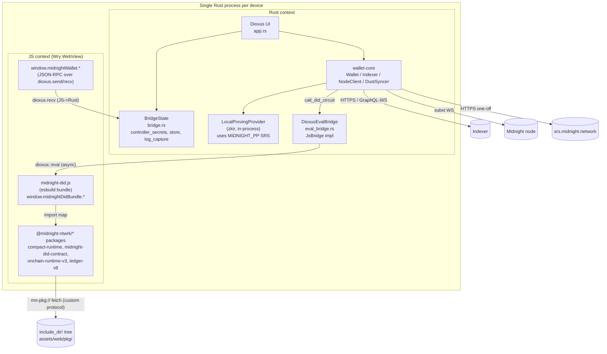
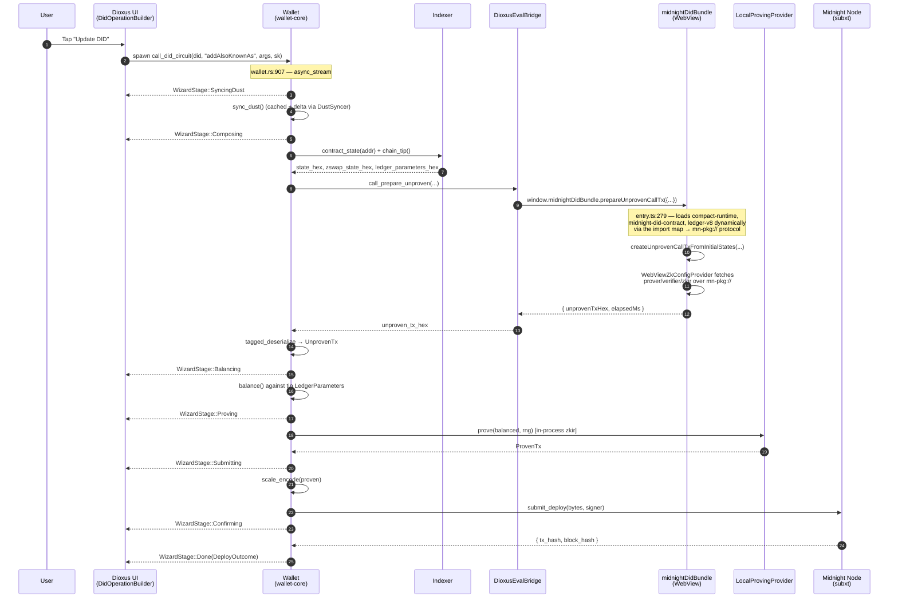
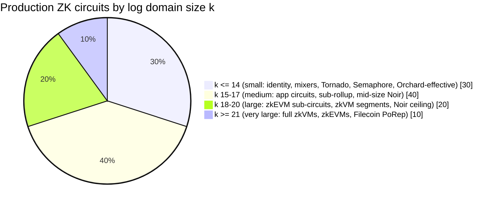

# Midnight Mobile Wallet — Architecture

Status: design + implementation reference for the `mobile-bench/dioxus-wallet`
crate (branch `mobile-bench/iteration-2`). Audience: a Midnight engineer who
has worked on the upstream TS wallet but has not yet looked at the mobile
slice. References are cited as `path/to/file.rs:LINE` so future readers can
jump.

**Companion docs (split out from the original single-file design ref):**

- [`optimization-phases.md`](./optimization-phases.md) — every memory /
  prove-time optimisation we landed, in order, with its marginal delta.
- [`react-native-adoption.md`](./react-native-adoption.md) — feasibility,
  packaging proposal, embedding instructions for downstream teams, and the
  reason web wasm cannot host the same prover.
- [`benchmark.md`](./benchmark.md) — per-k sweep results in chronological
  order (slowest → final), per-phase trace, k = 21 ceiling test.

**Cross-doc §-numbers:** the original single-file numbering is preserved in each split file. If you see a §-reference that isn't in the current doc, check `midnight-mobile-architecture.md` (the index) for the cross-doc map.

---

## 1. High-level architecture

The mobile wallet is a single Rust binary that, on every target, runs **two
language contexts** in the same process:

- A **Rust foreground** that owns the seed, persistent state, indexer/node
  transport, ZK proof generation, and the UI tree. Dioxus 0.6 drives a Wry
  WebView for rendering.
- A **JavaScript context inside that same WebView**, used as an embedded
  interpreter for upstream TypeScript packages that we have not (and probably
  cannot) port to Rust: `@midnight-ntwrk/midnight-did-contract`,
  `@midnight-ntwrk/compact-runtime`, `@midnight-ntwrk/midnight-js-contracts`,
  plus the wbindgen-generated `onchain-runtime-v3` and `ledger-v8` WASM
  blobs.

We straddle two languages because Midnight's contract layer lives in TS.
`compactc` emits `*.compact` → TS classes; the Compact runtime that
instantiates those classes at runtime is itself TS calling into wbindgen
WASM. Re-implementing that in Rust would mean re-implementing the runtime
*and* shipping a separate transpilation path for every new contract — far
more work than embedding a WebView and calling the existing TS. Meanwhile,
ledger / wallet / SCALE / subxt / DUST sync / indexer transport already
live in Rust (the SDK shape of `midnight-ledger`), so the wallet keeps its
side native and treats JS as a sub-interpreter only for the circuit
composition step.

Concretely:

- **DID read paths** (resolve, indexer fetch, DUST snapshot, balance lookup,
  unshielded UTXO sync) are 100% Rust. Indexer queries go straight from
  Rust over HTTPS / WebSocket. JS is never touched.
- **DID write paths** (Deploy / Update / Deactivate / circuit invocation)
  cross over to JS exactly once per submission, at the `Composing` stage,
  to assemble an `UnprovenTransaction`. Everything around that — balance,
  prove, encode, submit — is Rust.

### 1.1 Process diagram



Notes:

- The dotted lines through `mn-pkg://` are not a separate process. They are
  Wry custom-protocol callbacks (`src/protocol.rs:45`) running on the Rust
  thread, serving bytes out of an `include_dir!`-embedded snapshot of
  `assets/web/pkg/` (`src/protocol.rs:40`).
- On every supported target the production path uses
  `DioxusEvalBridge`; `NodeChildBridge` survives only as the
  `cargo test` transport. Desktop now defaults to `--features
  js-bridge` (see `mobile-bench/dioxus-wallet/Cargo.toml` `[features]`)
  so a plain `cargo run -p dioxus-wallet` mounts the WebView bundle
  and routes DID writes through the eval bridge — no Node child
  process is ever spawned from the App binary.

### 1.2 Sequence — Update DID (`addAlsoKnownAs`)

This is the representative DID-write path. The user taps **Update DID** on
a resolved DID's detail view, the wallet runs a Compact `addAlsoKnownAs`
circuit against the current contract state, balances DUST + proves +
submits, and reports back via `WizardStage`.



Key references:

- `mobile-bench/wallet-core/src/wallet.rs:907` — `Wallet::call_did_circuit`
  is the streamed pipeline. Stages line up with `WizardStage` in
  `mobile-bench/wallet-core/src/tx/mod.rs:39`.
- `mobile-bench/wallet-core/src/wallet.rs:1019` — call into the JS bridge.
- `mobile-bench/dioxus-wallet/web/src/entry.ts:279` — JS-side
  `prepareUnprovenCallTx` body.
- `mobile-bench/dioxus-wallet/src/eval_bridge.rs:94` — `run_one` builds the
  `await window.midnightDidBundle.<method>(params)` snippet and runs it
  through `document::eval`.

### 1.3 What is pure Rust

Everything except the **Compose** step of a DID write. In particular:

- DUST sync and snapshot — `mobile-bench/wallet-core/src/dust/syncer.rs`.
  Talks subxt to the node + GraphQL-WS to the indexer.
- Indexer queries (`contract_state`, `chain_tip`, `last_tx`) —
  `mobile-bench/wallet-core/src/indexer.rs`. Pure reqwest over HTTPS.
- DID resolve (`Wallet::resolve_did_full`, `wallet.rs:1206`) — fetches
  contract state from the indexer and decodes a `DidLedgerState` straight
  into a `DidDocument`. No JS involvement.
- Balance + prove + scale-encode + submit (`tx::balance`, `tx::prove`,
  `tx::scale`, `NodeClient::submit_deploy`).
- The unshielded NIGHT sync (`Wallet::sync_unshielded`).

JS is only on the critical path for **building the unproven transaction**,
because that requires running a Compact circuit against the current
on-chain `ContractState` to populate the transcript with the right
public/private input commitments. The JS bundle holds upstream wbindgen
modules that turn the Compact AST into a partition of guaranteed /
fallible transcripts. Once the bundle hands us back the SCALE-encoded
unproven tx, the rest is plain Rust on every target.

---

## 2. Rust ↔ TS ↔ Rust interop

### 2.1 The `JsBridge` trait

Lives at `mobile-bench/wallet-core/src/js_bridge.rs:57`. The shape is
deliberately minimal to keep the trait dyn-compatible:

```rust
#[async_trait]
pub trait JsBridge: Send + Sync {
    async fn call_json(
        &self,
        method: &str,
        params: serde_json::Value,
    ) -> Result<serde_json::Value, JsBridgeError>;
}
```

The trait method takes `serde_json::Value` in and out so it stays object-
safe — a generic `T` would block `Arc<dyn JsBridge>`. Typed convenience
lives on a blanket extension trait, `JsBridgeExt::call::<P, T>(...)` at
`js_bridge.rs:75`, implemented for every `T: JsBridge + ?Sized`. Callers
write `bridge.call::<P, T>("prepareUnprovenCallTx", params).await` and get
strongly-typed JSON back.

`JsBridgeError` (`js_bridge.rs:33`) has three variants — `Transport`,
`JsError`, `Codec` — so callers can tell "the bridge process died" apart
from "the JS function threw" apart from "the JSON didn't parse".

### 2.2 Two implementations

#### `NodeChildBridge` — test-only

Defined at `mobile-bench/wallet-core/src/js_bridge.rs:102` and used **only
by `cargo test`** in the wallet-core crate. It spawns
`node mobile-bench/wallet-core/tests/js-harness/harness.mjs` and pipes
newline-delimited JSON-RPC over the child's stdin/stdout. Per-call
serialisation is handled by holding both `stdin` and `stdout` behind
`tokio::sync::Mutex` (`js_bridge.rs:109`), which means concurrent `call`s
inside one test are processed sequentially.

The Android-side `spawn` (`js_bridge.rs:131`) is a hard error: the APK has
no Node runtime and the sandbox cannot exec siblings. The desktop-side
`spawn` (`js_bridge.rs:152`) requires `node_modules/` to already exist
next to the harness; it surfaces a clear error if you forgot to run
`npm install --ignore-scripts` (`--ignore-scripts` is load-bearing —
upstream `compact-runtime` has a postinstall script that would `rm -rf`
its own `dist/`).

Why it exists at all: `cargo test` cannot drive Wry on macOS (Tao requires
the main thread; libtest uses worker threads), nor in headless Linux CI
(wry's webkitgtk needs a display). The Node harness gives the same JSON-
RPC surface the WebView exposes, so the Compact-runtime-driven flows can
be covered end-to-end from `cargo test` with no display dependency. The
harness's method registry (`harness.mjs:109`) intentionally mirrors the
WebView's `window.midnightDidBundle` shape: a `prepareUnprovenCallTx` here
takes the same parameter object the WebView one does (`harness.mjs:247`).

#### `DioxusEvalBridge` — production

Defined at `mobile-bench/dioxus-wallet/src/eval_bridge.rs:46`. This is the
transport used by the shipping wallet on both desktop and Android once
`--features js-bridge` is on.

The non-obvious bit is the **threading model**:

- `dioxus::document::eval` is only safe to call from inside the Dioxus
  runtime. The `Eval` handle wraps a `GenerationalBox` keyed against the
  current `RuntimeContext` and is `!Send` (`eval_bridge.rs:12-20` design
  note).
- But `wallet-core`'s `call_did_circuit` awaits the bridge from arbitrary
  tokio tasks; that future is `Send`.
- So we split: a single **driver task** spawned via `use_future` owns an
  `mpsc::UnboundedReceiver<EvalRequest>` and is the only thing that ever
  touches `document::eval`. The `DioxusEvalBridge` handle is a thin
  `Send + Sync` wrapper around an `mpsc::UnboundedSender`. Calls ferry
  `{ method, params, reply: oneshot::Sender }` over the channel; the
  driver fills the oneshot when the JS promise resolves
  (`eval_bridge.rs:94 run_one`).

Process-wide installation: `eval_bridge::install_global()`
(`eval_bridge.rs:156`) sets a `OnceLock<DioxusEvalBridge>`. The App's
startup code calls `install_global` and hands the matching receiver to a
`use_future` that runs `run_driver(rx)` (`eval_bridge.rs:137`).
`app_wallet_for` (`mobile-bench/dioxus-wallet/src/app.rs:475`) then reads
the global handle on every wallet construction and attaches it via
`Wallet::with_js_bridge` (`mobile-bench/wallet-core/src/wallet.rs:179`).
Because all wallet handles in the App are short-lived and re-constructed
per write, no eager invalidation logic is needed.

A subtle behaviour to remember: the driver runs `run_one` calls
**sequentially** because each one awaits a `document::eval`. The bridge
imposes no parallelism between Rust callers. If a JS method needs
parallel work, it has to fan out *within* JS. In practice the only thing
running over the bridge is `prepareUnprovenCallTx`, which is sequential
anyway.

### 2.3 The other direction — JS → Rust over `dioxus.send`

The JS bundle needs to call back into Rust for things only Rust knows
(seeds, controller secrets, signing, log routing). That path lives in
`mobile-bench/dioxus-wallet/src/bridge.rs` and is independent of the
`JsBridge` trait — it's a fire-and-forget JSON-RPC channel built on
Dioxus' document-eval channel.

- `BridgeState::run_bridge_loop` (`bridge.rs:552`) starts a `document::eval`
  with the `BRIDGE_JS` shim (`bridge.rs:493`), which installs
  `window.midnightWallet.<method>(params)` and pumps each call through
  `dioxus.send({ id, method, params })`. The loop awaits each
  `handle.recv()`, dispatches to `run_method` (`bridge.rs:347`), and
  replies with `handle.send(response)`.
- The shim assigns its own request ids and matches replies by id — there's
  no relationship to the request-id space `DioxusEvalBridge` uses going
  the other way; they are two independent channels.

Methods on the JS→Rust side:

| Method                   | Purpose                                                 |
|--------------------------|---------------------------------------------------------|
| `ping`                   | Transport sanity                                        |
| `bundleError`            | JS error/info routing → `tracing` (`bridge.rs:356`)     |
| `bridgeProbe`            | (dev) loads the contract layer and reports exports      |
| `getProofServerUrl`      | When `proof-server-http` is on, the local URL           |
| `getBech32Address`       | Unshielded NIGHT bech32 for the active seed             |
| `getControllerSecretKey` | Per-DID controller sk for `localSecretKey()` witness    |

Most of these are placeholders; `getControllerSecretKey` and `bundleError`
are the load-bearing ones today. The seed never crosses the channel —
`signData` / `getPublicKey` would derive in Rust if implemented
(`bridge.rs:416-428` TODOs).

`BridgeState` itself (`bridge.rs:47`) is the shared in-process state the
JS→Rust dispatcher reads from. It's an Arc bundle of:

- `controller_secrets: HashMap<did, [u8; 32]>` — minted at deploy time,
  hydrated from the persistent store at unlock (`bridge.rs:215`).
- `store: OnceCell<WalletStore>` — the redb-backed persistent store.
- `active_wallet_id` — which `WalletId` the UI pickers bind against.
- `log_capture` — the in-memory log ring + persist-channel handle.

`BridgeState` derives `Clone + PartialEq` (`bridge.rs:73`) by Arc-pointer
equality so it can ride as a Dioxus component prop.

---

## 3. WebView / `mn-pkg://` asset pipeline

The TS pipeline only works if the WebView can resolve
`@midnight-ntwrk/...` package specifiers at runtime and instantiate the
WASM blobs that ship with them. We don't have npm at runtime, and we
don't want to depend on a host filesystem (Android sandbox has none for
our packages). The solution: vendor the packages, embed them in the
binary, serve via a custom Wry protocol, and inject an import map into
`<head>` so the browser engine's native module resolver routes specifiers
to our handler.

The whole pipeline is gated by `--features js-bridge` (Cargo.toml:29).
Off by default — vanilla builds ship only the Rust read paths.

### 3.1 `web/vendor.mjs` — copy curated packages

`mobile-bench/dioxus-wallet/web/vendor.mjs:46` lists the WASM-bearing
packages to copy from the operator's `~/iohk/midnight-did/node_modules`
into `assets/web/pkg/`:

- `midnight-did-contract` (with its `dist/managed/did/` of prover keys,
  verifier keys, and `.bzkir` files)
- `compact-runtime`
- `compact-js`
- `onchain-runtime-v3`
- `ledger-v8`
- `object-inspect` (a CJS dep `compact-runtime` reaches for — vendored as
  an ESM wrapper via a one-off esbuild invocation, `vendor.mjs:106`)

Pure-JS packages (`midnight-js-contracts`, `midnight-js-network-id`,
`effect`, …) are **not** vendored; they're bundled by `build.mjs` into
`midnight-did.js`. Only modules that bring `.wasm` along — or have CJS
quirks — need to be loaded by the browser's native module machinery, and
those are the only ones the import map covers.

A second pass at `vendor.mjs:140` rewrites the wbindgen entry files for
`onchain-runtime-v3` and `ledger-v8`. Upstream emits

```js
import * as wasm from "./xxx_bg.wasm";
```

which requires WebAssembly ES Module Integration (stage-4 spec, not in
WKWebView). The rewrite replaces that with a manual loader that
`fetch`-es the `.wasm` via `import.meta.url` and instantiates it through
`WebAssembly.instantiateStreaming` (`vendor.mjs:144`). Modeled after
upstream's own `xxx_fs.js` Node loader.

### 3.2 `web/build.mjs` — esbuild the entry

`mobile-bench/dioxus-wallet/web/build.mjs:43` bundles
`web/src/entry.ts` into `assets/web/midnight-did.js`. The vendored
packages (the `VENDORED_EXTERNALS` array at `build.mjs:35`) are declared
`external`, so esbuild keeps their import specifiers intact in the
output. At runtime the browser's import map rewrites those specifiers to
`mn-pkg://` URLs.

Notable knobs:

- `format: "esm"` — output is `<script type="module">` so static + dynamic
  `import()` resolve through the import map.
- `conditions: ["browser", "module", "import", "default"]` — picks browser
  entry points for the polyfilled std stack.
- `nodeModulesPolyfillPlugin` — polyfills `path`, `crypto`, `assert`,
  `util`, `events`, `stream`, `buffer`; emptied stubs for `fs` and
  `fs/promises` (the WebView has no filesystem).
- `nodePaths: [$MIDNIGHT_DID_NODE_MODULES || ~/iohk/midnight-did/node_modules]`
  — esbuild resolves transitive deps against the upstream tree.
- A few packages are aliased to `unsupported-stub.js` (the wallet's seed
  storage, level-db state provider, HD-key helpers) because they are
  Node-only and the wallet supplies its own Rust equivalents.

### 3.3 `assets/web/pkg/` as `include_dir!` payload

`mobile-bench/dioxus-wallet/src/protocol.rs:40`:

```rust
static PKG_TREE: Dir<'static> = include_dir!("$CARGO_MANIFEST_DIR/assets/web/pkg");
```

The directory is statically embedded in the binary at build time. On
arm64 Android the embedded tree adds ~30 MB to the cdylib; on desktop the
cost is similar but less visible. The trade-off is intentional: the same
protocol handler then works on Android without filesystem access to the
host's source tree, which is what made phase D (DID writes on Android)
feasible without a server.

### 3.4 The Wry custom-protocol handler

`mobile-bench/dioxus-wallet/src/protocol.rs:45`:

```rust
pub fn build_handler() -> impl Fn(Request<Vec<u8>>) -> Response<Cow<'static, [u8]>> + 'static {
    |req| handle(req)
}
```

`handle` (`protocol.rs:50`) strips the URL path, runs it through a
path-traversal guard (`protocol.rs:104`), looks up bytes in `PKG_TREE`,
infers a content-type from the extension (`protocol.rs:108`), and serves
`200` with `access-control-allow-origin: *` so dynamic imports don't trip
CORS. Logging at `target = "mn-pkg"` makes asset misses visible in the
Logs tab.

The handler is wired into the Wry config in
`mobile-bench/dioxus-wallet/src/lib.rs:234`:

```rust
cfg.with_custom_head(bundle_script).with_custom_protocol(
    "mn-pkg".to_string(),
    protocol::build_handler(),
)
```

### 3.5 The Android URL-rewrite quirk

Wry desktop registers `mn-pkg` directly as a custom scheme with
WKURLSchemeHandler (macOS) or its Linux equivalent. JS `import("mn-pkg://...")`
dispatches to our handler.

Wry-Android cannot do that. Chromium WebView does not allow JS to
`fetch` / `import` arbitrary non-standard schemes. Wry-Android's
workaround is to translate every custom-protocol URL of the form
`name://authority/...` into `http://name.authority/...` and match that
prefix inside the `shouldInterceptRequest` callback. The translation
only fires for the initial page URL, not for runtime `import()` calls
— **the import map has to spell the `http://` form itself**.

`lib.rs:201-228` does exactly that:

```rust
#[cfg(not(target_os = "android"))]
let import_map = r#"
<script type="importmap">
{ "imports": {
    "@midnight-ntwrk/midnight-did-contract": "mn-pkg://localhost/midnight-did-contract/dist/index.js",
    ...
} }
</script>"#;

#[cfg(target_os = "android")]
let import_map = r#"
<script type="importmap">
{ "imports": {
    "@midnight-ntwrk/midnight-did-contract": "http://mn-pkg.localhost/midnight-did-contract/dist/index.js",
    ...
} }
</script>"#;
```

The JS side mirrors the same heuristic for runtime URL construction —
`entry.ts:223 pkgBaseUrlFor()` checks `location.host.endsWith(".localhost")`
and picks the right scheme so the `WebViewZkConfigProvider` fetches keys
through the correct URL.

### 3.6 `<head>` injection

`with_js_bridge_inner` (`lib.rs:153`) assembles three blocks and hands
them to `cfg.with_custom_head`:

1. **Error reporter** (`lib.rs:154-187`) — installs `window.onerror` +
   `unhandledrejection` listeners and routes them to
   `window.midnightWallet.bundleError`. Buffers events until the bridge
   shim is available (the bridge installs slightly later via
   `BridgeState::run_bridge_loop`), then drains. Without this, JS load
   failures vanish into the Wry void and only show up as inert dev-tools
   noise.
2. **Import map** (`lib.rs:201-228`) — the desktop / Android pair from §3.5.
3. **Module bundle** (`lib.rs:229-232`) — `<script type="module">` whose
   body is the literal contents of `assets/web/midnight-did.js`, pasted
   inline via `include_str!`. The bundle's static imports get resolved
   through the import map; its dynamic imports (`compact-runtime`,
   `midnight-did-contract`, `ledger-v8`) load on first
   `prepareUnprovenCallTx` call.

The ordering matters: error reporter first so reporter can catch any
later failures; import map before the bundle so the bundle's static
imports resolve; bundle last.

---

## 4. Proof generation

### 4.1 `LocalProvingProvider` — the default everywhere

`Wallet::call_did_circuit` → `tx::prove::prove(balanced, rng)` runs the
zkir prover in-process. The prover loads BLS-12-381 SRS files via
`base_crypto::data_provider::MidnightDataProvider`, which resolves them
in this order:

1. `$MIDNIGHT_PP` (an absolute directory the operator points us at)
2. `$XDG_CACHE_HOME/midnight/zk-params`
3. `$HOME/.cache/midnight/zk-params`

On desktop the user's `~/.cache/midnight/zk-params` is populated lazily
on first run by the SDK's HTTPS fetch from `srs.midnight.network`.

On Android there is no `$HOME`, and the SDK provider hard-errors with
"Could not determine $HOME, $XDG_CACHE_HOME, or $MIDNIGHT_PP". The Android
entry point (`lib.rs:268`) sets `MIDNIGHT_PP=/data/local/tmp/midnight-pp`
before launching Dioxus:

```rust
#[unsafe(no_mangle)]
pub extern "C" fn main() -> i32 {
    let pp = "/data/local/tmp/midnight-pp";
    let _ = std::fs::create_dir_all(pp);
    unsafe { std::env::set_var("MIDNIGHT_PP", pp); }
    run();
    0
}
```

The matching SRS files are pre-pushed via `adb push` (see DEPLOY guide
§2.2 below).

### 4.2 `proof-server-http` — in-process HTTP wrapper (desktop today)

`mobile-bench/dioxus-wallet/Cargo.toml:37` gates `proof-server-http`,
which spins up `prover-core`'s actix-web server in-process at startup.
`bridge::spawn_proof_server` (`bridge.rs:244`) binds it to `127.0.0.1:0`
and registers the resulting URL with the App's process-wide static
(`app::set_proof_server_url`). Every subsequent `app_wallet_for` call
attaches that URL to the new wallet via `with_proof_server_url`
(`app.rs:506`), and `tx::prove::prove_via_http` routes proving through
`POST /prove`.

This exists for one reason: debug-built wallets prove ~20× slower than
release-built provers. Running the prover behind an HTTP wrapper lets you
run the *wallet* in debug for fast iteration while still proving through
a release-built binary. Same intra-process address space, no IPC cost
beyond the local `fetch`.

**Today it is desktop-only by configuration** (`prover-core` is gated to
`cfg(all(not(target_os = "android"), not(target_os = "ios")))` in
`Cargo.toml:117`), not by design. `js-bridge` and `proof-server-http`
are otherwise orthogonal; `proof-server-http` implies `js-bridge` only
because the JS pipeline is the original consumer. §4.3 below covers
why we want to lift the desktop-only gate and what it takes.

### 4.3 Local proof-server on mobile (target architecture)

The goal is to run **the same `127.0.0.1:<port>/prove` HTTP wrapper
inside the Android / iOS app**, so that *any* consumer — the wallet's
own Rust path, the WebView JS bundle, or upstream Midnight TS/JS DApp
packages embedded in a future host app — can use the standard
`proofServerUrl` configuration shape the upstream SDK already expects.
This unifies the proving call sites:

```
                                ┌──────────────────────────┐
                  POST /prove   │                          │
   Rust  ──────────────────────►│                          │
                                │   in-process actix-web   │
                                │   on 127.0.0.1:<port>    │
   WebView JS  ────────────────►│   = prover-core release  │
   (fetch via window.fetch)     │                          │
                                └──────────────────────────┘
   Upstream Midnight TS         ▲
   (configured with             │
   `proofServerUrl =            │
   "http://127.0.0.1:<port>"`)  │
   ─────────────────────────────┘
```

#### Why the loopback URL works inside the app

- **Android.** The WebView (Chromium) runs inside the same Linux
  process as the Rust code. Loopback (`127.0.0.1`) is in-namespace
  and needs no permission. Cleartext loopback is allowed by default
  on Android 9+ when targeting older API levels; for Android 9+
  with target SDK ≥ 28 we'll add a `network_security_config.xml`
  that explicitly opts loopback in:
  ```xml
  <network-security-config>
    <domain-config cleartextTrafficPermitted="true">
      <domain includeSubdomains="true">127.0.0.1</domain>
      <domain includeSubdomains="true">localhost</domain>
    </domain-config>
  </network-security-config>
  ```
  and reference it from `AndroidManifest.xml` via
  `android:networkSecurityConfig="@xml/network_security_config"`.
- **iOS.** `WKWebView` likewise reaches `127.0.0.1` inside the app
  sandbox. ATS is already relaxed via `NSAllowsArbitraryLoads: true`
  in `Info.plist` (§5b.1) so cleartext loopback isn't blocked.
- **JS-side configuration.** The upstream Midnight SDK reads its
  proof-server URL from a config object (typically
  `{ proofServerUrl: "http://..." }`). The Rust App already exposes
  the chosen URL via `set_proof_server_url`; we inject it into the
  WebView at boot the same way `<head>` injection currently
  delivers the `<importmap>`:
  ```rust
  let cfg = cfg.with_custom_head(format!(
      "<script>window.midnightProofServerUrl = {url:?};</script>{rest}",
      url = chosen_url, rest = existing_head));
  ```
  JS bundle reads `window.midnightProofServerUrl` and plugs it into
  whichever SDK factory it uses. No native bridge call needed.

#### What needs to change

1. **Cargo wiring.** Move the `prover-core` dependency out of the
   desktop-only `[target.…]` block in
   `mobile-bench/dioxus-wallet/Cargo.toml`. The `proof-server-http`
   feature already names `prover-core/proof-server-http` as its
   transitive dep; we just need that target to be reachable on
   Android and iOS too. `proof-server-http` is opt-in, so this
   doesn't bloat the default mobile build.
2. **Verify actix-web cross-compiles to `aarch64-linux-android` /
   `aarch64-apple-ios`.** The doc previously claimed actix doesn't
   cross-compile to Android. Re-checking against the current
   pinning (`actix-web ^4.13`, `default-features = false`, features
   `["macros", "compress-brotli", "compress-gzip", "cookies",
   "http2"]` in `proof-server/Cargo.toml:27`), this should compile
   cleanly — actix-web 4.x is pure-Rust except for compression
   crates which themselves cross-compile cleanly. Plan: try
   `cargo ndk -t arm64-v8a build --release -p dioxus-wallet --lib
   --features js-bridge,proof-server-http,preprod-live` and fix the
   first error if it surfaces.
3. **Fallback if actix is too heavy.** If actix-web 4.x trips a
   build error we can't resolve in <1 day, drop to a minimal
   `hyper` or `tiny_http` server inside `prover-core` behind the
   same feature flag. The HTTP surface is just `POST /prove` and
   `GET /fetch-params/{k}` (≤ 200 lines of glue); we don't need
   actix's middleware / extractors for this in-process use case.
   The `POST /prove` contract — `application/octet-stream` body
   containing SCALE-encoded `ProofPreimageVersioned` plus optional
   `ProvingKeyMaterial`, returning SCALE-encoded `Proof` — is
   framework-independent.
4. **WebView `<head>` injection of `window.midnightProofServerUrl`.**
   See snippet above. One-line addition to `lib.rs::with_js_bridge_inner`.
5. **`network_security_config.xml`** as shown above. One new file
   in `android/app/src/main/res/xml/`, one attribute in the
   manifest's `<application>` tag.

#### Why this is worth doing

- **Symmetry with desktop.** Today the wallet's own Rust path uses
  `prove_via_http` when `PROOF_SERVER_URL` is set, but the WebView
  JS bundle does composition only — proving is delegated back to
  native Rust via the `DioxusEvalBridge`. Once the mobile
  proof-server is up, the JS bundle can call `fetch(<local
  url>/prove, …)` and the architecture stops having two parallel
  proof-routing mechanisms in one process.
- **Drop-in for upstream DApp consumers.** Any team taking the
  upstream Midnight TS/JS DApp stack and embedding it inside an
  Android / iOS host app gets a proof-server "for free" — they
  configure their SDK with the URL we surface and don't have to
  ship their own.
- **It is *not* a replacement** for the in-process Rust path. The
  Rust path (§4.1) stays the production default for the wallet's
  own DID writes — it skips the HTTP round-trip entirely. The
  HTTP wrapper exists for the cases that need it: JS consumers,
  debug-built wallet → release-built prover, and any future
  Native module hosted by RN / Capacitor (§7).

#### Verification status (updated 2026-05-22)

- ✅ Design captured here.
- ✅ `prover-core` lifted to a global dep + four `not(target_os
  = "android")` cfg gates removed from `prover-core/src/lib.rs`,
  `server.rs`, `http.rs`. The previous Cargo gate reflected a
  belief that turned out to be false.
- ✅ `actix-web 4.13` (with `default-features = false`) +
  `midnight-proof-server` + `reqwest 0.13` cross-compile to
  **`aarch64-linux-android`** — release `.so` 145 MB (up from
  132 MB without the feature), build time 1m 24s on a warm cache.
- ✅ Same source cross-compiles to **`aarch64-apple-ios-sim`** —
  release `.dylib` 134 MB, build time 2m 48s. (iOS Simulator
  artifact only; physical iOS device deploy still depends on
  the signing dance from §5b.5.)
- ✅ `bridge::spawn_proof_server` runs unconditionally from
  `use_future` at `app.rs:1022`. On a fresh APK install the
  startup log emits:
  ```
  INFO dioxuswalletmain::bridge:
       embedded proof-server ready url=http://127.0.0.1:42605
  ```
  and `/proc/<pid>/net/tcp` confirms two loopback listeners
  bound by the actix accept loop.
- ✅ HTTP from the **device shell**: `adb shell curl -i
  http://127.0.0.1:42605/` returns `200 OK` with CORS headers
  and a JSON status payload — actix is genuinely serving, not
  just bound.
- ✅ End-to-end **Update DID** from the UI on a physical
  Samsung S24 Ultra completes via the embedded server. The
  prove-routing log line confirms which path was taken:
  ```
  INFO wallet_core::tx::prove:
       proving via HTTP proof-server url=http://127.0.0.1:42605
  ```
  Subsequent submit + indexer confirmation complete normally.
- ⏳ `network_security_config.xml` for cleartext loopback —
  not strictly needed for the wallet's own Rust client (which
  is what we tested) because `reqwest` honours system policy
  rather than the WebView's. Will still be needed before the
  **WebView JS** (or an RN JS host) can `fetch` the loopback
  URL. Tracked alongside the next item.
- ⏳ `window.midnightProofServerUrl` `<head>` injection — not
  yet added; needs ~10 LoC in `lib.rs::with_js_bridge_inner`.
  Closes the loop for "WebView/RN JS can hit the URL" from
  step 5 of the prototype plan in §7.3a.

The big-ticket questions ("will actix cross-compile", "will
loopback work inside the app sandbox", "will the existing
`prove_via_http` path actually engage") are all **answered yes**
on real arm64 hardware. The two remaining `⏳` items are the
JS-side bring-up and are independent of the server itself.

---

## 5. Android specifics

### 5.1 Gradle wrapper

`mobile-bench/dioxus-wallet/android/` is mirrored from
`mobile-bench/dioxus-bench/android/`. Package id
`io.iohk.midnight.wallet`, native lib name `dioxuswalletmain`
(`Cargo.toml:11`). The build process:

1. `cargo ndk -t arm64-v8a -o android/app/src/main/jniLibs build --release --features js-bridge`
   compiles `libdioxuswalletmain.so` (~30 MB with the embedded `pkg/`
   tree) and drops it under `jniLibs/arm64-v8a/`.
2. `./gradlew assembleDebug` wraps that `.so` into
   `app/build/outputs/apk/debug/app-debug.apk`, signed with the default
   debug keystore.
3. `adb install -r ...` deploys.

### 5.2 Wallet store path

`mobile-bench/dioxus-wallet/src/app.rs:7242`:

- Desktop: `~/.midnight/wallet-prototype/wallet.redb`.
- Android: `/data/data/<package>/files/midnight-dx-wallet/wallet.redb`.

The Android branch resolves the package name by reading `/proc/self/cmdline`
(`app.rs:7278`) rather than going through JNI for `getFilesDir()`. The
package id is the first NUL-separated field of cmdline on Android,
written by Zygote for every app process, so this avoids one round of JNI
plumbing for a value we know is stable per process.

### 5.3 TLS initialisation — the `try_init_android_tls` poll

`rustls-platform-verifier`'s Android backend stores its JNI handles in a
process-global `OnceLock` populated by `init_with_env(&mut JNIEnv, JObject)`.
Without that call, the first TLS handshake panics with
"Expect rustls-platform-verifier to be initialized" — and the wallet
hits TLS immediately (indexer over HTTPS, SRS fetch, proof-server probe).

We cannot call `init_with_env` from `lib.rs::main` (`lib.rs:268`):
- `ndk_context::android_context()` panics with "android context was not
  initialized" because Dioxus seeds that context only *after* it calls
  our `extern "C" fn main`.
- `extern "C" fn` cannot unwind. A panic inside the C ABI aborts the
  process.

Fix: a `use_future` inside `App` (`app.rs:666`) polls `try_init_android_tls`
every 100 ms for up to 3 seconds:

```rust
for _ in 0..30 {
    match crate::try_init_android_tls() {
        Ok(true) => { tracing::info!("rustls-platform-verifier ready"); return; }
        Ok(false) => {}
        Err(e) => { tracing::warn!(...); return; }
    }
    tokio::time::sleep(Duration::from_millis(100)).await;
}
```

`try_init_android_tls` (`lib.rs:298`) wraps `ndk_context::android_context()`
in `catch_unwind` so the panic-before-seeding path returns `Ok(false)`
without aborting, and only sees a `panic` once Dioxus has run its JNI
hook.

There's a second twist: **two versions of `rustls-platform-verifier` are
in the dep tree**. `reqwest` pulls 0.6 and `subxt` pulls 0.5. Each crate
has its own `OnceLock`, so initialising 0.6 does not satisfy 0.5's call
site. Without a second init the dust syncer's WS subscribe (subxt path)
hits the panic on first TLS use. We pull 0.5 under a renamed alias
(`Cargo.toml:94`) so both are addressable:

```rust
rustls_platform_verifier::android::init_with_env(&mut env, activity_0_6)?;
rustls_platform_verifier_v05::android::init_with_env(&mut env, activity_0_5)?;
```

(`lib.rs:319-329`)

### 5.4 Network egress on the emulator

The Android emulator's NAT can drop specific Midnight endpoints (we have
observed it dropping `indexer.preprod.midnight.network` reliably while
letting public DNS through). Cold-boot the emulator with
`-dns-server 8.8.8.8,1.1.1.1` to force the AVD to use external resolvers
instead of the host's DNS. The DEPLOY guide records this workaround.

---

## 5b. iOS specifics

The iOS slice is **end-to-end verified on the iPhone 15 Pro / iOS 17.5
Simulator** as of this update. App boots cleanly, Rust↔JS↔Rust round
trips through WKWebView, PreProd-live seed + DID inventory hydrate,
and the DUST syncer starts. All three boot markers fire:

```
INFO mn-pkg: request url=mn-pkg://localhost/midnight-did-contract/dist/index.js
INFO mn-pkg: request url=mn-pkg://localhost/ledger-v8/midnight_ledger_wasm_bg.wasm
INFO dioxuswalletmain: app_wallet_for: ...                  ← marker 1
INFO eval-bridge: driver started                            ← marker 2
INFO bundle: JS bundle event msg=contract layer loaded      ← marker 3
INFO dioxuswalletmain::app: preprod-live: seeded inventory + secrets count=3
INFO dioxuswalletmain::app: wallet store opened path=.../Documents/midnight-dx-wallet/wallet.redb
INFO wallet_core::dust::syncer: dust syncer starting network=preprod resume_from=70
```

The slice required two host-side fixes during bring-up beyond what the
original brief covered (recorded for future runs):

1. **Xcode platform components were missing on first run.** `xcodebuild
   -showdestinations` reported `DVTDownloads.framework` missing.
   `sudo xcodebuild -runFirstLaunch` (or letting the macOS auto-installer
   trigger from `xcrun simctl list devices`) fixed it.
2. **The scheme's `SUPPORTED_PLATFORMS` defaulted to `iphoneos` only.**
   xcodebuild then refused any `-destination 'platform=iOS Simulator'`
   spec because the scheme couldn't see a simulator destination. The
   fix lives in `ios/project.yml`: set
   `SUPPORTED_PLATFORMS: "iphoneos iphonesimulator"` plus the
   `CODE_SIGN_*` suppressors for `iphonesimulator` builds, so simulator
   builds don't need a paid Apple developer cert.

### 5b.1 Xcode wrapper

`mobile-bench/dioxus-wallet/ios/` is the iOS counterpart to the
Android Gradle wrapper:

```
ios/
├── App/
│   ├── App.swift              ← SwiftUI @main; calls Rust start_app()
│   ├── Info.plist             ← generated by XcodeGen
│   └── libdioxuswalletmain.dylib   ← vendored from cargo build
├── DioxusWallet.xcodeproj/    ← generated by `xcodegen generate`
└── project.yml                ← XcodeGen spec (iOS 15.0 target)
```

`App.swift` declares the Rust entry point on the `@main` struct
itself so the file has no file-scope code (Swift forbids `@main` in
a file with top-level executable code):

```swift
@main
struct DioxusWalletApp: App {
    @_silgen_name("start_app") static func start_app()
    init() { Self.start_app() }
    var body: some Scene { WindowGroup { Color.clear } }
}
```

The Rust side exposes the symbol with `#[no_mangle] pub extern "C" fn
start_app()` under `cfg(target_os = "ios")` in `src/lib.rs`. It sets
`MIDNIGHT_PP=$HOME/Library/Caches/midnight-pp/` (writable iOS sandbox
path — unlike Android's `/data/local/tmp/` constraint, on-demand SRS
fetch actually works here) then calls `run()`.

### 5b.2 Cross-compile

`cargo build --target aarch64-apple-ios-sim --release -p dioxus-wallet
--lib --features "preprod-live js-bridge"` produces a ~118 MB
`libdioxuswalletmain.dylib`. Debug build ~20 s; release ~5 m
(dominated by the embedded `pkg/` tree + halo2 prover crates).

The release `.dylib` carries the `_start_app` C-ABI symbol (`nm`
confirms `T _start_app`) and links cleanly against `UIKit`, `WebKit`,
`Security`, `Foundation`, `CoreGraphics`, `CoreFoundation`, `libobjc`
— the iOS Simulator frameworks Wry-iOS pulls in. No external
toolchain knobs needed beyond `xcode-select -p` returning a usable
Xcode and `rustup target add aarch64-apple-ios-sim`.

`install_name_tool -id "@rpath/libdioxuswalletmain.dylib"` is applied
to the vendored `.dylib` so dyld resolves it after the Xcode "Embed
Frameworks" phase copies it to `Frameworks/` inside the `.app`.

### 5b.3 Deps that differ from desktop / Android

`Cargo.toml` carries a third per-target block,
`[target.'cfg(target_os = "ios")'.dependencies]`:

- **Pulled in**: `dioxus` with `["mobile"]`, `rustls-platform-verifier`
  (both 0.6 and 0.5 aliased) — same TLS dual-init concern as Android,
  but `rustls-platform-verifier` auto-detects iOS and uses `SecTrust`
  natively, so no `init_with_env` dance is needed. The
  `try_init_android_tls` poller in `app.rs` stays Android-gated and
  is skipped on iOS entirely.
- **Excluded**: `prover-core` (no actix on iOS — same constraint as
  Android), `ndk-context` / `jni` / `libc` (Android-only JNI plumbing),
  `dirs` (use `std::env::var_os("HOME")` to find the sandbox),
  `arboard` (use `UIPasteboard` via UIKit when we wire it),
  `resvg` / `tiny-skia` (no per-process window icon — iOS uses the
  `.app` bundle's `AppIcon.appiconset`).

### 5b.4 mn-pkg:// on iOS — no URL rewrite needed

The Android Chromium WebView path required rewriting the import map
to `http://mn-pkg.localhost/…` because Chromium-on-Android refuses
non-standard schemes from `import()`. **iOS uses `WKWebView`, which
honours `WKURLSchemeHandler` registration the same way macOS
desktop does** — so the desktop `mn-pkg://localhost/…` form works
unchanged on iOS. The existing
`#[cfg(not(target_os = "android"))]` branch in `lib.rs` already
covers iOS without modification.

The single `Wry-Android` rewrite trick (`http://name.authority/…`)
stays Android-only.

### 5b.5 Install + launch recipe

The full pipeline once the host is provisioned (Xcode platforms
installed, simulator runtime available, scheme configured per § 5b.2):

```bash
cd mobile-bench/dioxus-wallet
# 1. Refresh the .dylib if Rust source changed.
cargo build --target aarch64-apple-ios-sim --release \
  -p dioxus-wallet --lib --features "preprod-live js-bridge"
cp target/aarch64-apple-ios-sim/release/libdioxuswalletmain.dylib \
   ios/App/
install_name_tool -id "@rpath/libdioxuswalletmain.dylib" \
   ios/App/libdioxuswalletmain.dylib

# 2. Generate + build the Xcode project.
cd ios
xcodegen generate
xcodebuild -project DioxusWallet.xcodeproj -scheme DioxusWallet \
  -configuration Debug -sdk iphonesimulator \
  -destination 'platform=iOS Simulator,name=iPhone 15 Pro,OS=17.5' build

# 3. Boot the simulator + install + launch.
xcrun simctl boot "iPhone 15 Pro"
xcrun simctl bootstatus "iPhone 15 Pro"
xcrun simctl install booted /path/to/DioxusWallet.app
xcrun simctl launch --console-pty booted io.iohk.midnight.wallet
```

`--console-pty` is the magic flag — without it, Rust's `tracing`
output (stderr) is eaten by the iOS app sandbox and never reaches
`xcrun simctl spawn booted log show`. With it, stderr streams to
the launching terminal so the `INFO eval-bridge: driver started`,
`bundle event msg=contract layer loaded`, etc. lines appear inline.
For a separate stream (without re-launching), tail WebKit-level
events instead:

```bash
xcrun simctl spawn booted log stream --predicate \
  'processImagePath CONTAINS "DioxusWallet"'
```

(That captures `WebPageProxy::runJavaScriptInFrameInScriptWorld`,
`didCommitLoadForFrame`, etc. — useful when the app is misbehaving
mid-flight and you want WebKit-level signals.)

The three boot markers to verify the slice is healthy (mirrors the
Android list — minus `rustls-platform-verifier ready` since iOS
skips the dual-init):

1. First `INFO dioxuswalletmain: app_wallet_for` line.
2. `INFO eval-bridge: driver started` — `DioxusEvalBridge` mounted
   on Wry-iOS's WebView.
3. `INFO bundle: JS bundle event msg=contract layer loaded` —
   confirms `WKURLSchemeHandler` is serving the embedded `mn-pkg`
   bundle.

### 5b.6 Open follow-ups

- Real-device deploy (TestFlight or ad-hoc) — requires a paid
  Apple developer account, provisioning profile, and signing
  certificate. Out of scope for the simulator pipeline.
- `UIPasteboard` wiring for the clipboard-copy buttons (currently
  `copy_to_clipboard` is a no-op on iOS, same as Android).
- A `cargo lipo`-style multi-arch `.xcframework` if we want one
  build artifact for both Apple Silicon simulator and arm64 device.

---

## 6. Build matrix

### 6.1 Feature combos

| Feature combo                              | Desktop                                                           | Android                                                | iOS Simulator                                          |
|--------------------------------------------|-------------------------------------------------------------------|--------------------------------------------------------|--------------------------------------------------------|
| (none — default)                           | + WebView bundle + DID writes via `DioxusEvalBridge` (`js-bridge` is on by default) | UI + read-only on-chain                                | UI + read-only on-chain                                |
| `--features js-bridge`                     | (same as default on desktop)                                      | + WebView bundle + DID writes (no Node)                | + WebView bundle + DID writes via WKWebView            |
| `--no-default-features`                    | UI + read-only on-chain (resolve, balance, DUST sync), no WebView | n/a (mobile builds always pass `js-bridge` explicitly) | n/a (mobile builds always pass `js-bridge` explicitly) |
| `--features proof-server-http`             | + in-process actix proof-server (implies `js-bridge`)             | **shipped & verified on real device** (§4.3) — actix-web 4.13 cross-compiles cleanly, server binds `127.0.0.1:<port>`, Update DID round-trips through `/prove` end-to-end on S24 Ultra | **builds** for `aarch64-apple-ios-sim` (§4.3) — same source, no device-deploy verification yet |
| `--features preprod-live`                  | Operator PreProd seed + 3 pre-seeded DIDs                         | same                                                   | same                                                   |
| `--features js-bridge,preprod-live`        | full DID writes against PreProd                                   | full DID writes against PreProd                        | full DID writes against PreProd                        |
| `--target wasm32-unknown-unknown`          | **blocked** — see §6.1a                                           | n/a                                                    | n/a                                                    |

### 6.1a Web target (`wasm32-unknown-unknown`) — feasibility probe (2026-05-22)

Cargo-checking `dioxus-wallet --lib --target wasm32-unknown-unknown
--no-default-features` was attempted as a "run the benchmark in
a browser" experiment. **It does not compile** — and the
fail-points fall in two tiers:

**Tier 1 — toolchain configuration (resolvable):**

- `getrandom` 0.3.x requires `--cfg wasm_js` for `wasm32-unknown-unknown`.
  Already solved upstream in `zkir-wasm/Cargo.toml` by pulling
  the two-version dance:
  ```toml
  getrandom_2 = { package = "getrandom", version = "^0.2.16", features = ["js"] }
  getrandom_3 = { package = "getrandom", version = "^0.3.4", features = ["wasm_js"] }
  ```
- `mio` 1.2 doesn't compile on `wasm32-unknown-unknown`. Pulled
  transitively by `tokio`'s `net` feature → reqwest / subxt /
  tokio-tungstenite. Resolution: a wasm32-specific
  `[target.'cfg(target_arch = "wasm32")'.dependencies]` block
  with `tokio = { features = ["rt", "macros", "sync"] }` — no
  `rt-multi-thread`, no transitive `net`.

**Tier 2 — architectural conflicts (significant porting):**

- `redb` (file-backed). The wallet store has no browser-side
  analogue without a substantial port to IndexedDB / OPFS.
- `actix-web` (`proof-server-http` feature). Won't compile to
  wasm32 — but already feature-gated, so this is a non-issue
  for an `--no-default-features` web build.
- `subxt` chain client + `tokio-tungstenite` WebSocket — both
  expect native sockets. Browser equivalent is `web-sys`
  WebSocket; non-trivial swap.
- `reqwest`. Has wasm32 support via the `fetch` backend, but
  needs explicit feature gating.
- `std::time::Instant::now()`. Panics on
  `wasm32-unknown-unknown`. Used directly in
  `contract-benchmark::run_proof`. Resolution: swap to the
  `web-time` crate behind a `cfg(target_arch = "wasm32")` block.
- `std::fs::*` (used by `MidnightDataProvider` and the
  benchmark's SRS cache). Browser has no filesystem.
  Resolution: switch the data provider to a fetch-only mode
  that streams SRS files from `srs.midnight.network` directly
  into memory, no on-disk cache (or use `IndexedDB` as a
  cache backend).
- `dioxus_desktop` (Wry + Tao). Doesn't target the web.
  Resolution: swap to `dioxus_web` (already supported by
  Dioxus 0.6) — but that needs a sibling crate or a third
  cfg-arm in `lib.rs::desktop_or_mobile_launch`.

**Two viable paths forward** (neither one explored further this
session):

| Path | Scope | Useful for |
|---|---|---|
| (A) **Benchmark-only wasm crate.** New crate `contract-benchmark-wasm` modelled on `zkir-wasm` (~30 LoC of wasm-bindgen glue). Exports `run_proof_k(k)` returning a JSON-stringified `RunStats`. Tiny static HTML page (~40 LoC) provides a "Run all" sweep UI. SRS files: pre-baked into the wasm via `include_bytes!` for k ≤ N (binary size cost ~tens of MB), or streamed from `srs.midnight.network` via JS `fetch` on demand. | Running the prover in a browser and getting per-k timings — directly addresses the original "run the benchmark here" ask. ~ 1 day of work. |
| (B) **Full UI port (`dioxus_web` arm).** Wire a third platform branch in `lib.rs`, add wasm32-specific dependency block, replace `redb` with IndexedDB-backed store, replace `subxt` WS with `web-sys` WebSocket, swap `std::time::Instant` for `web_time::Instant`, swap reqwest backend to fetch. | Running the *full* wallet (with DID resolution + writes) in a browser. ~ 1–2 weeks of work. Likely yields a slower wallet than native arm64 due to single-threaded wasm. |

For an actual prove-in-browser experiment, path (A) is the
right scope — and the `zkir-wasm` crate already proves the
core proving stack works on wasm32. Recommended next step
when reopening this thread.

From `mobile-bench/DEPLOY_TO_DEVICE.md`:

```bash
# 1. Cross-compile the cdylib (drops the .so into jniLibs).
cd mobile-bench/dioxus-wallet
ANDROID_NDK_HOME=$HOME/Library/Android/sdk/ndk/27.0.12077973 \
  cargo ndk -t arm64-v8a -o android/app/src/main/jniLibs \
  build --release --features js-bridge

# 2. Wrap into a debug APK.
cd android
JAVA_HOME=/Library/Java/JavaVirtualMachines/temurin-21.jdk/Contents/Home \
  ./gradlew assembleDebug
# → app/build/outputs/apk/debug/app-debug.apk

# 3. Push SRS params (one-time per device).
PARAMS=$HOME/.cache/midnight/zk-params
adb shell mkdir -p /data/local/tmp/midnight-pp
for f in "$PARAMS"/bls_midnight_2p{4,5,6,7,8,9,10,11}; do
  [ -f "$f" ] && adb push "$f" /data/local/tmp/midnight-pp/
done

# 4. Install + launch.
adb install -r android/app/build/outputs/apk/debug/app-debug.apk
adb shell am start -n io.iohk.midnight.wallet/dev.dioxus.main.MainActivity
```

Higher-`k` circuits need more SRS files; if a Compact circuit consumes
`k=19` you need `bls_midnight_2p4..bls_midnight_2p19`. The default
deploy push only covers up through `2p11`.

### 6.3 Desktop build

```bash
# default — no JS, no DID writes
cargo run -p dioxus-wallet

# with the WebView bundle + bridge
cargo run -p dioxus-wallet --features js-bridge

# with the local HTTP proof-server (release-built for proving speed)
cargo run -p dioxus-wallet --release --features proof-server-http
```

The `web/` bundle must be built once before any `js-bridge` build:

```bash
cd mobile-bench/dioxus-wallet/web
node vendor.mjs        # copy + rewrite vendored npm packages
node build.mjs         # esbuild midnight-did.js
```

This populates `assets/web/pkg/` and `assets/web/midnight-did.js`. Both
are read by `include_str!` / `include_dir!` at compile time, so the
Rust build will fail with a clear error if either is missing.

---


## 8. Open questions / known gaps

- **Production runs on every target use `DioxusEvalBridge`; the Node
  harness is test-only.** `app_wallet_for` (`app.rs:534-549`) installs
  the `DioxusEvalBridge` under `--features js-bridge`, which is now
  the desktop default (see `mobile-bench/dioxus-wallet/Cargo.toml`).
  A vanilla `cargo run -p dioxus-wallet` mounts the WebView bundle
  and routes DID writes through the eval bridge. `cargo test
  -p wallet-core --tests` still spawns `NodeChildBridge` because
  the App component is not running during libtest, so there is no
  Dioxus runtime to host `document::eval`.

- **PreProd DID maintenance keys are not HD-derived.** Per the operator-
  side `did-manager`, each DID gets a random committee key. Our wallet
  cannot send a `MaintenanceUpdate` against an operator-deployed DID
  without first ingesting those keys (the `--features preprod-live`
  flag seeds the controller secrets the wallet *does* have access to).
  See `~/.claude/projects/-Users-ysh-iohk-midnight-ledger/memory/project_preprod_did_maintenance_keys.md`.

- **SRS coverage.** The deploy push covers
  `bls_midnight_2p4 .. 2p19` on Android (emulator + real S24 Ultra); iOS
  fetches missing files on-demand from `srs.midnight.network` into the
  app's writable sandbox cache. Android's `/data/local/tmp/midnight-pp/`
  is shell-writable but app-read-only, so the on-demand fetch fails
  silently with `Permission denied (os error 13)` for any `k` that
  wasn't pre-pushed — that's the same error surfaced in the §9
  results table for `k=6` and `k=12` before we filled the gap.
  File sizes from 2p4 (3 KB) to 2p19 (100 MB); pushing the full set is
  ~200 MB one-time, cached afterwards.

- **Two `rustls-platform-verifier` versions in the tree (0.6 + 0.5).**
  Dedup needs subxt upgrade to a version that pulls 0.6. Until then we
  initialise both. Tracking issue: dependency-of-a-dependency that we
  don't control.

- **`controller_secrets` for a DID minted in a previous *device* are
  unknown.** The store roundtrips them locally (`bridge.rs:159`) but
  there's no cross-device sync. A user who deploys a DID on desktop and
  tries to call its update circuit on Android will hit
  `"no controller secret known for did:...— was the DID created in this
  session?"`. Importing the manager profile (`feat: import private keys
  from did-manager profile`) is the current workaround.

- **`prepareUnprovenCallTx` runs unconditionally in JS even when the
  matching circuit is in scope of Rust-side `tx::build`.** The Rust
  pipeline can compose the *envelope* (intent + balance) but not the
  Compact-runtime transcript. Until upstream surfaces a transcript
  composer in a Rust-callable form, JS stays on the critical path for
  every DID write.

---


## §12. What `k` actually means in production ZK — sizing context

To put the §10 unlocks in industry context: how does k = 20
on a phone compare to what real-world ZK projects deploy?
This section is a survey of typical `k` values across the
production ZK landscape (sourced 2026-05-23, primary references
cited), so future architectural decisions can be grounded in
real data rather than intuition.

### §12.1 Survey of production ZK circuits

| Project              | Use-case / circuit                          | k (log rows) | Approx constraints / rows         | Proof system               |
|----------------------|---------------------------------------------|-------------:|-----------------------------------|----------------------------|
| **Zcash Orchard**    | Action circuit (shielded spend + output)    | **11**       | 2 048 rows × 10 advice cols + lookups | halo2 (IPA, Pallas)       |
| **Tornado Cash**     | Withdraw (Pedersen + Merkle-20)             | ~12          | ~28k R1CS                         | Groth16 (circom)           |
| **Semaphore v3/v4**  | Membership + nullifier (Poseidon depth-20)  | ~14          | ~10–20k constraints               | Groth16 (circom)           |
| **Aleo (Varuna)**    | Per-function R1CS — non-trivial programs    | 14–18 typical| application-dependent             | Varuna (Marlin → KZG)      |
| **Scroll**           | Keccak permutation sub-circuit              | 16           | 2^16 rows                         | halo2-KZG                  |
| **Mina (Kimchi)**    | Per-circuit hard cap (pre-chunking RFC)     | 16           | 2^16 rows                         | Kimchi + Pickles recursion |
| **Noir / Aztec**     | UltraPlonk-bb browser-proving ceiling       | **~19**      | 2^19 max in browser; 1× Keccak ≈ 55k → k=16; 100× Keccak ≈ 1.8M → k=21 | UltraPlonk (Barretenberg) |
| **Scroll zkEVM**     | EVM circuit (1 M gas batch, 116 cols)       | 18           | 2^18 rows, 50 lookups, max-degree 9 | halo2-KZG                 |
| **RISC Zero zkVM**   | Single segment / RISC-V trace               | **20**       | largest of 6 segment sizes ≈ 2^20 cycles | STARK (Baby Bear, FRI)    |
| **SP1 (Succinct)**   | Default shard size (zkVM)                   | **21**       | 2^21 trace rows / shard, many AIR chips | STARK + Plonky3           |
| **Polygon zkEVM / zkSync / Linea / Taiko** | Production zkEVMs (survey of all four) | **20–24**     | 2^20–2^24 constraints typical workload | PLONKish + recursion |
| **Filecoin Window PoSt** | Partition proof (32 GiB)                | ~26          | ~10^8 constraints (10 challenges × 2 349 sectors) | Groth16 |
| **Filecoin SDR PoRep** | 32 GiB sector partition                   | **~27**      | **133 977 564 constraints** for 32 GiB partition | Groth16 (BLS12-381) |
| **Midnight Compact** | Contract entry-point circuits               | **per-circuit, key-gen time** | application-dependent     | halo2-style (BLS12-381 + Poseidon) |

Notes on the data:

- **Orchard k = 11 is a real production number, not a typo.**
  halo2 packs *very* densely with custom gates + lookups — 10
  advice columns running parallel Sinsemilla, Merkle, Poseidon,
  ECC, NoteCommit, and CommitIvk sub-chips. The raw row-count
  understates the work; in raw constraint count Orchard is
  closer to a k = 17-class R1CS circuit. ([orchard/src/circuit.rs:74](https://github.com/zcash/orchard/blob/main/src/circuit.rs))
- **Aztec Noir explicitly hard-caps the browser at k = 19**
  ([Aztec Noir Beta blog](https://aztec.network/blog/announcing-noir-beta-stable-fast-zk-applications-in-the-browser)),
  for the same reason §11 documents: 4 GiB wasm linear-memory
  wall.
- **zkEVMs cluster at k = 20–24**, but they prove
  on server-class hardware in clusters (or via recursion +
  zkVM segments).
- **Midnight Compact** circuits do not publicly fix a typical
  `k` — it's determined at key-gen time from circuit shape.
  Based on the kind of contract logic Compact targets (DID
  updates, shielded transfers, identity rails, simple game
  state), the realistic operating range sits in the
  k = 11–15 band — comfortably under any platform target.

### §12.2 Distribution diagram



Reading: the *count* of distinct production circuits living in
each bucket. By *proof volume*, server-class zkVMs and zkEVMs
at k ≥ 20 dominate by orders of magnitude — but those run on
clusters, not phones.

### §12.3 Where k = 20 on a phone fits

k = 20 on a Samsung S24 Ultra is **consumer-grade ambitious**.
Concretely:

- Roughly **equivalent in raw row count** to a single segment
  of RISC Zero's zkVM (k = 20), Scroll's EVM sub-circuit
  (k = 18), and the Aztec/Noir browser ceiling (k = 19).
- **Trivial relative** to a full zkEVM batch (k = 20–24,
  multi-million constraints, cluster-proved) and Filecoin's
  PoRep (k ≈ 27, ~10^8 constraints).
- Roughly **2 000× larger** than a typical privacy wallet
  action circuit:
  - A shielded transaction shaped like Orchard ≈ 2 048 dense
    rows (k = 11 nominal, ~k = 17 effective work).
  - A Semaphore-style membership + nullifier proof ≈ 10–20k
    constraints (k ≈ 14).
  - A Tornado-style mixer withdraw ≈ 28k R1CS (k ≈ 14).

So for our wallet specifically: a mobile prover able to
handle k = 20 has **at least 16× headroom** over any
realistic single-action privacy circuit. The constraint is
no longer "can the phone prove it" but "how aggressively
do we want to amortise multiple actions into one proof."

The honest bottom line: k = 20 on a phone is a meaningful
milestone — it puts mobile in the same league as a desktop
browser running Noir, and in the same league as a single
RISC Zero zkVM segment. It does not put mobile in the league
of zkEVM batching (intentionally — that workload doesn't
belong on a phone), but it does mean every consumer-facing
privacy circuit ever shipped (Orchard, Semaphore, Tornado,
Aleo's hello-tier programs) fits comfortably with plenty
of headroom.

### §12.4 Implication for product sizing

For the Midnight wallet specifically, the architectural
question becomes: at what k do we set the wallet's "expected
prove" budget, and what fraction of users does that satisfy?

| Operating point | Native arm64 (S24) wall | Web wasm wall | Use cases that fit |
|---|---|---|---|
| k = 11 (Orchard-scale) | ≈ 250 ms                | ≈ 1.8 s        | DID update, simple identity claim |
| k = 14 (Semaphore-scale)| ≈ 3.5 s                | ≈ 18 s        | Membership proofs, nullifier-based privacy |
| k = 17 (mid app)        | ≈ 33 s                 | ≈ 2 m         | Shielded transactions, multi-action bundles |
| k = 18 (DeFi-scale sub-circuit) | ≈ 50 s         | ~ ceiling     | Complex Compact contracts |
| **k = 20 (this PR)**    | **≈ 5 m 52 s**         | **out of reach**| Whatever we want — multi-action shielded batches, complex stateful contracts |

The product implication: **set the default UX budget at k = 17
(33 s wall on S24, 2 minutes on web), surface k = 20 as a
"power-user" capability with a "this will take ~6 minutes"
confirmation dialog.** Above k = 20 the wallet should
recommend remote-prover delegation (§4.2).

---

