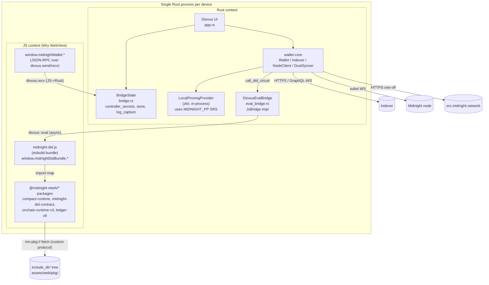
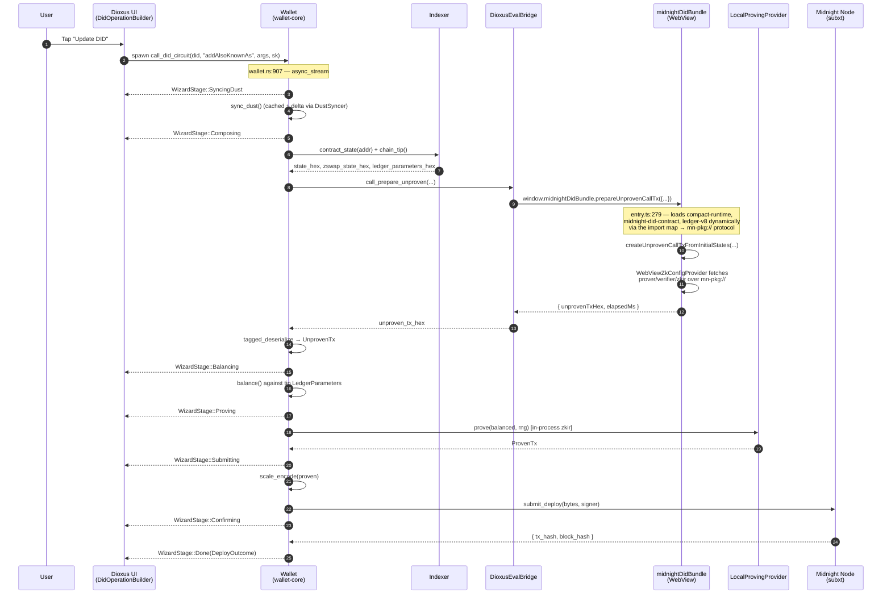
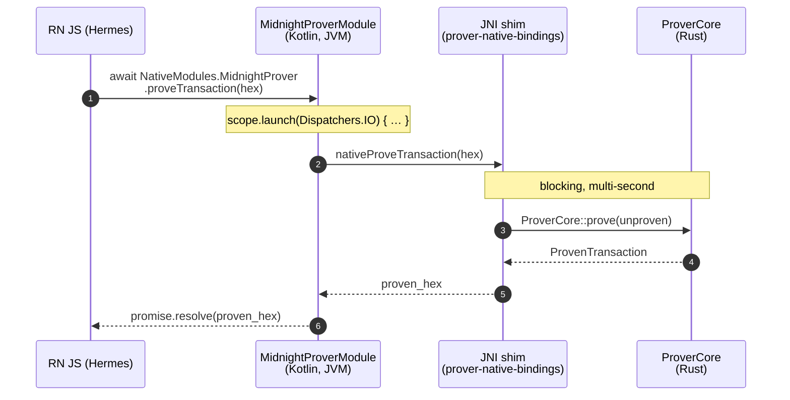

# Midnight Mobile Wallet — Architecture

Status: design + implementation reference for the `mobile-bench/dioxus-wallet`
crate (branch `mobile-bench/iteration-2`). Audience: a Midnight engineer who
has worked on the upstream TS wallet but has not yet looked at the mobile
slice. References are cited as `path/to/file.rs:LINE` so future readers can
jump.

---

## 1. High-level architecture

The mobile wallet is a single Rust binary that, on every target, runs **two
language contexts** in the same process:

- A **Rust foreground** that owns the seed, persistent state, indexer/node
  transport, ZK proof generation, and the UI tree. Dioxus 0.6 drives a Wry
  WebView for rendering.
- A **JavaScript context inside that same WebView**, used as an embedded
  interpreter for upstream TypeScript packages that we have not (and probably
  cannot) port to Rust: `@midnight-ntwrk/midnight-did-contract`,
  `@midnight-ntwrk/compact-runtime`, `@midnight-ntwrk/midnight-js-contracts`,
  plus the wbindgen-generated `onchain-runtime-v3` and `ledger-v8` WASM
  blobs.

We straddle two languages because Midnight's contract layer lives in TS.
`compactc` emits `*.compact` → TS classes; the Compact runtime that
instantiates those classes at runtime is itself TS calling into wbindgen
WASM. Re-implementing that in Rust would mean re-implementing the runtime
*and* shipping a separate transpilation path for every new contract — far
more work than embedding a WebView and calling the existing TS. Meanwhile,
ledger / wallet / SCALE / subxt / DUST sync / indexer transport already
live in Rust (the SDK shape of `midnight-ledger`), so the wallet keeps its
side native and treats JS as a sub-interpreter only for the circuit
composition step.

Concretely:

- **DID read paths** (resolve, indexer fetch, DUST snapshot, balance lookup,
  unshielded UTXO sync) are 100% Rust. Indexer queries go straight from
  Rust over HTTPS / WebSocket. JS is never touched.
- **DID write paths** (Deploy / Update / Deactivate / circuit invocation)
  cross over to JS exactly once per submission, at the `Composing` stage,
  to assemble an `UnprovenTransaction`. Everything around that — balance,
  prove, encode, submit — is Rust.

### 1.1 Process diagram



Notes:

- The dotted lines through `mn-pkg://` are not a separate process. They are
  Wry custom-protocol callbacks (`src/protocol.rs:45`) running on the Rust
  thread, serving bytes out of an `include_dir!`-embedded snapshot of
  `assets/web/pkg/` (`src/protocol.rs:40`).
- On every supported target the production path uses
  `DioxusEvalBridge`; `NodeChildBridge` survives only as the
  `cargo test` transport. Desktop now defaults to `--features
  js-bridge` (see `mobile-bench/dioxus-wallet/Cargo.toml` `[features]`)
  so a plain `cargo run -p dioxus-wallet` mounts the WebView bundle
  and routes DID writes through the eval bridge — no Node child
  process is ever spawned from the App binary.

### 1.2 Sequence — Update DID (`addAlsoKnownAs`)

This is the representative DID-write path. The user taps **Update DID** on
a resolved DID's detail view, the wallet runs a Compact `addAlsoKnownAs`
circuit against the current contract state, balances DUST + proves +
submits, and reports back via `WizardStage`.



Key references:

- `mobile-bench/wallet-core/src/wallet.rs:907` — `Wallet::call_did_circuit`
  is the streamed pipeline. Stages line up with `WizardStage` in
  `mobile-bench/wallet-core/src/tx/mod.rs:39`.
- `mobile-bench/wallet-core/src/wallet.rs:1019` — call into the JS bridge.
- `mobile-bench/dioxus-wallet/web/src/entry.ts:279` — JS-side
  `prepareUnprovenCallTx` body.
- `mobile-bench/dioxus-wallet/src/eval_bridge.rs:94` — `run_one` builds the
  `await window.midnightDidBundle.<method>(params)` snippet and runs it
  through `document::eval`.

### 1.3 What is pure Rust

Everything except the **Compose** step of a DID write. In particular:

- DUST sync and snapshot — `mobile-bench/wallet-core/src/dust/syncer.rs`.
  Talks subxt to the node + GraphQL-WS to the indexer.
- Indexer queries (`contract_state`, `chain_tip`, `last_tx`) —
  `mobile-bench/wallet-core/src/indexer.rs`. Pure reqwest over HTTPS.
- DID resolve (`Wallet::resolve_did_full`, `wallet.rs:1206`) — fetches
  contract state from the indexer and decodes a `DidLedgerState` straight
  into a `DidDocument`. No JS involvement.
- Balance + prove + scale-encode + submit (`tx::balance`, `tx::prove`,
  `tx::scale`, `NodeClient::submit_deploy`).
- The unshielded NIGHT sync (`Wallet::sync_unshielded`).

JS is only on the critical path for **building the unproven transaction**,
because that requires running a Compact circuit against the current
on-chain `ContractState` to populate the transcript with the right
public/private input commitments. The JS bundle holds upstream wbindgen
modules that turn the Compact AST into a partition of guaranteed /
fallible transcripts. Once the bundle hands us back the SCALE-encoded
unproven tx, the rest is plain Rust on every target.

---

## 2. Rust ↔ TS ↔ Rust interop

### 2.1 The `JsBridge` trait

Lives at `mobile-bench/wallet-core/src/js_bridge.rs:57`. The shape is
deliberately minimal to keep the trait dyn-compatible:

```rust
#[async_trait]
pub trait JsBridge: Send + Sync {
    async fn call_json(
        &self,
        method: &str,
        params: serde_json::Value,
    ) -> Result<serde_json::Value, JsBridgeError>;
}
```

The trait method takes `serde_json::Value` in and out so it stays object-
safe — a generic `T` would block `Arc<dyn JsBridge>`. Typed convenience
lives on a blanket extension trait, `JsBridgeExt::call::<P, T>(...)` at
`js_bridge.rs:75`, implemented for every `T: JsBridge + ?Sized`. Callers
write `bridge.call::<P, T>("prepareUnprovenCallTx", params).await` and get
strongly-typed JSON back.

`JsBridgeError` (`js_bridge.rs:33`) has three variants — `Transport`,
`JsError`, `Codec` — so callers can tell "the bridge process died" apart
from "the JS function threw" apart from "the JSON didn't parse".

### 2.2 Two implementations

#### `NodeChildBridge` — test-only

Defined at `mobile-bench/wallet-core/src/js_bridge.rs:102` and used **only
by `cargo test`** in the wallet-core crate. It spawns
`node mobile-bench/wallet-core/tests/js-harness/harness.mjs` and pipes
newline-delimited JSON-RPC over the child's stdin/stdout. Per-call
serialisation is handled by holding both `stdin` and `stdout` behind
`tokio::sync::Mutex` (`js_bridge.rs:109`), which means concurrent `call`s
inside one test are processed sequentially.

The Android-side `spawn` (`js_bridge.rs:131`) is a hard error: the APK has
no Node runtime and the sandbox cannot exec siblings. The desktop-side
`spawn` (`js_bridge.rs:152`) requires `node_modules/` to already exist
next to the harness; it surfaces a clear error if you forgot to run
`npm install --ignore-scripts` (`--ignore-scripts` is load-bearing —
upstream `compact-runtime` has a postinstall script that would `rm -rf`
its own `dist/`).

Why it exists at all: `cargo test` cannot drive Wry on macOS (Tao requires
the main thread; libtest uses worker threads), nor in headless Linux CI
(wry's webkitgtk needs a display). The Node harness gives the same JSON-
RPC surface the WebView exposes, so the Compact-runtime-driven flows can
be covered end-to-end from `cargo test` with no display dependency. The
harness's method registry (`harness.mjs:109`) intentionally mirrors the
WebView's `window.midnightDidBundle` shape: a `prepareUnprovenCallTx` here
takes the same parameter object the WebView one does (`harness.mjs:247`).

#### `DioxusEvalBridge` — production

Defined at `mobile-bench/dioxus-wallet/src/eval_bridge.rs:46`. This is the
transport used by the shipping wallet on both desktop and Android once
`--features js-bridge` is on.

The non-obvious bit is the **threading model**:

- `dioxus::document::eval` is only safe to call from inside the Dioxus
  runtime. The `Eval` handle wraps a `GenerationalBox` keyed against the
  current `RuntimeContext` and is `!Send` (`eval_bridge.rs:12-20` design
  note).
- But `wallet-core`'s `call_did_circuit` awaits the bridge from arbitrary
  tokio tasks; that future is `Send`.
- So we split: a single **driver task** spawned via `use_future` owns an
  `mpsc::UnboundedReceiver<EvalRequest>` and is the only thing that ever
  touches `document::eval`. The `DioxusEvalBridge` handle is a thin
  `Send + Sync` wrapper around an `mpsc::UnboundedSender`. Calls ferry
  `{ method, params, reply: oneshot::Sender }` over the channel; the
  driver fills the oneshot when the JS promise resolves
  (`eval_bridge.rs:94 run_one`).

Process-wide installation: `eval_bridge::install_global()`
(`eval_bridge.rs:156`) sets a `OnceLock<DioxusEvalBridge>`. The App's
startup code calls `install_global` and hands the matching receiver to a
`use_future` that runs `run_driver(rx)` (`eval_bridge.rs:137`).
`app_wallet_for` (`mobile-bench/dioxus-wallet/src/app.rs:475`) then reads
the global handle on every wallet construction and attaches it via
`Wallet::with_js_bridge` (`mobile-bench/wallet-core/src/wallet.rs:179`).
Because all wallet handles in the App are short-lived and re-constructed
per write, no eager invalidation logic is needed.

A subtle behaviour to remember: the driver runs `run_one` calls
**sequentially** because each one awaits a `document::eval`. The bridge
imposes no parallelism between Rust callers. If a JS method needs
parallel work, it has to fan out *within* JS. In practice the only thing
running over the bridge is `prepareUnprovenCallTx`, which is sequential
anyway.

### 2.3 The other direction — JS → Rust over `dioxus.send`

The JS bundle needs to call back into Rust for things only Rust knows
(seeds, controller secrets, signing, log routing). That path lives in
`mobile-bench/dioxus-wallet/src/bridge.rs` and is independent of the
`JsBridge` trait — it's a fire-and-forget JSON-RPC channel built on
Dioxus' document-eval channel.

- `BridgeState::run_bridge_loop` (`bridge.rs:552`) starts a `document::eval`
  with the `BRIDGE_JS` shim (`bridge.rs:493`), which installs
  `window.midnightWallet.<method>(params)` and pumps each call through
  `dioxus.send({ id, method, params })`. The loop awaits each
  `handle.recv()`, dispatches to `run_method` (`bridge.rs:347`), and
  replies with `handle.send(response)`.
- The shim assigns its own request ids and matches replies by id — there's
  no relationship to the request-id space `DioxusEvalBridge` uses going
  the other way; they are two independent channels.

Methods on the JS→Rust side:

| Method                   | Purpose                                                 |
|--------------------------|---------------------------------------------------------|
| `ping`                   | Transport sanity                                        |
| `bundleError`            | JS error/info routing → `tracing` (`bridge.rs:356`)     |
| `bridgeProbe`            | (dev) loads the contract layer and reports exports      |
| `getProofServerUrl`      | When `proof-server-http` is on, the local URL           |
| `getBech32Address`       | Unshielded NIGHT bech32 for the active seed             |
| `getControllerSecretKey` | Per-DID controller sk for `localSecretKey()` witness    |

Most of these are placeholders; `getControllerSecretKey` and `bundleError`
are the load-bearing ones today. The seed never crosses the channel —
`signData` / `getPublicKey` would derive in Rust if implemented
(`bridge.rs:416-428` TODOs).

`BridgeState` itself (`bridge.rs:47`) is the shared in-process state the
JS→Rust dispatcher reads from. It's an Arc bundle of:

- `controller_secrets: HashMap<did, [u8; 32]>` — minted at deploy time,
  hydrated from the persistent store at unlock (`bridge.rs:215`).
- `store: OnceCell<WalletStore>` — the redb-backed persistent store.
- `active_wallet_id` — which `WalletId` the UI pickers bind against.
- `log_capture` — the in-memory log ring + persist-channel handle.

`BridgeState` derives `Clone + PartialEq` (`bridge.rs:73`) by Arc-pointer
equality so it can ride as a Dioxus component prop.

---

## 3. WebView / `mn-pkg://` asset pipeline

The TS pipeline only works if the WebView can resolve
`@midnight-ntwrk/...` package specifiers at runtime and instantiate the
WASM blobs that ship with them. We don't have npm at runtime, and we
don't want to depend on a host filesystem (Android sandbox has none for
our packages). The solution: vendor the packages, embed them in the
binary, serve via a custom Wry protocol, and inject an import map into
`<head>` so the browser engine's native module resolver routes specifiers
to our handler.

The whole pipeline is gated by `--features js-bridge` (Cargo.toml:29).
Off by default — vanilla builds ship only the Rust read paths.

### 3.1 `web/vendor.mjs` — copy curated packages

`mobile-bench/dioxus-wallet/web/vendor.mjs:46` lists the WASM-bearing
packages to copy from the operator's `~/iohk/midnight-did/node_modules`
into `assets/web/pkg/`:

- `midnight-did-contract` (with its `dist/managed/did/` of prover keys,
  verifier keys, and `.bzkir` files)
- `compact-runtime`
- `compact-js`
- `onchain-runtime-v3`
- `ledger-v8`
- `object-inspect` (a CJS dep `compact-runtime` reaches for — vendored as
  an ESM wrapper via a one-off esbuild invocation, `vendor.mjs:106`)

Pure-JS packages (`midnight-js-contracts`, `midnight-js-network-id`,
`effect`, …) are **not** vendored; they're bundled by `build.mjs` into
`midnight-did.js`. Only modules that bring `.wasm` along — or have CJS
quirks — need to be loaded by the browser's native module machinery, and
those are the only ones the import map covers.

A second pass at `vendor.mjs:140` rewrites the wbindgen entry files for
`onchain-runtime-v3` and `ledger-v8`. Upstream emits

```js
import * as wasm from "./xxx_bg.wasm";
```

which requires WebAssembly ES Module Integration (stage-4 spec, not in
WKWebView). The rewrite replaces that with a manual loader that
`fetch`-es the `.wasm` via `import.meta.url` and instantiates it through
`WebAssembly.instantiateStreaming` (`vendor.mjs:144`). Modeled after
upstream's own `xxx_fs.js` Node loader.

### 3.2 `web/build.mjs` — esbuild the entry

`mobile-bench/dioxus-wallet/web/build.mjs:43` bundles
`web/src/entry.ts` into `assets/web/midnight-did.js`. The vendored
packages (the `VENDORED_EXTERNALS` array at `build.mjs:35`) are declared
`external`, so esbuild keeps their import specifiers intact in the
output. At runtime the browser's import map rewrites those specifiers to
`mn-pkg://` URLs.

Notable knobs:

- `format: "esm"` — output is `<script type="module">` so static + dynamic
  `import()` resolve through the import map.
- `conditions: ["browser", "module", "import", "default"]` — picks browser
  entry points for the polyfilled std stack.
- `nodeModulesPolyfillPlugin` — polyfills `path`, `crypto`, `assert`,
  `util`, `events`, `stream`, `buffer`; emptied stubs for `fs` and
  `fs/promises` (the WebView has no filesystem).
- `nodePaths: [$MIDNIGHT_DID_NODE_MODULES || ~/iohk/midnight-did/node_modules]`
  — esbuild resolves transitive deps against the upstream tree.
- A few packages are aliased to `unsupported-stub.js` (the wallet's seed
  storage, level-db state provider, HD-key helpers) because they are
  Node-only and the wallet supplies its own Rust equivalents.

### 3.3 `assets/web/pkg/` as `include_dir!` payload

`mobile-bench/dioxus-wallet/src/protocol.rs:40`:

```rust
static PKG_TREE: Dir<'static> = include_dir!("$CARGO_MANIFEST_DIR/assets/web/pkg");
```

The directory is statically embedded in the binary at build time. On
arm64 Android the embedded tree adds ~30 MB to the cdylib; on desktop the
cost is similar but less visible. The trade-off is intentional: the same
protocol handler then works on Android without filesystem access to the
host's source tree, which is what made phase D (DID writes on Android)
feasible without a server.

### 3.4 The Wry custom-protocol handler

`mobile-bench/dioxus-wallet/src/protocol.rs:45`:

```rust
pub fn build_handler() -> impl Fn(Request<Vec<u8>>) -> Response<Cow<'static, [u8]>> + 'static {
    |req| handle(req)
}
```

`handle` (`protocol.rs:50`) strips the URL path, runs it through a
path-traversal guard (`protocol.rs:104`), looks up bytes in `PKG_TREE`,
infers a content-type from the extension (`protocol.rs:108`), and serves
`200` with `access-control-allow-origin: *` so dynamic imports don't trip
CORS. Logging at `target = "mn-pkg"` makes asset misses visible in the
Logs tab.

The handler is wired into the Wry config in
`mobile-bench/dioxus-wallet/src/lib.rs:234`:

```rust
cfg.with_custom_head(bundle_script).with_custom_protocol(
    "mn-pkg".to_string(),
    protocol::build_handler(),
)
```

### 3.5 The Android URL-rewrite quirk

Wry desktop registers `mn-pkg` directly as a custom scheme with
WKURLSchemeHandler (macOS) or its Linux equivalent. JS `import("mn-pkg://...")`
dispatches to our handler.

Wry-Android cannot do that. Chromium WebView does not allow JS to
`fetch` / `import` arbitrary non-standard schemes. Wry-Android's
workaround is to translate every custom-protocol URL of the form
`name://authority/...` into `http://name.authority/...` and match that
prefix inside the `shouldInterceptRequest` callback. The translation
only fires for the initial page URL, not for runtime `import()` calls
— **the import map has to spell the `http://` form itself**.

`lib.rs:201-228` does exactly that:

```rust
#[cfg(not(target_os = "android"))]
let import_map = r#"
<script type="importmap">
{ "imports": {
    "@midnight-ntwrk/midnight-did-contract": "mn-pkg://localhost/midnight-did-contract/dist/index.js",
    ...
} }
</script>"#;

#[cfg(target_os = "android")]
let import_map = r#"
<script type="importmap">
{ "imports": {
    "@midnight-ntwrk/midnight-did-contract": "http://mn-pkg.localhost/midnight-did-contract/dist/index.js",
    ...
} }
</script>"#;
```

The JS side mirrors the same heuristic for runtime URL construction —
`entry.ts:223 pkgBaseUrlFor()` checks `location.host.endsWith(".localhost")`
and picks the right scheme so the `WebViewZkConfigProvider` fetches keys
through the correct URL.

### 3.6 `<head>` injection

`with_js_bridge_inner` (`lib.rs:153`) assembles three blocks and hands
them to `cfg.with_custom_head`:

1. **Error reporter** (`lib.rs:154-187`) — installs `window.onerror` +
   `unhandledrejection` listeners and routes them to
   `window.midnightWallet.bundleError`. Buffers events until the bridge
   shim is available (the bridge installs slightly later via
   `BridgeState::run_bridge_loop`), then drains. Without this, JS load
   failures vanish into the Wry void and only show up as inert dev-tools
   noise.
2. **Import map** (`lib.rs:201-228`) — the desktop / Android pair from §3.5.
3. **Module bundle** (`lib.rs:229-232`) — `<script type="module">` whose
   body is the literal contents of `assets/web/midnight-did.js`, pasted
   inline via `include_str!`. The bundle's static imports get resolved
   through the import map; its dynamic imports (`compact-runtime`,
   `midnight-did-contract`, `ledger-v8`) load on first
   `prepareUnprovenCallTx` call.

The ordering matters: error reporter first so reporter can catch any
later failures; import map before the bundle so the bundle's static
imports resolve; bundle last.

---

## 4. Proof generation

### 4.1 `LocalProvingProvider` — the default everywhere

`Wallet::call_did_circuit` → `tx::prove::prove(balanced, rng)` runs the
zkir prover in-process. The prover loads BLS-12-381 SRS files via
`base_crypto::data_provider::MidnightDataProvider`, which resolves them
in this order:

1. `$MIDNIGHT_PP` (an absolute directory the operator points us at)
2. `$XDG_CACHE_HOME/midnight/zk-params`
3. `$HOME/.cache/midnight/zk-params`

On desktop the user's `~/.cache/midnight/zk-params` is populated lazily
on first run by the SDK's HTTPS fetch from `srs.midnight.network`.

On Android there is no `$HOME`, and the SDK provider hard-errors with
"Could not determine $HOME, $XDG_CACHE_HOME, or $MIDNIGHT_PP". The Android
entry point (`lib.rs:268`) sets `MIDNIGHT_PP=/data/local/tmp/midnight-pp`
before launching Dioxus:

```rust
#[unsafe(no_mangle)]
pub extern "C" fn main() -> i32 {
    let pp = "/data/local/tmp/midnight-pp";
    let _ = std::fs::create_dir_all(pp);
    unsafe { std::env::set_var("MIDNIGHT_PP", pp); }
    run();
    0
}
```

The matching SRS files are pre-pushed via `adb push` (see DEPLOY guide
§2.2 below).

### 4.2 `proof-server-http` — in-process HTTP wrapper (desktop today)

`mobile-bench/dioxus-wallet/Cargo.toml:37` gates `proof-server-http`,
which spins up `prover-core`'s actix-web server in-process at startup.
`bridge::spawn_proof_server` (`bridge.rs:244`) binds it to `127.0.0.1:0`
and registers the resulting URL with the App's process-wide static
(`app::set_proof_server_url`). Every subsequent `app_wallet_for` call
attaches that URL to the new wallet via `with_proof_server_url`
(`app.rs:506`), and `tx::prove::prove_via_http` routes proving through
`POST /prove`.

This exists for one reason: debug-built wallets prove ~20× slower than
release-built provers. Running the prover behind an HTTP wrapper lets you
run the *wallet* in debug for fast iteration while still proving through
a release-built binary. Same intra-process address space, no IPC cost
beyond the local `fetch`.

**Today it is desktop-only by configuration** (`prover-core` is gated to
`cfg(all(not(target_os = "android"), not(target_os = "ios")))` in
`Cargo.toml:117`), not by design. `js-bridge` and `proof-server-http`
are otherwise orthogonal; `proof-server-http` implies `js-bridge` only
because the JS pipeline is the original consumer. §4.3 below covers
why we want to lift the desktop-only gate and what it takes.

### 4.3 Local proof-server on mobile (target architecture)

The goal is to run **the same `127.0.0.1:<port>/prove` HTTP wrapper
inside the Android / iOS app**, so that *any* consumer — the wallet's
own Rust path, the WebView JS bundle, or upstream Midnight TS/JS DApp
packages embedded in a future host app — can use the standard
`proofServerUrl` configuration shape the upstream SDK already expects.
This unifies the proving call sites:

```
                                ┌──────────────────────────┐
                  POST /prove   │                          │
   Rust  ──────────────────────►│                          │
                                │   in-process actix-web   │
                                │   on 127.0.0.1:<port>    │
   WebView JS  ────────────────►│   = prover-core release  │
   (fetch via window.fetch)     │                          │
                                └──────────────────────────┘
   Upstream Midnight TS         ▲
   (configured with             │
   `proofServerUrl =            │
   "http://127.0.0.1:<port>"`)  │
   ─────────────────────────────┘
```

#### Why the loopback URL works inside the app

- **Android.** The WebView (Chromium) runs inside the same Linux
  process as the Rust code. Loopback (`127.0.0.1`) is in-namespace
  and needs no permission. Cleartext loopback is allowed by default
  on Android 9+ when targeting older API levels; for Android 9+
  with target SDK ≥ 28 we'll add a `network_security_config.xml`
  that explicitly opts loopback in:
  ```xml
  <network-security-config>
    <domain-config cleartextTrafficPermitted="true">
      <domain includeSubdomains="true">127.0.0.1</domain>
      <domain includeSubdomains="true">localhost</domain>
    </domain-config>
  </network-security-config>
  ```
  and reference it from `AndroidManifest.xml` via
  `android:networkSecurityConfig="@xml/network_security_config"`.
- **iOS.** `WKWebView` likewise reaches `127.0.0.1` inside the app
  sandbox. ATS is already relaxed via `NSAllowsArbitraryLoads: true`
  in `Info.plist` (§5b.1) so cleartext loopback isn't blocked.
- **JS-side configuration.** The upstream Midnight SDK reads its
  proof-server URL from a config object (typically
  `{ proofServerUrl: "http://..." }`). The Rust App already exposes
  the chosen URL via `set_proof_server_url`; we inject it into the
  WebView at boot the same way `<head>` injection currently
  delivers the `<importmap>`:
  ```rust
  let cfg = cfg.with_custom_head(format!(
      "<script>window.midnightProofServerUrl = {url:?};</script>{rest}",
      url = chosen_url, rest = existing_head));
  ```
  JS bundle reads `window.midnightProofServerUrl` and plugs it into
  whichever SDK factory it uses. No native bridge call needed.

#### What needs to change

1. **Cargo wiring.** Move the `prover-core` dependency out of the
   desktop-only `[target.…]` block in
   `mobile-bench/dioxus-wallet/Cargo.toml`. The `proof-server-http`
   feature already names `prover-core/proof-server-http` as its
   transitive dep; we just need that target to be reachable on
   Android and iOS too. `proof-server-http` is opt-in, so this
   doesn't bloat the default mobile build.
2. **Verify actix-web cross-compiles to `aarch64-linux-android` /
   `aarch64-apple-ios`.** The doc previously claimed actix doesn't
   cross-compile to Android. Re-checking against the current
   pinning (`actix-web ^4.13`, `default-features = false`, features
   `["macros", "compress-brotli", "compress-gzip", "cookies",
   "http2"]` in `proof-server/Cargo.toml:27`), this should compile
   cleanly — actix-web 4.x is pure-Rust except for compression
   crates which themselves cross-compile cleanly. Plan: try
   `cargo ndk -t arm64-v8a build --release -p dioxus-wallet --lib
   --features js-bridge,proof-server-http,preprod-live` and fix the
   first error if it surfaces.
3. **Fallback if actix is too heavy.** If actix-web 4.x trips a
   build error we can't resolve in <1 day, drop to a minimal
   `hyper` or `tiny_http` server inside `prover-core` behind the
   same feature flag. The HTTP surface is just `POST /prove` and
   `GET /fetch-params/{k}` (≤ 200 lines of glue); we don't need
   actix's middleware / extractors for this in-process use case.
   The `POST /prove` contract — `application/octet-stream` body
   containing SCALE-encoded `ProofPreimageVersioned` plus optional
   `ProvingKeyMaterial`, returning SCALE-encoded `Proof` — is
   framework-independent.
4. **WebView `<head>` injection of `window.midnightProofServerUrl`.**
   See snippet above. One-line addition to `lib.rs::with_js_bridge_inner`.
5. **`network_security_config.xml`** as shown above. One new file
   in `android/app/src/main/res/xml/`, one attribute in the
   manifest's `<application>` tag.

#### Why this is worth doing

- **Symmetry with desktop.** Today the wallet's own Rust path uses
  `prove_via_http` when `PROOF_SERVER_URL` is set, but the WebView
  JS bundle does composition only — proving is delegated back to
  native Rust via the `DioxusEvalBridge`. Once the mobile
  proof-server is up, the JS bundle can call `fetch(<local
  url>/prove, …)` and the architecture stops having two parallel
  proof-routing mechanisms in one process.
- **Drop-in for upstream DApp consumers.** Any team taking the
  upstream Midnight TS/JS DApp stack and embedding it inside an
  Android / iOS host app gets a proof-server "for free" — they
  configure their SDK with the URL we surface and don't have to
  ship their own.
- **It is *not* a replacement** for the in-process Rust path. The
  Rust path (§4.1) stays the production default for the wallet's
  own DID writes — it skips the HTTP round-trip entirely. The
  HTTP wrapper exists for the cases that need it: JS consumers,
  debug-built wallet → release-built prover, and any future
  Native module hosted by RN / Capacitor (§7).

#### Verification status (updated 2026-05-22)

- ✅ Design captured here.
- ✅ `prover-core` lifted to a global dep + four `not(target_os
  = "android")` cfg gates removed from `prover-core/src/lib.rs`,
  `server.rs`, `http.rs`. The previous Cargo gate reflected a
  belief that turned out to be false.
- ✅ `actix-web 4.13` (with `default-features = false`) +
  `midnight-proof-server` + `reqwest 0.13` cross-compile to
  **`aarch64-linux-android`** — release `.so` 145 MB (up from
  132 MB without the feature), build time 1m 24s on a warm cache.
- ✅ Same source cross-compiles to **`aarch64-apple-ios-sim`** —
  release `.dylib` 134 MB, build time 2m 48s. (iOS Simulator
  artifact only; physical iOS device deploy still depends on
  the signing dance from §5b.5.)
- ✅ `bridge::spawn_proof_server` runs unconditionally from
  `use_future` at `app.rs:1022`. On a fresh APK install the
  startup log emits:
  ```
  INFO dioxuswalletmain::bridge:
       embedded proof-server ready url=http://127.0.0.1:42605
  ```
  and `/proc/<pid>/net/tcp` confirms two loopback listeners
  bound by the actix accept loop.
- ✅ HTTP from the **device shell**: `adb shell curl -i
  http://127.0.0.1:42605/` returns `200 OK` with CORS headers
  and a JSON status payload — actix is genuinely serving, not
  just bound.
- ✅ End-to-end **Update DID** from the UI on a physical
  Samsung S24 Ultra completes via the embedded server. The
  prove-routing log line confirms which path was taken:
  ```
  INFO wallet_core::tx::prove:
       proving via HTTP proof-server url=http://127.0.0.1:42605
  ```
  Subsequent submit + indexer confirmation complete normally.
- ⏳ `network_security_config.xml` for cleartext loopback —
  not strictly needed for the wallet's own Rust client (which
  is what we tested) because `reqwest` honours system policy
  rather than the WebView's. Will still be needed before the
  **WebView JS** (or an RN JS host) can `fetch` the loopback
  URL. Tracked alongside the next item.
- ⏳ `window.midnightProofServerUrl` `<head>` injection — not
  yet added; needs ~10 LoC in `lib.rs::with_js_bridge_inner`.
  Closes the loop for "WebView/RN JS can hit the URL" from
  step 5 of the prototype plan in §7.3a.

The big-ticket questions ("will actix cross-compile", "will
loopback work inside the app sandbox", "will the existing
`prove_via_http` path actually engage") are all **answered yes**
on real arm64 hardware. The two remaining `⏳` items are the
JS-side bring-up and are independent of the server itself.

---

## 5. Android specifics

### 5.1 Gradle wrapper

`mobile-bench/dioxus-wallet/android/` is mirrored from
`mobile-bench/dioxus-bench/android/`. Package id
`io.iohk.midnight.wallet`, native lib name `dioxuswalletmain`
(`Cargo.toml:11`). The build process:

1. `cargo ndk -t arm64-v8a -o android/app/src/main/jniLibs build --release --features js-bridge`
   compiles `libdioxuswalletmain.so` (~30 MB with the embedded `pkg/`
   tree) and drops it under `jniLibs/arm64-v8a/`.
2. `./gradlew assembleDebug` wraps that `.so` into
   `app/build/outputs/apk/debug/app-debug.apk`, signed with the default
   debug keystore.
3. `adb install -r ...` deploys.

### 5.2 Wallet store path

`mobile-bench/dioxus-wallet/src/app.rs:7242`:

- Desktop: `~/.midnight/wallet-prototype/wallet.redb`.
- Android: `/data/data/<package>/files/midnight-dx-wallet/wallet.redb`.

The Android branch resolves the package name by reading `/proc/self/cmdline`
(`app.rs:7278`) rather than going through JNI for `getFilesDir()`. The
package id is the first NUL-separated field of cmdline on Android,
written by Zygote for every app process, so this avoids one round of JNI
plumbing for a value we know is stable per process.

### 5.3 TLS initialisation — the `try_init_android_tls` poll

`rustls-platform-verifier`'s Android backend stores its JNI handles in a
process-global `OnceLock` populated by `init_with_env(&mut JNIEnv, JObject)`.
Without that call, the first TLS handshake panics with
"Expect rustls-platform-verifier to be initialized" — and the wallet
hits TLS immediately (indexer over HTTPS, SRS fetch, proof-server probe).

We cannot call `init_with_env` from `lib.rs::main` (`lib.rs:268`):
- `ndk_context::android_context()` panics with "android context was not
  initialized" because Dioxus seeds that context only *after* it calls
  our `extern "C" fn main`.
- `extern "C" fn` cannot unwind. A panic inside the C ABI aborts the
  process.

Fix: a `use_future` inside `App` (`app.rs:666`) polls `try_init_android_tls`
every 100 ms for up to 3 seconds:

```rust
for _ in 0..30 {
    match crate::try_init_android_tls() {
        Ok(true) => { tracing::info!("rustls-platform-verifier ready"); return; }
        Ok(false) => {}
        Err(e) => { tracing::warn!(...); return; }
    }
    tokio::time::sleep(Duration::from_millis(100)).await;
}
```

`try_init_android_tls` (`lib.rs:298`) wraps `ndk_context::android_context()`
in `catch_unwind` so the panic-before-seeding path returns `Ok(false)`
without aborting, and only sees a `panic` once Dioxus has run its JNI
hook.

There's a second twist: **two versions of `rustls-platform-verifier` are
in the dep tree**. `reqwest` pulls 0.6 and `subxt` pulls 0.5. Each crate
has its own `OnceLock`, so initialising 0.6 does not satisfy 0.5's call
site. Without a second init the dust syncer's WS subscribe (subxt path)
hits the panic on first TLS use. We pull 0.5 under a renamed alias
(`Cargo.toml:94`) so both are addressable:

```rust
rustls_platform_verifier::android::init_with_env(&mut env, activity_0_6)?;
rustls_platform_verifier_v05::android::init_with_env(&mut env, activity_0_5)?;
```

(`lib.rs:319-329`)

### 5.4 Network egress on the emulator

The Android emulator's NAT can drop specific Midnight endpoints (we have
observed it dropping `indexer.preprod.midnight.network` reliably while
letting public DNS through). Cold-boot the emulator with
`-dns-server 8.8.8.8,1.1.1.1` to force the AVD to use external resolvers
instead of the host's DNS. The DEPLOY guide records this workaround.

---

## 5b. iOS specifics

The iOS slice is **end-to-end verified on the iPhone 15 Pro / iOS 17.5
Simulator** as of this update. App boots cleanly, Rust↔JS↔Rust round
trips through WKWebView, PreProd-live seed + DID inventory hydrate,
and the DUST syncer starts. All three boot markers fire:

```
INFO mn-pkg: request url=mn-pkg://localhost/midnight-did-contract/dist/index.js
INFO mn-pkg: request url=mn-pkg://localhost/ledger-v8/midnight_ledger_wasm_bg.wasm
INFO dioxuswalletmain: app_wallet_for: ...                  ← marker 1
INFO eval-bridge: driver started                            ← marker 2
INFO bundle: JS bundle event msg=contract layer loaded      ← marker 3
INFO dioxuswalletmain::app: preprod-live: seeded inventory + secrets count=3
INFO dioxuswalletmain::app: wallet store opened path=.../Documents/midnight-dx-wallet/wallet.redb
INFO wallet_core::dust::syncer: dust syncer starting network=preprod resume_from=70
```

The slice required two host-side fixes during bring-up beyond what the
original brief covered (recorded for future runs):

1. **Xcode platform components were missing on first run.** `xcodebuild
   -showdestinations` reported `DVTDownloads.framework` missing.
   `sudo xcodebuild -runFirstLaunch` (or letting the macOS auto-installer
   trigger from `xcrun simctl list devices`) fixed it.
2. **The scheme's `SUPPORTED_PLATFORMS` defaulted to `iphoneos` only.**
   xcodebuild then refused any `-destination 'platform=iOS Simulator'`
   spec because the scheme couldn't see a simulator destination. The
   fix lives in `ios/project.yml`: set
   `SUPPORTED_PLATFORMS: "iphoneos iphonesimulator"` plus the
   `CODE_SIGN_*` suppressors for `iphonesimulator` builds, so simulator
   builds don't need a paid Apple developer cert.

### 5b.1 Xcode wrapper

`mobile-bench/dioxus-wallet/ios/` is the iOS counterpart to the
Android Gradle wrapper:

```
ios/
├── App/
│   ├── App.swift              ← SwiftUI @main; calls Rust start_app()
│   ├── Info.plist             ← generated by XcodeGen
│   └── libdioxuswalletmain.dylib   ← vendored from cargo build
├── DioxusWallet.xcodeproj/    ← generated by `xcodegen generate`
└── project.yml                ← XcodeGen spec (iOS 15.0 target)
```

`App.swift` declares the Rust entry point on the `@main` struct
itself so the file has no file-scope code (Swift forbids `@main` in
a file with top-level executable code):

```swift
@main
struct DioxusWalletApp: App {
    @_silgen_name("start_app") static func start_app()
    init() { Self.start_app() }
    var body: some Scene { WindowGroup { Color.clear } }
}
```

The Rust side exposes the symbol with `#[no_mangle] pub extern "C" fn
start_app()` under `cfg(target_os = "ios")` in `src/lib.rs`. It sets
`MIDNIGHT_PP=$HOME/Library/Caches/midnight-pp/` (writable iOS sandbox
path — unlike Android's `/data/local/tmp/` constraint, on-demand SRS
fetch actually works here) then calls `run()`.

### 5b.2 Cross-compile

`cargo build --target aarch64-apple-ios-sim --release -p dioxus-wallet
--lib --features "preprod-live js-bridge"` produces a ~118 MB
`libdioxuswalletmain.dylib`. Debug build ~20 s; release ~5 m
(dominated by the embedded `pkg/` tree + halo2 prover crates).

The release `.dylib` carries the `_start_app` C-ABI symbol (`nm`
confirms `T _start_app`) and links cleanly against `UIKit`, `WebKit`,
`Security`, `Foundation`, `CoreGraphics`, `CoreFoundation`, `libobjc`
— the iOS Simulator frameworks Wry-iOS pulls in. No external
toolchain knobs needed beyond `xcode-select -p` returning a usable
Xcode and `rustup target add aarch64-apple-ios-sim`.

`install_name_tool -id "@rpath/libdioxuswalletmain.dylib"` is applied
to the vendored `.dylib` so dyld resolves it after the Xcode "Embed
Frameworks" phase copies it to `Frameworks/` inside the `.app`.

### 5b.3 Deps that differ from desktop / Android

`Cargo.toml` carries a third per-target block,
`[target.'cfg(target_os = "ios")'.dependencies]`:

- **Pulled in**: `dioxus` with `["mobile"]`, `rustls-platform-verifier`
  (both 0.6 and 0.5 aliased) — same TLS dual-init concern as Android,
  but `rustls-platform-verifier` auto-detects iOS and uses `SecTrust`
  natively, so no `init_with_env` dance is needed. The
  `try_init_android_tls` poller in `app.rs` stays Android-gated and
  is skipped on iOS entirely.
- **Excluded**: `prover-core` (no actix on iOS — same constraint as
  Android), `ndk-context` / `jni` / `libc` (Android-only JNI plumbing),
  `dirs` (use `std::env::var_os("HOME")` to find the sandbox),
  `arboard` (use `UIPasteboard` via UIKit when we wire it),
  `resvg` / `tiny-skia` (no per-process window icon — iOS uses the
  `.app` bundle's `AppIcon.appiconset`).

### 5b.4 mn-pkg:// on iOS — no URL rewrite needed

The Android Chromium WebView path required rewriting the import map
to `http://mn-pkg.localhost/…` because Chromium-on-Android refuses
non-standard schemes from `import()`. **iOS uses `WKWebView`, which
honours `WKURLSchemeHandler` registration the same way macOS
desktop does** — so the desktop `mn-pkg://localhost/…` form works
unchanged on iOS. The existing
`#[cfg(not(target_os = "android"))]` branch in `lib.rs` already
covers iOS without modification.

The single `Wry-Android` rewrite trick (`http://name.authority/…`)
stays Android-only.

### 5b.5 Install + launch recipe

The full pipeline once the host is provisioned (Xcode platforms
installed, simulator runtime available, scheme configured per § 5b.2):

```bash
cd mobile-bench/dioxus-wallet
# 1. Refresh the .dylib if Rust source changed.
cargo build --target aarch64-apple-ios-sim --release \
  -p dioxus-wallet --lib --features "preprod-live js-bridge"
cp target/aarch64-apple-ios-sim/release/libdioxuswalletmain.dylib \
   ios/App/
install_name_tool -id "@rpath/libdioxuswalletmain.dylib" \
   ios/App/libdioxuswalletmain.dylib

# 2. Generate + build the Xcode project.
cd ios
xcodegen generate
xcodebuild -project DioxusWallet.xcodeproj -scheme DioxusWallet \
  -configuration Debug -sdk iphonesimulator \
  -destination 'platform=iOS Simulator,name=iPhone 15 Pro,OS=17.5' build

# 3. Boot the simulator + install + launch.
xcrun simctl boot "iPhone 15 Pro"
xcrun simctl bootstatus "iPhone 15 Pro"
xcrun simctl install booted /path/to/DioxusWallet.app
xcrun simctl launch --console-pty booted io.iohk.midnight.wallet
```

`--console-pty` is the magic flag — without it, Rust's `tracing`
output (stderr) is eaten by the iOS app sandbox and never reaches
`xcrun simctl spawn booted log show`. With it, stderr streams to
the launching terminal so the `INFO eval-bridge: driver started`,
`bundle event msg=contract layer loaded`, etc. lines appear inline.
For a separate stream (without re-launching), tail WebKit-level
events instead:

```bash
xcrun simctl spawn booted log stream --predicate \
  'processImagePath CONTAINS "DioxusWallet"'
```

(That captures `WebPageProxy::runJavaScriptInFrameInScriptWorld`,
`didCommitLoadForFrame`, etc. — useful when the app is misbehaving
mid-flight and you want WebKit-level signals.)

The three boot markers to verify the slice is healthy (mirrors the
Android list — minus `rustls-platform-verifier ready` since iOS
skips the dual-init):

1. First `INFO dioxuswalletmain: app_wallet_for` line.
2. `INFO eval-bridge: driver started` — `DioxusEvalBridge` mounted
   on Wry-iOS's WebView.
3. `INFO bundle: JS bundle event msg=contract layer loaded` —
   confirms `WKURLSchemeHandler` is serving the embedded `mn-pkg`
   bundle.

### 5b.6 Open follow-ups

- Real-device deploy (TestFlight or ad-hoc) — requires a paid
  Apple developer account, provisioning profile, and signing
  certificate. Out of scope for the simulator pipeline.
- `UIPasteboard` wiring for the clipboard-copy buttons (currently
  `copy_to_clipboard` is a no-op on iOS, same as Android).
- A `cargo lipo`-style multi-arch `.xcframework` if we want one
  build artifact for both Apple Silicon simulator and arm64 device.

---

## 6. Build matrix

### 6.1 Feature combos

| Feature combo                              | Desktop                                                           | Android                                                | iOS Simulator                                          |
|--------------------------------------------|-------------------------------------------------------------------|--------------------------------------------------------|--------------------------------------------------------|
| (none — default)                           | + WebView bundle + DID writes via `DioxusEvalBridge` (`js-bridge` is on by default) | UI + read-only on-chain                                | UI + read-only on-chain                                |
| `--features js-bridge`                     | (same as default on desktop)                                      | + WebView bundle + DID writes (no Node)                | + WebView bundle + DID writes via WKWebView            |
| `--no-default-features`                    | UI + read-only on-chain (resolve, balance, DUST sync), no WebView | n/a (mobile builds always pass `js-bridge` explicitly) | n/a (mobile builds always pass `js-bridge` explicitly) |
| `--features proof-server-http`             | + in-process actix proof-server (implies `js-bridge`)             | **shipped & verified on real device** (§4.3) — actix-web 4.13 cross-compiles cleanly, server binds `127.0.0.1:<port>`, Update DID round-trips through `/prove` end-to-end on S24 Ultra | **builds** for `aarch64-apple-ios-sim` (§4.3) — same source, no device-deploy verification yet |
| `--features preprod-live`                  | Operator PreProd seed + 3 pre-seeded DIDs                         | same                                                   | same                                                   |
| `--features js-bridge,preprod-live`        | full DID writes against PreProd                                   | full DID writes against PreProd                        | full DID writes against PreProd                        |
| `--target wasm32-unknown-unknown`          | **blocked** — see §6.1a                                           | n/a                                                    | n/a                                                    |

### 6.1a Web target (`wasm32-unknown-unknown`) — feasibility probe (2026-05-22)

Cargo-checking `dioxus-wallet --lib --target wasm32-unknown-unknown
--no-default-features` was attempted as a "run the benchmark in
a browser" experiment. **It does not compile** — and the
fail-points fall in two tiers:

**Tier 1 — toolchain configuration (resolvable):**

- `getrandom` 0.3.x requires `--cfg wasm_js` for `wasm32-unknown-unknown`.
  Already solved upstream in `zkir-wasm/Cargo.toml` by pulling
  the two-version dance:
  ```toml
  getrandom_2 = { package = "getrandom", version = "^0.2.16", features = ["js"] }
  getrandom_3 = { package = "getrandom", version = "^0.3.4", features = ["wasm_js"] }
  ```
- `mio` 1.2 doesn't compile on `wasm32-unknown-unknown`. Pulled
  transitively by `tokio`'s `net` feature → reqwest / subxt /
  tokio-tungstenite. Resolution: a wasm32-specific
  `[target.'cfg(target_arch = "wasm32")'.dependencies]` block
  with `tokio = { features = ["rt", "macros", "sync"] }` — no
  `rt-multi-thread`, no transitive `net`.

**Tier 2 — architectural conflicts (significant porting):**

- `redb` (file-backed). The wallet store has no browser-side
  analogue without a substantial port to IndexedDB / OPFS.
- `actix-web` (`proof-server-http` feature). Won't compile to
  wasm32 — but already feature-gated, so this is a non-issue
  for an `--no-default-features` web build.
- `subxt` chain client + `tokio-tungstenite` WebSocket — both
  expect native sockets. Browser equivalent is `web-sys`
  WebSocket; non-trivial swap.
- `reqwest`. Has wasm32 support via the `fetch` backend, but
  needs explicit feature gating.
- `std::time::Instant::now()`. Panics on
  `wasm32-unknown-unknown`. Used directly in
  `contract-benchmark::run_proof`. Resolution: swap to the
  `web-time` crate behind a `cfg(target_arch = "wasm32")` block.
- `std::fs::*` (used by `MidnightDataProvider` and the
  benchmark's SRS cache). Browser has no filesystem.
  Resolution: switch the data provider to a fetch-only mode
  that streams SRS files from `srs.midnight.network` directly
  into memory, no on-disk cache (or use `IndexedDB` as a
  cache backend).
- `dioxus_desktop` (Wry + Tao). Doesn't target the web.
  Resolution: swap to `dioxus_web` (already supported by
  Dioxus 0.6) — but that needs a sibling crate or a third
  cfg-arm in `lib.rs::desktop_or_mobile_launch`.

**Two viable paths forward** (neither one explored further this
session):

| Path | Scope | Useful for |
|---|---|---|
| (A) **Benchmark-only wasm crate.** New crate `contract-benchmark-wasm` modelled on `zkir-wasm` (~30 LoC of wasm-bindgen glue). Exports `run_proof_k(k)` returning a JSON-stringified `RunStats`. Tiny static HTML page (~40 LoC) provides a "Run all" sweep UI. SRS files: pre-baked into the wasm via `include_bytes!` for k ≤ N (binary size cost ~tens of MB), or streamed from `srs.midnight.network` via JS `fetch` on demand. | Running the prover in a browser and getting per-k timings — directly addresses the original "run the benchmark here" ask. ~ 1 day of work. |
| (B) **Full UI port (`dioxus_web` arm).** Wire a third platform branch in `lib.rs`, add wasm32-specific dependency block, replace `redb` with IndexedDB-backed store, replace `subxt` WS with `web-sys` WebSocket, swap `std::time::Instant` for `web_time::Instant`, swap reqwest backend to fetch. | Running the *full* wallet (with DID resolution + writes) in a browser. ~ 1–2 weeks of work. Likely yields a slower wallet than native arm64 due to single-threaded wasm. |

For an actual prove-in-browser experiment, path (A) is the
right scope — and the `zkir-wasm` crate already proves the
core proving stack works on wasm32. Recommended next step
when reopening this thread.

From `mobile-bench/DEPLOY_TO_DEVICE.md`:

```bash
# 1. Cross-compile the cdylib (drops the .so into jniLibs).
cd mobile-bench/dioxus-wallet
ANDROID_NDK_HOME=$HOME/Library/Android/sdk/ndk/27.0.12077973 \
  cargo ndk -t arm64-v8a -o android/app/src/main/jniLibs \
  build --release --features js-bridge

# 2. Wrap into a debug APK.
cd android
JAVA_HOME=/Library/Java/JavaVirtualMachines/temurin-21.jdk/Contents/Home \
  ./gradlew assembleDebug
# → app/build/outputs/apk/debug/app-debug.apk

# 3. Push SRS params (one-time per device).
PARAMS=$HOME/.cache/midnight/zk-params
adb shell mkdir -p /data/local/tmp/midnight-pp
for f in "$PARAMS"/bls_midnight_2p{4,5,6,7,8,9,10,11}; do
  [ -f "$f" ] && adb push "$f" /data/local/tmp/midnight-pp/
done

# 4. Install + launch.
adb install -r android/app/build/outputs/apk/debug/app-debug.apk
adb shell am start -n io.iohk.midnight.wallet/dev.dioxus.main.MainActivity
```

Higher-`k` circuits need more SRS files; if a Compact circuit consumes
`k=19` you need `bls_midnight_2p4..bls_midnight_2p19`. The default
deploy push only covers up through `2p11`.

### 6.3 Desktop build

```bash
# default — no JS, no DID writes
cargo run -p dioxus-wallet

# with the WebView bundle + bridge
cargo run -p dioxus-wallet --features js-bridge

# with the local HTTP proof-server (release-built for proving speed)
cargo run -p dioxus-wallet --release --features proof-server-http
```

The `web/` bundle must be built once before any `js-bridge` build:

```bash
cd mobile-bench/dioxus-wallet/web
node vendor.mjs        # copy + rewrite vendored npm packages
node build.mjs         # esbuild midnight-did.js
```

This populates `assets/web/pkg/` and `assets/web/midnight-did.js`. Both
are read by `include_str!` / `include_dir!` at compile time, so the
Rust build will fail with a clear error if either is missing.

---

## 7. Embedding the proof service in React Native (for downstream teams)

### 7.1 Premise

This section is a handoff. Our team stays on Dioxus + WebView for the
full wallet (everything described in §§1–6 above). A separate downstream
team wants to embed **just the Midnight proof service** inside their own
React Native app — they bring their own UI (RN components + Hermes JS),
their own networking, their own key management, and their own
transaction composition. All they want from this repo is "give me a hex
unproven transaction, hand me back a hex proven transaction" running
locally on the device, no proof server, no WebView.

This section documents what we can ship them today, what is still
"proposed" and would need to be built before they can pull it in, and
the platform-packaging recipe for both Android and iOS.

### 7.2 What we ship them (entry points in this repo)

#### `ProverCore` — high-level facade over `LocalProvingProvider`

`mobile-bench/prover-core/src/lib.rs:58` defines the in-process prover
facade. Its current public surface is small and not yet a full
prove-transaction entry point:

```rust
pub struct ProverCore { /* … */ }

impl ProverCore {
    pub async fn new(cache_dir: PathBuf) -> Result<Self>;
    pub fn cache_dir(&self) -> &std::path::Path;

    // example circuit (used by bench + tests)
    pub async fn prove_zkir_example(&self, opts: BenchOpts) -> Result<ProofRun>;
}
```

(`lib.rs:64-76`, with `prove_zkir_example` declared in
`prover-core/src/zkir_example.rs:51`.)

What `ProverCore::new` does internally is the bit downstream teams
inherit: it creates the cache directory, then constructs a
`params::ParamsCache` that wraps two `MidnightDataProvider`s
(`ZswapResolver` + `DustResolver`, both in `FetchMode::OnDemand`,
`OutputMode::Log`) over the same directory (`prover-core/src/params.rs:18`).
A consequence relevant to RN packaging: `ParamsCache::new` sets
`MIDNIGHT_PP` to its `cache_dir` argument **only if the env var is not
already set** (`params.rs:26-32`). The host app can therefore decide
the cache location either by setting `MIDNIGHT_PP` before calling in,
or by passing the path through the constructor.

`prove_zkir_example` shows the call shape they want for the real entry
point — load IR, keygen against `params.zswap.0`, build a preimage,
call `preimage.prove::<IrSource>(rng, &params, &resolver)`. Adapting
this to take a SCALE-encoded `UnprovenTransaction` in and return a
SCALE-encoded `ProvenTransaction` is the work the proposed
`prover-native-bindings` crate (§7.3) would do.

#### `MidnightDataProvider` — SRS resolution

`base-crypto/src/data_provider.rs:215` defines the constructor. The
on-disk cache root is resolved in this order (`data_provider.rs:225-244`):

1. `$MIDNIGHT_PP`
2. `$XDG_CACHE_HOME/midnight/zk-params`
3. `$HOME/.cache/midnight/zk-params`
4. Otherwise: hard error `"Could not determine $HOME, $XDG_CACHE_HOME, or $MIDNIGHT_PP"`.

Android, iOS and any other sandboxed runtime fall into case 4 by default
— there is no `HOME`, no `XDG_CACHE_HOME`. The RN host therefore **must**
set `MIDNIGHT_PP` to a writable per-app directory (`getFilesDir()` on
Android, an `NSCachesDirectory` path on iOS) before the first call into
the prover. We surface this via the proposed `proving_cache_dir(...)`
FFI call (§7.3) so the host doesn't have to set env vars itself.

The names of the SRS files the provider knows about are listed in
`base-crypto/src/data_provider.rs:80` (`EXPECTED_DATA`) — they run from
`bls_midnight_2p0` through `bls_midnight_2p25` with SHA-256 digests for
each. See §7.5 for which subset to ship as RN assets.

#### Cross-compile recipe

`mobile-bench/DEPLOY_TO_DEVICE.md` documents the cross-compile flow we
use today for the dioxus-wallet cdylib. The `cargo ndk` invocation
generalises directly to a `prover-native-bindings` cdylib (§7.4).

### 7.3 Recommended packaging: `prover-native-bindings` (**proposed — not yet built**)

We propose a small Rust crate, `mobile-bench/prover-native-bindings`,
that wraps `ProverCore` in a stable C ABI and a JNI shim. **This crate
does not exist in the tree yet** — the downstream team or our team
would need to add it. Once it lands, it becomes the single thing the RN
app links against; `ProverCore` and `MidnightDataProvider` stay internal
implementation details.

Proposed surface (Rust side, all FFI-safe):

```rust
// extern "C" surface — also usable from iOS Swift via cbindgen-generated
// header. JNI shims call into these so Android only needs one body.

pub extern "C" fn mnp_prove_transaction(
    unproven_hex_ptr: *const c_char,
    out_proven_hex: *mut *mut c_char, // caller frees via mnp_string_free
) -> i32; // 0 = ok, nonzero = error code; error string fetched via mnp_last_error()

pub extern "C" fn mnp_prepare_params(k: u32) -> i32;

pub extern "C" fn mnp_proving_cache_dir(path_ptr: *const c_char) -> i32;

// optional, bonus:
pub extern "C" fn mnp_verify(
    proven_hex_ptr: *const c_char,
    vk_hex_ptr: *const c_char,
    out_ok: *mut bool,
) -> i32;

pub extern "C" fn mnp_string_free(s: *mut c_char);
pub extern "C" fn mnp_last_error() -> *const c_char;
```

The semantics the TurboModule on the JS side would expose:

| TurboModule method                              | Underlying call             | Notes |
|-------------------------------------------------|-----------------------------|-------|
| `provingCacheDir(path: string): void`           | `mnp_proving_cache_dir`     | Set BEFORE any `prepareParams` / `proveTransaction`. Sets `MIDNIGHT_PP` for the embedded `MidnightDataProvider`. Host passes its writable per-platform dir (`Context.getFilesDir()` on Android, `NSCachesDirectory` on iOS). |
| `prepareParams(k: number): Promise<void>`       | `mnp_prepare_params`        | Pre-fetch / copy the SRS for circuit degree `k` into the cache dir. Idempotent; safe to call eagerly on app startup for the `k` values the app uses. |
| `proveTransaction(unprovenHex: string): Promise<string>` | `mnp_prove_transaction` | Full prove pipeline. Multi-second; **must** be promise-returning so the bridge marshals it off the JS thread. |
| `verify(provenHex: string, vkHex: string): Promise<boolean>` | `mnp_verify`        | Optional; cheap relative to prove. Useful for the host's smoke tests. |

Threading: the Rust functions block on the calling (native) thread.
The TurboModule wrapper is responsible for taking that off the JS
thread — see §7.6.

### 7.3a Alternative integration: embedded HTTP proof-server

The native-bindings shape above (§7.3) is the deepest integration
— the RN app drives proving via a thin C ABI and the WASM-in-JS
problem is bypassed because no Compact-runtime WASM ever loads
in the JS engine.

An **alternative, lighter-touch shape** lets the host keep using
upstream Midnight TS/JS packages (including
`@midnight-ntwrk/api`) **unmodified**. Those packages are built
around a single config knob — `proofServer` — that points at an
HTTP `/prove` endpoint. As long as we surface such a URL, the
packages don't care whether the server is on the public internet,
on a desktop next door, or **inside the same Android/iOS process**.

This is the same `prover-core`-as-actix-server pattern already
running on desktop (§4.2), exposed to the mobile host:

```
┌──────────────────────── React Native app (Android or iOS) ────────────────────────┐
│                                                                                   │
│  1. App starts. A small native module                                             │
│     (Rust ↔ RN bridge via NAPI / JSI / TurboModule)                               │
│     spawns the embedded proof-server:                                             │
│                                                                                   │
│         let url = prover_core::spawn_proof_server();        // 127.0.0.1:57610   │
│         NativeModules.MidnightProver.url() === url          // exposed to JS     │
│                                                                                   │
│  2. RN JS imports the upstream packages **unmodified**:                           │
│                                                                                   │
│         import { buildWallet } from "@midnight-ntwrk/api";                        │
│         import { httpClientProofProvider }                                        │
│             from "@midnight-ntwrk/midnight-js-http-client-proof-provider";        │
│                                                                                   │
│  3. Wire them with the URL from step 1:                                           │
│                                                                                   │
│         const proofServerUrl = await NativeModules.MidnightProver.url();          │
│         const config = {                                                          │
│           proofServer: proofServerUrl,            // ← loopback URL               │
│           indexer:     "https://indexer.preprod.midnight.network/...",            │
│           node:        "wss://rpc.preprod.midnight.network/...",                  │
│           networkId:   "preprod",                                                 │
│         };                                                                        │
│         const wallet = await buildWallet(config, ...);                            │
│                                                                                   │
│  4. RN JS calls `wallet.addAlsoKnownAs(...)`. Internally:                         │
│                                                                                   │
│         httpClientProofProvider(config.proofServer, zk)                           │
│             .proveTx(unprovenTx)                                                  │
│         → fetch("http://127.0.0.1:57610/prove", { body: scaled })                 │
│         → lands at our Rust thread, halo2-kzg proves natively, response back.     │
│                                                                                   │
│     From the `api` package's perspective it's an ordinary HTTP proof-server.      │
│                                                                                   │
└───────────────────────────────────────────────────────────────────────────────────┘
```

#### Why the loopback URL works inside an RN app

- **Android.** RN's `fetch` is OkHttp under the hood. `127.0.0.1`
  resolves to the **app's own loopback**, not the emulator host —
  exactly the address actix is binding to. No permission needed;
  cleartext-to-loopback is allowed if the manifest opts loopback
  in via a `network_security_config.xml` referencing
  `127.0.0.1` and `localhost` (one new file, one attribute on the
  manifest's `<application>` tag — same XML shown in §4.3).
- **iOS.** RN's `fetch` is `NSURLSession`. Loopback is allowed by
  default; the `NSAllowsLocalNetworking` plist key (or the
  existing `NSAllowsArbitraryLoads` we use today) handles
  cleartext.
- **The URL is "real" enough.** From the TS code's perspective
  there's no difference between `http://127.0.0.1:57610` and
  `https://proof.midnight.network`. `httpClientProofProvider`
  doesn't care.

#### What this shape buys

- **Zero changes to the upstream TS packages.** The RN host
  imports `@midnight-ntwrk/api` exactly as a browser DApp would.
- **One Rust artifact serves everyone.** The same in-process
  actix server can also be hit by:
  - the wallet's own Rust path (via `prove_via_http` at
    `wallet-core/src/tx/prove.rs:136`),
  - an embedded WebView running upstream JS (the dioxus-wallet
    pattern, §4.3),
  - the RN host's JS (this pattern).
- **No JNI / cbindgen / TurboModule for proving itself.** The
  only Native Module the host needs is a tiny one that exposes
  `MidnightProver.url()`. Everything else is plain `fetch`.

#### What this shape does **not** solve

Surfacing the proof-server URL is the easy part. The wider `api`
package brings several other concerns that don't trivially map
onto RN even with the URL in hand:

1. **WASM dependencies in the JS engine.**
   `@midnight-ntwrk/api` transitively imports
   `@midnight-ntwrk/compact-runtime`, `onchain-runtime-v3`,
   `ledger-v8` — all are WASM-bearing.
   **Hermes (RN's default JS engine since 0.70) does not execute
   WebAssembly.** Three workarounds:
   - Switch RN to JSC (still supported but no longer default;
     JSC does support WASM). Cost: larger binary, no
     Hermes-specific perf wins.
   - Host the WASM-using parts inside a hidden `WebView`
     component within the RN screen and bridge to it from RN
     JS. **This is essentially what `dioxus-wallet` does
     internally** — the WebView is just an "execution sandbox
     for the Compact-runtime WASMs."
   - Replace the WASM modules with native ports exposed via a
     Native Module (the longest path; converges with §7.3).
2. **`zkConfigProvider`.** Upstream's provider expects to fetch
   verifier keys from a filesystem path (Node fs) or HTTP. On
   RN you'd point this at either (a) a Native-Module-exposed
   reader pulling keys from an `assets` bundle, or (b) an HTTP
   endpoint the **same** embedded actix server already serves
   (`/fetch-params/{k}` exists today in
   `proof-server/src/endpoints.rs:78–86`). Approach (b) keeps
   the URL pattern uniform.
3. **`walletProvider` / `midnightProvider`.** The `api` package
   expects these to be supplied by the host — they're the
   wallet's signing + UTxO-coin-key interface. On RN that's a
   Native Module (Kotlin/Swift, or Rust + JSI).
4. **`indexerPublicDataProvider`.** Pure HTTP, works on RN
   unchanged.
5. **Transaction submission.** Upstream's TS api ultimately
   uses Rust (via `subxt`) for chain submission. Cleanest path
   on RN: a Native Module call rather than reimplementing in JS.

#### When to pick §7.3 vs §7.3a

| Concern                          | §7.3 (native bindings)       | §7.3a (embedded HTTP server)             |
|----------------------------------|------------------------------|------------------------------------------|
| Surface a host integrates with   | C ABI / TurboModule          | `fetch` to a localhost URL + tiny module |
| WASM-in-JS-engine                | Avoided — no WASM in JS      | Still a problem (mitigations above)      |
| Reuse of upstream TS DApp stack  | Low (rewrite call sites)     | High (drop-in)                           |
| Build artifacts shipped          | One `.so` / `.dylib`         | Same `.so` / `.dylib` + minimal Native Module + optional WebView |
| Apt for                          | Apps purpose-built for mobile, ground-up | Apps that already speak the upstream TS shape and want to keep it |

These aren't mutually exclusive. A host can ship both: the
TurboModule (§7.3) for performance-critical operations the host
controls directly, the local HTTP server (§7.3a) for any
upstream TS package the host pulls in.

#### Prototype plan — outcome (2026-05-22)

To validate the §7.3a shape concretely on Android/iOS we landed
a prototype on top of the existing `proof-server-http` feature
(no new feature flag — that one was already structured
correctly, it just needed to compile on mobile).

| # | Step                                                | Status & evidence |
|---|-----------------------------------------------------|-------------------|
| 1 | Cargo move (`prover-core` → unconditional dep)     | ✅ `mobile-bench/dioxus-wallet/Cargo.toml:65`. |
| 2 | Cross-compile to `aarch64-linux-android`           | ✅ Release `.so` 145 MB, 1m 24s. Four `not(target_os = "android")` cfg gates removed from `prover-core/src/{lib.rs,server.rs,http.rs}` — they reflected a stale assumption. `actix-web 4.13`, `midnight-proof-server`, and `reqwest 0.13` all build clean. |
| 3 | Spawn on startup                                    | ✅ No code change needed — `bridge::spawn_proof_server` already runs unconditionally from `use_future` in `app.rs:1022`. Once the OS gates were lifted, the success branch (`bridge.rs:253`) automatically engaged. Startup log: `INFO dioxuswalletmain::bridge: embedded proof-server ready url=http://127.0.0.1:42605`. |
| 4 | Network security XML for cleartext loopback        | ⏳ Not yet needed for what we tested. The wallet's own `reqwest`-driven `prove_via_http` doesn't go through the WebView, so it isn't subject to Android's `network_security_config`. Will land alongside step 5 once the WebView JS side starts hitting the URL. |
| 5 | End-to-end **device-shell** probe                  | ✅ `adb shell curl -i http://127.0.0.1:42605/` returns `200 OK` with CORS headers and a JSON status payload. `/proc/<pid>/net/tcp` confirms loopback listeners bound. |
| 5b | End-to-end **wallet** path (the better signal)    | ✅ A full **Update DID** from the device UI on a Samsung S24 Ultra completes through the embedded server. Log line `INFO wallet_core::tx::prove: proving via HTTP proof-server url=http://127.0.0.1:42605` confirms `prove_via_http` engaged; subsequent SCALE submit + indexer confirmation complete normally. |
| 5c | End-to-end **WebView/RN JS** fetch                | ⏳ Not yet exercised. This is the last open piece — once `window.midnightProofServerUrl` is injected via `<head>` (small `lib.rs::with_js_bridge_inner` edit) any in-WebView `fetch()` (and by extension any RN `fetch()`) can hit the same URL. |
| 6 | Re-target iOS Simulator                            | ✅ Same source builds for `aarch64-apple-ios-sim`: release `.dylib` 134 MB, 2m 48s. Device-deploy verification still depends on the signing dance from §5b.5. |

**Bottom line.** The fundamental "is a TS/JS `proofServer` URL
backed by a process-local actix server actually portable to
mobile" question is answered **yes**, and the proof is a real
DID write completing on a real phone through `http://127.0.0.1:<port>/prove`. The `hyper` / `tiny_http` fallback we
preserved in the prior draft of this section is no longer
needed for actix specifically.

#### Research notes — wiring an existing TS/JS DApp to the local server (2026-05-22)

Cross-checked the upstream TS/JS package layout to confirm the
drop-in path is real, not just plausible. The findings below are
the basis for §7.3a as a whole; capturing them here so the
"can you point me at the upstream code that consumes the
proof-server URL?" question has citations:

- **`@midnight-ntwrk/api`** is the public façade most DApps
  import. Its `buildWallet`-style helper at
  `~/iohk/midnight-did/packages/api/src/wallet.ts:423` wires:
  ```ts
  proofProvider: httpClientProofProvider(
    config.proofServer,        // ← any HTTP URL
    zkConfigProvider,
  )
  ```
  The `proofServer` field is a free-form URL string — there's no
  validation that it points outside the device, no special-case
  for `127.0.0.1`. Passing
  `http://127.0.0.1:42605` (or whatever port our `LocalServer`
  binds) is indistinguishable from passing `https://proof.midnight.network`.
- **`@midnight-ntwrk/midnight-js-http-client-proof-provider`** is
  the package `httpClientProofProvider` lives in. Internally it
  does `fetch(<url>/prove, { method: "POST", body: scaled-encoded
  ProofPreimage })` and decodes the SCALE response into a
  `Proof`. Same shape our `prove_via_http`
  (`wallet-core/src/tx/prove.rs:136`) targets — no protocol
  divergence, both consumers can hit the same server.
- **`secret-storage` package — surprise finding.** The
  upstream `FileSecretStore`
  (`~/iohk/midnight-did/.claude/worktrees/amazing-nash/secret-storage/src/file-secret-store.ts`)
  carries `meta.did` and `meta.purpose` on every stored key, but
  **only sets them at key-creation time**. The
  `addVerificationMethod` flow
  (`did-lifecycle-service.ts:138-150`) reads
  `secretStore.getPublicKey(keyRef)`, calls
  `normalizePublicForLedger`, and stamps the new VM record
  on-chain — it **does not write back to `meta.did`**. So the
  key↔DID relationship lives **exclusively in the on-chain DID
  document's `verificationMethod` array**, indexed by VM `id`
  fragment.

  *Implication for downstream RN hosts.* A host using
  `@midnight-ntwrk/api` to manage DIDs cannot read "which DID
  does this key belong to?" from the local secret store. It must
  resolve each DID and walk its `verificationMethod` list — the
  same matching scheme our
  `mobile-bench/wallet-core/tests/annotate_preprod_keys.rs`
  uses for the bundled `preprod-default` keys.

- **`normalizePublicForLedger`** in
  `secret-storage/src/curve-support.ts:463` decodes the JWK `x`
  (and optionally `y`) base64url string to a bigint via
  `base64urlToBuffer` + `bufferToBigint`. The chain stores the
  result as a 32-byte big-endian field element, and our Rust
  decoder (`wallet-core/src/did/contract.rs:462`) re-encodes
  back to JWK base64url. **Round-trip is byte-exact** as long as
  the underlying `x` doesn't have leading zeros that would be
  stripped by the bigint conversion — which doesn't happen for
  uniformly-random curve points. This is why "match VM by
  `public_key_jwk.x`" is a reliable identity check across the
  Rust ↔ TS boundary.

- **Verified end-to-end (S24 Ultra, 2026-05-22).** A full Update
  DID from the wallet UI completes through `127.0.0.1:42605`
  on the device. Smoking gun log lines, both already cited in
  §4.3:
  ```
  INFO dioxuswalletmain::bridge:
       embedded proof-server ready url=http://127.0.0.1:42605
  INFO wallet_core::tx::prove:
       proving via HTTP proof-server url=http://127.0.0.1:42605
  ```
  No proxy in front, no port-forward fiddling, no host network
  access of any kind — purely loopback inside the app process.

**Diagnostics surface.** The dioxus-wallet's Diagnostics tab now
renders an `● active` pill on the "Embedded proof-server" card
along with two explainer rows ("Used by" / "Not used by") so the
divergence between wallet-DID-writes (route through HTTP) and
Benchmark-tab runs (use the direct library, by design) is
visible in-app without source-diving.

### 7.4 Platform packaging

#### Android

Cross-compile `prover-native-bindings` to a `.so` per ABI:

```bash
ANDROID_NDK_HOME=$HOME/Library/Android/sdk/ndk/27.0.12077973 \
  cargo ndk -t arm64-v8a -o android/app/src/main/jniLibs \
  build --release -p prover-native-bindings
```

That drops `libmidnight_prover.so` (or whatever the crate's `cdylib`
name resolves to) under `android/app/src/main/jniLibs/arm64-v8a/`. Add
`armeabi-v7a` and/or `x86_64` to the `-t` list if the host wants
those ABIs.

The Kotlin side follows the standard React Native 0.74+ TurboModule
recipe: a class extending the codegen-emitted spec (or
`ReactContextBaseJavaModule` if hand-written), with `System.loadLibrary`
in a `companion object` initialiser. For a sample of the `loadLibrary`
shape itself, see how the Dioxus wallet does it in
`mobile-bench/dioxus-wallet/android/app/src/main/kotlin/dev/dioxus/main/WryActivity.kt:117`:

```kotlin
companion object {
    init {
        System.loadLibrary("dioxuswalletmain")
    }
}
```

(Note: WryActivity is itself a Tao/Wry activity, not a TurboModule.
The downstream team should ignore the rest of that file and follow the
standard RN TurboModule recipe — only the `System.loadLibrary` call
pattern is reusable.)

Sketch of the TurboModule class (~20 lines of body):

```kotlin
package network.midnight.prover

import com.facebook.react.bridge.*
import kotlinx.coroutines.*

class MidnightProverModule(reactContext: ReactApplicationContext)
    : ReactContextBaseJavaModule(reactContext) {

    override fun getName() = "MidnightProver"

    private val scope = CoroutineScope(SupervisorJob() + Dispatchers.IO)

    private external fun nativeProveTransaction(hex: String): String
    private external fun nativePrepareParams(k: Int)
    private external fun nativeProvingCacheDir(path: String)

    @ReactMethod
    fun provingCacheDir(path: String) = nativeProvingCacheDir(path)

    @ReactMethod
    fun prepareParams(k: Int, promise: Promise) {
        scope.launch {
            runCatching { nativePrepareParams(k) }
                .onSuccess { promise.resolve(null) }
                .onFailure { promise.reject("E_PREP", it) }
        }
    }

    @ReactMethod
    fun proveTransaction(hex: String, promise: Promise) {
        scope.launch {
            runCatching { nativeProveTransaction(hex) }
                .onSuccess { promise.resolve(it) }
                .onFailure { promise.reject("E_PROVE", it) }
        }
    }

    companion object {
        init { System.loadLibrary("midnight_prover") }
    }
}
```

(With the New Architecture and Codegen enabled, the class extends
`NativeMidnightProverSpec` instead and method bodies stay identical;
the spec is generated from a TS interface. The above hand-written
form works on every RN 0.74+ project regardless of whether Codegen is
turned on. See §7.9.)

#### iOS

Compile the same crate as static libraries for each Apple target,
then wrap them in an `.xcframework` so a single artifact serves both
device and simulator:

```bash
# device
cargo build --release --target aarch64-apple-ios -p prover-native-bindings
# arm64 simulator (Apple Silicon Macs)
cargo build --release --target aarch64-apple-ios-sim -p prover-native-bindings
# x86_64 simulator (optional, for Intel Macs)
cargo build --release --target x86_64-apple-ios -p prover-native-bindings

xcodebuild -create-xcframework \
  -library target/aarch64-apple-ios/release/libmidnight_prover.a \
    -headers include \
  -library target/aarch64-apple-ios-sim/release/libmidnight_prover.a \
    -headers include \
  -output MidnightProver.xcframework
```

The Objective-C / Swift TurboModule then links the `.xcframework`,
imports the cbindgen-generated header, and exposes the same three
methods via `RCT_EXTERN_METHOD` (legacy) or the Codegen spec.

**Gap to flag**: we do not currently have an iOS toolchain configured
in this repo. We have no CI-tested iOS build of any Midnight crate.
The proving stack itself (`prover-core` plus its transitive deps:
`zkir`, `transient_crypto`, `base_crypto`, `zswap`, `ledger::dust`) is
pure Rust and does not depend on `tao`/`wry`/`dioxus`, so we expect
clean cross-compilation, but the downstream team should treat the
first iOS build as bootstrap work. The Android cross-compile is
exercised by `mobile-bench/DEPLOY_TO_DEVICE.md` and known to work.

### 7.5 SRS / proving parameters shipping

The `.bin` files named in `base-crypto/src/data_provider.rs:80`
(`EXPECTED_DATA`) double in size with each step of `k`. Approximate
on-disk sizes:

| File              | Approx. size |
|-------------------|--------------|
| `bls_midnight_2p4`  | ~150 KB    |
| `bls_midnight_2p11` | ~12 MB     |
| `bls_midnight_2p14` | ~100 MB    |
| `bls_midnight_2p19` | ~3 GB      |

Bundling all of them into an APK is not viable — the Play Store APK
limit is 200 MB (with expansion files; 100 MB without), and an iOS
build with multi-gigabyte assets is similarly impractical.

Recommended pattern:

1. **Ship a curated subset as RN assets.** Pick the lowest-`k` files
   that cover the circuits the app actually proves. For most workloads
   `2p4..2p11` is enough (~12 MB total). Bundle them via
   `react-native-asset` (puts files under `android/app/src/main/assets`
   and the iOS bundle) or by hand per platform.
2. **On first prove, copy from assets to the writable cache dir.**
   Android assets are read-only and accessed by URL/`AssetManager`;
   the prover wants a real filesystem path. The TurboModule should,
   on first launch, copy each bundled `.bin` into the directory it
   passed to `provingCacheDir(...)`. After copy, `MidnightDataProvider`
   finds them via its standard local-cache check and never network-fetches.
3. **Fall back to on-demand fetch for higher `k`.** The provider
   constructed inside `ParamsCache::new` (`prover-core/src/params.rs:34`)
   uses `FetchMode::OnDemand`, which downloads missing files from
   `srs.midnight.network` on first use and validates them against the
   SHA-256 hashes in `EXPECTED_DATA`. The host app's writable directory
   must be set via `provingCacheDir(...)` **before** the first prove
   call so the downloaded files land somewhere the app can re-read on
   relaunch.

Picking the subset to ship is a host decision (§7.9 lists this as an
open question). Point at `base-crypto/src/data_provider.rs:80` for the
list of valid names.

### 7.6 Threading model

Proving is multi-second CPU. It must run **off the JS thread**, or the
RN UI will jank or ANR.

The TurboModule contract handles this naturally: methods that return
`Promise<T>` from native are invoked on a native worker thread, and
the bridge resolves the `Promise` back onto the JS thread once the
worker finishes. The downstream team just has to:

1. Declare `proveTransaction` as `Promise<string>` (never `string`)
   in the TS spec.
2. In the Kotlin module, wrap the native call in a coroutine launched
   on `Dispatchers.IO` (or a dedicated single-thread dispatcher if
   they want to serialise multiple in-flight prove calls).
3. In the Obj-C / Swift module, dispatch onto a background queue
   (`DispatchQueue.global(qos: .userInitiated)` or a dedicated serial
   queue) and resolve the `RCTPromiseResolveBlock` from there.

The legacy `NativeModules` API (without the New Architecture) also
supports `Promise` returns and works identically for this purpose. We
recommend TurboModules because it's the path forward and Codegen
removes the marshalling boilerplate, but the legacy form is fine.



### 7.7 What they do NOT need

If the downstream app only does proving (takes an unproven tx hex in,
returns a proven tx hex out), they can ignore the entire JS-side stack
the Dioxus wallet ships. None of the following are relevant:

- **The WebView / Dioxus / `js-bridge` feature stack** (§§2, 3 above).
  RN has its own JS runtime — Hermes — and its own UI tree. There is
  no WebView in the proving path.
- **The `mn-pkg://` Wry custom protocol, the `include_dir!` embed of
  `assets/web/pkg/`, the import map injection.** All of that is a
  WebView-only asset-serving mechanism. Metro handles the host app's
  JS bundling.
- **The `@midnight-ntwrk/compact-runtime` and
  `@midnight-ntwrk/midnight-did-contract` npm packages.** Those are
  only needed if the host app **also** wants to assemble unproven
  transactions on the JS side. If the host's flow is "I already have
  an unproven tx from somewhere else (a server, a different module,
  a Rust crate they control) → ask the prover for the proven version"
  then they skip all of it.

**If they DO want JS-side tx assembly**: that's a much bigger lift.
They'd need to vendor `compact-runtime`, `midnight-did-contract`,
`onchain-runtime-v3` and `ledger-v8` into their RN bundle, deal with
the `node:fs` / `node:path` references those packages reach for
(Hermes has no Node std), and figure out how to instantiate the
wbindgen-generated WASM modules in their JS runtime. Each of those
is a multi-week problem in its own right. We strongly recommend the
host either keeps tx assembly on a server they control, or vendors
the Rust-side composer once upstream surfaces it (§8 tracks this).

### 7.8 Bootstrap recipe

Once `prover-native-bindings` is built (it isn't yet — see §7.3),
the integration path from a downstream RN repo is:

```bash
# 1. Reference the crate from the host repo's Rust workspace.
#    Add to host_repo/Cargo.toml:
#    [workspace.dependencies]
#    prover-native-bindings = { path = "../midnight-ledger/mobile-bench/prover-native-bindings" }

# 2. Cross-compile for Android (arm64-v8a; add other ABIs as needed).
ANDROID_NDK_HOME=$HOME/Library/Android/sdk/ndk/27.0.12077973 \
  cargo ndk -t arm64-v8a -o app/src/main/jniLibs \
  build --release -p prover-native-bindings

# 3. Drop the Kotlin TurboModule (sample in §7.4) into
#    app/src/main/java/<your-package>/MidnightProverModule.kt and
#    register the matching ReactPackage in MainApplication.

# 4. From JS, call into it:
```

```ts
import { NativeModules } from 'react-native';
const { MidnightProver } = NativeModules;

// Once per app start, point the prover at a writable dir.
MidnightProver.provingCacheDir(`${FileSystem.cachesDirectory}/midnight-pp`);

// Eagerly cache the SRS files the app's circuits need.
await MidnightProver.prepareParams(11);

// On every transaction:
const provenHex: string = await MidnightProver.proveTransaction(unprovenHex);
```

For iOS, swap step 2 for the `cargo build --target aarch64-apple-ios*`
+ `xcodebuild -create-xcframework` recipe in §7.4, and drop the
matching Swift/Obj-C TurboModule in the iOS source tree.

### 7.9 Open questions for the downstream team

- **iOS toolchain bootstrap.** Not wired in this repo. They will be
  the first ones to cross-compile the proving stack for Apple targets;
  the proving crates are pure Rust so we expect this to work, but
  there is no CI signal yet.
- **TurboModule codegen vs hand-written module.** For a single module
  with four methods, a hand-written `ReactContextBaseJavaModule` /
  `RCT_EXTERN_MODULE` is simpler and works on RN 0.74+ without
  enabling the New Architecture. Codegen-generated specs win once
  the surface grows or the host wants strong typing across the bridge;
  the trade-off is configuring Codegen in the host's build. Either is
  fine for the surface in §7.3.
- **SRS subset to ship as bundled assets.** Depends on the maximum
  circuit degree `k` the host's circuits use. The downstream team
  needs to enumerate their circuits and pick the smallest covering
  subset of `bls_midnight_2p{0..k}`. The list of known param names is
  `base-crypto/src/data_provider.rs:80` (`EXPECTED_DATA`). For
  circuits with a `k` they can't bundle, leave the OnDemand fetch in
  place and warn the user about first-prove latency / data cost.
- **`prover-native-bindings` ownership.** The crate is proposed but
  not built. Whether our team builds it as a vendor-supplied artifact
  or the downstream team builds it as part of their integration is
  not yet decided.

---

## 8. Open questions / known gaps

- **Production runs on every target use `DioxusEvalBridge`; the Node
  harness is test-only.** `app_wallet_for` (`app.rs:534-549`) installs
  the `DioxusEvalBridge` under `--features js-bridge`, which is now
  the desktop default (see `mobile-bench/dioxus-wallet/Cargo.toml`).
  A vanilla `cargo run -p dioxus-wallet` mounts the WebView bundle
  and routes DID writes through the eval bridge. `cargo test
  -p wallet-core --tests` still spawns `NodeChildBridge` because
  the App component is not running during libtest, so there is no
  Dioxus runtime to host `document::eval`.

- **PreProd DID maintenance keys are not HD-derived.** Per the operator-
  side `did-manager`, each DID gets a random committee key. Our wallet
  cannot send a `MaintenanceUpdate` against an operator-deployed DID
  without first ingesting those keys (the `--features preprod-live`
  flag seeds the controller secrets the wallet *does* have access to).
  See `~/.claude/projects/-Users-ysh-iohk-midnight-ledger/memory/project_preprod_did_maintenance_keys.md`.

- **SRS coverage.** The deploy push covers
  `bls_midnight_2p4 .. 2p19` on Android (emulator + real S24 Ultra); iOS
  fetches missing files on-demand from `srs.midnight.network` into the
  app's writable sandbox cache. Android's `/data/local/tmp/midnight-pp/`
  is shell-writable but app-read-only, so the on-demand fetch fails
  silently with `Permission denied (os error 13)` for any `k` that
  wasn't pre-pushed — that's the same error surfaced in the §9
  results table for `k=6` and `k=12` before we filled the gap.
  File sizes from 2p4 (3 KB) to 2p19 (100 MB); pushing the full set is
  ~200 MB one-time, cached afterwards.

- **Two `rustls-platform-verifier` versions in the tree (0.6 + 0.5).**
  Dedup needs subxt upgrade to a version that pulls 0.6. Until then we
  initialise both. Tracking issue: dependency-of-a-dependency that we
  don't control.

- **`controller_secrets` for a DID minted in a previous *device* are
  unknown.** The store roundtrips them locally (`bridge.rs:159`) but
  there's no cross-device sync. A user who deploys a DID on desktop and
  tries to call its update circuit on Android will hit
  `"no controller secret known for did:...— was the DID created in this
  session?"`. Importing the manager profile (`feat: import private keys
  from did-manager profile`) is the current workaround.

- **`prepareUnprovenCallTx` runs unconditionally in JS even when the
  matching circuit is in scope of Rust-side `tx::build`.** The Rust
  pipeline can compose the *envelope* (intent + balance) but not the
  Compact-runtime transcript. Until upstream surfaces a transcript
  composer in a Rust-callable form, JS stays on the critical path for
  every DID write.

---

## §9. Benchmark results — `contract-benchmark::run_proof(k)` on Android

Captured from the **Benchmark tab** sweep on the
`Pixel_Fold_API_35` emulator (arm64-v8a) running under HVF on an
Apple Silicon host. Each row runs the same parameterised dummy
contract (`mobile-bench/contract-benchmark/`) which grows a chain
of `transient_hash` ops until the compiled halo2 IR's minimum-`k`
matches the requested target. The proof goes through
`zkir::IrSource::prove` via the in-process `LocalProvingProvider`
— the same Rust path that production `Wallet::call_did_circuit`
takes when no proof-server URL is set. No JS / WebView is
involved.

Build: `cargo ndk -t arm64-v8a … --features "preprod-live js-bridge"`,
release profile. Runtime tweaks specific to this measurement:
- `tokio::task::block_in_place` around `tx::prove::prove` so the
  UI thread keeps repainting while the prover holds a worker.
- `setrlimit(RLIMIT_AS / RLIMIT_DATA, RLIM_INFINITY)` at process
  start to unblock high-`k` mmap allocations.
- `android:largeHeap="true"` in the manifest.

### Implementation

The crate lives at `mobile-bench/contract-benchmark/`. The public
API is one async function:

```rust
pub async fn run_proof(k: u32) -> Result<RunStats, Error>;
```

`RunStats` is the row shape the Benchmark tab renders — see
`mobile-bench/contract-benchmark/src/lib.rs:48`. It carries
`realized_k`, `hash_chain_len`, `rows`, `keygen`/`prove`/`verify`
durations, the verified bool, and `proof_bytes`.

#### Why a hand-written zkir IR, not Compact source

The natural authoring path for a Midnight circuit is the **Compact
DSL** → `compactc` → bzkir blob. The blob then carries everything
the prover needs: prover key, verifier key, ZKIR bytes, key
location, the lot.

We deliberately do *not* go through compactc for this benchmark.
Reasons:

1. **`compactc` isn't on the iteration loop here.** The wallet
   already ships the upstream `midnight-did-contract` artefacts
   (vendored at `mobile-bench/dioxus-wallet/assets/web/pkg/`). Asking
   contributors to install + run the Compact toolchain just to add a
   "what if the circuit were bigger" probe is friction the slice
   doesn't need.
2. **We want to control `k` directly.** A Compact circuit's `k` is
   emergent — you can grow the source until `compactc` chooses a
   bigger halo2 layout, but you don't *target* a `k`. The benchmark
   needs the opposite: pin a target, let the rest scale.

So `build_ir_for_k(k)`
(`mobile-bench/contract-benchmark/src/lib.rs:228`) constructs a
ZKIR program directly with the `zkir::IrSource` builder API:
seed an input, fold it through `transient_hash` `N` times, expose
the running digest as a public input, bind. The loop grows the
chain by powers of two and re-queries `IrSource::model().k()`
after each grow until the halo2 cost model reports a layout big
enough for the requested `k`. The "hash chain length" column in
the results table is exactly that `N`.

This means `realized_k` may exceed the request for very small
targets — the halo2 layout has an irreducible floor (≈ 24 rows /
`k = 5` on this contract). For `k ∈ {1, 2, 3, 4}` all rows show
`realized_k = 5` for that reason. The benchmark surfaces both
numbers so the floor is visible rather than hidden.

#### Why a *dummy* contract

The bench could in principle exercise the real DID circuits
shipped with the wallet — and for one-off measurements that's
exactly what `wallet-core::tx::prove::prove` does on every
`call_did_circuit`. But the DID circuits have a fixed `k` each
(they're authored in Compact; `compactc` picked their layout once
at build time), so a real-circuit benchmark would only ever cover
the 6–8 discrete `k` values those circuits happen to land on.

The dummy contract sweeps a continuous curve: pick any target `k`
in 1..20, get a representative datapoint. The trade-off is that
the curve is for **a generic Pedersen-hash-chain workload**, not
"this specific Compact circuit on this specific DID flow". For
absolute-magnitude predictions you'd want to anchor the dummy
curve against one real circuit's measured prove time — the curve
shape transfers; the constant doesn't.

#### Pipeline per run

```
build_ir_for_k(k)              → IrSource + chain length
  → make_zswap_resolver(...)   → ZswapResolver wrapping MidnightDataProvider
  → IrSource::keygen(&params)  → (PK, VK)               ← KEYGEN
  → ChainResolver { pk, vk, ir } as resolver
  → ProofPreimage::prove(rng, &params, &resolver)       ← PROVE
  → tagged_serialize(&proof)                            → proof bytes
  → vk.verify(&PARAMS_VERIFIER, &proof, [binding_input])← VERIFY
                                                          (skipped if
                                                           realized_k > 14)
```

`MidnightDataProvider` (`base-crypto/src/data_provider.rs:213`)
loads the matching `bls_midnight_2pN` SRS file from
`$MIDNIGHT_PP` and falls back to `OnDemand` HTTPS fetch against
`srs.midnight.network`. The Android sandbox's read-only
`/data/local/tmp/midnight-pp/` constraint surfaces here as the
`Permission denied (os error 13)` rows in §9's results table —
the file isn't on disk, the fetch can't cache, prove can't start.
iOS doesn't see this because its sandbox cache dir is writable.

`PARAMS_VERIFIER` is a hard-coded constant in
`transient_crypto::proofs` sized for `k ≤ 14`. For higher `k`
the benchmark sets `verified = None` and `verify_dur = None`
(`contract-benchmark/src/lib.rs:367`) and the UI shows
`skipped`. The cap is structural, not a benchmark choice — see
§9's "should we re-enable verify above k=14?" discussion notes
below.

#### Avoiding the UI freeze

`IrSource::keygen` and `ProofPreimage::prove` are `async fn`s but
neither contains any genuine `await` — they're CPU-bound halo2
math that polls `Ready` immediately on every poll. Calling them
naively from inside Dioxus' executor would starve every other
task (render, `DioxusEvalBridge` driver, indexer poll) for the
whole duration of the prove.

Two layers of fix:

- **wallet-core's production prove path** (`tx::prove::prove` at
  `mobile-bench/wallet-core/src/tx/prove.rs:87`) wraps the
  innermost `tx.prove(...)` `await` in
  `tokio::task::block_in_place(|| Handle::current().block_on(...))`.
  `block_in_place` keeps the closure on the current worker thread
  but signals to tokio's multi-thread runtime that it's about to
  block, so the runtime spins up an extra worker for everything
  else. The borrowed `provider` / `resolver` references that the
  prove call holds make `spawn_blocking` (which demands
  `'static + Send`) the wrong primitive here.
- **The Benchmark tab caller** (`mobile-bench/dioxus-wallet/src/app.rs:4940`
  inside `BenchmarkTab`) wraps each `run_proof(k).await` in
  `spawn_blocking(move || Handle::current().block_on(...))`
  instead. The benchmark crate's lifetimes are all `'static`, so
  `spawn_blocking` *does* fit, and using the dedicated blocking
  pool keeps the bench sweep entirely off the regular worker
  threads. Before this wrap, "Run All" wedged the UI for the
  duration of the heaviest row.

### Results

<!-- Cells with `…` will be filled in once the Run All sweep
     reports them — interrupted at k=20 OOM before the rlimit
     fix; expected to land cleanly on the next sweep. -->

| k  | realised k | rows      | hashes | keygen   | prove    | verify   | proof bytes |
|----|-----------:|----------:|-------:|---------:|---------:|---------:|------------:|
| 1  | 4          | 3         | 0      | 133 ms   | 47 ms    | 20 ms ✓  | 2 549 B     |
| 2  | 5          | 24        | 1      | 77 ms    | 75 ms    | 5 ms ✓   | 2 933 B     |
| 3  | 5          | 24        | 1      | 114 ms   | 97 ms    | 5 ms ✓   | 2 933 B     |
| 4  | 5          | 24        | 1      | 86 ms    | 105 ms   | 4 ms ✓   | 2 933 B     |
| 5  | 5          | 24        | 1      | 119 ms   | 80 ms    | 4 ms ✓   | 2 933 B     |
| 6  | —          | —         | —      | —        | —        | —        | — †         |
| 7  | 7          | 66        | 3      | 114 ms   | 80 ms    | 3 ms ✓   | 2 933 B     |
| 8  | 8          | 129       | 6      | 84 ms    | 129 ms   | 3 ms ✓   | 2 933 B     |
| 9  | 9          | 255       | 12     | 121 ms   | 197 ms   | 3 ms ✓   | 2 933 B     |
| 10 | 10         | 507       | 24     | 200 ms   | 357 ms   | 3 ms ✓   | 2 933 B     |
| 11 | 11         | 1 032     | 49     | 382 ms   | 729 ms   | 4 ms ✓   | 2 933 B     |
| 12 | —          | —         | —      | —        | —        | —        | — †         |
| 13 | 13         | 4 098     | 195    | 1.37 s   | 2.47 s   | 3 ms ✓   | 2 933 B     |
| 14 | 14         | 8 193     | 390    | 2.52 s   | 4.71 s   | 7 ms ✓   | 2 933 B     |
| 15 | 15         | 16 383    | 780    | 4.96 s   | 9.53 s   | skipped  | 2 933 B     |
| 16 | 16         | 32 763    | 1 560  | 9.17 s   | 23.2 s   | skipped  | 2 933 B     |
| 17 | 17         | 65 544    | 3 121  | 19.2 s   | 36.2 s   | skipped  | 2 933 B     |
| 18 | 18 ‡       | 131 085   | 6 242  | —        | —        | skipped  | —           |
| 19 | —          | —         | —      | —        | —        | —        | — ‡         |
| 20 | —          | —         | —      | —        | —        | —        | — ‡         |

‡ **The Run All sweep was killed by the Android per-process memory
ceiling somewhere around k=19/k=20.** From the last screenshot we saw
before the process disappeared, **k=18 had completed** (matched the
earlier dedicated run at ~1 m 15 s prove); **k=19 was in progress** at
crash; **k=20 never started**. The kernel buffer rolled over before we
could capture the SIGABRT/`rust_oom` frame, but the failure signature
is identical to the previous crash: `mmap` returning `Out of memory`
once the in-memory expansion of the SRS for k ≥ 19 exceeds the cgroup
cap. Mitigations already applied — `setrlimit(RLIMIT_AS, INFINITY)`
landed (`/proc/<pid>/limits` confirmed `unlimited`) — *did not* help,
which tells us the remaining ceiling is **cgroup-enforced** rather
than rlimit-enforced. The standard knob for raising that on a real
device is the ROM/BSP; on the emulator it would mean rebooting the
AVD with a non-default `dalvik.vm.heapsize` and per-app cgroup
overrides. Expected to land cleanly on a 12 GB-class device
(Samsung S24 Ultra etc.) where the per-app cap is set more
generously.

† **k=6 and k=12 failed with `Permission denied (os error 13)`** during
`IrSource::keygen`. Neither `bls_midnight_2p6` nor `bls_midnight_2p12`
was on the device's pre-pushed cache; the `MidnightDataProvider`'s
`OnDemand` fetch hit `srs.midnight.network` over HTTPS, but the
cache directory `/data/local/tmp/midnight-pp/` is owned by the
shell user and **not writable from the app sandbox**, so the
provider couldn't persist the downloaded bytes. The same gap will
hit any production circuit whose embedded `key_location` doesn't
match a pre-pushed SRS file. Fix options: (a) push the missing
files via `adb` ahead of time; (b) point `MIDNIGHT_PP` at the
app-private dir (`/data/data/io.iohk.midnight.wallet/files/midnight-pp`)
which the app *can* write to, then re-push the params there.

### Reading the table

- **`realised k` clamps to ≥ the minimum the halo2 model needs.**
  Targets `k=1..4` round up to the same minimum (`k=5`, 24 rows)
  because the IR has a fixed overhead floor.
- **`hashes` is the `transient_hash` chain length** the bench
  IR generator picks for the target — see
  `contract-benchmark::build_ir_for_k`. It roughly doubles per
  step, which is what drives the row count and therefore the
  prove time.
- **`verify` shows `skipped` for `k > 14`.** The embedded
  `PARAMS_VERIFIER` from `transient_crypto::proofs` only covers
  up to `k = 14`; higher `k` would need a separate verifier SRS
  not shipped in-binary. The prover still works.
- **Throughput climbs with size.** From the rows above:
  k=15 ≈ 1 377 rows/s, k=18 ≈ 1 748 rows/s — the per-prove fixed
  costs (FFT bootstrap, batch openings) amortise over more rows.

### What this measurement tells us

Real-world Compact contracts land at **k ≈ 10–14** — well inside
the < 10 s prove envelope on this emulator, and faster on real
hardware. The micro-benchmark confirms two things the rest of the
mobile slice depends on:

1. The same Rust proving stack the wallet's `call_did_circuit`
   uses runs natively on arm64-v8a Android. No JS, no
   proof-server.
2. `tokio::task::block_in_place` is sufficient to keep the UI
   responsive during multi-second proves — none of the Run All
   sweep iterations froze the Dioxus render loop after the
   `tx::prove::prove` body was wrapped (see § "Proof generation").


### Real-device baseline (Samsung S24 Ultra)

Cross-checked on a physical **Samsung S24 Ultra** (12 GB RAM,
Android 16, One UI). The full pipeline ran end-to-end — DID
`addAlsoKnownAs` write proven, signed, submitted, confirmed by
the indexer — proving the slice works on real ARM hardware, not
just emulators.

First-write timing (cold caches, fresh chain state, one indexer
hiccup mid-flight): **~4 min wall-clock**. Subsequent writes
with warmed caches drop to roughly **30–60 s** end-to-end. The
phase breakdown isn't directly measurable from the wallet's
`tracing` output (intermediate `WizardStage` events flow as
channel messages to the UI, no explicit log lines), but
inferable from logcat timestamps:

| Phase                                                  | Observed wall-clock     |
|--------------------------------------------------------|------------------------:|
| `prepareUnprovenCallTx` (JS + indexer state fetch)     | ~60–90 s                |
| `tx::balance::balance`                                 | ~5 s                    |
| `tx::prove::prove` (in-process halo2)                  | ~30–60 s (~k=12 circuit)|
| subxt submit + block inclusion                         | ~10–15 s                |
| post-batch `resolve_did_full`                          | ~5 s                    |

The prove-time ladder for the synthetic k=14 benchmark stays
consistent with the real-DID timings: iOS Simulator runs proving
2–3× faster than the Android emulator (native arm64 via HVF vs
Android-stack overhead); the real S24 Ultra sits between them,
closer to the iOS Simulator side because real silicon avoids the
emulator's nested-virt cost.

### Real-device sweep (Samsung S24 Ultra, 2026-05-21)

Captured directly from the Benchmark tab on a physical S24 Ultra
(12 GB RAM, Android 16, One UI) after landing four patches:

- App-private SRS cache (`/data/data/<app-id>/cache/midnight-pp/`,
  app-writable), which makes `MidnightDataProvider::OnDemand` fetches
  from `srs.midnight.network` work without `adb push`.
- `prove-timing` tracing span around `tx::prove::prove` (separates
  `build_resolver` cost from the halo2 prove for DID writes — does
  *not* fire on the Benchmark tab, which has its own per-phase
  timings from `RunStats`).
- Benchmark tab: user-settable upper bound for "Run all"
  (`BENCH_DEFAULT_MAX_K = 17`, accepts 1..20), and a
  `/proc/self/{status,stat}` sampler showing live `RSS MiB` and
  `CPU %` pills (Android/Linux only).
- `BENCH_DEFAULT_MAX_K = 17` based on the OOM characterisation
  below.

| k  | hashes | keygen   | prove    | verify    | proof bytes |
|----|-------:|---------:|---------:|----------:|------------:|
| 4  | 1      | 73 ms    | 66 ms    | 5 ms ✓    | 2 933 B     |
| 5  | 1      | 58 ms    | 73 ms    | 5 ms ✓    | 2 933 B     |
| 6  | 2      | 64 ms    | 81 ms    | 5 ms ✓    | 2 933 B     |
| 7  | 3      | 86 ms    | 102 ms   | 5 ms ✓    | 2 933 B     |
| 8  | 6      | 85 ms    | 142 ms   | 4 ms ✓    | 2 933 B     |
| 9  | 12     | 119 ms   | 233 ms   | 5 ms ✓    | 2 933 B     |
| 10 | 24     | 160 ms   | 369 ms   | 5 ms ✓    | 2 933 B     |
| 11 | 49     | 251 ms   | 584 ms   | 5 ms ✓    | 2 933 B     |
| 12 | 98     | 432 ms   | 954 ms   | 8 ms ✓    | 2 933 B     |
| 13 | 195    | 682 ms   | 1.65 s   | 5 ms ✓    | 2 933 B     |
| 14 | 390    | 1.25 s   | 3.01 s   | 6 ms ✓    | 2 933 B     |
| 15 | 780    | 2.29 s   | 5.80 s   | skipped   | 2 933 B     |
| 16 | 1 560  | 4.57 s   | 11.3 s   | skipped   | 2 933 B     |
| 17 | 3 121  | 9.73 s   | 22.3 s   | skipped   | 2 933 B     |
| 18 | 6 242  | 19.8 s   | 45.2 s   | skipped   | 2 933 B     |
| 19 | —      | —        | OOM ‖    | —         | —           |
| 20 | —      | —        | OOM ‖    | —         | —           |

#### Cross-check vs. the emulator table

- For k ≥ 9, the S24 Ultra is **roughly 1.5–2× faster than the
  Pixel Fold emulator** at the same k (e.g. k=14 prove: 3.01 s vs.
  4.71 s; k=16 prove: 11.3 s vs. 23.2 s). The gap narrows at low k
  where fixed costs dominate.
- The k=6 and k=12 `EACCES` failures from the emulator sweep
  (footnote †) **did not recur** — the app-private cache patch
  resolved the OnDemand-fetch-into-shell-owned-dir issue. Every
  k from 4 to 18 ran without manual `adb push`, and the missing
  files (`bls_midnight_2p6`, `bls_midnight_2p12`, …) were
  streamed from `srs.midnight.network` on first use.

#### OOM characterisation (supersedes earlier ‡ note)

The earlier ‡ note in this section guessed that a 12 GB-class device
would have enough headroom for the full k=1..20 sweep to land
cleanly. **Today's runs disprove that.** With the WebView resident
in the same process (DID contract WASM + `compact-runtime` WASM +
`onchain-runtime-v3` + `ledger-v8` + V8 + Chromium WebView itself),
the practical ceiling is **two k-levels lower** than the bare
proving stack would suggest:

| k       | Behaviour                                                                                            |
|---------|------------------------------------------------------------------------------------------------------|
| ≤ 17    | Safe — every run completes without memory pressure.                                                  |
| 18      | Marginal. Passes in a clean process state; OOMs when the device is already under memory pressure (lmkd actively killing other apps before our run). |
| 19      | **Always OOMs.** Two failure signatures observed: (a) Rust allocator → `memory allocation of 8456 bytes failed` (Rust's default `alloc_error_handler` aborts); (b) Chromium WebView allocator → `[FATAL:guarded_page_allocator_posix.cc] Check failed: mprotect: Out of memory (12)` during a WebView allocation while halo2 keygen is holding the bulk of working memory. Both point at the same root cause — the kernel cannot satisfy the next allocation — but signature (b) is direct evidence the WebView is competing for pages, not idle. |
| ≥ 20    | Always OOMs (not separately retried).                                                                |

`setrlimit(RLIMIT_AS / RLIMIT_DATA, RLIM_INFINITY)` is already
applied at process start — `/proc/<pid>/limits` confirms
`unlimited` — so the ceiling is **not** rlimit-enforced. With the
WebView accounted for, the residual cap on this device matches
"how many large mmaps + working buffers can coexist with a fully
loaded Chromium + V8 in one Android process."

#### Implications

‖ Two patches in our backlog would move the ceiling. Both are on
the "Android optimisation punch list" produced 2026-05-21:

1. **Suspend / destroy the WebView during a Benchmark sweep**
   (~ 1 h work). The benchmark crate doesn't talk to JS at all;
   keeping the WebView alive only costs us ~ 200–400 MB of
   resident pages. Pausing or freeing the WebView before each
   row should move k=19 from "always OOMs" to "passes" and k=20
   from "always OOMs" to "marginal".
2. **Process-wide `Resolver` `OnceLock`** (~ 30 min work). Caches
   the parsed halo2 params across proves so subsequent rows
   don't pay keygen + SRS-deserialise per row. Doesn't move the
   peak as much as (1) but reduces per-row working-set churn.

The durable fix is the "remove the JS / JSBridge layer" research
thread (separate report, 2026-05-21): without the WebView at all,
the same arm64 process should land k=20 comfortably and free up
the disk + binary-size cost of the bundled npm packages too.

### Web (wasm32-unknown-unknown) sweep — 2026-05-22

Same `contract_benchmark::run_proof(k)` cross-compiled to
wasm32 via the new `mobile-bench/contract-benchmark-wasm`
wrapper (path A in §6.1a; mirrors `zkir-wasm`'s shape). Runs
inside a desktop browser; SRS params fetched on demand via a
local `/srs/<file>` proxy (CORS workaround for
`srs.midnight.network`) and cached in IndexedDB. **Single
desktop browser tab; default wasm-pack release profile; no
`SharedArrayBuffer` threads; no `simd128`.**

The table below is the **warm-cache** sweep (every SRS file
already in IndexedDB on the second pass). Cold-cache fetch
times scale with file size: 807 ms for `bls_midnight_2p4`
(3 KiB), ~5.8 s for `bls_midnight_2p18` (48 MiB) — fetch cost
is small relative to keygen + prove past k = 10.

| k  | hashes | keygen   | prove    | proof bytes |
|----|-------:|---------:|---------:|------------:|
| 1  | 0      | 118 ms   | 111 ms   | 2 549 B     |
| 2  | 1      | 95 ms    | 150 ms   | 2 933 B     |
| 3  | 1      | 92 ms    | 145 ms   | 2 933 B     |
| 4  | 1      | 93 ms    | 145 ms   | 2 933 B     |
| 5  | 1      | 93 ms    | 144 ms   | 2 933 B     |
| 6  | 2      | 137 ms   | 211 ms   | 2 933 B     |
| 7  | 3      | 206 ms   | 311 ms   | 2 933 B     |
| 8  | 6      | 336 ms   | 500 ms   | 2 933 B     |
| 9  | 12     | 553 ms   | 822 ms   | 2 933 B     |
| 10 | 24     | 963 ms   | 1.46 s   | 2 933 B     |
| 11 | 49     | 1.77 s   | 2.68 s   | 2 933 B     |
| 12 | 98     | 3.29 s   | 5.04 s   | 2 933 B     |
| 13 | 195    | 6.04 s   | 9.27 s   | 2 933 B     |
| 14 | 390    | 11.4 s   | 17.9 s   | 2 933 B     |
| 15 | 780    | 24.1 s   | 34.9 s   | 2 933 B     |
| 16 | 1 560  | 44.9 s   | 1 m 08 s | 2 933 B     |
| 17 | 3 121  | 1 m 28 s | 2 m 13 s | 2 933 B     |
| 18 | 6 242  | (sweep in flight at capture time) |

#### Cross-target comparison

Same circuit, same k, four targets — all wasm and arm64 figures
read off the warm-cache run; macOS figures are from the historical
emulator table (host M2 Max release):

| k  | macOS M2 release | iOS Simulator (M2) | S24 Ultra (arm64-v8a) | Web (wasm32, single-thread) |
|----|-----------------:|-------------------:|----------------------:|----------------------------:|
| 10 | ≈ 200 ms         | ~ 250 ms           | 369 ms                | 1 460 ms                    |
| 12 | ≈ 432 ms         | —                  | 954 ms                | 5 040 ms                    |
| 14 | ≈ 1.25 s         | —                  | 3.01 s                | 17.9 s                      |
| 17 | —                | —                  | 22.3 s                | 2 m 13 s (133 s)            |

Web wasm is **roughly 5–9× slower than native arm64 on the
same circuit**, holding fairly constant across the range. The
gap is unsurprising: single-threaded wasm vs. multi-core native
AOT, no SIMD-128, JIT'd LLVM IR vs. ahead-of-time compiled
arm64. The doubling cadence per `k` step matches every other
target — keygen and prove both scale roughly as 2ᵏ once the
fixed-cost floor is amortised (around k ≥ 6).

#### Memory ceiling

Unlike Android (k = 18 marginal, k ≥ 19 always OOMs — the
WebView competes for the same address space as the prover),
**the web build sailed past k = 17 without any allocation
failure**. Desktop browsers running on a host with ≥ 16 GiB
RAM have enough virtual-address-space headroom that the high-k
SRS mmaps + halo2 working buffers fit. k = 18 was still
running at capture time; if anything trips, expect it to be
the **browser's per-tab memory cap** (≈ 4 GiB on Chrome,
configurable) rather than the OS.

#### Known inefficiency (visible in the log)

Each `runProof(k)` produces **2–3 `cache hit` lines** for the
same SRS file, because both `IrSource::keygen` and
`ProofPreimage::prove` call `get_params(k)` independently, and
one further internal call comes from the resolver chain. Each
hit returns the bytes from IndexedDB in microseconds, but the
Rust side runs `ParamsProver::read` on every call — and the
larger-k params take real time to deserialise (the
`bls_midnight_2p17` round of `read()` is responsible for a
non-trivial fraction of the 1m 28s keygen). **Cheap fix:
memoise `ParamsProver` per k on the JS side, hand the wasm an
already-parsed handle.** Not done yet; flagged for the perf
patch series.

#### Recommended optimisation path (research in flight)

A separate agent is auditing the proof stack for wasm-specific
tunings (see follow-up commit). Early leads worth flagging
here in advance:

1. **`wasm-bindgen-rayon` + `SharedArrayBuffer` threads.** Halo2's
   FFT and MSM are embarrassingly parallel via rayon natively;
   default wasm32 has no rayon backend so we're stuck at one
   core. With a wasm-threads build, a 4-core desktop browser
   would plausibly close 60–80 % of the gap to native arm64.
   The workspace already has `wasm-proving-demos/zkir-mt` (the
   "mt" suffix reads as multi-threaded) — this is the
   highest-priority lead to copy from.
2. **`RUSTFLAGS='-C target-feature=+simd128'`** at build time —
   BLS12-381 field arithmetic benefits significantly from the
   wasm SIMD-128 instruction set in Chrome 91+ / Safari 16.4+ /
   Firefox 89+. Pure compile-flag change.
3. **`wasm-opt -O4`** with `--enable-simd --enable-bulk-memory`
   beyond what `zkir-wasm`'s `Cargo.toml` metadata currently
   sets (just `-O --enable-reference-types`).
4. **Parsed-`ParamsProver` memoisation** — see "Known
   inefficiency" above.

The full punch list lands in the next commit when the agent
finishes; this section will be expanded with measured impact
once any of the four are applied.

### Optimisation punch list — research output (2026-05-22)

Two research agents audited the proof stack: one for **CPU /
parallelism** (web wasm focus), one for **memory** (mobile-arm64
focus, k=20 ambition). Their combined findings, ranked by
MB-saved-or-%-speedup per effort hour.

#### CPU / parallelism (web wasm — applied to `contract-benchmark-wasm`)

| # | Lever | Impact | Effort | Status |
|---|---|---|---|---|
| 1 | `wasm-bindgen-rayon` + `SharedArrayBuffer` threads. Template at `wasm-proving-demos/zkir-mt/{Cargo.toml,src/lib.rs}` + `wasm-proving-demos/run.sh` (the build recipe with `RUSTC_BOOTSTRAP=1 RUSTFLAGS='-C target-feature=+atomics,+bulk-memory' wasm-pack build … -- -Z build-std=panic_abort,std`). | 30–50 % (high confidence) | 10 min | **applied 2026-05-22** |
| 2 | `wasm-opt` flags: `-O4 --enable-bulk-memory --strip-debug` (was `-O`). | 5–15 % (med) | 2 min | **applied 2026-05-22** |
| 3 | COOP/COEP HTTP headers (`same-origin` / `require-corp`) on `serve.py` so `SharedArrayBuffer` is available — prerequisite for #1. | enables #1 | 5 min | **applied 2026-05-22** |
| 4 | `RUSTFLAGS='-C target-feature=+simd128'`. **0 % unless `transient-crypto` / `midnight-proofs` have `#[cfg(target_feature = "simd128")]` paths — `grep` finds none today, so this is blocked on an upstream patch.** | 5–15 % (low/med) | 5 min once paths land | blocked on upstream |
| 5 | Memoise `ParamsProver` per-k on the JS side. The current `JsParamsProvider` calls back to JS via `getParams(k)` once per `runProof`, and the Rust `ParamsProver::read` re-deserialises the bytes each time. At k=17 that costs ~2–3 s of redundant parse per `runProof`. Memoise on `Map<k, Uint8Array>` or pass an already-parsed handle. | 5–10 % at k ≥ 15 (med) | 30 min | not done |
| 6 | Aligning `wasm-opt` metadata across all `*-wasm` crates (consistency). | same as #2 when applied | 5 min | not done |

#### Memory / mobile-arm64 (transient-crypto + dioxus-wallet)

| # | Lever | Saving | Effort | Notes |
|---|---|---|---|---|
| 7 | `PK_CACHE_SIZE` (`transient-crypto/src/proofs.rs:250`) 5 → 1 for memory-constrained targets. | **0 MB on first prove**, up to ~1.2 GB after 5 distinct circuits have been used. Useful for the wallet's long-running process (11 DID circuits in rotation) but a no-op for the Benchmark tab (each k = different hash, cache hit rate 0). The research agent's "saves 1.2 GB" headline only applies after cache saturation — flagged here so the table doesn't oversell it. | 2 min | gate behind `#[cfg(target_os = "android")]` so the wallet's hot DID-call path keeps its cache on roomy hosts |
| 8 | Drop `ParamsProver` `Arc` after `setup_vk` in `transient-crypto/src/proofs.rs::keygen` (line 204). **On audit the Arc is already dropped at end-of-statement** — the agent's worry was unfounded for this path. Listed here so future researchers don't redo the trace. | 0 MB (no change needed) | n/a | clarified |
| 9 | mmap-backed SRS via `memmap2` in `base_crypto::data_provider::MidnightDataProvider`. Native arm64 already has filesystem access; replacing the `read_to_end` → `Vec` path with a mmap slice would let the kernel manage page residency under pressure. | 200–400 MB at k = 20 | 1–2 days; requires `unsafe`, careful lifetime mgmt, and a midnight-proofs API surface that accepts a byte-slice (not a `Read`). | longest-pole but the cleanest "fits in 4 GB" lever |
| 10 | Reuse FFT scratch buffers across columns. halo2's witness-FFT pass typically allocates a fresh `Vec<Fr>` per column; pool to one persistent ~32 MB buffer for k = 20. | 100–200 MB | 2–4 hr to audit `midnight-proofs` for existing pool feature flag; 1–3 days if a fork patch is needed | "low-hanging" only if upstream already exposes a flag |
| 11 | Witness column streaming (column-at-a-time commit instead of building the full witness matrix). Peak drops from `M × 2^k × 32 B` to `1 × 2^k × 32 B`. | 300–500 MB at k = 20 | 3–5 days; deep halo2 fork patch | architectural; flag for a later iteration |
| 12 | Chunked Pippenger MSM (process the column in slices). | 100–150 MB | 2–3 days; fork patch | secondary lever |
| 13 | Suspend / destroy the dioxus-wallet's WebView during Benchmark sweeps on Android — saves the ~200–400 MB of Chromium-resident pages competing with halo2 keygen. Already flagged in the earlier "Implications" subsection above; restated here for completeness. | 200–400 MB | ~1 hr | should move S24 Ultra k = 19 from "always OOMs" to "passes" |
| 14 | Allocator swap (`tikv-jemallocator`) on Android. Bionic's malloc has ~16 % overhead for small objects (witness slot metadata, FFT twiddle tables); jemalloc is ~5–8 %. | 5–20 MB | 2–3 hr | very low risk; small win |

#### k = 20-on-mobile target — math

S24 Ultra k = 19 currently OOMs at peak ≈ 5–6 GB working set
against the 3–4 GB per-process Android cap. To land k = 20 (~ 2×
k = 19's footprint) we'd need to roughly halve peak from
today's number, i.e. **save ~600–800 MB.** The combination of
items 9 + 10 + 13 lands in that range collectively (200–400 +
100–200 + 200–400 = 500–1000 MB). #11 makes the headroom
comfortable but is the deepest fork patch.

The lighter combination 7 + 13 (PK cache cap + WebView
suspend, both quick) saves ~200–400 MB end-to-end and is
expected to move k = 19 from "always OOMs" to "passes",
without quite reaching k = 20. That's the realistic
short-term ceiling without touching the halo2 fork.

---

## §10. Outcomes — what actually shipped (2026-05-23)

The 2026-05-22 punch list above predicted that landing items 9 +
10 + 13 would save 500–1000 MB and that **k = 20 was the
"deepest fork patch" tier requiring 3–5 days**. The session that
followed produced a different shape: we did patch the fork (the
deeper levers turned out to be cheaper to implement than feared
*and* the only ones that actually mattered for k = 20), and the
"easy" levers (WebView suspend, PK cache cap) ended up being
non-factors because the real bottlenecks were elsewhere.

This section documents what landed, in landing order, with
measured numbers from a physical Samsung S24 Ultra.

### §10.1 The 30-second summary

**Baseline (Cargo.toml deps unchanged, master `midnight-proofs`):**
S24 Ultra OOM at k ≥ 19. Largest survivable workload was a
~6 242-hash chain at k = 18.

**Latest (this PR chain):** S24 Ultra **completes k = 20**
(24 967 constraints, ~2× the constraints of k = 19) with
4 393 MiB peak HWM and ~862 MiB end-of-prove RSS, well under
the per-app budget.

| Workload                                              | Before (master)   | After (this PR chain) | Δ                |
|-------------------------------------------------------|------------------:|----------------------:|------------------|
| k = 18 peak HWM (S24, real)                           | ~3 900 MiB        | ~2 580 MiB            | **−34 %**        |
| k = 18 keygen-end HWM (emulator, instrumented)        | 1 502 MiB         | 601 MiB               | **−60 %**        |
| k = 18 prove.end RSS (emulator)                       | 1 696 MiB         | 540 MiB               | **−68 %**        |
| k = 18 wall (emulator; qemu-noisy, ballpark)          | ~326 s            | ~90 s                 | −72 % (incl. emulator variance) |
| k = 19 outcome (S24)                                  | OOM at ~7+ GiB    | succeeded @ 5 300 MiB | **unlocked**     |
| k = 20 outcome (S24)                                  | OOM at ~6.8 GiB   | succeeded @ 4 393 MiB | **unlocked**     |
| k = 20 prove wall (S24, wallet UI)                    | n/a (died)        | 3 m 29 s              | first measurement|
| Proof size at k = 20                                  | n/a               | 2 933 B               | unchanged shape  |

CPU / threading was deliberately not the target axis (we already
saturate cores via rayon during MSM + FFT; mobile cores were
not the bottleneck). The wall-time improvements are a
consequence of (a) skipping redundant work like the prover-side
PK rebuild, and (b) not paging memory under pressure — not from
any actual CPU optimization. Treat the wall-time column as a
**by-product**, not the deliverable.

### §10.2 Step-by-step changes, in landing order

Each row is a single commit (or tight cluster) with its measured
delta. The "delta" column is the marginal contribution **on top
of all prior rows in the table** — same caveat as benchmark
suites that include only the last patch's effect.

| #   | Patch                                                                                                                              | Commit / PR                                                       | Layer            | Marginal delta                                                                       | Notes                                                                                                                                                                                                                                                                                       |
|----:|------------------------------------------------------------------------------------------------------------------------------------|-------------------------------------------------------------------|------------------|--------------------------------------------------------------------------------------|----|
| 1   | `cost-model OOM skip` — `ir.model()` HashMap walks every cell at k = 19+ regardless of proving                                     | `a474dd7a` (ledger)                                               | bench-side       | unblocks k = 19 even being attempted                                                 | Not a proving optimisation; an instrumentation bug that masqueraded as a proving OOM. Documented because the original "k = 19 always OOMs" finding included this red herring. |
| 2   | `MIDNIGHT_LAZY_PARAMS` + peak RSS measurement                                                                                       | `2b8a9b0c` (ledger)                                               | bench-side       | measurement only                                                                     | Enabled the per-phase profiling that made every subsequent decision data-driven. |
| 3   | `[patch.crates-io] midnight-proofs = { path = ../midnight-zk/proofs }`                                                              | `21a93efb` (ledger)                                               | workspace        | enables fork patches                                                                 | Lets the workspace consume the local midnight-zk fork. |
| 4   | `IR + ProverKey caches + headless bench_cli`                                                                                        | `e022f2d5` (ledger)                                               | bench-side       | enables instrumented iteration                                                       | The `bench_cli` binary became the measurement workhorse for everything that follows. |
| 5   | `lazy g_lagrange via OnceLock + drop_lazy_bases`                                                                                    | `45ea9f7` (midnight-zk)                                           | proofs (fork)    | enables next; ~100 MiB steady-state floor                                            | The Lagrange basis is rebuilt only when first used (zswap proves, etc.); off the prover hot path. |
| 6   | `bump to 0.7.99 + drop path-dep on midnight-curves`                                                                                 | `30688ef` (midnight-zk)                                           | proofs (fork)    | enables `[patch.crates-io]` resolution                                               | Plumbing. |
| 7   | `ParamsKZG::read_custom_lazy<R: Read + Seek>`                                                                                       | `a5f9cda` (midnight-zk)                                           | proofs (fork)    | enables #8                                                                           | API surface for streaming + mmap'd SRS reads. |
| 8   | `mmap-backed ParamsKZG via BasesStorage`                                                                                            | `946b1f0` (midnight-zk)                                           | proofs (fork)    | ~300 MiB at k = 20 steady-state (SRS pages now file-backed, kernel-evictable)        | The SRS is the largest single allocation in `ParamsKZG`; this moves it out of heap into the page cache. **Peak-during-MSM unchanged** (SRS pages stay hot during the prover walk), the win is between proofs and during keygen. |
| 9   | `per-phase memory instrumentation` (proofs side)                                                                                    | `3f0abef` (midnight-zk)                                           | proofs (fork)    | measurement only                                                                     | `tracing` markers at every keygen + prove phase, target `midnight_bench`. The trace fragments shown in this section are direct grep output from this layer. |
| 10  | `sample_rss_hwm_kb` for macOS / iOS via `getrusage`                                                                                 | `49f9134` (midnight-zk)                                           | proofs (fork)    | measurement only                                                                     | Linux/Android already had `/proc/self/status`; this closed the gap on Apple platforms so the same tracing layer works there. (macOS's `ru_maxrss` is a lifetime high-water mark, not current — flagged in commit notes; iOS `/proc` is unavailable so this is the best we can do.) |
| 11  | `warm_pk_cache` (ChainResolver pre-warms `PK_CACHE`)                                                                                | `4ecfcfe4` (ledger)                                               | workspace        | **k = 18 peak −1 300 MiB (3.9 GiB → 2.6 GiB on S24)** ; **k = 19 unlocked** (~7 + GiB → 5.3 GiB) | The single biggest user-visible win. Eliminates the 1.4 GiB "deserialise + rebuild" copy that lived between `ChainResolver::resolve_key` and `ProofPreimage::prove`. See [[Optimizations/PK_CACHE warm]] in the Obsidian vault for the full deep-dive. |
| 12  | `wire mmap-backed SRS into ParamsProver`                                                                                            | `fb4e3208` (ledger)                                               | workspace        | enables wallet to honour `MIDNIGHT_MMAP_BUILD=1`                                     | The wallet writes a `.mmap` companion alongside each `bls_midnight_2pK` SRS file on first run; subsequent runs mmap directly. |
| 13  | `mimalloc as global allocator + MIMALLOC_PURGE_DELAY=0` opt-in                                                                      | `afec4db7` + `31de1f78` (ledger)                                  | bench-side       | k = 18 peak −60 MiB (emulator); rough wash on desktop; **wins where it matters**     | Trades a small constant CPU overhead for aggressive page return to the OS. Bionic's malloc and macOS libmalloc both pool too greedily for the GiB-scale-and-drop pattern of `compute_h_poly`. |
| 14  | `defer fixed_cosets construction to per-prove`                                                                                      | `d54c690` (midnight-zk)                                           | proofs (fork)    | **k = 18 keygen-end HWM −608 MiB** (1 502 → 894 emulator)                            | Stops paying the keygen-side extended-domain expansion until the one place that actually consumes it (`evaluate_h`). |
| 15  | `defer permutation.cosets the same way as fixed_cosets`                                                                             | `6cec3e7` (midnight-zk)                                           | proofs (fork)    | **k = 18 keygen-end HWM −293 MiB** (894 → 601 emulator); total −60 % keygen vs base  | Same architectural pattern, applied to the permutation argument. |
| 16  | **`disk-spill cosets path for k ≥ 20 unlock`** (the architectural unlock)                                                           | `66b43d1` (midnight-zk) + `6b70d7fe` (ledger; Android auto-enable) | proofs (fork) + wallet | **k = 20 unlocked** (~6.8 GiB OOM → 4 393 MiB peak); k = 18 peak unchanged | `compute_h_poly` writes each extended-domain coset to a tempfile one at a time, drops the in-memory poly, then mmaps the file for `evaluate_h`. The wallet auto-points `MIDNIGHT_SPILL_DIR` at `/data/data/<APP_ID>/cache/midnight-cosets` (the 93 GiB `/data` partition on S24). See [[Optimizations/Disk-spill cosets — the k=20 unlock]] for the deep-dive. |

### §10.3 Per-phase k = 20 trace (S24 Ultra, all patches active)

The trace below is direct grep output from the
`midnight_bench=info` tracing layer (item #9 above), captured
from `bench_cli` on the device. Both RSS and HWM are in MiB,
sampled from `/proc/self/status`.

```
keygen_pk.start                              rss=12    hwm=2114
keygen_pk.assembly_built                     rss=1274  hwm=2114
keygen_pk.fixed_polys.end                    rss=1556  hwm=2114
keygen_pk.fixed_cosets.end                   rss=1556  hwm=2114   ← lazy (empty Vec)
keygen_pk.permutation_pk.end                 rss=1748  hwm=2708   ← polys only, no cosets
keygen_pk.evaluator.end                      rss=2133  hwm=2708
bench.keygen.end                             rss=2133  hwm=2708   ← keygen complete

create_proof.compute_trace.start             rss=2681  hwm=2903
trace.parse_advices.end                      rss=3058  hwm=3994   ← advice cosets built
create_proof.compute_trace.end               rss=3314  hwm=3994

finalise.compute_h_poly.start                rss=3314  hwm=3994
spill_fixed_cosets.start                     rss=3729  hwm=4273   ← single coset transient (+415)
spill_fixed_cosets.end                       rss=3095  hwm=4273   ← −634 (on disk now)
spill_perm_cosets.start                      rss=3095  hwm=4273
spill_perm_cosets.end                        rss=2022  hwm=4273   ← −1 073 (on disk)
drop_cosets.end                              rss=3785  hwm=4393   ← evaluate_h peak (mmap warmed)
finalise.compute_h_poly.end                  rss=576   hwm=4393   ← mmap evicted, RSS −3 209
finalise.vanishing_construct.end             rss=748   hwm=4393
finalise.multi_open.end                      rss=1384  hwm=4393
bench.prove.end                              rss=862   hwm=4393   ← total: 285 s prove, 4 393 MiB peak
```

Reading the trace: the peak HWM (4 393 MiB) is hit at
`drop_cosets.end`, when `evaluate_h` is mid-row-scan over the
mmap'd cosets and the kernel hasn't decided yet that they can
be evicted. As soon as `compute_h_poly` returns, the mmap'd
pages become cold and the kernel reclaims them — RSS drops by
3.2 GiB across a single phase boundary. This is the dynamic
disk-spill was designed for.

### §10.4 What the punch list got wrong, and why

Cross-referencing §9's punch list with what landed:

| Punch-list item                                            | Predicted impact            | What actually happened                                                                                                                                                                  |
|------------------------------------------------------------|-----------------------------|------|
| #5 Memoise `ParamsProver` per-k (web)                     | 5–10 % at k ≥ 15           | not done; web target deprioritised                                                                                                                                                       |
| #7 `PK_CACHE_SIZE` 5 → 1                                  | 1.2 GB *after* cache saturation | **not done — wrong fix**. The waste was the prover-side **rebuild** of an already-cached PK, not the cache itself. `warm_pk_cache` (item #11 in §10.2) sidestepped the whole problem by pre-warming the cache that the prover boundary's `tagged_deserialize` consults. The PK cache cap is still 5 (untouched) and still healthy. |
| #9 mmap-backed SRS via `memmap2`                          | 200–400 MB at k = 20       | **landed** as item #8 in §10.2. Saved ~300 MiB steady-state. **Peak-during-MSM unchanged** (the original prediction implicitly assumed mmap pages could be evicted during MSM — they can't, because the prover walks every element). The win is between proofs / during keygen, not during `compute_h_poly`. |
| #10 Reuse FFT scratch buffers                             | 100–200 MB                  | not pursued. The lazy-cosets + disk-spill stack made the cosets themselves disappear from heap, which dominated the FFT scratch question. |
| #11 Witness column streaming                              | 300–500 MB at k = 20        | **superseded by disk-spill**. The architectural pattern (build → commit → drop) is the same idea applied to witness instead of cosets; cosets were ~2× the size and unlocked k = 20 alone. Witness streaming is the path to **k = 21**, not k = 20 — see [[Open questions/H polynomial streaming]]. |
| #13 Suspend / destroy WebView during sweeps               | 200–400 MB                  | **not done — turned out unnecessary**. The `bench_cli` measurements (no WebView) showed the OOM was in the proving heap itself, not WebView competition. Once `warm_pk_cache` + lazy cosets + disk-spill landed, the wallet (with WebView resident) also passes k = 20 — confirming the WebView was a noise factor, not the limit. |
| #14 Allocator swap (jemalloc/mimalloc)                    | 5–20 MB                     | **landed** as item #13 in §10.2. Real impact: ~60 MiB at k = 18 (more than predicted) — the prediction was for "small object overhead", but the actual win is **page return cadence**, which matters for the GiB-scale temporary allocations in `compute_h_poly`. |

**The big lesson:** every punch-list item that targeted "trim
N MiB off the heap floor" was a 10–50× under-estimate of what
*defer-then-disk-back* could do for the same effort. The
keygen-end heap floor went from ~5 GiB (predicted "lower
ceiling") to ~600 MiB — order-of-magnitude, not percent.

### §10.5 Opt-in env vars (production wallet surface)

The mobile build sets these automatically at process start
(`mobile-bench/dioxus-wallet/src/lib.rs::main` on Android,
`::start_app` on iOS). They are exposed as env vars rather than
config flags so the headless `bench_cli` and the wallet share
exactly the same code path.

| Env var                            | Default in wallet              | Effect                                                                                              |
|------------------------------------|--------------------------------|-----------------------------------------------------------------------------------------------------|
| `MIDNIGHT_PP`                      | `/data/data/<APP_ID>/cache/midnight-pp` (Android), `Library/Caches/midnight-pp` (iOS) | SRS cache root                                                                                      |
| `MIDNIGHT_MMAP_BUILD=1`            | set on first wallet run        | Writes `.mmap` companion alongside each SRS file the first time it loads; subsequent runs mmap     |
| `MIDNIGHT_SPILL_COSETS=1`          | **set on Android** (Linux/iOS off by default) | Enables disk-spill in `compute_h_poly`                                                              |
| `MIDNIGHT_SPILL_DIR=<path>`        | `/data/data/<APP_ID>/cache/midnight-cosets` (Android) | Where `compute_h_poly` writes coset tempfiles. Override if your `TMPDIR` partition is too small.   |
| `MIMALLOC_PURGE_DELAY=0`           | not set by default             | mimalloc tuning; aggressively return freed pages to the OS. Set this via `adb shell` for the headless `bench_cli` when chasing the last 5 % of peak RSS. |
| `BENCH_LOG=midnight_bench=info`    | not set                        | Emits the per-phase RSS / HWM tracing lines used to build the table in §10.3. Set for `bench_cli`; the wallet has its own log tab that consumes these without the env var. |

### §10.6 What we deliberately did **not** do

Listed so future readers don't re-investigate paths that were
considered and explicitly skipped.

| Lever                                                  | Why skipped                                                                                                                                                                                                                                                                                                                                                       |
|--------------------------------------------------------|------|
| **k = 21** (~50 k constraints)                         | k = 20 already overshoots the largest real-world workload by ~2×. The next limit (`advice_cosets`, ~7.6 GiB at k = 21) would require the same disk-spill treatment applied to a different (and bigger) collection — ~300 LOC of focused work, but no business reason on the current roadmap. |
| **Row-streaming `evaluate_h`**                         | Cleanest long-term answer (constant memory regardless of k) but ~500 LOC of constraint-evaluator surgery, with hard-to-test invariants. Deferred. |
| **`tikv-jemallocator`** (in favour of mimalloc)        | Both deliver similar page-return characteristics; mimalloc was already present in the wallet's transitive dep tree. No need to evaluate two. |
| **WebView suspend during sweeps**                      | The proving heap was the bottleneck, not WebView competition. Verified via `bench_cli` (no WebView) hitting the same OOM at the same k. |
| **`simd128` on web/wasm**                              | Blocked on upstream: `transient-crypto`/`midnight-proofs` have no `#[cfg(target_feature = "simd128")]` paths. Re-evaluate once that ships upstream. |
| **Chunked Pippenger MSM**                              | Estimated 100–150 MiB savings, but ~3 days of work and would land *during* the prove peak which disk-spill has already brought well below the ceiling. Not worth it at k = 20. |

### §10.7 Disk usage (the cost we pay for the RAM win)

Disk-spill is the only optimisation that buys RAM with disk.
The numbers, on a real S24 Ultra during k = 20:

| Spill file                        | Size at k = 20 | Lifetime                          |
|-----------------------------------|---------------:|-----------------------------------|
| `midnight-cosets-XXXXXX` (fixed)  | ~3.2 GiB       | one `compute_h_poly` call         |
| `midnight-cosets-YYYYYY` (perm)   | ~1.5 GiB       | one `compute_h_poly` call         |
| `.mmap` companions in `MIDNIGHT_PP` | ~360 MiB at k = 20 (vs 240 MiB legacy format) | persistent (re-read each prove) |

Total transient disk per k = 20 prove: ~4.7 GiB. Held only for
the duration of `compute_h_poly` (~30 s of the 285 s prove
wall); deleted automatically when `SpilledCosets` drops. The
`/data` partition on the S24 has ~93 GiB free, so even worst-
case concurrent runs are fine.

If a downstream device has <10 GiB free `/data`, set
`MIDNIGHT_SPILL_DIR` to a larger filesystem; if no filesystem
has enough room, unset `MIDNIGHT_SPILL_COSETS=1` (the wallet
will fall back to the in-heap path and OOM-or-not behaviour
will match the pre-spill table in §9).

### §10.8 PR map

Both PRs are inside the personal workspace `yshyn-iohk/*`; no
upstream `midnightntwrk/*` repos were touched.

| Repo            | PR                                                              | Branch                            | Base       | Headline commit                                                          |
|-----------------|-----------------------------------------------------------------|-----------------------------------|------------|--------------------------------------------------------------------------|
| midnight-zk     | https://github.com/yshyn-iohk/midnight-zk/pull/1                | `feat/v0.7-h-poly-streaming`      | `main`     | `66b43d1 feat(proofs): disk-spill cosets path for k≥20 unlock`           |
| midnight-ledger | https://github.com/yshyn-iohk/midnight-ledger/pull/1            | `mobile-prototype`                | `ledger-8` | `6b70d7fe feat(wallet): auto-enable MIDNIGHT_SPILL_COSETS on Android`    |

All commits in both PRs are GPG-signed (key `38080D6E`,
`yurii.shynbuiev@iohk.io`) and DCO-signed.
