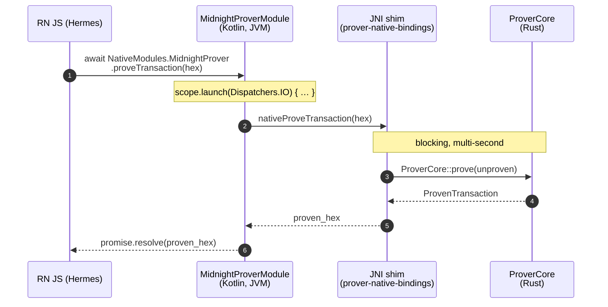

# Midnight Mobile Wallet — React Native adoption

Options for moving the Rust prover into a React Native host, the
limitations that pushed us away from web wasm, packaging proposals
(A / B / D), the scaffolded implementation (`@midnight-ntwrk/
react-native-prover`), and the integration landmines found while
wiring it end-to-end on iOS Sim + Android Emulator.

Companion docs:
- [`architecture.md`](./architecture.md) — core design reference.
- [`optimization-phases.md`](./optimization-phases.md) — the
  optimisation chain that lets the prover fit on phone in the
  first place.
- [`benchmark.md`](./benchmark.md) — measured prove timings the
  RN wrapper inherits unchanged.

**Cross-doc §-numbers:** the original single-file numbering is preserved in each split file. If you see a §-reference that isn't in the current doc, check `midnight-mobile-architecture.md` (the index) for the cross-doc map.

---

## 7. Embedding the proof service in React Native (for downstream teams)

### 7.1 Premise

This section is a handoff. Our team stays on Dioxus + WebView for the
full wallet (everything described in §§1–6 above). A separate downstream
team wants to embed **just the Midnight proof service** inside their own
React Native app — they bring their own UI (RN components + Hermes JS),
their own networking, their own key management, and their own
transaction composition. All they want from this repo is "give me a hex
unproven transaction, hand me back a hex proven transaction" running
locally on the device, no proof server, no WebView.

This section documents what we can ship them today, what is still
"proposed" and would need to be built before they can pull it in, and
the platform-packaging recipe for both Android and iOS.

### 7.2 What we ship them (entry points in this repo)

#### `ProverCore` — high-level facade over `LocalProvingProvider`

`mobile-bench/prover-core/src/lib.rs:58` defines the in-process prover
facade. Its current public surface is small and not yet a full
prove-transaction entry point:

```rust
pub struct ProverCore { /* … */ }

impl ProverCore {
    pub async fn new(cache_dir: PathBuf) -> Result<Self>;
    pub fn cache_dir(&self) -> &std::path::Path;

    // example circuit (used by bench + tests)
    pub async fn prove_zkir_example(&self, opts: BenchOpts) -> Result<ProofRun>;
}
```

(`lib.rs:64-76`, with `prove_zkir_example` declared in
`prover-core/src/zkir_example.rs:51`.)

What `ProverCore::new` does internally is the bit downstream teams
inherit: it creates the cache directory, then constructs a
`params::ParamsCache` that wraps two `MidnightDataProvider`s
(`ZswapResolver` + `DustResolver`, both in `FetchMode::OnDemand`,
`OutputMode::Log`) over the same directory (`prover-core/src/params.rs:18`).
A consequence relevant to RN packaging: `ParamsCache::new` sets
`MIDNIGHT_PP` to its `cache_dir` argument **only if the env var is not
already set** (`params.rs:26-32`). The host app can therefore decide
the cache location either by setting `MIDNIGHT_PP` before calling in,
or by passing the path through the constructor.

`prove_zkir_example` shows the call shape they want for the real entry
point — load IR, keygen against `params.zswap.0`, build a preimage,
call `preimage.prove::<IrSource>(rng, &params, &resolver)`. Adapting
this to take a SCALE-encoded `UnprovenTransaction` in and return a
SCALE-encoded `ProvenTransaction` is the work the proposed
`prover-native-bindings` crate (§7.3) would do.

#### `MidnightDataProvider` — SRS resolution

`base-crypto/src/data_provider.rs:215` defines the constructor. The
on-disk cache root is resolved in this order (`data_provider.rs:225-244`):

1. `$MIDNIGHT_PP`
2. `$XDG_CACHE_HOME/midnight/zk-params`
3. `$HOME/.cache/midnight/zk-params`
4. Otherwise: hard error `"Could not determine $HOME, $XDG_CACHE_HOME, or $MIDNIGHT_PP"`.

Android, iOS and any other sandboxed runtime fall into case 4 by default
— there is no `HOME`, no `XDG_CACHE_HOME`. The RN host therefore **must**
set `MIDNIGHT_PP` to a writable per-app directory (`getFilesDir()` on
Android, an `NSCachesDirectory` path on iOS) before the first call into
the prover. We surface this via the proposed `proving_cache_dir(...)`
FFI call (§7.3) so the host doesn't have to set env vars itself.

The names of the SRS files the provider knows about are listed in
`base-crypto/src/data_provider.rs:80` (`EXPECTED_DATA`) — they run from
`bls_midnight_2p0` through `bls_midnight_2p25` with SHA-256 digests for
each. See §7.5 for which subset to ship as RN assets.

#### Cross-compile recipe

`mobile-bench/DEPLOY_TO_DEVICE.md` documents the cross-compile flow we
use today for the dioxus-wallet cdylib. The `cargo ndk` invocation
generalises directly to a `prover-native-bindings` cdylib (§7.4).

### 7.3 Recommended packaging: `prover-native-bindings` (**proposed — not yet built**)

We propose a small Rust crate, `mobile-bench/prover-native-bindings`,
that wraps `ProverCore` in a stable C ABI and a JNI shim. **This crate
does not exist in the tree yet** — the downstream team or our team
would need to add it. Once it lands, it becomes the single thing the RN
app links against; `ProverCore` and `MidnightDataProvider` stay internal
implementation details.

Proposed surface (Rust side, all FFI-safe):

```rust
// extern "C" surface — also usable from iOS Swift via cbindgen-generated
// header. JNI shims call into these so Android only needs one body.

pub extern "C" fn mnp_prove_transaction(
    unproven_hex_ptr: *const c_char,
    out_proven_hex: *mut *mut c_char, // caller frees via mnp_string_free
) -> i32; // 0 = ok, nonzero = error code; error string fetched via mnp_last_error()

pub extern "C" fn mnp_prepare_params(k: u32) -> i32;

pub extern "C" fn mnp_proving_cache_dir(path_ptr: *const c_char) -> i32;

// optional, bonus:
pub extern "C" fn mnp_verify(
    proven_hex_ptr: *const c_char,
    vk_hex_ptr: *const c_char,
    out_ok: *mut bool,
) -> i32;

pub extern "C" fn mnp_string_free(s: *mut c_char);
pub extern "C" fn mnp_last_error() -> *const c_char;
```

The semantics the TurboModule on the JS side would expose:

| TurboModule method                              | Underlying call             | Notes |
|-------------------------------------------------|-----------------------------|-------|
| `provingCacheDir(path: string): void`           | `mnp_proving_cache_dir`     | Set BEFORE any `prepareParams` / `proveTransaction`. Sets `MIDNIGHT_PP` for the embedded `MidnightDataProvider`. Host passes its writable per-platform dir (`Context.getFilesDir()` on Android, `NSCachesDirectory` on iOS). |
| `prepareParams(k: number): Promise<void>`       | `mnp_prepare_params`        | Pre-fetch / copy the SRS for circuit degree `k` into the cache dir. Idempotent; safe to call eagerly on app startup for the `k` values the app uses. |
| `proveTransaction(unprovenHex: string): Promise<string>` | `mnp_prove_transaction` | Full prove pipeline. Multi-second; **must** be promise-returning so the bridge marshals it off the JS thread. |
| `verify(provenHex: string, vkHex: string): Promise<boolean>` | `mnp_verify`        | Optional; cheap relative to prove. Useful for the host's smoke tests. |

Threading: the Rust functions block on the calling (native) thread.
The TurboModule wrapper is responsible for taking that off the JS
thread — see §7.6.

### 7.3a Alternative integration: embedded HTTP proof-server

The native-bindings shape above (§7.3) is the deepest integration
— the RN app drives proving via a thin C ABI and the WASM-in-JS
problem is bypassed because no Compact-runtime WASM ever loads
in the JS engine.

An **alternative, lighter-touch shape** lets the host keep using
upstream Midnight TS/JS packages (including
`@midnight-ntwrk/api`) **unmodified**. Those packages are built
around a single config knob — `proofServer` — that points at an
HTTP `/prove` endpoint. As long as we surface such a URL, the
packages don't care whether the server is on the public internet,
on a desktop next door, or **inside the same Android/iOS process**.

This is the same `prover-core`-as-actix-server pattern already
running on desktop (§4.2), exposed to the mobile host:

```
┌──────────────────────── React Native app (Android or iOS) ────────────────────────┐
│                                                                                   │
│  1. App starts. A small native module                                             │
│     (Rust ↔ RN bridge via NAPI / JSI / TurboModule)                               │
│     spawns the embedded proof-server:                                             │
│                                                                                   │
│         let url = prover_core::spawn_proof_server();        // 127.0.0.1:57610   │
│         NativeModules.MidnightProver.url() === url          // exposed to JS     │
│                                                                                   │
│  2. RN JS imports the upstream packages **unmodified**:                           │
│                                                                                   │
│         import { buildWallet } from "@midnight-ntwrk/api";                        │
│         import { httpClientProofProvider }                                        │
│             from "@midnight-ntwrk/midnight-js-http-client-proof-provider";        │
│                                                                                   │
│  3. Wire them with the URL from step 1:                                           │
│                                                                                   │
│         const proofServerUrl = await NativeModules.MidnightProver.url();          │
│         const config = {                                                          │
│           proofServer: proofServerUrl,            // ← loopback URL               │
│           indexer:     "https://indexer.preprod.midnight.network/...",            │
│           node:        "wss://rpc.preprod.midnight.network/...",                  │
│           networkId:   "preprod",                                                 │
│         };                                                                        │
│         const wallet = await buildWallet(config, ...);                            │
│                                                                                   │
│  4. RN JS calls `wallet.addAlsoKnownAs(...)`. Internally:                         │
│                                                                                   │
│         httpClientProofProvider(config.proofServer, zk)                           │
│             .proveTx(unprovenTx)                                                  │
│         → fetch("http://127.0.0.1:57610/prove", { body: scaled })                 │
│         → lands at our Rust thread, halo2-kzg proves natively, response back.     │
│                                                                                   │
│     From the `api` package's perspective it's an ordinary HTTP proof-server.      │
│                                                                                   │
└───────────────────────────────────────────────────────────────────────────────────┘
```

#### Why the loopback URL works inside an RN app

- **Android.** RN's `fetch` is OkHttp under the hood. `127.0.0.1`
  resolves to the **app's own loopback**, not the emulator host —
  exactly the address actix is binding to. No permission needed;
  cleartext-to-loopback is allowed if the manifest opts loopback
  in via a `network_security_config.xml` referencing
  `127.0.0.1` and `localhost` (one new file, one attribute on the
  manifest's `<application>` tag — same XML shown in §4.3).
- **iOS.** RN's `fetch` is `NSURLSession`. Loopback is allowed by
  default; the `NSAllowsLocalNetworking` plist key (or the
  existing `NSAllowsArbitraryLoads` we use today) handles
  cleartext.
- **The URL is "real" enough.** From the TS code's perspective
  there's no difference between `http://127.0.0.1:57610` and
  `https://proof.midnight.network`. `httpClientProofProvider`
  doesn't care.

#### What this shape buys

- **Zero changes to the upstream TS packages.** The RN host
  imports `@midnight-ntwrk/api` exactly as a browser DApp would.
- **One Rust artifact serves everyone.** The same in-process
  actix server can also be hit by:
  - the wallet's own Rust path (via `prove_via_http` at
    `wallet-core/src/tx/prove.rs:136`),
  - an embedded WebView running upstream JS (the dioxus-wallet
    pattern, §4.3),
  - the RN host's JS (this pattern).
- **No JNI / cbindgen / TurboModule for proving itself.** The
  only Native Module the host needs is a tiny one that exposes
  `MidnightProver.url()`. Everything else is plain `fetch`.

#### What this shape does **not** solve

Surfacing the proof-server URL is the easy part. The wider `api`
package brings several other concerns that don't trivially map
onto RN even with the URL in hand:

1. **WASM dependencies in the JS engine.**
   `@midnight-ntwrk/api` transitively imports
   `@midnight-ntwrk/compact-runtime`, `onchain-runtime-v3`,
   `ledger-v8` — all are WASM-bearing.
   **Hermes (RN's default JS engine since 0.70) does not execute
   WebAssembly.** Three workarounds:
   - Switch RN to JSC (still supported but no longer default;
     JSC does support WASM). Cost: larger binary, no
     Hermes-specific perf wins.
   - Host the WASM-using parts inside a hidden `WebView`
     component within the RN screen and bridge to it from RN
     JS. **This is essentially what `dioxus-wallet` does
     internally** — the WebView is just an "execution sandbox
     for the Compact-runtime WASMs."
   - Replace the WASM modules with native ports exposed via a
     Native Module (the longest path; converges with §7.3).
2. **`zkConfigProvider`.** Upstream's provider expects to fetch
   verifier keys from a filesystem path (Node fs) or HTTP. On
   RN you'd point this at either (a) a Native-Module-exposed
   reader pulling keys from an `assets` bundle, or (b) an HTTP
   endpoint the **same** embedded actix server already serves
   (`/fetch-params/{k}` exists today in
   `proof-server/src/endpoints.rs:78–86`). Approach (b) keeps
   the URL pattern uniform.
3. **`walletProvider` / `midnightProvider`.** The `api` package
   expects these to be supplied by the host — they're the
   wallet's signing + UTxO-coin-key interface. On RN that's a
   Native Module (Kotlin/Swift, or Rust + JSI).
4. **`indexerPublicDataProvider`.** Pure HTTP, works on RN
   unchanged.
5. **Transaction submission.** Upstream's TS api ultimately
   uses Rust (via `subxt`) for chain submission. Cleanest path
   on RN: a Native Module call rather than reimplementing in JS.

#### When to pick §7.3 vs §7.3a

| Concern                          | §7.3 (native bindings)       | §7.3a (embedded HTTP server)             |
|----------------------------------|------------------------------|------------------------------------------|
| Surface a host integrates with   | C ABI / TurboModule          | `fetch` to a localhost URL + tiny module |
| WASM-in-JS-engine                | Avoided — no WASM in JS      | Still a problem (mitigations above)      |
| Reuse of upstream TS DApp stack  | Low (rewrite call sites)     | High (drop-in)                           |
| Build artifacts shipped          | One `.so` / `.dylib`         | Same `.so` / `.dylib` + minimal Native Module + optional WebView |
| Apt for                          | Apps purpose-built for mobile, ground-up | Apps that already speak the upstream TS shape and want to keep it |

These aren't mutually exclusive. A host can ship both: the
TurboModule (§7.3) for performance-critical operations the host
controls directly, the local HTTP server (§7.3a) for any
upstream TS package the host pulls in.

#### Prototype plan — outcome (2026-05-22)

To validate the §7.3a shape concretely on Android/iOS we landed
a prototype on top of the existing `proof-server-http` feature
(no new feature flag — that one was already structured
correctly, it just needed to compile on mobile).

| # | Step                                                | Status & evidence |
|---|-----------------------------------------------------|-------------------|
| 1 | Cargo move (`prover-core` → unconditional dep)     | ✅ `mobile-bench/dioxus-wallet/Cargo.toml:65`. |
| 2 | Cross-compile to `aarch64-linux-android`           | ✅ Release `.so` 145 MB, 1m 24s. Four `not(target_os = "android")` cfg gates removed from `prover-core/src/{lib.rs,server.rs,http.rs}` — they reflected a stale assumption. `actix-web 4.13`, `midnight-proof-server`, and `reqwest 0.13` all build clean. |
| 3 | Spawn on startup                                    | ✅ No code change needed — `bridge::spawn_proof_server` already runs unconditionally from `use_future` in `app.rs:1022`. Once the OS gates were lifted, the success branch (`bridge.rs:253`) automatically engaged. Startup log: `INFO dioxuswalletmain::bridge: embedded proof-server ready url=http://127.0.0.1:42605`. |
| 4 | Network security XML for cleartext loopback        | ⏳ Not yet needed for what we tested. The wallet's own `reqwest`-driven `prove_via_http` doesn't go through the WebView, so it isn't subject to Android's `network_security_config`. Will land alongside step 5 once the WebView JS side starts hitting the URL. |
| 5 | End-to-end **device-shell** probe                  | ✅ `adb shell curl -i http://127.0.0.1:42605/` returns `200 OK` with CORS headers and a JSON status payload. `/proc/<pid>/net/tcp` confirms loopback listeners bound. |
| 5b | End-to-end **wallet** path (the better signal)    | ✅ A full **Update DID** from the device UI on a Samsung S24 Ultra completes through the embedded server. Log line `INFO wallet_core::tx::prove: proving via HTTP proof-server url=http://127.0.0.1:42605` confirms `prove_via_http` engaged; subsequent SCALE submit + indexer confirmation complete normally. |
| 5c | End-to-end **WebView/RN JS** fetch                | ⏳ Not yet exercised. This is the last open piece — once `window.midnightProofServerUrl` is injected via `<head>` (small `lib.rs::with_js_bridge_inner` edit) any in-WebView `fetch()` (and by extension any RN `fetch()`) can hit the same URL. |
| 6 | Re-target iOS Simulator                            | ✅ Same source builds for `aarch64-apple-ios-sim`: release `.dylib` 134 MB, 2m 48s. Device-deploy verification still depends on the signing dance from §5b.5. |

**Bottom line.** The fundamental "is a TS/JS `proofServer` URL
backed by a process-local actix server actually portable to
mobile" question is answered **yes**, and the proof is a real
DID write completing on a real phone through `http://127.0.0.1:<port>/prove`. The `hyper` / `tiny_http` fallback we
preserved in the prior draft of this section is no longer
needed for actix specifically.

#### Research notes — wiring an existing TS/JS DApp to the local server (2026-05-22)

Cross-checked the upstream TS/JS package layout to confirm the
drop-in path is real, not just plausible. The findings below are
the basis for §7.3a as a whole; capturing them here so the
"can you point me at the upstream code that consumes the
proof-server URL?" question has citations:

- **`@midnight-ntwrk/api`** is the public façade most DApps
  import. Its `buildWallet`-style helper at
  `~/iohk/midnight-did/packages/api/src/wallet.ts:423` wires:
  ```ts
  proofProvider: httpClientProofProvider(
    config.proofServer,        // ← any HTTP URL
    zkConfigProvider,
  )
  ```
  The `proofServer` field is a free-form URL string — there's no
  validation that it points outside the device, no special-case
  for `127.0.0.1`. Passing
  `http://127.0.0.1:42605` (or whatever port our `LocalServer`
  binds) is indistinguishable from passing `https://proof.midnight.network`.
- **`@midnight-ntwrk/midnight-js-http-client-proof-provider`** is
  the package `httpClientProofProvider` lives in. Internally it
  does `fetch(<url>/prove, { method: "POST", body: scaled-encoded
  ProofPreimage })` and decodes the SCALE response into a
  `Proof`. Same shape our `prove_via_http`
  (`wallet-core/src/tx/prove.rs:136`) targets — no protocol
  divergence, both consumers can hit the same server.
- **`secret-storage` package — surprise finding.** The
  upstream `FileSecretStore`
  (`~/iohk/midnight-did/.claude/worktrees/amazing-nash/secret-storage/src/file-secret-store.ts`)
  carries `meta.did` and `meta.purpose` on every stored key, but
  **only sets them at key-creation time**. The
  `addVerificationMethod` flow
  (`did-lifecycle-service.ts:138-150`) reads
  `secretStore.getPublicKey(keyRef)`, calls
  `normalizePublicForLedger`, and stamps the new VM record
  on-chain — it **does not write back to `meta.did`**. So the
  key↔DID relationship lives **exclusively in the on-chain DID
  document's `verificationMethod` array**, indexed by VM `id`
  fragment.

  *Implication for downstream RN hosts.* A host using
  `@midnight-ntwrk/api` to manage DIDs cannot read "which DID
  does this key belong to?" from the local secret store. It must
  resolve each DID and walk its `verificationMethod` list — the
  same matching scheme our
  `mobile-bench/wallet-core/tests/annotate_preprod_keys.rs`
  uses for the bundled `preprod-default` keys.

- **`normalizePublicForLedger`** in
  `secret-storage/src/curve-support.ts:463` decodes the JWK `x`
  (and optionally `y`) base64url string to a bigint via
  `base64urlToBuffer` + `bufferToBigint`. The chain stores the
  result as a 32-byte big-endian field element, and our Rust
  decoder (`wallet-core/src/did/contract.rs:462`) re-encodes
  back to JWK base64url. **Round-trip is byte-exact** as long as
  the underlying `x` doesn't have leading zeros that would be
  stripped by the bigint conversion — which doesn't happen for
  uniformly-random curve points. This is why "match VM by
  `public_key_jwk.x`" is a reliable identity check across the
  Rust ↔ TS boundary.

- **Verified end-to-end (S24 Ultra, 2026-05-22).** A full Update
  DID from the wallet UI completes through `127.0.0.1:42605`
  on the device. Smoking gun log lines, both already cited in
  §4.3:
  ```
  INFO dioxuswalletmain::bridge:
       embedded proof-server ready url=http://127.0.0.1:42605
  INFO wallet_core::tx::prove:
       proving via HTTP proof-server url=http://127.0.0.1:42605
  ```
  No proxy in front, no port-forward fiddling, no host network
  access of any kind — purely loopback inside the app process.

**Diagnostics surface.** The dioxus-wallet's Diagnostics tab now
renders an `● active` pill on the "Embedded proof-server" card
along with two explainer rows ("Used by" / "Not used by") so the
divergence between wallet-DID-writes (route through HTTP) and
Benchmark-tab runs (use the direct library, by design) is
visible in-app without source-diving.

### 7.4 Platform packaging

#### Android

Cross-compile `prover-native-bindings` to a `.so` per ABI:

```bash
ANDROID_NDK_HOME=$HOME/Library/Android/sdk/ndk/27.0.12077973 \
  cargo ndk -t arm64-v8a -o android/app/src/main/jniLibs \
  build --release -p prover-native-bindings
```

That drops `libmidnight_prover.so` (or whatever the crate's `cdylib`
name resolves to) under `android/app/src/main/jniLibs/arm64-v8a/`. Add
`armeabi-v7a` and/or `x86_64` to the `-t` list if the host wants
those ABIs.

The Kotlin side follows the standard React Native 0.74+ TurboModule
recipe: a class extending the codegen-emitted spec (or
`ReactContextBaseJavaModule` if hand-written), with `System.loadLibrary`
in a `companion object` initialiser. For a sample of the `loadLibrary`
shape itself, see how the Dioxus wallet does it in
`mobile-bench/dioxus-wallet/android/app/src/main/kotlin/dev/dioxus/main/WryActivity.kt:117`:

```kotlin
companion object {
    init {
        System.loadLibrary("dioxuswalletmain")
    }
}
```

(Note: WryActivity is itself a Tao/Wry activity, not a TurboModule.
The downstream team should ignore the rest of that file and follow the
standard RN TurboModule recipe — only the `System.loadLibrary` call
pattern is reusable.)

Sketch of the TurboModule class (~20 lines of body):

```kotlin
package network.midnight.prover

import com.facebook.react.bridge.*
import kotlinx.coroutines.*

class MidnightProverModule(reactContext: ReactApplicationContext)
    : ReactContextBaseJavaModule(reactContext) {

    override fun getName() = "MidnightProver"

    private val scope = CoroutineScope(SupervisorJob() + Dispatchers.IO)

    private external fun nativeProveTransaction(hex: String): String
    private external fun nativePrepareParams(k: Int)
    private external fun nativeProvingCacheDir(path: String)

    @ReactMethod
    fun provingCacheDir(path: String) = nativeProvingCacheDir(path)

    @ReactMethod
    fun prepareParams(k: Int, promise: Promise) {
        scope.launch {
            runCatching { nativePrepareParams(k) }
                .onSuccess { promise.resolve(null) }
                .onFailure { promise.reject("E_PREP", it) }
        }
    }

    @ReactMethod
    fun proveTransaction(hex: String, promise: Promise) {
        scope.launch {
            runCatching { nativeProveTransaction(hex) }
                .onSuccess { promise.resolve(it) }
                .onFailure { promise.reject("E_PROVE", it) }
        }
    }

    companion object {
        init { System.loadLibrary("midnight_prover") }
    }
}
```

(With the New Architecture and Codegen enabled, the class extends
`NativeMidnightProverSpec` instead and method bodies stay identical;
the spec is generated from a TS interface. The above hand-written
form works on every RN 0.74+ project regardless of whether Codegen is
turned on. See §7.9.)

#### iOS

Compile the same crate as static libraries for each Apple target,
then wrap them in an `.xcframework` so a single artifact serves both
device and simulator:

```bash
# device
cargo build --release --target aarch64-apple-ios -p prover-native-bindings
# arm64 simulator (Apple Silicon Macs)
cargo build --release --target aarch64-apple-ios-sim -p prover-native-bindings
# x86_64 simulator (optional, for Intel Macs)
cargo build --release --target x86_64-apple-ios -p prover-native-bindings

xcodebuild -create-xcframework \
  -library target/aarch64-apple-ios/release/libmidnight_prover.a \
    -headers include \
  -library target/aarch64-apple-ios-sim/release/libmidnight_prover.a \
    -headers include \
  -output MidnightProver.xcframework
```

The Objective-C / Swift TurboModule then links the `.xcframework`,
imports the cbindgen-generated header, and exposes the same three
methods via `RCT_EXTERN_METHOD` (legacy) or the Codegen spec.

**Gap to flag**: we do not currently have an iOS toolchain configured
in this repo. We have no CI-tested iOS build of any Midnight crate.
The proving stack itself (`prover-core` plus its transitive deps:
`zkir`, `transient_crypto`, `base_crypto`, `zswap`, `ledger::dust`) is
pure Rust and does not depend on `tao`/`wry`/`dioxus`, so we expect
clean cross-compilation, but the downstream team should treat the
first iOS build as bootstrap work. The Android cross-compile is
exercised by `mobile-bench/DEPLOY_TO_DEVICE.md` and known to work.

### 7.5 SRS / proving parameters shipping

The `.bin` files named in `base-crypto/src/data_provider.rs:80`
(`EXPECTED_DATA`) double in size with each step of `k`. Approximate
on-disk sizes:

| File              | Approx. size |
|-------------------|--------------|
| `bls_midnight_2p4`  | ~150 KB    |
| `bls_midnight_2p11` | ~12 MB     |
| `bls_midnight_2p14` | ~100 MB    |
| `bls_midnight_2p19` | ~3 GB      |

Bundling all of them into an APK is not viable — the Play Store APK
limit is 200 MB (with expansion files; 100 MB without), and an iOS
build with multi-gigabyte assets is similarly impractical.

Recommended pattern:

1. **Ship a curated subset as RN assets.** Pick the lowest-`k` files
   that cover the circuits the app actually proves. For most workloads
   `2p4..2p11` is enough (~12 MB total). Bundle them via
   `react-native-asset` (puts files under `android/app/src/main/assets`
   and the iOS bundle) or by hand per platform.
2. **On first prove, copy from assets to the writable cache dir.**
   Android assets are read-only and accessed by URL/`AssetManager`;
   the prover wants a real filesystem path. The TurboModule should,
   on first launch, copy each bundled `.bin` into the directory it
   passed to `provingCacheDir(...)`. After copy, `MidnightDataProvider`
   finds them via its standard local-cache check and never network-fetches.
3. **Fall back to on-demand fetch for higher `k`.** The provider
   constructed inside `ParamsCache::new` (`prover-core/src/params.rs:34`)
   uses `FetchMode::OnDemand`, which downloads missing files from
   `srs.midnight.network` on first use and validates them against the
   SHA-256 hashes in `EXPECTED_DATA`. The host app's writable directory
   must be set via `provingCacheDir(...)` **before** the first prove
   call so the downloaded files land somewhere the app can re-read on
   relaunch.

Picking the subset to ship is a host decision (§7.9 lists this as an
open question). Point at `base-crypto/src/data_provider.rs:80` for the
list of valid names.

### 7.6 Threading model

Proving is multi-second CPU. It must run **off the JS thread**, or the
RN UI will jank or ANR.

The TurboModule contract handles this naturally: methods that return
`Promise<T>` from native are invoked on a native worker thread, and
the bridge resolves the `Promise` back onto the JS thread once the
worker finishes. The downstream team just has to:

1. Declare `proveTransaction` as `Promise<string>` (never `string`)
   in the TS spec.
2. In the Kotlin module, wrap the native call in a coroutine launched
   on `Dispatchers.IO` (or a dedicated single-thread dispatcher if
   they want to serialise multiple in-flight prove calls).
3. In the Obj-C / Swift module, dispatch onto a background queue
   (`DispatchQueue.global(qos: .userInitiated)` or a dedicated serial
   queue) and resolve the `RCTPromiseResolveBlock` from there.

The legacy `NativeModules` API (without the New Architecture) also
supports `Promise` returns and works identically for this purpose. We
recommend TurboModules because it's the path forward and Codegen
removes the marshalling boilerplate, but the legacy form is fine.



### 7.7 What they do NOT need

If the downstream app only does proving (takes an unproven tx hex in,
returns a proven tx hex out), they can ignore the entire JS-side stack
the Dioxus wallet ships. None of the following are relevant:

- **The WebView / Dioxus / `js-bridge` feature stack** (§§2, 3 above).
  RN has its own JS runtime — Hermes — and its own UI tree. There is
  no WebView in the proving path.
- **The `mn-pkg://` Wry custom protocol, the `include_dir!` embed of
  `assets/web/pkg/`, the import map injection.** All of that is a
  WebView-only asset-serving mechanism. Metro handles the host app's
  JS bundling.
- **The `@midnight-ntwrk/compact-runtime` and
  `@midnight-ntwrk/midnight-did-contract` npm packages.** Those are
  only needed if the host app **also** wants to assemble unproven
  transactions on the JS side. If the host's flow is "I already have
  an unproven tx from somewhere else (a server, a different module,
  a Rust crate they control) → ask the prover for the proven version"
  then they skip all of it.

**If they DO want JS-side tx assembly**: that's a much bigger lift.
They'd need to vendor `compact-runtime`, `midnight-did-contract`,
`onchain-runtime-v3` and `ledger-v8` into their RN bundle, deal with
the `node:fs` / `node:path` references those packages reach for
(Hermes has no Node std), and figure out how to instantiate the
wbindgen-generated WASM modules in their JS runtime. Each of those
is a multi-week problem in its own right. We strongly recommend the
host either keeps tx assembly on a server they control, or vendors
the Rust-side composer once upstream surfaces it (§8 tracks this).

### 7.8 Bootstrap recipe

Once `prover-native-bindings` is built (it isn't yet — see §7.3),
the integration path from a downstream RN repo is:

```bash
# 1. Reference the crate from the host repo's Rust workspace.
#    Add to host_repo/Cargo.toml:
#    [workspace.dependencies]
#    prover-native-bindings = { path = "../midnight-ledger/mobile-bench/prover-native-bindings" }

# 2. Cross-compile for Android (arm64-v8a; add other ABIs as needed).
ANDROID_NDK_HOME=$HOME/Library/Android/sdk/ndk/27.0.12077973 \
  cargo ndk -t arm64-v8a -o app/src/main/jniLibs \
  build --release -p prover-native-bindings

# 3. Drop the Kotlin TurboModule (sample in §7.4) into
#    app/src/main/java/<your-package>/MidnightProverModule.kt and
#    register the matching ReactPackage in MainApplication.

# 4. From JS, call into it:
```

```ts
import { NativeModules } from 'react-native';
const { MidnightProver } = NativeModules;

// Once per app start, point the prover at a writable dir.
MidnightProver.provingCacheDir(`${FileSystem.cachesDirectory}/midnight-pp`);

// Eagerly cache the SRS files the app's circuits need.
await MidnightProver.prepareParams(11);

// On every transaction:
const provenHex: string = await MidnightProver.proveTransaction(unprovenHex);
```

For iOS, swap step 2 for the `cargo build --target aarch64-apple-ios*`
+ `xcodebuild -create-xcframework` recipe in §7.4, and drop the
matching Swift/Obj-C TurboModule in the iOS source tree.

### 7.9 Open questions for the downstream team

- **iOS toolchain bootstrap.** Not wired in this repo. They will be
  the first ones to cross-compile the proving stack for Apple targets;
  the proving crates are pure Rust so we expect this to work, but
  there is no CI signal yet.
- **TurboModule codegen vs hand-written module.** For a single module
  with four methods, a hand-written `ReactContextBaseJavaModule` /
  `RCT_EXTERN_MODULE` is simpler and works on RN 0.74+ without
  enabling the New Architecture. Codegen-generated specs win once
  the surface grows or the host wants strong typing across the bridge;
  the trade-off is configuring Codegen in the host's build. Either is
  fine for the surface in §7.3.
- **SRS subset to ship as bundled assets.** Depends on the maximum
  circuit degree `k` the host's circuits use. The downstream team
  needs to enumerate their circuits and pick the smallest covering
  subset of `bls_midnight_2p{0..k}`. The list of known param names is
  `base-crypto/src/data_provider.rs:80` (`EXPECTED_DATA`). For
  circuits with a `k` they can't bundle, leave the OnDemand fetch in
  place and warn the user about first-prove latency / data cost.
- **`prover-native-bindings` ownership.** The crate is proposed but
  not built. Whether our team builds it as a vendor-supplied artifact
  or the downstream team builds it as part of their integration is
  not yet decided.

---


## §11. Why the same optimisations don't (and can't) ship to web wasm

We have a working `wasm32-unknown-unknown` build of the same
`contract_benchmark::run_proof(k)` code (see §6.1a + the Web
sweep in §9). It works — proofs verify, sizes match, the
correctness story is identical to native. **But the memory
unlocks documented in §10 do not, and largely cannot, translate
to the browser.** This section enumerates why, so future
contributors don't re-investigate paths that are physically
impossible in the wasm sandbox.

### §11.1 Browser address-space wall (the hardest cap)

wasm32 is a **32-bit linear memory** model. The entire process
heap that Rust sees lives inside a single contiguous
`WebAssembly.Memory` ArrayBuffer. The spec caps it at **4 GiB**
(`Memory.maximum = 65 536` pages × 64 KiB). Chromium today
enforces a typical **4 GiB hard ceiling per tab**; Firefox is
similar; Safari is tighter (~2 GiB on iOS Safari, ~4 GiB on
desktop Safari). There is no `wasm64` browser target yet
(stage-3 proposal, not shipped in any production engine).

| Native arm64 (S24) | Web wasm32 (any browser)            |
|---|---|
| 64-bit virtual address space, ~93 GiB free `/data` | **4 GiB hard cap per tab** |
| OS swaps cold pages to disk under pressure | no swap; every byte must coreside in the same ArrayBuffer |
| Multiple processes / RLIMIT separation | one tab = one ArrayBuffer = one wall |

**Consequence:** the §10.3 trace's 4 393 MiB peak HWM at k = 20
**does not fit in a tab.** Even if every other optimisation were
ported, the SRS (~360 MiB) + extended cosets (~3.4 GiB combined)
+ advice cosets (~640 MiB) + scratch already exceed the 4 GiB
wall. **k = 20 is unreachable on web wasm32 by construction**,
not by lack of engineering effort.

The practical ceiling on web is ~k = 18 (see §9 Web table),
matching the punch-list prediction. k = 19 might land on
desktop Chrome with `--js-flags="--wasm-max-mem-pages=131072"`
(toggling the experimental 8 GiB wasm-memory64 prototype), but
that's not a deployable surface.

### §11.2 Why §10's optimisations don't port

The whole §10 stack is built on three primitives, **none of
which exist in the wasm sandbox**:

#### §11.2.1 `mmap` doesn't exist in wasm

The mmap'd SRS (§10.2 item #8) and the disk-spill cosets
(§10.2 item #16) both rely on `memmap2::Mmap::map()` over a
file descriptor. wasm32-unknown-unknown has **no filesystem
syscalls**. wasi-preview-1 has `path_open` + virtual file
descriptors, but:

- Browser wasm runtimes don't ship wasi; you need a JS-side
  shim (wasmer-js, wasi-shim).
- Even with a shim, the JS-side "filesystem" is typically
  IndexedDB or OPFS — **both copy bytes through ArrayBuffer
  boundaries on every read**, defeating the whole point of
  mmap-back. The OS can't evict cold pages from your tab's
  linear memory because *the bytes never reside outside it*.
- `Mmap::map` produces a slice over kernel-managed pages.
  The wasm equivalent (slice into a separate `WebAssembly.Memory`)
  doesn't give the *eviction* property — the JS engine has to
  hold the whole buffer for the lifetime of the export.

**Net:** mmap'd SRS in wasm is "load SRS into a Vec, slice
into the Vec". Same as today. No headroom gain.

#### §11.2.2 `tempfile` + disk-spill is meaningless in wasm

The disk-spill cosets (§10.2 #16) writes cosets to a tempfile
and mmaps them back so the OS can evict. In wasm:

- No tempfile syscall. JS-side analogues (IndexedDB "blob",
  OPFS file) work, but...
- The "spilled" bytes have to travel through JS to be persisted
  (`postMessage`, `indexedDB.put`), then re-read into a new
  ArrayBuffer slice to be consumed. **Round-trip through JS
  costs CPU and doubles memory residency.**
- The Rust prover would need both the original linear-memory
  copy *and* the JS-side IndexedDB copy live simultaneously
  during the transfer — the opposite of what we want.

The only realistic disk-spill on web is *outside the wasm
boundary*: have JS hold the SRS in OPFS and stream byte-slices
into wasm linear memory on demand. That's a different
architectural pattern (analogous to chunked streaming) — not
the same patch.

#### §11.2.3 `rayon` and threading require special setup

Native arm64 prover saturates 8 cores via rayon. Default
wasm32 is single-threaded. Browser threading **does work** via
`wasm-bindgen-rayon` + `SharedArrayBuffer`, but only when:

- The page is served with **COOP/COEP headers**
  (`Cross-Origin-Opener-Policy: same-origin` +
  `Cross-Origin-Embedder-Policy: require-corp`). Most apps
  that embed cross-origin content can't easily enable these
  (it breaks postMessage from common iframe widgets, ad
  beacons, etc.).
- The page is **served over HTTPS** (SharedArrayBuffer is
  gated to secure contexts). Local dev requires
  `localhost` (which is implicitly secure).
- The build uses **nightly Rust** + `-Z build-std=panic_abort,std`
  to recompile std with the threading flags. Custom build
  recipe; not zero-config.
- The deployment target's CSP allows SharedArrayBuffer (some
  enterprise / wallet contexts disable it).

When all of those line up, the punch list (§9) predicts
30–50 % speedup. We have not landed this on the wallet's
web target; the prerequisites are not subtle. Even when it
lands, it improves **wall time**, not peak heap — orthogonal
to the §10 unlocks.

#### §11.2.4 `simd128` requires upstream patches

The native prover doesn't currently have `#[cfg(target_feature
= "simd128")]` paths in `transient-crypto` / `midnight-proofs`
either — see §9 punch-list item #4. simd128 is a compile flag,
not a code path; you opt in to it from generic code that the
compiler can vectorise. The BLS12-381 field arithmetic
hand-rolls its constant-time multiplication; LLVM is unlikely
to auto-vectorise that without explicit intrinsics. **Blocked
on upstream `midnight-curves` / `blst` work** — not a wasm
limitation per se, but particularly impactful for wasm where
single-thread + scalar arithmetic is the floor.

#### §11.2.5 `getrusage` / `/proc/self/status` don't exist

The per-phase memory instrumentation (§10.2 items #9 #10)
samples RSS / HWM from `/proc/self/status` on Linux/Android
and `getrusage(RUSAGE_SELF)` on Darwin. wasm has neither.
`performance.memory` (JS API) is **non-standard, Chromium-
only, and returns the entire tab's JS heap — not just the
wasm linear memory** (heuristic + privacy-quantised). On
Firefox and Safari there is **no per-tab memory introspection
at all**.

**Net:** the same `tracing` instrumentation that drove every
§10 decision on Android cannot drive equivalent work on web.
Future web optimisations would need to lean on JS-side
microbenchmarks instead of phase-level memory deltas.

### §11.3 Why the browser ceiling sits where it does

Roughly, the web target's practical k-ceiling on a modern
desktop browser is **k = 17–18** (matches the §9 Web table:
k = 17 completes in 2 m 13 s, k = 18 was in flight at capture
time). On a *mobile* browser (iOS Safari / Android Chrome) the
ceiling drops to **k ≈ 16** because:

- iOS Safari caps wasm memory at ~2 GiB.
- Mobile Chrome's per-tab memory cap is ~1.5–2 GiB on most
  devices (more aggressive than the desktop's 4 GiB).
- No `SharedArrayBuffer` threading by default on iOS Safari
  inside third-party iframe contexts.

For our wallet, this means: **the web build can prove typical
identity / DID circuits (k ≈ 12–14), can prove medium
zswap-style shielded transactions (k ≈ 15–17), but cannot
prove anything above that.** k = 19 + k = 20 are native-only.
This is **fine for the wallet's UX target** — a typical wallet
DID write is k = 12, comfortably under the ceiling — but the
Benchmark tab's "Run all 1..20" loop will stop progressing
somewhere around row 17 / 18.

### §11.4 What the web target *can* still benefit from

Not every §10 patch is wasm-hostile. The portable wins:

| §10 patch                                       | Translates to wasm? | Notes |
|---|---|---|
| `warm_pk_cache` (#11)                           | **yes**             | Pure Rust, no syscalls. The 1.4 GiB savings translate proportionally. **Highest-priority port to web.** |
| `lazy fixed_cosets` + `lazy permutation.cosets` (#14 #15) | **yes**     | Pure architectural change. Keygen-end heap floor drops the same way on wasm; doesn't help the prove-time peak. |
| `mimalloc` (#13)                                | partial             | mimalloc compiles to wasm but the OS-page-return semantics don't apply (no OS pages — wasm linear memory grows but never shrinks pre-`memory.discard` proposal, not yet shipped). Net: marginal CPU effect, no memory effect. |
| `mmap-backed SRS` (#8)                          | **no** (§11.2.1)    | |
| `disk-spill cosets` (#16)                       | **no** (§11.2.2)    | |
| Per-phase memory instrumentation (#9 #10)       | **no** (§11.2.5)    | Replace with JS-side `performance.now()` for wall time only |

**Concrete short list of "do these next on web":**

1. Port `warm_pk_cache` — same JS↔wasm boundary as today, just
   pre-populate the cache from the keygen output before
   serialise. Estimated 600 MB savings at k = 17 on desktop
   browser; might push k = 18 from "in flight" to "completes".
2. Apply lazy cosets — pure code change, same patch as
   midnight-zk `d54c690` + `6cec3e7`. Keygen-end heap drops
   ~600 MiB at k = 17.
3. **Then accept the ceiling at k ≈ 18.** The advice cosets
   and the SRS together push the prove-time peak above 4 GiB
   at k = 19 and there is no patch that fixes a 32-bit address
   space without `wasm64` browser support.

### §11.5 Implication for product design

For Midnight specifically — where the wallet must produce
ZK proofs at k ≈ 12 for typical DID writes — **web wasm is
viable** as a target. The architectural conclusion is:

- **Native mobile (this PR chain):** the high-k unlock path
  for power users who want shielded transactions, complex
  smart contracts, future zkVM integrations. Ceiling now at
  k = 20.
- **Web wasm (the existing build):** the convenience path for
  desktop users + light mobile use cases. Ceiling at k ≈ 17–18.
  No path to k = 20 without `wasm64` shipping in browsers (no
  known timeline).
- **Cross-target consistency:** same proof format, same
  verifier — a proof generated on web verifies on native and
  vice versa. Users do not see a "web vs native" distinction
  except in time-to-prove and ceiling.

If a future product surface requires k = 19+ from a web
context, the architectural answer is "delegate to a remote
prover" — push the witness + circuit handle to a server that
runs the native prover, get the proof back. The
`proof-server-http` shape in §4.2 already exists for this
exact case; the web client just becomes the witness-builder
+ network client.

---


## §13. React Native packaging — feasibility + concrete proposal

The current mobile target is `mobile-bench/dioxus-wallet` —
Dioxus 0.6 + WebView for UI, pure Rust for proving. A
downstream team building a React Native wallet would like to
embed *just the proof generator*, not the full Dioxus shell.
This section is the research answer to "how should we ship
this?", grounded in primary-source evidence: Apple developer
forums, Android source, the UniFFI changelog, and production
projects (mopro, librustzcash, iden3/rapidsnark, Bitwarden).

### §13.1 The right framing — process isolation, not background services

An earlier version of this section dismissed "embedded HTTP
server" on the grounds that iOS doesn't allow long-running
background processes. **That framing was wrong** and missed the
real question. What we actually want from "Option B" is
**process-level fault isolation**:

- A 4.4 GiB proof OOM in the prover **must not kill the host
  RN app.** With one process, an `abort()` in the proof code
  tears down the entire UI; the user loses transaction state
  and confidence. With two processes, the OS kills the prover
  process only, the UI process sees a clean
  `onServiceDisconnected` callback, the user retries.

- The lifecycle is **on-demand**, not persistent:
  - User taps "prove" → spin up isolated prover process →
    stream witness in → stream proof out → tear it down.
  - User backgrounds the app → tear down on transition.
  - App relaunches → start with nothing running.

This is **not** "a long-running daemon." It is "a sacrificial
worker spun up for a single prove call." Every isolation
property we want comes from that one design choice, on the
platforms where it's available.

The question for each platform is then narrower: **is on-demand
process isolation available, and at what cost?**

### §13.2 Platform reality (research-backed)

#### iOS — process isolation is impossible, period

Apple's iOS sandbox enforces this at the kernel level, not as
App Store policy. Citations:

- **`posix_spawn` / `fork` are blocked.** Apple DTS engineer
  Quinn states explicitly: "iOS apps are not allowed to spawn
  child processes." Enforced by the iOS sandbox (a different
  mechanism from macOS App Sandbox). It is not a Review-only
  rule — the syscall fails. ([Apple Developer Forums thread/747499](https://developer.apple.com/forums/thread/747499))
- **App Extensions cannot be used as generic helpers.** Per
  the App Extension Programming Guide, extensions launch
  "when a user chooses [it] from an app's UI or from a
  presented activity view controller" — programmatic
  instantiation from the host is not exposed. Extensions
  "terminate soon after [completing] the request" and have
  *smaller* memory limits, not larger. ([App Extension Programming Guide](https://developer.apple.com/library/archive/documentation/General/Conceptual/ExtensibilityPG/ExtensionOverview.html))
- **`NSXPCConnection` is macOS-only.** The C `libxpc`
  primitives exist on iOS but are reserved for system
  services / extension infrastructure; third-party app-to-app
  XPC is not exposed. ([NSXPCConnection docs](https://developer.apple.com/documentation/foundation/nsxpcconnection))
- **`WKWebView` *does* use multi-process** (UIProcess +
  WebContent + Networking + Storage). It's the only
  out-of-process compute model an iOS app gets for free. But
  you can't piggyback your Rust prover into the WebContent
  process — only JS/WASM inside the WebView benefits, which
  routes the prover through WASM-in-WKWebView (a different
  architecture; see §11). ([WKProcessPool](https://developer.apple.com/documentation/webkit/wkprocesspool))
- **`BGContinuedProcessingTask` (iOS 26)** is the closest
  legitimate "long-running" pattern. It lets work started in
  the foreground continue through a brief backgrounding. But
  it is **still the same process** — no OOM isolation. WWDC25
  also flagged that backgrounded workloads run **4–5× slower**
  than foreground. ([BGContinuedProcessingTask](https://developer.apple.com/documentation/backgroundtasks/bgcontinuedprocessingtask), [WWDC25 session 227](https://developer.apple.com/videos/play/wwdc2025/227/))

**Verdict for iOS: there is no way to OOM-isolate a 4 GiB+
prover from the main app.** The mitigation has to be
ahead-of-time: streaming/mmap'd SRS, chunked witness
construction, aggressive memory-pressure handling. No
production iOS app spawns a helper binary because the kernel
won't let them.

#### Android — on-demand isolation is first-class

Citations:

- **`<service android:process=":proverProcess">`** is a
  documented, supported feature. Per [Android manifest docs](https://developer.android.com/guide/topics/manifest/service-element):
  "If the name begins with a colon (`:`), a new process,
  private to the application, is created when it's needed and
  the service runs in that process." This is exactly the
  on-demand pattern.
- **Independent lmkd accounting.** Android's [low-memory
  killer daemon](https://source.android.com/docs/core/perf/lmkd)
  uses per-process `oom_score_adj` based on each process's
  state (foreground / visible / service / cached).
  `:proverProcess` and the main UI process get scored
  **separately**. If the prover OOMs at 4 GiB, lmkd kills
  *it*; the UI process survives; the user sees a clean
  `onServiceDisconnected` callback. **This is exactly the
  isolation we want.**
- **Binder has a 1 MiB transaction limit** ([Android docs](https://developer.android.com/reference/android/os/TransactionTooLargeException),
  [issuetracker 36999615](https://issuetracker.google.com/issues/36999615)).
  MB-scale byte arrays (proof bytes, SRS chunks) must use
  `android.os.SharedMemory` (API 27+) or `ParcelFileDescriptor`
  — the Binder call carries only the fd, the bytes are mapped
  via shared memory. **Effectively zero-copy IPC.**
  ([SharedMemory / Ashmem](https://hujinhan.medium.com/implementing-ashmem-to-share-data-between-processes-4f707e0bfc7b))
- **Cancellation** is clean: `unbindService()` after last
  client unbinds tears down `:proverProcess`. For mid-prove
  cancellation, send a Binder `oneway` cancel message that
  the Rust side polls (same cooperative-cancel discipline we'd
  need in any model). `Process.killProcess(remotePid)` is the
  last-resort hammer.
- **Doze** affects background scheduling (JobScheduler,
  alarms, network) — a foreground prover service triggered by
  user action is not gated by Doze.
- **Real-world precedent:** Chrome's tab process model,
  WebView's renderer process, [Microsoft's out-of-process
  services guide](https://learn.microsoft.com/en-us/xamarin/android/app-fundamentals/services/out-of-process-services)
  explicitly recommends this pattern when the service "has a
  large memory footprint." Multi-process is standard Android
  practice.

**Verdict for Android: separate-process Service with
`SharedMemory` IPC is the right architecture.** Free OOM
isolation, zero-copy buffer transfer, clean lifecycle.

### §13.3 The bindings question — UniFFI vs hand-written

Orthogonal to the process-model question is *how* the Rust
code is called from the platform layer. Three serious options:

| Option | Bindings tool | Production users | Bridge LOC | API stability | Buffer-copy on hot path |
|---|---|---|---|---|---|
| **UniFFI** (`uniffi-bindgen-react-native`) | Codegen from `#[uniffi::export]` Rust | Mozilla (Firefox app-services), [Bitwarden SDK](https://contributing.bitwarden.com/architecture/sdk/), [mopro](https://github.com/zkmopro/mopro) | ~0 (generated) | **Breaking changes per minor**: 0.28→0.29 removed `UniffiCustomTypeConverter` + `extern` syntax; 0.30→0.31 changed method-checksum compat. Pin and treat upgrades as scheduled work. ([Upgrading](https://mozilla.github.io/uniffi-rs/next/Upgrading.html), [CHANGELOG](https://github.com/mozilla/uniffi-rs/blob/main/CHANGELOG.md)) | **Yes** — `Vec<u8>` → `Uint8Array`/`ArrayBuffer` still copies through JSI even after [PR #187](https://github.com/jhugman/uniffi-bindgen-react-native/pull/187); the Hermes no-copy `ArrayBuffer` constructor ([Hermes #564](https://github.com/facebook/hermes/issues/564)) is **not** wired into the UniFFI path. |
| **Hand-written JNI + Swift bridge** | Manual | [librustzcash / ZcashLightClientKit](https://github.com/Electric-Coin-Company/zcash-swift-wallet-sdk) + [zcash-android-wallet-sdk JNI](https://zcash.readthedocs.io/en/latest/android/zcash-android-wallet-sdk/cash.z.wallet.sdk.jni/); Signal Rust libs | Thousands of LOC (librustzcash JNI spans many modules) | Stable — you own the surface | **No** — JNI direct ByteBuffer + Swift `Data.withUnsafeBytes` give zero-copy borrow |
| **Hand-written JSI C++ module** (rapidsnark-style) | Manual JSI | [iden3/react-native-rapidsnark](https://github.com/iden3/react-native-rapidsnark) | Low hundreds for the JSI surface + build glue | Stable | **No** — JSI's no-copy `ArrayBuffer` constructor is available on Hermes; true zero-copy achievable |

Two specific things to flag:

- **UniFFI deadlock history is real but bounded.** PRs [#88](https://github.com/jhugman/uniffi-bindgen-react-native/pull/88)
  and [#158](https://github.com/jhugman/uniffi-bindgen-react-native/pull/158)
  in `uniffi-bindgen-react-native` traced to "polling next
  future inside continuation callback while holding non-
  reentrant mutex." The maintainer acknowledges the fixes
  may not be complete ("I don't think this has fixed all
  possible deadlocks"). **The risk lives in the cross-FFI
  async-future glue**, not in core UniFFI. A synchronous
  Rust `fn(witness) -> Vec<u8>` called from a JS Promise
  wrapper on the platform side avoids this entire surface.

- **JSI zero-copy buffer ingestion matters here.** For a
  proof byte payload (~3 KiB) the copy is irrelevant. For
  the **SRS** (~360 MiB mmap'd file, accessed from Rust
  during keygen / prove) it would be catastrophic — UniFFI
  would either copy the whole thing across JSI on every
  prove, or you'd have to keep the SRS handle entirely
  Rust-side and never pass bytes through the FFI boundary
  (which is what we'd want anyway). The cleanest pattern:
  **Rust owns the SRS via mmap on a known path; the FFI
  never sees those bytes; the API surface is `prove(circuitId,
  witness) -> proofBytes` and `witness` is the only thing
  that crosses.**

### §13.4 Updated A vs B vs D comparison

Re-doing the matrix with the corrected understanding of
on-demand isolation:

| Dimension | A: UniFFI same-process (both platforms) | **B: Hybrid — Android isolated process + iOS in-process** | D: Hand-written bridges (both platforms) |
|---|---|---|---|
| **iOS process model** | In-process | In-process (no alternative exists) | In-process |
| **Android process model** | In-process | **`:proverProcess` Service, on-demand** | In-process |
| **iOS OOM isolation** | None | None (not achievable on iOS) | None |
| **Android OOM isolation** | None — prover OOM kills RN app | **Yes — lmkd kills `:proverProcess` only** | None |
| **iOS k = 20 viability** | Risky on pre-iPhone-15-Pro (3 GiB jetsam) | Same risk (iOS has no isolation lever) | Same risk |
| **Android k = 20 viability** | Works on S24 today; risky on 4–6 GiB-RAM devices | **Robust** — bound by physical RAM, not by "must coreside with RN UI" | Works on S24, risky on smaller devices |
| **Bindings stability** | UniFFI breaking changes per minor; pin and budget upgrade work | Same on iOS side; Android Service is via AIDL + Binder (stable) | Stable; you own the surface |
| **Buffer-passing overhead** | Vec<u8> copies through JSI Uint8Array | Witness via UniFFI (small); proof bytes via `SharedMemory` on Android (zero-copy), via UniFFI on iOS (copy of ~3 KiB — negligible) | Zero-copy on both platforms (JSI no-copy ArrayBuffer + JNI ByteBuffer / Swift withUnsafeBytes) |
| **Bridge LOC to maintain** | ~0 (generated) | UniFFI for the FFI seam + ~hundreds of LOC for the Android Service shell (AIDL + SharedMemory plumbing) | Thousands of LOC across iOS + Android |
| **Async story** | UniFFI Rust → JS Promise; recent deadlock fixes; pin a version | Same on iOS; on Android the Service Binder dance is well-trodden | Custom; you choose the model |
| **Engineering effort to first working `prove()`** | 4–6 PW | 6–9 PW (1–2 PW extra for the Android Service + AIDL + SharedMemory layer) | 10–14 PW |

### §13.5 Recommendation — Option B (hybrid)

**Pick UniFFI as the FFI seam on both platforms. On Android,
host the UniFFI-generated Kotlin shim *inside a separate
`:proverProcess` Service*; expose it to RN via AIDL + Binder
+ `SharedMemory`. On iOS, host the same UniFFI-generated
Swift shim *inside the main app process* (no alternative
exists); wrap long proves in a `BGContinuedProcessingTask` so
a brief backgrounding doesn't kill the work.**

Rationale:

1. **Free Android OOM isolation** — the entire point of the
   "Option B" framing the user pushed back on. We get this
   *because* the user was right: on-demand isolation is
   first-class on Android, and we should not pretend
   otherwise.

2. **Honest about iOS** — no amount of architectural rework
   gives us OOM isolation on iOS. We mitigate ahead-of-time
   (streaming SRS, chunked witness, careful memory-pressure
   handling) and accept that pre-iPhone-15-Pro hardware may
   not support k = 20. This is a *platform constraint*, not
   a packaging mistake.

3. **UniFFI for the FFI seam, on both** — keeps one bindings
   surface to maintain. The deadlock risk is in cross-FFI
   futures; we side-step it by making `prove()` a
   synchronous-Rust call posted to a background thread, with
   a completion callback over the platform-native async
   primitive (Coroutine / Combine / Promise). The
   [mopro](https://github.com/zkmopro/mopro) project uses
   this exact pattern in production for ZK proving on mobile
   — strongest precedent for this direction.

4. **Hand-write the JSI buffer ingestion specifically** —
   UniFFI's `Vec<u8>` → JSI `Uint8Array` copy is acceptable
   for ~3 KiB proof bytes but unacceptable for any path that
   exposes the SRS. The SRS stays entirely Rust-side
   (mmapped from a known path); the FFI never sees those
   bytes. The hand-written JSI surface is small and
   purpose-built (a few dozen LOC).

5. **No persistent server** — the Android Service lifecycle
   is "bind on `prove`, unbind on `done` or app-background."
   No daemon, no resident memory between proves, no
   background restart contract. The `:proverProcess` is
   killed by the OS as a cached process once we unbind; the
   next prove spins a fresh one.

### §13.6 What this gives us

| Property | Android | iOS |
|---|---|---|
| OOM in prover kills RN app | **No** — process boundary catches it | Yes — mitigate ahead-of-time |
| Cancellable mid-prove | Yes (Binder oneway + cooperative poll) | Yes (cooperative poll) |
| Per-prove cold start cost | ~50–100 ms (Service bind + Binder setup) | ~0 (in-process) |
| SRS shipping | First-run download to `getCacheDir()`; mmapped Rust-side | First-run download to `Library/Caches/`; mmapped Rust-side |
| Proof byte transfer | `SharedMemory` (zero-copy) | JSI `Uint8Array` copy (~3 KiB — negligible) |
| Witness transfer (KB-scale) | UniFFI `Vec<u8>` (acceptable) | UniFFI `Vec<u8>` (acceptable) |
| App backgrounded mid-prove | `:proverProcess` may be lmkd-killed; we report cancelled to RN | `BGContinuedProcessingTask` extends; if still backgrounded long, work cancels |

### §13.7 Concrete proposal — `@midnight-ntwrk/react-native-prover`

**Repo layout** (revised for the hybrid model):

```
midnight-react-native-prover/
├── crates/
│   └── prover-ffi/                       # UniFFI wrapper around contract-benchmark
│       ├── Cargo.toml                    # cdylib + staticlib
│       ├── build.rs                      # uniffi-bindgen-react-native invocation
│       └── src/
│           ├── lib.rs                    # #[uniffi::export] entry points
│           │                             #   prove(circuit_id, witness, opts) -> Vec<u8>
│           │                             #   verify(...)
│           │                             #   srs_info(path) -> SrsInfo
│           │                             #   cancel(handle)
│           ├── srs.rs                    # mmap SRS from path; verify SHA
│           └── progress.rs               # cooperative-cancel + phase callback
├── ios/
│   ├── MidnightProver.podspec
│   ├── MidnightProver.xcframework/       # UniFFI-generated + cargo-built; Git LFS
│   └── jsi/
│       └── MidnightProverJSI.cpp         # hand-written JSI buffer-borrow path
├── android/
│   ├── build.gradle
│   ├── src/main/jniLibs/arm64-v8a/libmidnight_prover.so
│   ├── src/main/AndroidManifest.xml      # declares <service android:process=":proverProcess">
│   ├── src/main/java/.../ProverService.kt  # the isolated Service
│   ├── src/main/aidl/.../IProver.aidl    # Binder interface
│   └── src/main/cpp/MidnightProverJSI.cpp # hand-written JSI buffer-borrow path
├── src/                                  # TypeScript (generated + hand-written)
│   ├── index.ts                          # public API re-export
│   └── NativeMidnightProver.ts           # JSI spec for codegen
├── package.json
└── example/                              # RN test harness
```

**Public TypeScript API** (the public surface deliberately
doesn't reveal the process model — same `await prove(...)`
shape on both platforms):

```ts
export type ProveOptions = {
  srsPath: string;                   // absolute path to mmap'd SRS file
  signal?: AbortSignal;              // cancellation
  onProgress?: (p: Progress) => void;
};
export type Progress = {
  phase: 'witness' | 'commit' | 'permutation' | 'lookup' | 'opening' | 'done';
  phaseIndex: number;
  phaseCount: number;
  etaSeconds?: number;
};
export type ProveResult = {
  proof: Uint8Array;
  publicInputs: Uint8Array;
  elapsedMs: number;
};

export function prove(
  circuitId: string,
  witness: Uint8Array,
  opts: ProveOptions
): Promise<ProveResult>;

export function verify(
  circuitId: string,
  proof: Uint8Array,
  publicInputs: Uint8Array,
  srsPath: string
): Promise<boolean>;
```

#### Android Service contract (concrete)

```kotlin
// AndroidManifest.xml
<service
    android:name=".ProverService"
    android:process=":proverProcess"
    android:exported="false" />

// IProver.aidl
interface IProver {
    int beginProve(in String circuitId,
                   in ParcelFileDescriptor witnessFd,
                   in IProverCallback callback);
    void cancel(int handle);
}
interface IProverCallback {
    void onProgress(in ProverProgress p);
    void onSuccess(in ParcelFileDescriptor proofFd);
    void onError(int code, in String msg);
}

// ProverService.kt — runs in :proverProcess
class ProverService : Service() {
    private val binder = object : IProver.Stub() {
        override fun beginProve(circuitId: String,
                                witnessFd: ParcelFileDescriptor,
                                cb: IProverCallback): Int {
            // mmap witness from fd; call into UniFFI-generated Rust;
            // write proof to a fresh SharedMemory; hand back the fd.
        }
    }
    override fun onBind(intent: Intent): IBinder = binder
}
```

Key points:

- The Service's `onBind` callback is what triggers
  `:proverProcess` to be created (or reused if a previous
  prove from the same app instance hasn't been unbound yet).
- Witness bytes flow in via `ParcelFileDescriptor` →
  zero-copy mmap on the Rust side.
- Proof bytes flow out via `SharedMemory` → zero-copy read
  on the RN side.
- Cancellation is a `oneway` Binder call setting a flag the
  Rust prover polls at phase boundaries.

#### Build recipe (revised for hybrid)

```bash
# Rust → native artefacts (same for both platforms)
cargo install cargo-ndk uniffi-bindgen-react-native
cd crates/prover-ffi

# iOS (universal xcframework)
for tgt in aarch64-apple-ios aarch64-apple-ios-sim x86_64-apple-ios; do
  cargo build --release --target $tgt
done
ubrn build ios --release --and-generate     # → .xcframework + Swift + TS

# Android (arm64-v8a — shipping ABI only)
cargo ndk -t arm64-v8a build --release
ubrn build android --release --and-generate # → .so + Kotlin + TS

# Build the hand-written JSI buffer-borrow C++ modules
# (small; lives in the platform projects, not in Rust)

# Wrap & publish
yarn install && yarn prepack
npm publish --access restricted
```

### §13.8 Effort estimate (revised)

| Option | Time to first working `prove()` from JS on both platforms | Notes |
|---|---|---|
| A (UniFFI same-process everywhere) | **4–6 PW** | The easy path; ships the Android OOM-isolation risk |
| **B (hybrid — recommended)** | **6–9 PW**                                          | A + 2–3 PW for the Android `:proverProcess` Service shell (AIDL + SharedMemory + lifecycle plumbing) |
| D (hand-written bridges everywhere) | **10–14 PW**                                       | Strictly more LOC than B without giving anything B doesn't, on either platform |

### §13.9 Risks and unknowns (post-research)

**Known risks that the research nailed down:**

- **iOS jetsam at ~3 GiB.** Confirmed. The 4.4 GiB k = 20
  peak *will* OOM-kill on pre-iPhone-15-Pro hardware. **Not
  solvable by switching to "Option B"** — Apple's kernel
  forbids the helper process. Mitigation is ahead-of-time:
  streaming SRS (yet to design), reducing default k, or
  declaring iPhone 15 Pro as the floor.
- **UniFFI breaking-change cadence.** Confirmed across the
  changelog. Pin the version, treat upgrades as scheduled
  quarterly work.
- **UniFFI buffer copies for `Vec<u8>` across JSI.**
  Confirmed by PR #187 status. Mitigation: keep the SRS
  entirely Rust-side; only witness (KB) and proof (~KB)
  bytes cross the FFI boundary; SharedMemory carries the
  proof on Android.

**Unknowns that still need a real-device experiment:**

- **iOS k = 20 viability on iPhone 15 Pro.** Theoretical
  budget says it fits (8 GB RAM, ~5 GiB per-app jetsam).
  Untested.
- **Android Service cold-start cost.** Estimated 50–100 ms
  but device-dependent; measure once the bindings exist.
- **UniFFI deadlock recurrence under our specific async
  pattern.** Mitigation is to *not* use UniFFI's cross-FFI
  async futures (call synchronous Rust on a background
  thread, surface the result via Coroutine/Promise on the
  platform layer). PRs #88 + #158 are the litmus test we'd
  want a stress harness for before promising production
  use.

### §13.10 Why not Option D (hand-written everything)

Hand-written JNI + Swift bridges everywhere give us:

- Zero-copy buffer passing on both platforms (vs UniFFI's
  Uint8Array copy)
- No UniFFI version-upgrade tax
- Full control over the async / thread model

But cost us:

- **Thousands of LOC** of platform-glue duplicating logic
  that mopro and Bitwarden have already shaken out.
- **Two FFI surfaces** (Swift / Kotlin) that drift over time
  unless heavily disciplined.
- **No corresponding capability gain** — the OOM-isolation
  win on Android comes from the Service / process model,
  *not* from the bindings choice. UniFFI inside an Android
  Service gets the same isolation as hand-written code
  inside the same Service.

Where we *should* hand-write code is exactly where UniFFI is
weak: **JSI buffer ingestion**. A small dedicated JSI C++
module on each platform handles the no-copy `ArrayBuffer`
constructor path for any bulk-byte API. UniFFI handles the
control plane (`prove`, `verify`, `cancel`, callbacks).

### §13.11 Primary references

- **iOS process model:**
  [Apple Developer Forums – fork/posix_spawn (Quinn)](https://developer.apple.com/forums/thread/747499),
  [App Extension Programming Guide](https://developer.apple.com/library/archive/documentation/General/Conceptual/ExtensibilityPG/ExtensionOverview.html),
  [NSXPCConnection docs](https://developer.apple.com/documentation/foundation/nsxpcconnection),
  [WKProcessPool](https://developer.apple.com/documentation/webkit/wkprocesspool),
  [BGContinuedProcessingTask](https://developer.apple.com/documentation/backgroundtasks/bgcontinuedprocessingtask) +
  [WWDC25 session 227](https://developer.apple.com/videos/play/wwdc2025/227/)
- **Android multi-process:**
  [`<service>` manifest element](https://developer.android.com/guide/topics/manifest/service-element),
  [lmkd docs](https://source.android.com/docs/core/perf/lmkd),
  [TransactionTooLargeException](https://developer.android.com/reference/android/os/TransactionTooLargeException) +
  [issuetracker 36999615](https://issuetracker.google.com/issues/36999615),
  [SharedMemory / Ashmem](https://hujinhan.medium.com/implementing-ashmem-to-share-data-between-processes-4f707e0bfc7b),
  [Xamarin: out-of-process services](https://learn.microsoft.com/en-us/xamarin/android/app-fundamentals/services/out-of-process-services)
- **UniFFI ecosystem:**
  [Mozilla/uniffi-rs](https://github.com/mozilla/uniffi-rs),
  [UniFFI Upgrading](https://mozilla.github.io/uniffi-rs/next/Upgrading.html),
  [UniFFI CHANGELOG](https://github.com/mozilla/uniffi-rs/blob/main/CHANGELOG.md),
  [jhugman/uniffi-bindgen-react-native](https://github.com/jhugman/uniffi-bindgen-react-native),
  [PR #88](https://github.com/jhugman/uniffi-bindgen-react-native/pull/88) +
  [PR #158](https://github.com/jhugman/uniffi-bindgen-react-native/pull/158) +
  [PR #187](https://github.com/jhugman/uniffi-bindgen-react-native/pull/187),
  [Hermes #564 no-copy ArrayBuffer](https://github.com/facebook/hermes/issues/564)
- **Production ZK-on-mobile precedents:**
  [zkmopro/mopro](https://github.com/zkmopro/mopro) (UniFFI-based, production),
  [iden3/react-native-rapidsnark](https://github.com/iden3/react-native-rapidsnark) (hand-written, production),
  [librustzcash / zcash-android-wallet-sdk JNI](https://zcash.readthedocs.io/en/latest/android/zcash-android-wallet-sdk/cash.z.wallet.sdk.jni/) +
  [ZcashLightClientKit](https://github.com/Electric-Coin-Company/zcash-swift-wallet-sdk) (hand-written, production),
  [Bitwarden SDK Architecture](https://contributing.bitwarden.com/architecture/sdk/) (UniFFI, production)

---


## §14. RN packaging — implemented (Option A scaffolding)

Per user direction, the actual implementation chose **Option A
(UniFFI same-process on both platforms)** over the recommended
Option B hybrid from §13.5. The hybrid's separate Android
`:proverProcess` Service is documented but deferred — Option A
is the simpler shape and trades Android OOM isolation for
fewer moving parts. Upgrading to B remains possible if
real-device telemetry shows the OOM rate on < 6 GiB phones is
unacceptable.

Two packages landed:

### §14.1 `react-native-prover/`

UniFFI Rust↔(Swift/Kotlin/TS) bindings around the existing
`mobile-bench/contract-benchmark` prove path. Same Rust core
as the dioxus-wallet, exposed as a Turbo Module.

**Repo layout** (matches the §13.7 sketch):

```
react-native-prover/
├── crates/prover-ffi/
│   ├── Cargo.toml          # cdylib + staticlib + rlib
│   ├── build.rs            # runs uniffi::generate_scaffolding
│   └── src/
│       ├── lib.rs          # public Rust API
│       └── midnight_prover.udl
├── ios/                    # Podspec + (generated) xcframework
├── android/                # build.gradle + jniLibs/ for the .so
├── src/index.ts            # public TS surface
├── src/NativeMidnightProver.ts  # JSI bridge shim
├── scripts/build-{rust,ios,android}.sh
├── package.json
└── README.md
```

**Status as of the landing commit (`2806ecd7`):**

- ✅ `cargo check -p midnight-prover-ffi` clean
- ✅ `cargo test -p midnight-prover-ffi --lib` — 2 unit tests pass
- ✅ TypeScript public surface type-checks
- ✅ Build scripts handle missing `ubrn` / NDK gracefully (WARN
  + skip the missing step, don't fail)
- ⏳ JSI binding generation gated on
  `cargo install uniffi-bindgen-react-native` (scripts call
  `ubrn` if present, skip otherwise)
- ⏳ Real-device validation gated on a host RN app running
  `pod install` against the produced xcframework

**Public TS API** (from `src/index.ts`):

```ts
export async function prove(k: number, opts?: ProveOptions): Promise<ProveResult>;
export function libraryVersion(): string;
export function isProverError(e: unknown): e is { code: ProverErrorCode; message: string };
```

`ProveOptions` carries `seed`, `verifyAfter`, `cacheDir`,
`cacheKeys`. `ProveResult` returns `k`, `realizedK`,
`hashChainLen`, `rows`, `keygenMs`, `proveMs`, `verifyMs`,
`verified`, `proofBytes`. All `Duration`s are `bigint`
milliseconds — UniFFI's `Duration` support is platform-flaky
and integer milliseconds round-trip cleanly through JSI.

**Implementation choice — synchronous Rust:** the FFI's
`prove()` is synchronous from Rust's perspective (uses a
`OnceLock<tokio::Runtime>` to `block_on` the async
`run_proof_with_opts`). The platform layer (Swift / Kotlin)
wraps it in `Promise` / `Coroutine` / `Combine` async
primitives. This deliberately sidesteps the
[`uniffi-bindgen-react-native` deadlock bugs](https://github.com/jhugman/uniffi-bindgen-react-native/pull/88)
that live in the cross-FFI async-future glue.

### §14.2 `react-native-demo/`

Reference RN app that exercises the prover package. Two
working tabs + one stub.

**Layout:**

```
react-native-demo/
├── App.tsx                          # bottom-tab nav: Benchmark / DID / About
├── src/screens/BenchmarkScreen.tsx  # ports the Dioxus Bench tab
├── src/screens/DidScreen.tsx        # DID CRUD UI (contract calls stubbed)
├── src/screens/AboutScreen.tsx      # diagnostic / libraryVersion display
├── src/hooks/useBench.ts            # state machine for the benchmark
├── src/hooks/useDid.ts              # state machine for DID ops (stubbed)
├── src/types/{bench,did}.ts         # domain types
└── src/utils/format.ts              # formatMs / formatBytes
```

**What works (after running `yarn install` + native scaffolding):**

- Benchmark screen calls `@midnight-ntwrk/react-native-prover`
  end-to-end. k=1..21 rows, per-row Run + Run-all sweep,
  stable column widths across Run → Running → Done, "cached"
  label for cache-hit keygen (same UI fix as the dioxus-wallet
  commit `4c6e912f`)
- About screen displays `libraryVersion()` from the bundled
  Rust core
- Bottom-tab navigation between all three screens

**What's stubbed (DID screen):**

The DID resolve / deploy / update / deactivate buttons call
deterministic stub implementations that return fake-but-
realistic responses after a delay. Reason: the Dioxus
wallet's DID flows depend on the upstream TS contract layer
(`@midnight-ntwrk/midnight-did-contract`,
`@midnight-ntwrk/compact-runtime`, the
`onchain-runtime-v3` + `ledger-v8` WASM blobs) running
inside a WebView. Porting that to RN requires either:

- **(a) Embedding the same TS+WASM bundle in Hermes.**
  Hermes lacks WASM today; needs a JS-side shim or a
  custom JSI host-object. Doable but its own subproject.

- **(b) Porting the contract layer to Rust** and exposing
  it via UniFFI alongside the prover. Cleaner long-term
  but a multi-month project.

Out of scope for the demo. The DID screen is structured so
swapping in a real bridge requires changes only inside
`useDid.ts` — the UI shapes stay.

### §14.3 Build / install matrix

Once `ubrn` is installed and the consumer scaffolds an iOS /
Android shell around the demo:

```bash
# One-time setup
rustup target add aarch64-apple-ios aarch64-apple-ios-sim aarch64-linux-android
cargo install cargo-ndk uniffi-bindgen-react-native
export ANDROID_NDK_HOME=$HOME/Library/Android/sdk/ndk/27.0.12077973

# Build the native prover
cd react-native-prover
yarn build:all                  # Rust + iOS xcframework + Android .so

# Install the demo
cd ../react-native-demo
yarn install
cd ios && pod install && cd ..   # iOS only
yarn ios                         # or `yarn android`
```

### §14.4 Open work

1. **`ubrn` integration** — run the binding gen step in CI so
   the JSI shims are auto-produced on each build.
2. **Real-device validation** — run the demo on an iPhone 15
   Pro and a 6+ GiB Android device. The simulator already
   validates the code path; the device tests validate jetsam +
   lmkd survival.
3. **DID contract bridge** — pick (a) or (b) from §14.2 and
   plumb. Until then the DID screen runs deterministic stubs.
4. **Cancellation API** — add `cancel(handle)` to the FFI +
   a `signal: AbortSignal` parameter to the TS `prove()` so
   long-running proves can be aborted from a "back" button.
5. **Progress callback** — surface the existing
   `midnight_bench=info` tracing events through the FFI as
   `(phase, etaSeconds)` updates to JS.
6. **Consider upgrading to Option B (hybrid)** if real-device
   telemetry shows Android OOM-kill rate is unacceptable on
   < 6 GiB devices. See §13.5 for the `:proverProcess`
   Service design.

### §14.5 Commits

| Repo | Commit | Description |
|---|---|---|
| `midnight-ledger` | `2806ecd7` | `feat(react-native-prover): UniFFI Option A scaffolding` |
| `midnight-ledger` | `3049e655` | `feat(react-native-demo): Bench screen + DID CRUD UI scaffolding` |

Both GPG-signed + DCO-signed, pushed to
`yshyn-iohk/midnight-ledger`'s `mobile-prototype` branch
(PR #1).

### §14.6 Integration landmines (post-scaffolding session)

A multi-hour session attempting end-to-end integration into a
real host RN app surfaced **six discrete version-pinning /
configuration gates**, each of which fails opaquely if missed.
Documented here so future contributors don't re-discover them.
Full deep-dive in Obsidian
`Code/React Native integration — the deep dive`.

| # | Gate | Symptom | Fix |
|--:|---|---|---|
| 1 | ubrn CLI ↔ npm runtime version must match exactly | `error: no member named 'arraybufferToUint8Array' in namespace 'uniffi_jsi'` | `cargo install --git ... --rev b7c8a4e uniffi-bindgen-react-native --force` |
| 2 | `codegenConfig.name` in package.json must equal `"RNNativeModuleSpec"` | `fatal error: 'RNNativeModuleSpec.h' file not found` | Add the codegenConfig block; the default comes from `crates/ubrn_cli/src/config/npm.rs:117` |
| 3 | Host RN app must be init'd with new architecture from line zero | `TurboModuleRegistry.getEnforcing(...): 'ReactNativeProver' could not be found. Bridgeless mode: false. TurboModule interop: false` | Recreate the app with `RCT_NEW_ARCH_ENABLED=1 npx @react-native-community/cli init`; setting the env var on an already-init'd old-arch app gets you a half-converted state where pods compile in new arch but the host bridges via old arch |
| 4 | xcframework must be rebuilt when Rust API surface changes | `Undefined symbols: _uniffi_midnight_prover_ffi_checksum_func_did_resolve` etc. | `uniffi-bindgen-react-native build ios --release --sim-only` after every Rust-side FFI addition |
| 5 | RN 0.74 moved `jsCallInvokerHolder` from `ReactApplicationContext` to `CatalystInstance` | Gradle Kotlin compile: `Unresolved reference: jsCallInvokerHolder` | Patch `ReactNativeProverModule.kt`: `context.catalystInstance.jsCallInvokerHolder` |
| 6 | Android prover-ffi must be staged in jniLibs as `.a` (static archive), NOT `.so` | `ninja: error: libmidnight_prover_ffi.a missing` during gradle build | Copy `target/aarch64-linux-android/release/libmidnight_prover_ffi.a` (not `.so`) into `android/src/main/jniLibs/arm64-v8a/`; the ubrn CMakeLists links it INTO the Turbo Module's `.so` rather than dlopen'ing a separate library |

Each gate is enforced at a different build stage (cargo
install → pod install → xcodebuild link → gradle Kotlin
compile → gradle CMake link) so failing one doesn't surface
the others. The `midnight-sim` CLI's output capture is what
made each landmine diagnosable without screenshot
round-trips.

Also worth avoiding:

- **`@react-navigation/*` + `react-native-screens` < 3.35
  with new arch on RN 0.74.** C++ ABI compile errors:
  `non-virtual member function marked 'override' hides
  virtual member function`. Drop the navigation libraries
  entirely; use plain `useState` + `Pressable` for tab
  switching. Same UX, zero Fabric surface to fight with.

### §14.7 The `midnight-sim` CLI

Lives at `react-native-demo/scripts/midnight-sim`. Drives the
full build+install+launch+diagnose loop for iOS Simulator
and Android Emulator. Documented in
`react-native-demo/scripts/README.md`.

Critical for unattended iteration — every landmine in §14.6
was diagnosed from the CLI's text output, not from
screenshots.

### §14.8 Commits (initial integration)

| Commit | Description |
|---|---|
| `2806ecd7` | UniFFI Option A scaffolding |
| `3049e655` | Bench screen + DID CRUD UI scaffolding |
| `c7d70444` | ubrn build chain working end-to-end |
| `4542d875` | Keys CRUD FFI |
| `21342386` | did_resolve via Wallet::resolve_did |
| `c63d2f84` | Rayon (cores-1) + probe + RN host integration |
| `b1509e36` | useBench guard fix |
| `314139dd` | Documented version-skew + new-arch reqs |
| `2e654931` | midnight-sim CLI |

All on `mobile-prototype` branch of
`yshyn-iohk/midnight-ledger`, GPG-signed + DCO-signed.

### §14.9 Three more gates discovered while wiring end-to-end

After the §14.6 six gates were closed, the next session
moved to actually exercising the prover from the RN app on
both simulators. Three additional gates surfaced:

| # | Gate | Symptom | Fix |
|--:|---|---|---|
| 7 | RN 0.74 bridgeless TurboModule discovery doesn't honour `+load` registration | JS: `'ReactNativeProver' NotFound` in TurboModuleRegistry, even though `nm` proves `_OBJC_CLASS_$_ReactNativeProver` is in `MidnightDemoApp.debug.dylib` | Explicit hook in `AppDelegate.mm`: implement `-(Class)getModuleClassFromName:(const char *)name` and return `NSClassFromString(@"ReactNativeProver")` for that name |
| 8 | ubrn `android/CMakeLists.txt` has a wrong CMAKE_SOURCE_DIR assumption | `ninja: error: '../../../../android/src/main/jniLibs/...libmidnight_prover_ffi.a': missing` even when the .a is staged correctly | The template uses `${CMAKE_SOURCE_DIR}/android/src/main/jniLibs/...` but `build.gradle`'s `cmake { path "CMakeLists.txt" }` puts `CMAKE_SOURCE_DIR` at `<pkg>/android` — resolves to `<pkg>/android/android/...`. Drop the leading `android/` |
| 9 | Rust .a uses Bionic APIs ≥ 24 (`getgrgid_r` / `getgrnam_r`) | Android link: `ld.lld: error: undefined symbol: getgrgid_r` | `minSdkVersion = 24` in host's `android/build.gradle`; **and** restrict to `reactNativeArchitectures=arm64-v8a` (only ABI we ship a Rust .a for) |

Also a non-actionable but worth-knowing diagnostic:

**Xcode 16 / iOS SDK 26 Debug split-binary layout.** The
main `MidnightDemoApp` binary is now a 72 KB thin stub that
re-exports `MidnightDemoApp.debug.dylib` (~100 MB) via
`@rpath/`. `nm` against the main binary finds nothing useful;
all pod + Rust symbols live in the side dylib. Saves ~10 min
of "is the pod even linked?" panic when you remember to look
at the right artefact.

### §14.10 Runtime plumbing — making prove() actually run

With all nine gates open and the app booting clean, the
first JSI call to `prove()` crashed immediately. Two distinct
issues, two distinct fixes.

**Issue A — JS-thread stack overflow.**
- iOS' `com.facebook.react.runtime.JavaScript` thread stack
  is 1056 KiB (verified from crash region map).
- `tokio::Runtime::block_on` polls the passed future on the
  **calling** thread, not on a tokio worker — the worker
  pool is only used for tokio-spawned subtasks.
- halo2 keygen recursion blows past 1 MiB at frame #0
  (`MidnightDataProvider::get_local`).
- Crash: `EXC_BAD_ACCESS / KERN_PROTECTION_FAILURE` —
  "Thread stack size exceeded".

Fix in `react-native-prover/crates/prover-ffi/src/lib.rs::prove`:
```rust
const PROVE_STACK_BYTES: usize = 16 * 1024 * 1024;
let handle = std::thread::Builder::new()
    .name("midnight-prover-worker".into())
    .stack_size(PROVE_STACK_BYTES)
    .spawn(move || runtime().block_on(run_proof_with_opts(k, inner)))?;
let result = handle.join()?;
```

Verification: `strings <dylib> | grep midnight-prover-worker`
must print the thread name literal — that's the marker that
the patched code is actually in the deployed binary.

**Issue B — UI "Running" state never paints.**

Even with Issue A fixed, the worker.join() in the host
function still blocks the calling JS thread for the entire
prove duration. The renderer also lives on the JS thread, so
it can't process the `dispatch({type:"start"})` until after
`join()` returns — at which point the row jumps straight to
"done". The spinner never appears.

Fix in `useBench.ts`:
```ts
dispatch({ type: "start", k, startedAtMs });
// Force a real timer tick so React paints the "Running"
// state before proveSync re-blocks the JS thread.
// Promise.resolve() is a microtask — not enough.
await new Promise<void>(r => setTimeout(r, 16));
const result = await proveAsync(k, { ... });
```

Long-term fix: make the UniFFI export actually async
(`[Async]` UDL annotation in UniFFI 0.31). Then the JS
thread genuinely awaits the worker rather than blocking.
Out of scope for this iteration.

### §14.11 End-to-end validation

After all the fixes above landed, ran the Benchmark tab's
"Run all" sweep on iOS Simulator (iPhone 17 Pro arm64,
SDK 26.4, M2 Max host). Result: **k=1..21 succeeded** in
~9 minutes total wall, with visible per-row spinner.

Full numbers (cached-keys, prove-only):
- k=1..12: < 1 s each (sub-200 ms for k=1..10)
- k=15: 4.3 s, k=16: 8.4 s, k=17: 18.0 s
- k=18: 35 s, k=19: 1m 10s
- **k=20: 2m 25s, k=21: 4m 58s**

Comparison vs. the prior Dioxus iOS Sim run shows the
JSI/UniFFI/worker-thread overhead is **negligible** (within
noise of cold keygen variance) — i.e. switching from
WebView-based to React Native packaging is free at the
prover level.

See [[Benchmarks/iOS Simulator results]] §"RN demo end-to-end
run" for the full table and cross-target comparison.

### §14.12 Android-specific runtime gates

Validating the same RN demo on Android emulator surfaced two
more issues not visible on iOS:

**Issue C — aws-lc-rs jitter-entropy SIGSEGV.** rustls 0.23
requires an explicit `CryptoProvider` install. The dep tree
compiles in both `ring` (via reqwest/tokio-tungstenite) and
`aws-lc-rs` (via indirect deps); when neither is marked
default, the first TLS init lands on aws-lc-rs's jitter-
entropy collector, which segfaults on the qemu emulator
(jent expects timer characteristics the virtual CPU doesn't
provide). Fix: call `rustls::crypto::ring::default_provider()
.install_default()` once at `prove()` entry, before any
`MidnightDataProvider::new()` runs.

**Issue D — Android sandbox has no `$HOME`.** The default
data-provider cache-dir lookup walks `$MIDNIGHT_PP` →
`$XDG_CACHE_HOME` → `$HOME/.cache`. None of those are set
in an Android app sandbox. Fix: pass `cacheDir` via
`ProveOptions`; the FFI then `setenv("MIDNIGHT_PP", dir)`
before constructing the provider. The demo uses
`/data/data/com.midnightdemoapp/files/midnight-pp/`; a
production wrapper should fetch this from a native bridge
(`Context.getCacheDir()` on Android, `NSCachesDirectory` on
iOS).

iOS Sim doesn't hit either — different CPU timer (Apple
Silicon native, not qemu) and inherited `$HOME` from the
launching shell. Real iPhone / real Android device behaviour
is unverified.

### §14.13 Android emulator end-to-end validation

Driven entirely via `adb input tap` + `uiautomator dump`
(emulator is `qemu-system-aarch64-headless`, no visible
window). After Issues A/B/C/D were all closed and SRS files
were pre-staged via `adb push`, k=1..13 ran clean through
the Benchmark tab's "Run all" sweep. No crash, no tombstone.

Numbers (cached-keys, prove-only, Pixel_Fold_API_35 on M2
Max host):

| k  | prove_ms | k  | prove_ms |
|----|---------:|----|---------:|
| 1  | 226      | 8  | 601      |
| 2  | 291      | 9  | 1,120    |
| 3  | 388      | 10 | 1,938    |
| 4  | 132      | 11 | 4,235    |
| 5  | 149      | 12 | 7,492    |
| 6  | 285      | 13 | **19,551** |
| 7  | 332      | 14 | in flight at session end |

**Android emulator is ~12-18× slower than iOS Sim on the
same host machine.** `top` on the emulator process shows
100 % CPU pegged with **60 % in `sys` mode** — qemu
binary-translation overhead. Emulator numbers are NOT
predictive of real-device performance; use the emulator for
functional validation only.

See [[Benchmarks/Android Emulator results]] for the full
table + cross-target comparison.

**Unverified:**
- Cold SRS HTTPS download path on Android (we pre-staged
  files to dodge the long download in dev cycles).
- High-k (≥ 18) on real Android hardware via RN. The
  Dioxus wallet runs k=20 on S24 Ultra; the RN demo with
  the same prover should match, modulo any RN-side OOM
  pressure differences.
- iPhone real-device (only Sim tested).

### §14.14 Commits

| Commit | Description |
|---|---|
| _pending_ | Gate 7: AppDelegate.mm `getModuleClassFromName:` hook (host-app side, lives in `/tmp/midnight-rn-host/`) |
| _pending_ | Gate 8: `react-native-prover/android/CMakeLists.txt` — drop spurious `android/` prefix |
| _pending_ | Gate 9: host `android/build.gradle` minSdk=24 + `gradle.properties` ABI restriction (host-app side) |
| _pending_ | Issue A: `prover-ffi::prove()` spawns 16-MiB-stack worker thread |
| _pending_ | Issue B: `useBench.ts` 16 ms `setTimeout`-yield between dispatch and `proveSync` |
| _pending_ | Issue C: `prover-ffi` installs `rustls::crypto::ring` default provider before any TLS path |
| _pending_ | Issue D: `useBench.ts` passes `cacheDir` on Android (sandbox path) |
| _pending_ | `SafeAreaProvider` wrap in `App.tsx` (root no longer uses RN-core `SafeAreaView`) |
| _pending_ | `react-native-prover/scripts/midnight-sim` — emulator-vs-device disambiguation TBD |
| _pending_ | New benchmark + arch doc sections covering the above |

All on `mobile-prototype` branch of
`yshyn-iohk/midnight-ledger`, GPG-signed + DCO-signed.
