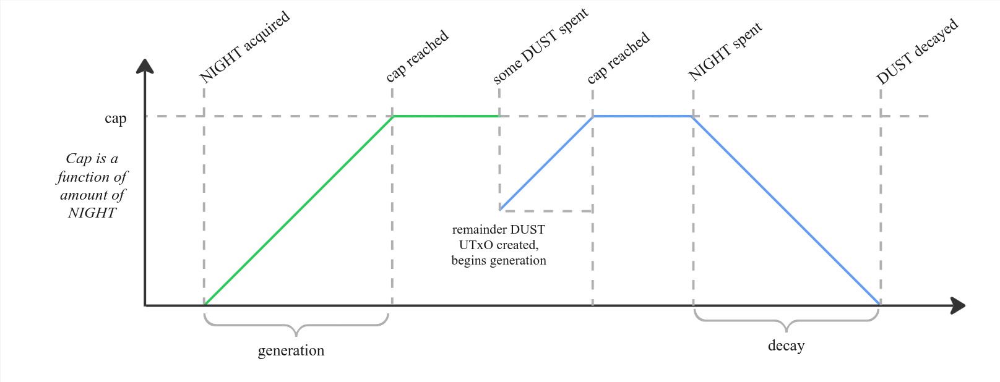
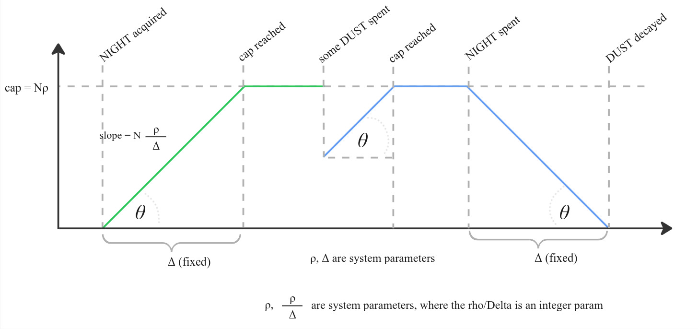
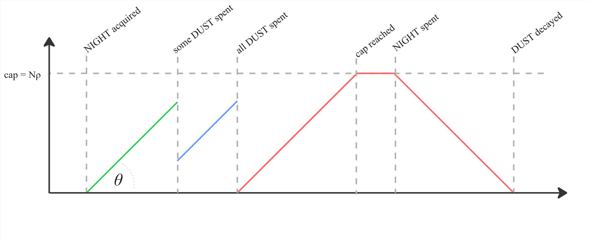
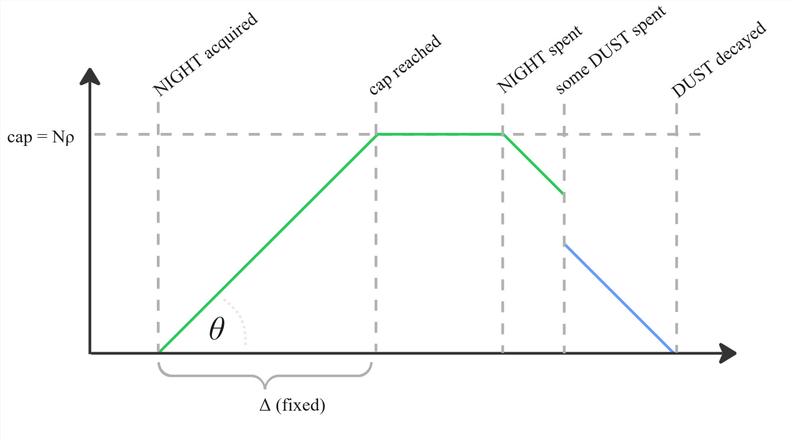
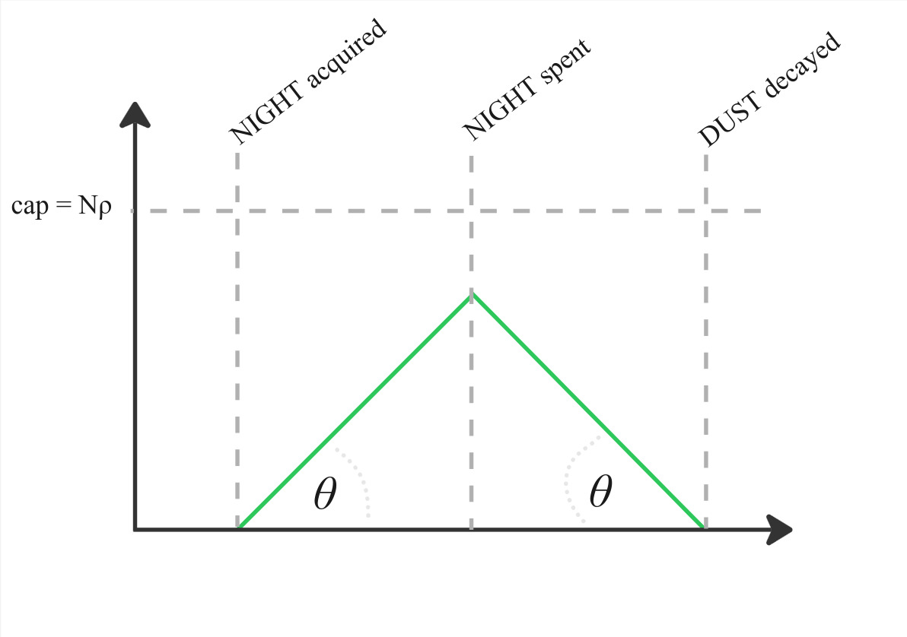
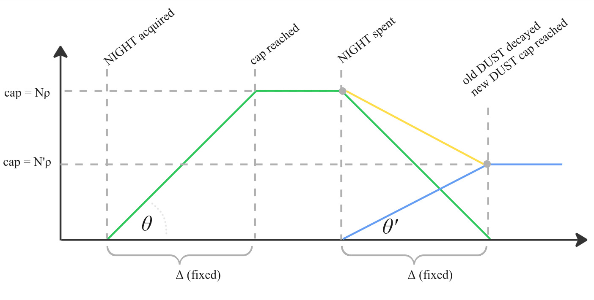

# Dust and fee payments

Dust operates similarly to, but separately from, [Zswap](./zswap.md). It
operates as the fee payment token of Midnight, but has the following unique
properties:

- Dust is a shielded token, but is not transferable, instead being usable only
  for fees.
- The value of a Dust UTXO is dynamically computed and derived from an
  associated Night UTXO.
- The computed value of a Dust UTXO grows over time to a maximum based on its Night UTXO.
- The computed value of a Dust UTXO decays over time to zero after its Night UTXO is spent.
- Dust is not persistent, the system may redistribute it on hardforks. (Note:
  This is *not* a statement of intent. Rather, the Midnight protocol reserves
  the right to freely modify Dust allocation and allocation rules and may, for
  example: 1. Add requirements to generate Dust, 2. Reset all existing Dust for
  garbage collection)

## Design overview

Similar to Zswap, Dust is built on hashes and the commitment/nullifier
paradigm; each Dust UTXO has an associated *commitment* which is inserted into
an append-only commitment Merkle tree at the time of creation, and *nullifier*
which is inserted into an append-only nullifier set at the time of
destruction/spending.

A Dust "spend" is a 1-to-1 "transfer", with 1 Dust UTXO input (nullifier), 1
Dust UTXO output (commitment), and a public declaration of the fees paid by
this spend. It includes a zero-knowledge proof that:
1. The input is valid, and included in the commitment Merkle tree (at a point
   in the recent past).
2. The output value is the *updated* input value (which will be elaborated
   below) minus the public fee declaration, and this is non-negative.
3. The output nullifier is correct with respect to the output value and the
   public key, which must be the same as the input public key.
Dust "spends" don't really transfer Dust therefore, as they do not allow for
change in ownership.

Conceptually, Dust is generated over time by held *Night* UTXOs. Dust UTXOs are
associated with a "backing" Night UTXO, and as long as this remains unspent
will generate Dust up to a cap given by the amount of Night held in the
backing UTXO. Once the backing Night is spent, the Dust UTXO will "decay" to
zero over time, but may still be used.

<p align="center"></p>

The rate of generation ($\theta$ in figures) depends on the amount of night
held ($N$), the ratio of the Dust cap to Night held ($\rho$), and "time to cap"
($\Delta$).

<p align="center"></p>

Dust may be spent multiple times, and a new UTXO is always created, even if its
value is zero:

<p align="center"></p>

Spending during decay is fine, and does not change the decay rate:

<p align="center"></p>

Once the backing Night is spent, the Dust immediately starts to decay, even if it is currently generating:

<p align="center"></p>

If only a portion of the backing Night is spent, the change will be the backing
Night to a new Dust UTXO, which accumulates Dust while the old UTXO decays. The
net effect is a linear decrease in total Dust holdings:

<p align="center"></p>

---

In practice, this is not continuously processed, but is calculated at the time
a Dust UTXO is spent, by computing the "updated" value of this UTXO. For this
purpose, the creation time of Dust UTXOs is used, as well as metadata
"generation info" associated with the backing Night UTXO. This metadata
includes the Dust public key, the creation time of the backing Night UTXO, and
the *deletion* time of the backing Night UTXO (if applicable -- this may also
be a future time, and is set to the maximum timestamp if backing Night UTXO is
still present). These allow computing any generation and decay between the
the time the Dust UTXO being spent was created and the current time.

This Night metadata is stored separately to the main UTXO set, and not all
UTXOs have associated metadata -- either because they are not Night UTXOs, or
because they do not generate Dust.

As Dust and Night have different public keys, and we anticipate leasing Dust to
be desirable, creating a new Night UTXO does not always create a corresponding
Dust UTXO. Instead, a table tracks which Dust public key to associate with
which Night public key, and a new Dust UTXO is created (initially with zero
balance) if and only if a Night UTXO is created *whose public key has a table
entry*, and it is created for the Dust public key recorded at that table entry.
A separate action allows (un)setting the table entry (or "registrations") for a
given Night public key with the corresponding secret key's signature.

Finally, because registrations run a challenge of paying for their own fees, if
the same Night address is used in a registration, and at least one input that
is *not* backing any Dust, then fees may be taken from the Dust these inputs
*would have* generated, had they has an associated Dust UTXO (effectively
backdating the registration). Any freshly created Dust UTXOs associated with
the same Night address get the remaining Dust from this split between them at
creation time, rather than the typical initial balance of 0.

---

Finally, the above assumes a perfect, instant network. In practice, there is a
timing delay between a transaction getting made, and it getting accepted
on-chain. Because our Dust payments are *shielded*, they can *only* compute the
updated value of dust *for the time of transaction creation*. This is *not* the
same as the value when it gets accepted onchain, however we can ensure it's
relatively close by limiting the time window during which this is accepted.
This time window is the *dust grace period*. It's effectively a global TTL for
Dust, but it also technically allows *back-dating* Dust spends for the grace
period.

In other words, even if a Dust UTXO just finished decaying, it can still be
spent for the balance it had one grace period ago by back-dating this spend. It
is therefore assumed that the grace period is much smaller than the time to
reach the Dust cap.

## Prerequisites

Dust is structured similarly to [Zswap](./zswap.md), knowledge of this
structure is assumed for this document. Similarly, knowledge of
[Night](./night.md) is assumed due to the interactions with Night attaching to
this structure.

Finally, this document makes reference to [intents](./intents-transactions.md)
and *segments*. While fully understanding these is circular, the basic
structure and [intent sequencing](./intents-transactions.md#sequencing) are
assumed knowledge.

## Preliminaries

Dust uses ZK-friendly hashes, as the
non-persistence of Dust allows these to be changed on hardforks.

```rust
type DustSecretKey = Fr;
type DustPublicKey = field::Hash<DustSecretKey>;
```

Dust does not need any encryption keys (as Zswap tokens do), as it is not transferred. This does
leave a question of wallet recovery, which [will be addressed
below](#wallet-recovery).

As in Zswap, Dust UTXOs have associated owners, values, and, to guarantee uniqueness, *nonces*.
To enable the aforementioned wallet recovery, these nonces cannot be fully
random, as randomness is inherently not recoverable. Instead, nonces evolve
deterministically, and can all be traced back to an originating Night UTXO. As
each Dust spend is non-transferring, it is 1-to-1. The first Dust UTXO
in a chain is uniquely determined by the Night UTXO (and associated metadata)
that created it. We hash three things to determine the nonce of a Dust UTXO:
- The [intent hash](./intents-transactions.md) and output number identifying its originating Night UTXO.
- A sequence number, starting at 0, indicating where we are in this chain of
self-spends.
- The owner's public key or secret key, depending on whether this is the first
  Dust UTXO in a sequence. For the first Dust UTXO, as this is created and
  publicly linked to the originating Night UTXO by necessity, this is the owner's Dust
  public key. For all subsequent Dust UTXOs, this is the owner's Dust *secret*
  key, to ensure that only the owner can construct this nonce.

The core `DustOutput` type takes a similar role as Zswap's `CoinInfo`,
describing a single UTXO as it may appear in a user's wallet.

```rust
/// Hash uniquely identifying the originating Night UTXO
type InitialNonce = Hash<(IntentHash, u32)>;

struct DustOutput {
    /// The amount of atomic Dust units (Specks) held in this UTXO
    /// at the instant of its creation, prior to any growth or decay
    initial_value: u128,
    /// The public key owning the Dust UTXO.
    owner: DustPublicKey,
    /// The nonce of this Dust UTXO
    nonce: field::Hash<(InitialNonce, u32, Fr)>,
    /// The current sequence number
    seq: u32,
    /// The creation time of this Dust UTXO
    ctime: Timestamp,
}
```

As with Zswap, Dust UTXOs have commitment and nullifier projections, here
defined over a variant of `DustOutput`:

```rust
struct DustPreProjection<T> {
    initial_value: u128,
    owner: T,
    nonce: field::Hash<(InitialNonce, u32, Fr)>,
    ctime: Timestamp,
}

type DustCommitment = field::Hash<DustPreProjection<DustPublicKey>>;
type DustNullifier = field::Hash<DustPreProjection<DustSecretKey>>;
```

The core state of the Dust subsystem then consists, similarly to Zswap, of a
commitment Merkle tree, a nullifier set, and a history of valid Merkle tree
roots for proof verification.

```rust
struct DustUtxoState {
    commitments: MerkleTree<DustCommitment>,
    commitments_first_free: usize,
    nullifiers: Set<DustNullifier>,
    root_history: TimeFilterMap<MerkleTreeRoot>,
}
```

## Initial Dust parameters

Dust has a handful of fundamental parameters, which are given here both in
abstract, and in their concrete initial assignment. Fundamentally, these define
the relation between Night, Dust, and time.

It is worth also being clear about the atomic units of Night and Dust here.
- The atomic unit of Night is the Star, with 1 Night = 10^6 Stars
- The atomic unit of Dust is the Speck, with 1 Dust = 10^15 Specks

Dust has a much higher resolution to allow more fine-grained fee payments,
while importantly being low enough that the maximum supply of Dust still fits
comfortably in a `u128`, eliminating (most) overflow concerns.

```rust
struct DustParameters {
    /// The maxmium supply of Specks per Star
    night_dust_ratio: u64,
    /// The number amount of Specks per Star per second to generate or decay.
    generation_decay_rate: u32,
    /// The amount of time that may pass before a Dust spend is forced to time out.
    dust_grace_period: Duration,
}
```

The initial assignment of these is given by the rough guidance of 5 Dust being
the maximum support per Night, and the generation time of 1 week. The grace
period is set to 3 hours, to allow for network congestion, but not transactions
living for days.

```rust
const INITIAL_DUST_PARAMETERS: DustParameters = {
    night_dust_ratio = 5_000_000_000; // 5 DUST per NIGHT
    generation_decay_rate = 8_267; // Works out to a generation time of approximately 1 week.
    dust_grace_period = Duration::from_hours(3),
};
```

## Dust actions

As part of an intent, there are three ways to influence the state of the Dust
subsystem:
- By transacting in Night, which affects the Dust generation state and creates
  fresh Dust UTXOs.
- By making `DustSpend`s, which explicitly transact on Dust UTXOs.
- By making `DustRegistration`s, which both affect the Night/Dust address
  mapping and may affect the Dust generation state and create fresh Dust UTXOs
  if the relevant Night address has Night UTXOs owed Dust in this transaction.

The latter two are captured in an explicit `DustActions` structure, which also includes a timestamp that these actions are made against.

The `DustRegistration`s case is the complex one, because these registrations
*may* pay for fees. This has several preconditions and, differently from the
other operations, happens sequentially. In particular, for a registration to
pay for fees, the relevant Night address must have both Night inputs
present in this transaction, and at least one of these inputs must not
have already been generating Dust. In that case, the Dust these inputs *would
have generated* will be used to cover transaction fees, up to the declared
limit, and the remaining amount distributed across the outputs.

However, if other parts of the transaction already sufficiently cover the fees,
Dust is not subtracted from the new registration, and the amount distributed
is correspondingly higher. By contrast, `DustSpend`s do not allow partial
refunds as the privacy mechanism doesn't make obvious where to refund *to*.

Registrations are processed sequentially and in order of the segment IDs of their
`Intent`s. Note that as fee payments are processed during the
guaranteed segment, this process affects only inputs and outputs in this
segment. Further, to minimize the amount of fees taken, all
`DustSpend`s in a segment are processed first, and then the segment's Dust registrations are processed
in sequence.

```rust
struct DustActions<S, P> {
    spends: Vec<DustSpend<P>>,
    registrations: Vec<DustRegistration>,
    ctime: Timestamp,
}
```

## Generating Dust

As stated, Dust is generated by Night over time. Technically this poses a
challenge, as Night uses different key material to Dust. In addition to this,
the Dust address to which any Night's Dust is delivered should be modifiable
over time, to enable the future use-case of leasing out Dust generation.

These different addresses are reconciled by table linking Night and Dust addresses,
and additional processing behaviour on processing Night inputs and outputs.
For each input and output processed, a table of Dust
generations is updated; this can then be referenced to determine the amount of
Dust held in any given UTXO. Additionally, each Night output processed creates a
new Dust UTXO.

The core information about one Night UTXO generation is
encapsulated in `DustGenerationInfo`, which captures the amount of Night
(Stars) generating Dust, the public key they are generating Dust to, the nonce
at the start of the Dust chain, and finally, the time this Night UTXO was
spent. The final value is necessary because determining the value of a Dust UTXO
requires knowledge of when any decay started. This time may be set
in the future, and unspent Night will have a generation info with this set to
`Timestamp::MAX`.

```rust
struct DustGenerationInfo {
    value: u128,
    owner: DustPublicKey,
    nonce: InitialNonce,
    dtime: Timestamp,
}
```

In order to ensure that Dust generation is unique, a variant of this without
the timestamp is also kept in the state, preventing duplicate Dust generations.

```rust
struct DustGenerationUniquenessInfo {
    value: u128,
    owner: DustPublicKey,
    nonce: InitialNonce,
}
```

The ledger's state related to the Dust generation information has a number of
components:
- A mapping from Night addresses to Dust addresses, to provide the Dust owner value for new Night outputs.
- A sequential Merkle tree of `DustGenerationInfo`, which can be directly used
  to assert the presence of a specific Dust generation info in ZK proofs.
- A corresponding set of the `DustGenerationUniquenessInfo`s, to prevent
  collisions in these.
- A mapping from Night UTXOs to their position in the Merkle tree.
- A history of valid Merkle tree roots (valid for the Dust grace period).

```rust
struct DustGenerationState {
    address_delegation: Map<NightAddress, DustPublicKey>,
    generating_tree: MerkleTree<DustGenerationInfo>,
    generating_tree_first_free: usize,
    generating_set: Set<DustGenerationUniquenessInfo>,
    night_indices: Map<InitialNonce, u64>,
    root_history: TimeFilterMap<MerkleTreeRoot>,
}
```

The address map itself is updated with 'registrations', signed by a Night
address (via its signature verifying key), and either linking a specific Dust
address, or removing the existing link. Registrations may also permit the
containing transaction to take some amount from *unclaimed* Dust associated
with this Night address to be used to cover the transaction's fees.

```rust
struct DustRegistration<S> {
    night_key: VerifyingKey,
    dust_address: Option<DustPublicKey>,
    /// The amount of fees from owed DUST that this registration will cede to
    /// fee payments. This *must* be an underestimate of the fees available.
    allow_fee_payment: u128,
    signature: S,
}
```

A 'registration' whose `dust_address` is `None` is treated as a
*de*registration, with the corresponding table entry being removed.

## Dust value & spends

Core to the experience of Dust is the change in value of a Dust UTXO over time.
If there is a backing Night UTXO (and all Dust UTXOs *initially* have a backing
Night UTXO), the value of the Dust UTXO will approach a maximum deteremined by
the Night-Dust ratio and the value of the backing Night. After the backing
Night UTXO has been marked as destroyed, the Dust UTXO's value instead approaches
zero over time.

<p align="center"></p>

When spending a Dust UTXO, its updated value needs to be computed. It's
important *when* this value is picked, and whose notion of time it respects.
Concretely, that is the time according to the transaction author, and is
recorded in `DustActions.ctime`, with the network accepting this if it is within the `dust_grace_period` of the current block time.

Computing the updated value may include both
generating and decaying phases. Specifically, we split the elapsed time into
(at most) four linear segments:

1. Generating, from the Dust UTXO's creation time, to the sooner of the time it
   reaches capacity and the time the backing Night UTXO is spent.
2. Constant at maximum capacity, from the time it reaches maximum capacity (if
   applicable) to the time the backing Night UTXO is spent.
3. Decaying, from the latter of the Dust UTXO's creation time, and time the backing Night UTXO is spent, to the time Dust reaches zero value.
4. Constant at zero, for the rest of time.

This relies on the fact that a Dust UTXO cannot regain a backing Night UTXO;
that would create a *new* Dust UTXO instead.

```rust
fn updated_value(
    inp: DustOutput,
    gen: DustGenerationInfo,
    now: Timestamp,
    params: DustParameters,
) -> u128 {
    // There are up to four linear segments:
    // 1. Generating (from inp.ctime to tfull, the time dust fills to the cap)
    // 2. Constant full (from tfull to gen.dtime)
    // 3. Decaying (from gen.dtime to tempty, the time dust reaches zero)
    // 4. Constant empty (from tempty onwards)
    //
    // If gen.dtime <= tfull, phase 2 doesn't occur.
    // If gen.dtime <= inp.ctime Phases 1 and 2 do not occur.
    //
    // The maximum capacity is gen.value * night_dust_ratio.
    let vfull = gen.value * params.night_dust_ratio;
    // The slope of generation and decay for a specific dust UTXO
    // is proportional to the value of its backing night.
    let rate = gen.value * params.generation_decay_rate;
    // Note that we aren't constraining the end to be after the start, instead
    // we're clamping the output to the reasonable region of outputs.
    let tstart_phase_1 = inp.ctime;
    let tend_phase_12 = min(gen.dtime, now);
    let value_phase_1_unchecked = (tend_phase_12 - tstart_phase_1).as_seconds() * rate + inp.initial_value;
    let value_phase_12 = clamp(value_phase_1_unchecked, inp.initial_value, vfull);
    // Again, we aren't constraining the end to be after the start, instead
    // we're clamping the output to the reasonable region of outputs.
    let tstart_phase_3 = gen.dtime;
    let tend_phase_3 = now;
    let value_phase_3_unchecked = value_phase_12 - (tend_phase_3 - tstart_phase_3).as_seconds() * rate;
    let value_phase_3 = clamp(value_phase_3_unchecked, 0, value_phase_12);
    value_phase_3
}
```

The main means for making use of Dust is by *spending* it. This is in some ways
similar to a combined Zswap spend and output, with the additional computation
of the *effective* value of the Dust using `updated_value` and a constraint that the owner
of the input and the owner of the output match. The spend also declares a *fee*
value, which is subtracted from the created output, representing the cost of performing
the transaction.

As opposed to Zswap, the Dust spend does not directly reference the Merkle tree
root of its generating tree. This is because Dust already has a strong
requirement on time, which needs to be within the `dust_grace_period` and is
already used to calculate its effective value. As a result, the timestamp is
used as a key to retrieve the appropriate Merkle tree, rather than including
the root in the transaction.

```rust
struct DustSpend<P> {
    v_fee: u128,
    old_nullifier: DustNullifier,
    new_commitment: DustCommitment,
    proof: P::Proof,
}
```

The zero-knowledge proof in the Dust spend is then validated against not just the spend itself, but also:
- The declared timestamp
- The dust parameters to use
- The Merkle tree roots associated with the Dust commitment tree, and the
  generation information tree, corresponding to the declared timestamp.

Locally, users need to supply:
- The Dust UTXO that is being spent
- The Dust secret key demonstrating ownership
- The backing generation info
- The paths to both the Dust commitment being spent and the generation info.
- The nonce and sequence number of the new output.

```rust
fn dust_spend_valid(
    dust_spend: Public<DustSpend<()>>,
    tnow: Public<Timestamp>,
    params: Public<DustParameters>,
    commitment_root: Public<MerkleTreeRoot>,
    generation_root: Public<MerkleTreeRoot>,
    dust: Private<DustOutput>,
    sk: Private<DustSecretKey>,
    gen: Private<DustGenerationInfo>,
    commitment_merkle_tree: Private<MerkleTree<DustCommitment>>,
    generation_merkle_tree: Private<MerkleTree<DustGenerationInfo>>,
    // Note these are for the new coin, and there is no need to validate these,
    // as the secret key ensures these are provided by the same user as consumes
    // them.
    initial_nonce: Private<InitialNonce>,
    seq_no: Private<u32>,
) -> bool {
    assert!(dust.owner == field::hash(sk));
    let pre_commitment = field::hash(DustPreProjection {
        initial_value: dust.initial_value,
        owner: dust.owner,
        nonce: dust.nonce,
        ctime: dust.ctime,
    });
    assert!(commitment_merkle_tree.contains(pre_commitment));
    assert!(commitment_root = commitment_merkle_tree.root());
    assert!(generation_merkle_tree.contains(gen));
    assert!(genration_root = generation_merkle_tree.root());
    let nullifier = field::hash(DustPreProjection {
        initial_value: dust.initial_value,
        owner: sk,
        nonce: dust.nonce,
        ctime: dust.ctime,
    });
    assert!(dust_spend.old_nullifier == nullifier);
    let v_pre = updated_value(inp, gen, tnow, params);
    assert!(v_pre >= dust_spend.v_fee);
    let v = v_pre - dust_spend.v_fee;
    let nonce = field::hash((initial_nonce, seq_no, sk));
    let post_commitment = field::hash(DustPreProjection {
        initial_value: v,
        owner: dust.owner,
        nonce,
        ctime: tnow,
    });
    assert!(dust_spend.new_commitment == post_commitment);
}
```

Well-formedness for dust spends is just proof verification, using the parent
intent's binding commitment to bind to, and a parent timestamp to look up
Merkle trees in the dust state. Said dust state is defined simply to consist of
the parameters, Dust UTXO state, and Dust generation state.

```rust
struct DustState {
    utxo: DustUtxoState,
    generation: DustGenerationState,
}

impl<P> DustSpend<P> {
    fn well_formed(self, ref_state: DustState, params: DustParameters, segment: u16, binding: Pedersen, tparent: Timestamp) -> Result<()> {
        assert!(zk_verify(
            dust_spend_valid,
            (
                self,
                tparent,
                params,
                ref_state.utxo.root_history.get(tparent),
                ref_state.generation.root_history.get(tparent),
            ),
            Some((segment, binding)),
            self.proof,
        ));
    }
}
```

## `DustAction` semantics

A `DustAction` is well-formed if its parts are well formed, there are no
duplicate registrations, we are withing a `dust_grace_period` time window
of the declared timestamp, and all `DustRegistration`s have enough funds to
cover their declared fee bound.

```rust
impl<S, P> DustActions<S, P> {
    fn well_formed(
        self,
        ref_dust_state: DustState,
        ref_utxo_state: UtxoState,
        segment: u16,
        parent: ErasedIntent,
        tblock: Timestamp,
        params: DustParameters,
    ) -> Result<()> {
        let binding = parent.binding_commitment;
        assert!(!self.spends.is_empty() || !self.registrations.is_empty())
        for spend in self.spends {
            spend.well_formed(ref_state, params, segment, binding, self.ctime)?;
        }
        assert!(self.ctime <= tblock && self.ctime + params.dust_grace_period >= tblock);
        // Make sure that we are not registering for the same night key more
        // than once
        let mut night_keys = self.registrations
            .iter()
            .map(|reg| reg.night_key)
            .collect::<Vec<_>>();
        night_keys.sort();
        assert!(night_keys.windows(2).all(|window| window[0] != window[1]));
        // Make sure that each registration has sufficient unclaimed night in
        // the ref utxo state to cover its allowed fee payment field.
        assert!(self.registrations
            .iter()
            .filter(|reg| reg.allow_fee_payment > 0)
            .all(|reg|
                ref_dust_state.generationless_fee_availability(
                    ref_utxo_state,
                    parent,
                    reg.night_key,
                    params,
                ).unwrap_or(0) >= reg.allow_fee_payment
            )
        );
    }
}

impl UtxoSpend {
    fn initial_nonce(&self) -> InitialNonce {
        hash((self.output_no, self.intent_hash))
    }
}

impl DustState {
    fn generationless_fee_availability(
        self,
        utxo_state: UtxoState,
        parent_intent: ErasedIntent,
        night_key: VerifyingKey,
        params: DustParameters,
    ) -> Result<u128> {
        let generationless_inputs = parent_intent.guaranteed_unshielded_offer
            .iter()
            .flat_map(|o| o.inputs.iter())
            .filter(|i| i.owner == night_key && i.type_ == NIGHT_RAW)
            .filter(|i| !self.generation.night_indices.contains(i.initial_nonce())))
            .collect();
        generationless_inputs.iter().map(|i| {
            // In parallel with `updated_value`, but only phase 1
            let vfull = i.value * params.night_dust_ratio;
            let rate = i.value * params.generation_decay_rate;
            let tstart = utxo_state.utxos.get(Utxo::from(i))?.ctime;
            let tend = parent_intent.dust_actions
                .expect("Dust actions must exist to process a generationless fee availability")
                .ctime;
            let value_unchecked = (tend_phase_1 - tstart_phase_1).as_seconds() * rate;
            clamp(value_unchecked, 0, vfull)
        }).sum()
    }
}
```

Applying Dust spends straightforwardly adds both the old Dust UTXO's nullifier,
and the new Dust UTXO's commitment to the corresponding set / Merkle tree,
while ensuring they are not already present.

```rust
impl DustState {
    fn apply_spend<P>(mut self, spend: DustSpend<P>) -> Result<Self> {
        assert!(!self.utxos.nullifiers.contains(spend.old_nullifier));
        self.utxo.nullifiers = self.utxo.nullifiers.insert(spend.old_nullifier);
        self.utxo.commitments = self.utxo.commitments.insert(self.utxo.commitments_first_free, spend.new_commitment);
        self.utxo.commitments_first_free += 1;
        Ok(self)
    }
} 
```

Applying unshielded offers to the Dust state processes Night inputs and outputs by:
- Setting the `dtime` on the corresponding `DustGenerationInfo` for a Night
  input (if it exists).
- If registration information for the recipient of a Night ouput exists:
  - Create a new `DustGenerationInfo` for this Night UTXO.
  - Create a fresh Dust UTXO, and insert this into the state.
- Outputs coverd by a new Dust registration are *not* processed here, but are
  processed with that registration instead.

```rust
impl DustState {
    fn apply_offer<S, P>(
        mut self,
        offer: UnshieldedOffer<S>,
        segment: u16,
        parent: ErasedIntent,
        tblock: Timestamp,
    ) -> Result<Self> {
        for input in offer.inputs.filter(|i| i.type_ == NIGHT_RAW) {
            let Some(idx) = self.generation.night_indices.get(input.initial_nonce()) else { continue; };
            let mut gen_info = self.generation.generating_tree
                .get(idx)
                .expect("Invalid index should not be in night indices");
            gen_info.dtime = tblock;
            self.generation.generating_tree = self.generation.generating_tree.insert(idx, gen_info);
        }
        for (output_no, output) in offer.outputs
            .iter()
            .enumerate()
            .filter(|(_, o)| o.type_ == NIGHT_RAW)
        {
            let Some(dust_addr) = self.generation.address_delegation.get(output.owner) else { continue; };
            let handled_by_registration = segment == 0 && parent.dust_actions
                .iter()
                .flat_map(|actions| actions.registrations.iter())
                .any(|reg| hash(reg.night_key) == output.owner);
            if !handled_by_registration {
                let initial_nonce = hash(hash(segment, parent), output_no as u32);
                self = self.fresh_dust_output(initial_nonce, 0,  output.value, dust_addr, tblock, tblock)?;
            }
        }
        self
    }

    fn fresh_dust_output(
        mut self,
        initial_nonce: InitialNonce,
        initial_value: u128,
        night_value: u128,
        dust_addr: DustPublicKey,
        tnow: Timestamp,
        tblock: Timestamp,
    ) -> Result<Self> {
        let seq = 0;
        let dust_pre_projection = DustPreProjection {
            initial_value: initial_value,
            owner: dust_addr,
            nonce: field::hash((initial_nonce, seq, dust_addr)),
            ctime: tnow,
        };
        let dust_commitment = field::hash(dust_pre_projection);
        self.utxo.commitments = self.utxo.commitments.insert(
            self.utxo.commitments_first_free,
            dust_commitment,
        );
        self.utxo.commitments_first_free += 1;
        let gen_info = DustGenerationInfo {
            value: output.value,
            owner: dust_addr,
            nonce: initial_nonce,
            dtime: Timestamp::MAX,
        };
        assert!(!self.generation.generating_set.contains(gen_info.into()));
        self.generation.generating_set = self.generation.generating_set.insert(
            gen_info.into(),
        );
        self.generation.generating_tree = self.generation.generating_tree.insert(
            self.generation.generating_tree_first_free,
            gen_info,
        );
        self.generation.night_indices.insert(
            initial_nonce,
            self.generation.generating_tree_first_free,
        );
        self.generation.generating_tree_first_free += 1;
    }
}
```

Dust registrations are processed by updating the Night/Dust address map, and
then processing remaining fees as declared above. As part of this process, fees
are diveded weighted by output UTXO values, this is done with a limited
resolution to prevent overflow or reliance on floating point math.

```rust
impl DustState {
    // Returns the updated self, and the updated `remaining_fees`.
    fn apply_registration<S>(
        mut self,
        utxo_state: UtxoState,
        mut remaining_fees: u128,
        parent_intent: ErasedIntent,
        reg: DustRegistration<S>,
        params: DustParameters,
        tnow: Timestamp,
        context: BlockContext,
    ) -> Result<(Self, u128)> {
        let night_address = hash(reg.night_key);
        match reg.dust_address {
            None => {
                let entry = self.generation.address_delegation.remove(night_address);
                assert!(entry.is_some());
            },
            Some(dust_addr) => self.generation.address_delegation.insert(night_address, dust_addr),
        }
        let owned_outputs = parent_intent.guaranteed_unshielded_offer
            .iter()
            .flat_map(|o| o.outputs.iter().enumerate())
            .filter(|(_, o)| o.owner == night_address && o.type_ == NIGHT_RAW)
            .collect();
        let dust_in = self.generationless_fee_availability(utxo_state, parent_intent, reg.night_key, params)?;
        let fee_paid = u128::min(remaining_fees, u128::min(reg.allow_fee_payment, dust_in));
        remaining_fees -= fee_paid;
        let dust_out = dust_in - fee_paid;
        if let Some(dust_addr) = reg.dust_address {
            let output_sum = owned_outputs.iter().map(|o| o.value).sum();
            for (output_no, output) in owned_outputs {
                // NOTE: The ratio calculation could overflow even u128. As a
                // result, we quantize it.
                const DISTRIBUTION_RESOLUTION: u128 = 10_000;
                let ratio = ((output.value * DISTRIBUTION_RESOLUTION) / output_sum);
                let initial_value = (ratio * dust_out) / DISTRIBUTION_RESOLUTION;
                let initial_nonce = hash(hash(segment, parent), output_no as u32);
                self = self.fresh_dust_output(initial_nonce, initial_value, output.value, dust_addr, tnow, context.tblock)?;
            }
        }
        Ok((self, remaining_fees))
    }
}
```

Finally, the post block update process for Dust state updates the Merkle tree
root history with the current tree, and filters our trees out of range.

```rust
impl DustState {
    fn post_block_update(mut self, tblock: Timestamp) -> Self {
        self.utxo.root_history = self.utxo.root_history.insert(
            tblock,
            self.utxo.commitments.root(),
        ).filter(tblock - global_ttl);
        self.generation.root_history = self.generation.root_history.insert(
            tblock,
            self.generation.generating_tree.root(),
        ).filter(tblock - global_ttl);
        self
    }
}
```

## Wallet recovery

For wallet recovery, the first step is to find owned Night UTXOs. This informs
the wallet of the *start* of any Dust UTXO chains, and the wallet can now
search linearly for the commitments associated with each sequence number in the
chain. The last such sequence number *should* be unspent.

Note that as this *does* link the given commitments to the indexing service
used, we suggest instead a stochastic privacy approach. Instead of quering
whether commitments are in the state, the wallet should query commitments
*starting with* a specific bit prefix, with the indexing service returning the
list of matching commitments, which the wallet can filter locally. The prefix
length should be determined from the number of total commitments, such that the
response includes however many commitments are sufficiently statistically
hiding for this wallet user.

For instance, if there are $2^{14}$ commitments in the state, and the wallet
wants an anonymity set of $2^7$, then it should send prefixes of $14 - 7 = 7$
bits.

## Interaction with cNight

The principle for interacting with cNight is straightforward: Cardano
periodically informs the Midnight ledger to:
1. Create new `DustGenerationInfo` entries with `nonce` values determined from
   the corresponding Cardano UTXO, such that it is collision resistant with
   those created on Midnight, as well as creating corresponding Dust UTXOs.
2. Set the destruction time of previously created `DustGenerationInfo` entries.

The Midnight ledger will validate that the dust generation instructed from
Cardano does not exceed the amount of Night intended to be in cNight
circulation, but otherwise deploys it as instructed.
