# AWS Nitro Enclave Deployment Guide

Complete guide for deploying the Midnight TEE Proof Server to AWS Nitro Enclaves.

## What You Have

✅ **Docker Image**: `midnight/proof-server:latest` (134MB)
✅ **Nitro-Compatible Dockerfile**: Supports AWS Nitro Enclaves
✅ **Deployment Script**: `scripts/aws-nitro-deploy.sh`
✅ **Version**: 6.2.0-alpha.1

## Deployment Flow

```mermaid
flowchart TD
    Start([Start on macOS]) --> SSO{AWS SSO<br/>Configured?}
    SSO -->|No| ConfigSSO[Configure AWS SSO<br/>aws configure sso]
    SSO -->|Yes| Launch[Launch EC2 Instance<br/>💻 macOS: aws ec2 run-instances]
    ConfigSSO --> Launch

    Launch --> Wait[Wait for Instance<br/>💻 macOS: aws ec2 wait]
    Wait --> GetIP[Save Instance Details<br/>💻 macOS: ~/midnight-nitro-instance.txt]

    GetIP --> SSH1[SSH to EC2<br/>💻 macOS → 📦 EC2]
    SSH1 --> InstallNitro[Install Nitro CLI<br/>📦 EC2: yum install]
    InstallNitro --> InstallDocker[Install Docker<br/>📦 EC2: yum install docker]
    InstallDocker --> ConfigEnclave[Configure Enclave<br/>📦 EC2: allocator.yaml]
    ConfigEnclave --> ReLogin[Re-login for Groups<br/>💻 macOS: ssh again]

    ReLogin --> ImageChoice{How to get<br/>Docker Image?}
    ImageChoice -->|Build on EC2| BuildEC2[Build & Deploy<br/>📦 EC2: ./aws-nitro-deploy.sh --build]
    ImageChoice -->|Transfer| SaveImage[Save Image<br/>💻 macOS: docker save]
    ImageChoice -->|Registry| PushReg[Push to Registry<br/>💻 macOS: docker push]

    SaveImage --> SCP[Transfer via SCP<br/>💻 macOS → 📦 EC2]
    SCP --> LoadImage[Load Image<br/>📦 EC2: docker load]
    LoadImage --> Deploy

    PushReg --> PullReg[Pull from Registry<br/>📦 EC2: docker pull]
    PullReg --> Deploy

    BuildEC2 --> Verify
    Deploy[Deploy to Enclave<br/>📦 EC2: ./aws-nitro-deploy.sh] --> Verify

    Verify[Verify Enclave<br/>📦 EC2: nitro-cli describe-enclaves]
    Verify --> SetupProxy[Setup vsock Proxy<br/>📦 EC2: vsock-proxy]
    SetupProxy --> TestLocal[Test Locally<br/>📦 EC2: curl localhost:6300]

    TestLocal --> TestRemote[Test from macOS<br/>💻 macOS: curl PUBLIC_IP:6300]
    TestRemote --> Success[✅ Deployment Complete]

    style Start fill:#fff3bf
    style Success fill:#b2f5ea
    style BuildEC2 fill:#d0ebff
    style Deploy fill:#d0ebff
    style Launch fill:#ffd8a8
    style TestRemote fill:#ffd8a8
```



**Legend:**
- 💻 = Run on macOS (your local machine)
- 📦 = Run on EC2 instance

## Information You Need Before Starting

Gather this information before running the deployment:

### AWS Account Information
- [ ] **AWS SSO Start URL**: `https://your-org.awsapps.com/start`
- [ ] **AWS Region**: Where to deploy (e.g., `us-east-1`, `us-west-2`)
- [ ] **AWS Profile Name**: What to call your SSO profile (e.g., `midnight-admin`)

### EC2 Configuration
- [ ] **SSH Key Pair Name**: Your existing EC2 key pair name (or create new)
- [ ] **SSH Private Key Path**: Location of `.pem` file (e.g., `~/.ssh/my-key.pem`)
- [ ] **Instance Type**: Nitro-enabled type (default: `c6i.2xlarge`)

### Optional
- [ ] **Docker Registry** (if using): ECR or Docker Hub URL
- [ ] **API Key** (for production): Secure key for proof server authentication

## Prerequisites

### 1. AWS Account Setup

**On Your Local Machine (macOS):**

- Active AWS account with EC2 permissions
- AWS CLI v2 installed
- AWS SSO configured
- SSH key pair for EC2 access

**Note:** The `nitro-cli` tool does NOT run on macOS and cannot be compiled. All Nitro-specific commands must be run on the EC2 instance itself.

### 2. AWS SSO Authentication Setup

**On Your Local Machine (macOS):**

```bash
# Install AWS CLI v2 (if not already installed)
brew install awscli

# Configure SSO profile
aws configure sso

# Follow prompts:
# SSO session name: midnight
# SSO start URL: https://your-org.awsapps.com/start
# SSO region: us-east-1 (or your region)
# SSO registration scopes: sso:account:access
# CLI default client Region: us-east-1
# CLI default output format: json
# CLI profile name: midnight-admin

# Login via SSO
aws sso login --profile midnight-admin

# Verify access
aws sts get-caller-identity --profile midnight-admin
```

**Add to your shell profile** (~/.zshrc or ~/.bashrc):

```bash
export AWS_PROFILE=midnight-admin
alias aws-login='aws sso login --profile midnight-admin'
```

### 3. EC2 Instance Requirements

**Supported Instance Types** (must support Nitro Enclaves):
- **C-Series**: C5, C5a, C5n, C6i, C6a, C6in, C7i
- **M-Series**: M5, M5a, M5n, M6i, M6a, M6in, M7i
- **R-Series**: R5, R5a, R5n, R6i, R6a, R6in, R7i

**Recommended for Proof Server**:
- Instance: `c6i.2xlarge` or `m6i.2xlarge`
- vCPUs: At least 4 (2 for enclave, 2 for host)
- Memory: At least 8 GB
- OS: Amazon Linux 2 or Ubuntu 20.04+

## Step-by-Step Deployment

### Step 1: Launch Nitro-Enabled EC2 Instance

**💻 Run from your LOCAL MACHINE (macOS)** using AWS CLI with SSO

#### Using AWS Console (Alternative)

1. Go to EC2 Console → Launch Instance
2. Choose AMI: **Amazon Linux 2** (recommended)
   - Or use: `ami-0c55b159cbfafe1f0` (check latest in your region)
3. Choose Instance Type: **c6i.2xlarge** or similar Nitro-enabled type
4. Configure Instance:
   - **Enable Enclave support** ⚠️ CRITICAL - this cannot be changed later!
   - Allocate 2 vCPUs and 4GB RAM to enclave
5. Add Storage: 50GB GP3
6. Configure Security Group:
   - SSH (22) from your IP
   - Custom TCP (6300) for proof server
7. Launch with your SSH key

#### Using AWS CLI (Recommended with SSO)

**On macOS (your local machine):**

```bash
# Ensure you're logged in via SSO
aws sso login --profile midnight-admin

# Set your variables
export AWS_PROFILE=midnight-admin
export KEY_NAME="your-ssh-key-name"        # Your existing EC2 key pair
export REGION="us-east-1"                   # Your preferred region
export MY_IP=$(curl -s https://checkip.amazonaws.com)  # Your public IP

# Get the latest Amazon Linux 2 AMI
AMI_ID=$(aws ec2 describe-images \
    --owners amazon \
    --filters "Name=name,Values=amzn2-ami-hvm-*-x86_64-gp2" \
              "Name=state,Values=available" \
    --query 'Images | sort_by(@, &CreationDate) | [-1].ImageId' \
    --output text \
    --region $REGION)

echo "Using AMI: $AMI_ID"

# Create security group
SG_ID=$(aws ec2 create-security-group \
    --group-name midnight-proof-server-sg \
    --description "Midnight Proof Server with Nitro Enclave" \
    --region $REGION \
    --query 'GroupId' \
    --output text)

echo "Created Security Group: $SG_ID"

# Allow SSH from your IP only
aws ec2 authorize-security-group-ingress \
    --group-id $SG_ID \
    --protocol tcp \
    --port 22 \
    --cidr ${MY_IP}/32 \
    --region $REGION

# Allow proof server port from anywhere (or restrict as needed)
aws ec2 authorize-security-group-ingress \
    --group-id $SG_ID \
    --protocol tcp \
    --port 6300 \
    --cidr 0.0.0.0/0 \
    --region $REGION

# Launch instance with Nitro Enclave support
INSTANCE_ID=$(aws ec2 run-instances \
    --image-id $AMI_ID \
    --count 1 \
    --instance-type c6i.2xlarge \
    --key-name $KEY_NAME \
    --security-group-ids $SG_ID \
    --enclave-options 'Enabled=true' \
    --block-device-mappings 'DeviceName=/dev/xvda,Ebs={VolumeSize=50,VolumeType=gp3}' \
    --tag-specifications 'ResourceType=instance,Tags=[{Key=Name,Value=midnight-proof-server}]' \
    --region $REGION \
    --query 'Instances[0].InstanceId' \
    --output text)

echo "Launched Instance: $INSTANCE_ID"

# Wait for instance to be running
echo "Waiting for instance to start..."
aws ec2 wait instance-running --instance-ids $INSTANCE_ID --region $REGION

# Get public IP
PUBLIC_IP=$(aws ec2 describe-instances \
    --instance-ids $INSTANCE_ID \
    --query 'Reservations[0].Instances[0].PublicIpAddress' \
    --output text \
    --region $REGION)

echo "━━━━━━━━━━━━━━━━━━━━━━━━━━━━━━━━━━━━━━━━━━"
echo "✅ EC2 Instance Ready!"
echo "━━━━━━━━━━━━━━━━━━━━━━━━━━━━━━━━━━━━━━━━━━"
echo "Instance ID:  $INSTANCE_ID"
echo "Public IP:    $PUBLIC_IP"
echo "Security Group: $SG_ID"
echo ""
echo "Connect with:"
echo "  ssh -i ~/.ssh/${KEY_NAME}.pem ec2-user@${PUBLIC_IP}"
echo "━━━━━━━━━━━━━━━━━━━━━━━━━━━━━━━━━━━━━━━━━━"

# Save details for later
cat > ~/midnight-nitro-instance.txt << EOF
Instance ID: $INSTANCE_ID
Public IP: $PUBLIC_IP
Security Group: $SG_ID
Region: $REGION
SSH Command: ssh -i ~/.ssh/${KEY_NAME}.pem ec2-user@${PUBLIC_IP}
EOF

echo ""
echo "Instance details saved to: ~/midnight-nitro-instance.txt"
```

### Step 2: Install Nitro CLI on EC2 Instance

**🔗 Run from LOCAL MACHINE (macOS)** - SSH to EC2:

```bash
# Get your instance IP from the previous step
PUBLIC_IP=$(cat ~/midnight-nitro-instance.txt | grep "Public IP" | cut -d' ' -f3)
KEY_NAME="your-ssh-key-name"  # Your SSH key name

# Connect to EC2
ssh -i ~/.ssh/${KEY_NAME}.pem ec2-user@${PUBLIC_IP}
```

**📦 Run on EC2 INSTANCE** - Install required software:

```bash
# Amazon Linux 2
sudo amazon-linux-extras install aws-nitro-enclaves-cli -y
sudo yum install aws-nitro-enclaves-cli-devel -y

# Or Ubuntu (if using Ubuntu AMI)
sudo apt-get update
sudo apt-get install -y aws-nitro-enclaves-cli aws-nitro-enclaves-cli-devel
```

**📦 Still on EC2** - Configure Nitro CLI:

```bash
# Allocate resources for enclaves
sudo systemctl enable nitro-enclaves-allocator.service
sudo systemctl start nitro-enclaves-allocator.service

# Configure enclave resources (2 CPUs, 4096 MB memory)
sudo tee /etc/nitro_enclaves/allocator.yaml > /dev/null <<EOF
---
# Enclave configuration for Midnight Proof Server
# Total resources on c6i.2xlarge: 8 vCPUs, 16GB RAM
# Allocating 2 vCPUs and 4GB RAM to enclave

cpu_count: 2
memory_mib: 4096
EOF

echo "✅ Allocator configured"
cat /etc/nitro_enclaves/allocator.yaml
```

**📦 Still on EC2** - Restart services and configure permissions:

```bash
# Restart allocator with new configuration
sudo systemctl restart nitro-enclaves-allocator.service

# Install and start Docker
sudo yum install docker -y
sudo systemctl enable --now docker

# Add user to groups (allows running nitro-cli and docker without sudo)
sudo usermod -aG ne ec2-user
sudo usermod -aG docker ec2-user

echo "✅ Configuration complete - logging out to apply group changes"
echo "   Run: ssh -i ~/.ssh/${KEY_NAME}.pem ec2-user@${PUBLIC_IP}"
echo "   to reconnect after logout"

# Log out and back in for group changes to take effect
exit
```

**🔗 From macOS** - Reconnect to EC2:

```bash
# Reconnect (group membership takes effect on new login)
PUBLIC_IP=$(cat ~/midnight-nitro-instance.txt | grep "Public IP" | cut -d' ' -f3)
KEY_NAME="your-ssh-key-name"

ssh -i ~/.ssh/${KEY_NAME}.pem ec2-user@${PUBLIC_IP}
```

### Step 3: Transfer Docker Image to EC2

#### Option A: Build on EC2 (Recommended)

**📦 On EC2 Instance:**

```bash
# Clone the midnight-code repository
git clone https://github.com/your-org/midnight-code.git
cd midnight-code/midnight-ledger/tee-proof-server-proto

# Build using deployment script (this will build Docker image + deploy to Nitro)
./scripts/aws-nitro-deploy.sh --build

# Skip to Step 4 - deployment is complete!
```

#### Option B: Push to Registry and Pull

**💻 On macOS (local machine):**

```bash
cd ~/code/midnight-code/midnight-ledger

# Tag and push to ECR or Docker Hub
docker tag midnight/proof-server:latest YOUR_REGISTRY/midnight-proof-server:latest
docker push YOUR_REGISTRY/midnight-proof-server:latest
```

**📦 On EC2 Instance:**

```bash
# Pull from registry
docker pull YOUR_REGISTRY/midnight-proof-server:latest
docker tag YOUR_REGISTRY/midnight-proof-server:latest midnight/proof-server:latest

# Verify image
docker images | grep proof-server
```

#### Option C: Save and Transfer (No Registry)

**💻 On macOS (local machine):**

```bash
cd ~/code/midnight-code/midnight-ledger

# Save Docker image to file
docker save midnight/proof-server:latest | gzip > midnight-proof-server.tar.gz

# Check file size
ls -lh midnight-proof-server.tar.gz
# Should be ~50-60MB compressed

# Get EC2 public IP
PUBLIC_IP=$(cat ~/midnight-nitro-instance.txt | grep "Public IP" | cut -d' ' -f3)
KEY_NAME="your-ssh-key-name"

# Transfer to EC2 (will take a few minutes)
scp -i ~/.ssh/${KEY_NAME}.pem midnight-proof-server.tar.gz ec2-user@${PUBLIC_IP}:~/

echo "✅ Transfer complete!"
```

**📦 On EC2 Instance:**

```bash
# Uncompress and load the Docker image
gunzip midnight-proof-server.tar.gz
docker load < midnight-proof-server.tar

# Verify image loaded
docker images | grep midnight/proof-server

# Clean up the tar file (save space)
rm midnight-proof-server.tar

echo "✅ Docker image ready!"
```

### Step 4: Deploy to Nitro Enclave

**📦 On EC2 Instance** (if you didn't use Option A above):

```bash
cd midnight-code/midnight-ledger/tee-proof-server-proto

# Deploy using existing Docker image
./scripts/aws-nitro-deploy.sh

# Or build and deploy in one step (if you haven't built yet)
./scripts/aws-nitro-deploy.sh --build
```

The script will:
1. ✅ Verify Nitro CLI is installed
2. ✅ Verify Docker image exists (or build it with --build flag)
3. ✅ Convert Docker image to EIF (Enclave Image File)
4. ✅ Show attestation measurements (PCR values)
5. ✅ Launch the enclave
6. ✅ Provide management commands

**Expected Output:**

```
=== AWS Nitro Enclave Deployment ===
✓ Image found: midnight/proof-server:latest
✓ Nitro CLI found

=== BUILDING NITRO ENCLAVE IMAGE ===
Converting Docker image to Enclave Image File (EIF)...
✓ Enclave Image File built successfully

EIF Measurements (for attestation verification):
{
  "PCR0": "abc123...",  # EIF hash
  "PCR1": "def456...",  # Kernel + bootstrap
  "PCR2": "789ghi..."   # Application hash
}

=== STARTING NITRO ENCLAVE ===
✓ Enclave started successfully
Enclave ID: i-1234567890abcdef0-enc1234567890abcdef

━━━━━━━━━━━━━━━━━━━━━━━━━━━━━━━━━━━━━━━━━━━━━━
ENCLAVE INFORMATION
━━━━━━━━━━━━━━━━━━━━━━━━━━━━━━━━━━━━━━━━━━━━━━
Enclave ID:       i-1234567890abcdef0-enc1234567890abcdef
Image:            midnight/proof-server:latest
EIF File:         proof-server.eif
CPUs:             2
Memory:           4096 MB
━━━━━━━━━━━━━━━━━━━━━━━━━━━━━━━━━━━━━━━━━━━━━━
```

### Step 5: Verify Deployment

**📦 Still on EC2 Instance:**

```bash
# Check enclave is running
nitro-cli describe-enclaves

# Should show something like:
# [
#   {
#     "EnclaveID": "i-xxx-encyyy",
#     "ProcessID": 12345,
#     "EnclaveCID": 16,
#     "NumberOfCPUs": 2,
#     "CPUIDs": [1, 3],
#     "MemoryMiB": 4096,
#     "State": "RUNNING",
#     "Flags": "DEBUG_MODE"
#   }
# ]

# Save the Enclave ID for later use
ENCLAVE_ID=$(nitro-cli describe-enclaves | jq -r '.[0].EnclaveID')
echo "Enclave ID: $ENCLAVE_ID"

# View enclave console output (live logs)
nitro-cli console --enclave-id $ENCLAVE_ID

# You should see the proof server starting up:
# "Starting Midnight Proof Server (Axum) v6.2.0-alpha.1"
# "Listening on: http://0.0.0.0:6300"
# Press Ctrl+C to exit console view
```

### Step 6: Set Up vsock Proxy (Network Access)

The enclave communicates via vsock (virtual socket). You need a proxy to access it from the network.

**📦 On EC2 Instance:**

#### Install vsock-proxy

```bash
# Check if vsock-proxy is available
if command -v vsock-proxy &> /dev/null; then
    echo "✅ vsock-proxy already installed"
else
    echo "Installing vsock-proxy..."
    sudo yum install -y vsock-proxy || {
        echo "Building from source..."
        sudo yum install -y rust cargo git
        git clone https://github.com/aws/aws-nitro-enclaves-cli.git
        cd aws-nitro-enclaves-cli/vsock_proxy
        cargo build --release
        sudo cp target/release/vsock-proxy /usr/local/bin/
        cd ~
    }
fi
```

#### Start vsock Proxy

```bash
# Get enclave CID (usually 16, but let's verify)
ENCLAVE_CID=$(nitro-cli describe-enclaves | jq -r '.[0].EnclaveCID')
echo "Enclave CID: $ENCLAVE_CID"

# Forward host port 6300 to enclave port 6300
nohup vsock-proxy 6300 vsock://${ENCLAVE_CID}:6300 > /tmp/vsock-proxy.log 2>&1 &

# Verify it's running
sleep 2
if ps aux | grep -q "[v]sock-proxy"; then
    echo "✅ vsock-proxy is running"
    echo "   Host port 6300 -> Enclave CID ${ENCLAVE_CID} port 6300"
else
    echo "❌ vsock-proxy failed to start"
    cat /tmp/vsock-proxy.log
fi
```

#### Test Local Access

```bash
# Wait a moment for proxy to fully initialize
sleep 3

# Test health endpoint
echo "Testing proof server..."
curl -s http://localhost:6300/health | jq

# Test version
curl -s http://localhost:6300/version

# Test attestation
curl -s http://localhost:6300/attestation | jq

# If all tests pass:
echo ""
echo "✅ Proof server is accessible via vsock proxy!"
```

#### Create systemd Service (for auto-start)

```bash
sudo tee /etc/systemd/system/proof-server-proxy.service << EOF
[Unit]
Description=Midnight Proof Server vsock Proxy
After=network.target

[Service]
Type=simple
User=ec2-user
ExecStart=/usr/local/bin/vsock-proxy 6300 vsock://16:6300
Restart=always
RestartSec=5

[Install]
WantedBy=multi-user.target
EOF

sudo systemctl daemon-reload
sudo systemctl enable proof-server-proxy.service
sudo systemctl start proof-server-proxy.service
```

### Step 7: Test from Your Local Machine (macOS)

**💻 Run from your LOCAL MACHINE (macOS):**

```bash
# Get your instance IP
PUBLIC_IP=$(cat ~/midnight-nitro-instance.txt | grep "Public IP" | cut -d' ' -f3)

echo "Testing proof server at: ${PUBLIC_IP}:6300"
echo ""

# Test health endpoint
echo "1. Health check:"
curl -s http://${PUBLIC_IP}:6300/health | jq
echo ""

# Test version
echo "2. Version:"
curl -s http://${PUBLIC_IP}:6300/version
echo ""

# Test attestation
echo "3. Attestation:"
curl -s http://${PUBLIC_IP}:6300/attestation | jq
echo ""

# Test ready endpoint (shows worker pool status)
echo "4. Ready status:"
curl -s http://${PUBLIC_IP}:6300/ready | jq
echo ""

# If all tests pass:
echo "━━━━━━━━━━━━━━━━━━━━━━━━━━━━━━━━━━━━━━━"
echo "✅ Proof server is accessible from internet!"
echo "━━━━━━━━━━━━━━━━━━━━━━━━━━━━━━━━━━━━━━━"
echo ""
echo "Your proof server address:"
echo "  http://${PUBLIC_IP}:6300"
echo ""
echo "Configure Lace wallet to use:"
echo '  {"userNetworksConfigOverrides": "{\"preview\":{\"proofServerAddress\":\"http://'${PUBLIC_IP}':6300\"}}"}'
```

## Attestation

### Get Attestation Document

```bash
curl http://YOUR_INSTANCE_IP:6300/attestation | jq
```

The attestation document includes:
- **PCR0**: EIF image hash (proves image integrity)
- **PCR1**: Linux kernel + bootstrap
- **PCR2**: Application hash (proof server)
- **PCR8**: Enclave certificate

### Verify Attestation

```bash
# Get EIF measurements
nitro-cli describe-eif --eif-path proof-server.eif

# Compare with running enclave
nitro-cli describe-enclaves | jq '.[0].Measurements'

# Both should match!
```

### Save Measurements for Client Verification

```bash
# Extract PCR values
nitro-cli describe-eif --eif-path proof-server.eif | \
    jq -r '.Measurements' > proof-server-measurements.json

# Clients can verify these values when connecting
```

## Production Configuration

### Enable Authentication

Edit environment variables before deployment:

```bash
# In aws-nitro-deploy.sh or docker-compose
export MIDNIGHT_PROOF_SERVER_DISABLE_AUTH=false
export MIDNIGHT_PROOF_SERVER_API_KEY=your-secure-api-key-here
```

### Increase Resources

```bash
# For production load
export ENCLAVE_CPU_COUNT=4
export ENCLAVE_MEMORY_MB=8192

./scripts/aws-nitro-deploy.sh
```

### Configure Workers

```bash
# More workers for concurrent proof generation
docker run ... \
    -e MIDNIGHT_PROOF_SERVER_NUM_WORKERS=32 \
    midnight/proof-server:latest
```

## Monitoring

### View Logs in Real-Time

```bash
# Enclave console
ENCLAVE_ID=$(nitro-cli describe-enclaves | jq -r '.[0].EnclaveID')
nitro-cli console --enclave-id $ENCLAVE_ID

# System logs
sudo journalctl -u proof-server-proxy.service -f
```

### CloudWatch Integration

Install CloudWatch agent:

```bash
sudo yum install amazon-cloudwatch-agent -y

# Configure to collect logs
sudo /opt/aws/amazon-cloudwatch-agent/bin/amazon-cloudwatch-agent-ctl \
    -a fetch-config \
    -m ec2 \
    -c file:/opt/aws/amazon-cloudwatch-agent/etc/config.json \
    -s
```

### Health Check Script

```bash
#!/bin/bash
# health-check.sh

if curl -f http://localhost:6300/health > /dev/null 2>&1; then
    echo "✅ Proof server healthy"
    exit 0
else
    echo "❌ Proof server unhealthy"
    exit 1
fi
```

Add to crontab:

```bash
*/5 * * * * /home/ec2-user/health-check.sh
```

## Management Commands

### Restart Enclave

```bash
# Get enclave ID
ENCLAVE_ID=$(nitro-cli describe-enclaves | jq -r '.[0].EnclaveID')

# Terminate
nitro-cli terminate-enclave --enclave-id $ENCLAVE_ID

# Restart
./scripts/aws-nitro-deploy.sh
```

### Update Proof Server

```bash
# Pull new code
cd ~/midnight-code/midnight-ledger
git pull

# Rebuild
cd tee-proof-server-proto
./scripts/aws-nitro-deploy.sh --build
```

### Clean Up

```bash
# Stop enclave
ENCLAVE_ID=$(nitro-cli describe-enclaves | jq -r '.[0].EnclaveID')
nitro-cli terminate-enclave --enclave-id $ENCLAVE_ID

# Remove Docker image
docker rmi midnight/proof-server:latest

# Remove EIF
rm proof-server.eif
```

## Troubleshooting

### "nitro-cli: command not found"

**Solution:**
```bash
sudo amazon-linux-extras install aws-nitro-enclaves-cli -y
```

### "No enclaves found"

**Solution:** Check allocator configuration:
```bash
cat /etc/nitro_enclaves/allocator.yaml
sudo systemctl status nitro-enclaves-allocator.service
```

### "Cannot connect to enclave"

**Solution:** Check vsock proxy:
```bash
ps aux | grep vsock-proxy
sudo netstat -tulpn | grep 6300
```

### "Insufficient resources"

**Solution:** Increase instance size or reduce enclave allocation:
```bash
# Edit allocator
sudo nano /etc/nitro_enclaves/allocator.yaml

# Set:
cpu_count: 2
memory_mib: 3072

# Restart
sudo systemctl restart nitro-enclaves-allocator.service
```

## Cost Estimation

Example costs (us-east-1, on-demand pricing):

| Instance Type | vCPU | Memory | Price/hour | Price/month |
|---------------|------|--------|------------|-------------|
| c6i.2xlarge | 8 | 16 GB | $0.34 | ~$245 |
| c6i.4xlarge | 16 | 32 GB | $0.68 | ~$490 |
| m6i.2xlarge | 8 | 32 GB | $0.384 | ~$277 |

**Recommended**: Use Reserved Instances or Savings Plans for 40-70% discount.

## Security Best Practices

1. ✅ **Enable attestation verification** in your clients
2. ✅ **Use API keys** for authentication
3. ✅ **Restrict Security Group** to known IPs
4. ✅ **Enable CloudWatch logging**
5. ✅ **Regular updates** of proof server and dependencies
6. ✅ **Monitor PCR values** for unexpected changes
7. ✅ **Use HTTPS/TLS** with a reverse proxy (nginx/ALB)

## Architecture Diagram


## Quick Reference Card

```bash
# Build and deploy
./scripts/aws-nitro-deploy.sh --build

# Check status
nitro-cli describe-enclaves

# View logs
nitro-cli console --enclave-id <ID>

# Test health
curl http://localhost:6300/health

# Restart
nitro-cli terminate-enclave --enclave-id <ID>
./scripts/aws-nitro-deploy.sh

# Get attestation
curl http://localhost:6300/attestation | jq
```

## Summary

You're ready to deploy! Just:

1. ✅ Launch Nitro-enabled EC2 instance
2. ✅ Install Nitro CLI + Docker
3. ✅ Run: `./scripts/aws-nitro-deploy.sh --build`
4. ✅ Set up vsock proxy
5. ✅ Test and monitor

Your proof server is production-ready! 🚀

---

**Need Help?**
- AWS Nitro Enclaves: https://docs.aws.amazon.com/enclaves/
- Proof Server Docs: `PROOF-SERVER-DOCKER.md`
- Build Reference: `BUILD-REFERENCE.md`
