# AWS Nitro Deployment WITHOUT SSH

Complete deployment guide using **AWS Systems Manager (SSM) Session Manager** instead of SSH.

## Why SSM Session Manager?

✅ **No SSH required** - Connect via browser or AWS CLI
✅ **No key management** - Uses IAM permissions
✅ **Audit logs** - All sessions logged in CloudTrail
✅ **Port forwarding** - Can tunnel to services
✅ **Built into AWS** - No additional setup needed

## Architecture


## Prerequisites

### Information You Need

- [ ] **AWS SSO Start URL**: `https://your-org.awsapps.com/start`
- [ ] **AWS Region**: `us-east-1` (or your preferred region)
- [ ] **AWS Profile Name**: `midnight-admin`
- [ ] **Instance Type**: `c6i.2xlarge` (or similar Nitro-enabled)

### Local Setup (macOS)

```bash
# Install AWS CLI v2
brew install awscli

# Install Session Manager plugin
curl "https://s3.amazonaws.com/session-manager-downloads/plugin/latest/mac/sessionmanager-bundle.zip" -o "sessionmanager-bundle.zip"
unzip sessionmanager-bundle.zip
sudo ./sessionmanager-bundle/install -i /usr/local/sessionmanagerplugin -b /usr/local/bin/session-manager-plugin

# Verify installation
session-manager-plugin

# Configure SSO
aws configure sso

# Login
aws sso login --profile midnight-admin
export AWS_PROFILE=midnight-admin
```

## Deployment Flow

```mermaid
flowchart TD
    Start([Start on macOS]) --> SSO[Configure AWS SSO<br/>💻 aws configure sso]
    SSO --> Launch[Launch EC2 with User Data<br/>💻 aws ec2 run-instances]

    Launch --> Wait[Wait for Instance<br/>💻 aws ec2 wait]
    Wait --> Connect[Connect via SSM<br/>💻 aws ssm start-session]

    Connect --> Deploy{Deployment<br/>Method?}

    Deploy -->|User Data| Auto[Automatic Setup<br/>📦 Runs at boot]
    Deploy -->|Manual| Manual[Manual Commands<br/>📦 Via SSM terminal]

    Auto --> Verify[Verify Deployment<br/>💻 curl PUBLIC_IP:6300]
    Manual --> BuildDeploy[Build & Deploy<br/>📦 ./aws-nitro-deploy.sh --build]
    BuildDeploy --> Verify

    Verify --> Success[✅ Complete]

    style Start fill:#fff3bf
    style Success fill:#b2f5ea
    style SSO fill:#ffd8a8
    style Connect fill:#ffd8a8
```



## Step-by-Step Deployment

### Step 1: Launch EC2 with Automated Setup

**💻 Run on macOS:**

Save this script as `launch-nitro-instance.sh`:

```bash
#!/bin/bash
# Launch Nitro instance with automated setup (no SSH required)

set -e

# Configuration
export AWS_PROFILE=midnight-admin
REGION="us-east-1"
INSTANCE_TYPE="c6i.2xlarge"

echo "🚀 Launching Nitro-enabled EC2 instance..."

# Get latest Amazon Linux 2 AMI
AMI_ID=$(aws ec2 describe-images \
    --owners amazon \
    --filters "Name=name,Values=amzn2-ami-hvm-*-x86_64-gp2" \
              "Name=state,Values=available" \
    --query 'Images | sort_by(@, &CreationDate) | [-1].ImageId' \
    --output text \
    --region $REGION)

echo "Using AMI: $AMI_ID"

# Get your public IP
MY_IP=$(curl -s https://checkip.amazonaws.com)
echo "Your IP: $MY_IP"

# Create security group
SG_ID=$(aws ec2 create-security-group \
    --group-name midnight-proof-server-sg-$(date +%s) \
    --description "Midnight Proof Server with Nitro Enclave (SSM access)" \
    --region $REGION \
    --query 'GroupId' \
    --output text)

echo "Security Group: $SG_ID"

# Allow proof server port (no SSH port needed!)
aws ec2 authorize-security-group-ingress \
    --group-id $SG_ID \
    --protocol tcp \
    --port 6300 \
    --cidr 0.0.0.0/0 \
    --region $REGION

# Create IAM role for SSM (if it doesn't exist)
aws iam create-role \
    --role-name MidnightProofServerRole \
    --assume-role-policy-document '{
        "Version": "2012-10-17",
        "Statement": [{
            "Effect": "Allow",
            "Principal": {"Service": "ec2.amazonaws.com"},
            "Action": "sts:AssumeRole"
        }]
    }' 2>/dev/null || echo "Role already exists"

# Attach SSM policy
aws iam attach-role-policy \
    --role-name MidnightProofServerRole \
    --policy-arn arn:aws:iam::aws:policy/AmazonSSMManagedInstanceCore \
    2>/dev/null || echo "Policy already attached"

# Create instance profile
aws iam create-instance-profile \
    --instance-profile-name MidnightProofServerProfile \
    2>/dev/null || echo "Profile already exists"

# Add role to profile
aws iam add-role-to-instance-profile \
    --instance-profile-name MidnightProofServerProfile \
    --role-name MidnightProofServerRole \
    2>/dev/null || echo "Role already in profile"

# Wait for instance profile to propagate
sleep 5

# Create user data script for automated setup
USER_DATA=$(cat <<'EOF'
#!/bin/bash
# Automated Nitro Enclave setup script

# Log everything
exec > >(tee /var/log/midnight-setup.log)
exec 2>&1

echo "=== Midnight Proof Server Setup Started ==="
date

# Install dependencies
echo "Installing Nitro CLI and Docker..."
amazon-linux-extras install aws-nitro-enclaves-cli -y
yum install aws-nitro-enclaves-cli-devel docker git jq -y

# Configure enclave resources
echo "Configuring enclave allocator..."
cat > /etc/nitro_enclaves/allocator.yaml <<EOT
cpu_count: 2
memory_mib: 4096
EOT

# Start services
echo "Starting services..."
systemctl enable nitro-enclaves-allocator
systemctl start nitro-enclaves-allocator
systemctl enable docker
systemctl start docker

# Add ec2-user to groups
usermod -aG ne ec2-user
usermod -aG docker ec2-user

# Clone repository
echo "Cloning midnight-code repository..."
cd /home/ec2-user
if [ ! -d "midnight-code" ]; then
    sudo -u ec2-user git clone https://github.com/midnightntwrk/midnight-code.git
fi

# Build and deploy
echo "Building and deploying proof server..."
cd /home/ec2-user/midnight-code/midnight-ledger/tee-proof-server-proto

# Make deployment script executable
chmod +x scripts/aws-nitro-deploy.sh

# Build and deploy (as ec2-user)
sudo -u ec2-user ./scripts/aws-nitro-deploy.sh --build

# Get enclave CID
sleep 10
ENCLAVE_CID=$(nitro-cli describe-enclaves | jq -r '.[0].EnclaveCID')

# Install and start vsock proxy
echo "Setting up vsock proxy..."
yum install -y vsock-proxy || {
    # Build from source if not available
    sudo -u ec2-user bash <<EOT2
        cd /home/ec2-user
        git clone https://github.com/aws/aws-nitro-enclaves-cli.git
        cd aws-nitro-enclaves-cli/vsock_proxy
        cargo build --release
        sudo cp target/release/vsock-proxy /usr/local/bin/
EOT2
}

# Start vsock proxy as a service
cat > /etc/systemd/system/vsock-proxy.service <<EOT
[Unit]
Description=vsock proxy for Midnight Proof Server
After=network.target

[Service]
Type=simple
ExecStart=/usr/bin/vsock-proxy 6300 vsock://${ENCLAVE_CID}:6300
Restart=always
RestartSec=5

[Install]
WantedBy=multi-user.target
EOT

systemctl daemon-reload
systemctl enable vsock-proxy
systemctl start vsock-proxy

# Test
sleep 5
if curl -f http://localhost:6300/health; then
    echo "✅ Proof server is running!"
else
    echo "❌ Proof server health check failed"
fi

echo "=== Midnight Proof Server Setup Complete ==="
date

# Mark setup as complete
touch /var/log/midnight-setup-complete
EOF
)

# Launch instance
INSTANCE_ID=$(aws ec2 run-instances \
    --image-id $AMI_ID \
    --count 1 \
    --instance-type $INSTANCE_TYPE \
    --iam-instance-profile Name=MidnightProofServerProfile \
    --security-group-ids $SG_ID \
    --enclave-options 'Enabled=true' \
    --block-device-mappings 'DeviceName=/dev/xvda,Ebs={VolumeSize=50,VolumeType=gp3}' \
    --tag-specifications 'ResourceType=instance,Tags=[{Key=Name,Value=midnight-proof-server}]' \
    --user-data "$USER_DATA" \
    --region $REGION \
    --query 'Instances[0].InstanceId' \
    --output text)

echo "✅ Instance launched: $INSTANCE_ID"

# Wait for running
echo "Waiting for instance to start..."
aws ec2 wait instance-running --instance-ids $INSTANCE_ID --region $REGION

# Get public IP
PUBLIC_IP=$(aws ec2 describe-instances \
    --instance-ids $INSTANCE_ID \
    --query 'Reservations[0].Instances[0].PublicIpAddress' \
    --output text \
    --region $REGION)

# Save details
cat > ~/midnight-nitro-instance.txt <<EOD
Instance ID: $INSTANCE_ID
Public IP: $PUBLIC_IP
Security Group: $SG_ID
Region: $REGION
Deployed: $(date)

# Connect via SSM:
aws ssm start-session --target $INSTANCE_ID --region $REGION

# Test:
curl http://${PUBLIC_IP}:6300/health
EOD

echo ""
echo "━━━━━━━━━━━━━━━━━━━━━━━━━━━━━━━━━━━━━━━━━━"
echo "✅ Instance launched successfully!"
echo "━━━━━━━━━━━━━━━━━━━━━━━━━━━━━━━━━━━━━━━━━━"
echo "Instance ID:  $INSTANCE_ID"
echo "Public IP:    $PUBLIC_IP"
echo ""
echo "The instance is now setting up automatically (takes 5-10 minutes)."
echo ""
echo "To connect via Session Manager:"
echo "  aws ssm start-session --target $INSTANCE_ID --region $REGION"
echo ""
echo "To monitor setup progress:"
echo "  aws ssm start-session --target $INSTANCE_ID --region $REGION"
echo "  Then run: tail -f /var/log/midnight-setup.log"
echo ""
echo "To test when ready (wait 10 minutes):"
echo "  curl http://${PUBLIC_IP}:6300/health"
echo ""
echo "Details saved to: ~/midnight-nitro-instance.txt"
echo "━━━━━━━━━━━━━━━━━━━━━━━━━━━━━━━━━━━━━━━━━━"
```

Make it executable and run:

```bash
chmod +x launch-nitro-instance.sh
./launch-nitro-instance.sh
```

### Step 2: Connect via Session Manager

**💻 From macOS (after instance is running):**

```bash
# Get instance ID
INSTANCE_ID=$(cat ~/midnight-nitro-instance.txt | grep "Instance ID" | cut -d' ' -f3)
REGION="us-east-1"

# Connect via Session Manager (no SSH!)
aws ssm start-session --target $INSTANCE_ID --region $REGION
```

This opens a terminal session in your browser or terminal!

### Step 3: Monitor Setup Progress

**📦 In the SSM session:**

```bash
# Watch setup log in real-time
tail -f /var/log/midnight-setup.log

# Or check if setup is complete
ls -l /var/log/midnight-setup-complete

# Check enclave status
sudo nitro-cli describe-enclaves

# Check vsock proxy
sudo systemctl status vsock-proxy

# Test locally
curl http://localhost:6300/health
```

### Step 4: Test from macOS

**💻 Run on macOS:**

```bash
# Wait 10-15 minutes for automatic setup to complete

PUBLIC_IP=$(cat ~/midnight-nitro-instance.txt | grep "Public IP" | cut -d' ' -f3)

# Test proof server
curl http://${PUBLIC_IP}:6300/health
curl http://${PUBLIC_IP}:6300/version
curl http://${PUBLIC_IP}:6300/attestation | jq
```

## Manual Deployment (via SSM)

If you prefer manual control instead of automated user data:

### Step 1: Launch minimal instance

```bash
# Same as automated, but without user data
# Just launch with SSM IAM role

INSTANCE_ID=$(aws ec2 run-instances \
    --image-id $AMI_ID \
    --count 1 \
    --instance-type c6i.2xlarge \
    --iam-instance-profile Name=MidnightProofServerProfile \
    --security-group-ids $SG_ID \
    --enclave-options 'Enabled=true' \
    --tag-specifications 'ResourceType=instance,Tags=[{Key=Name,Value=midnight-proof-server}]' \
    --region us-east-1 \
    --query 'Instances[0].InstanceId' \
    --output text)
```

### Step 2: Connect and setup manually

```bash
# Connect via SSM
aws ssm start-session --target $INSTANCE_ID --region us-east-1
```

**📦 In SSM session:**

```bash
# Install dependencies
sudo amazon-linux-extras install aws-nitro-enclaves-cli -y
sudo yum install aws-nitro-enclaves-cli-devel docker git jq -y

# Configure enclave
sudo tee /etc/nitro_enclaves/allocator.yaml > /dev/null <<EOF
cpu_count: 2
memory_mib: 4096
EOF

# Start services
sudo systemctl restart nitro-enclaves-allocator
sudo systemctl enable --now docker
sudo usermod -aG ne,docker ec2-user

# Clone and deploy
git clone https://github.com/midnightntwrk/midnight-code.git
cd midnight-code/midnight-ledger/tee-proof-server-proto
./scripts/aws-nitro-deploy.sh --build

# Setup proxy
sudo yum install -y vsock-proxy
ENCLAVE_CID=$(sudo nitro-cli describe-enclaves | jq -r '.[0].EnclaveCID')
sudo nohup vsock-proxy 6300 vsock://${ENCLAVE_CID}:6300 > /tmp/vsock-proxy.log 2>&1 &
```

## SSM Session Manager Features

### Port Forwarding (Optional)

Forward remote port to your local machine:

```bash
# Forward EC2's port 6300 to local port 6300
aws ssm start-session \
    --target $INSTANCE_ID \
    --region $REGION \
    --document-name AWS-StartPortForwardingSession \
    --parameters '{"portNumber":["6300"],"localPortNumber":["6300"]}'

# Then test locally on macOS:
curl http://localhost:6300/health
```

### Run Commands Without Interactive Session

```bash
# Run a single command
aws ssm send-command \
    --instance-ids $INSTANCE_ID \
    --document-name "AWS-RunShellScript" \
    --parameters 'commands=["curl http://localhost:6300/health"]' \
    --region $REGION

# Get command output
COMMAND_ID="..." # From previous command
aws ssm get-command-invocation \
    --command-id $COMMAND_ID \
    --instance-id $INSTANCE_ID \
    --region $REGION
```

## Troubleshooting

### Can't connect via SSM

**Problem:** Session Manager connection fails

**Solution:**
```bash
# Check SSM agent status
aws ssm describe-instance-information \
    --filters "Key=InstanceIds,Values=$INSTANCE_ID" \
    --region $REGION

# If not showing, check IAM role
aws ec2 describe-iam-instance-profile-associations \
    --filters "Name=instance-id,Values=$INSTANCE_ID" \
    --region $REGION

# Verify instance profile has SSM policy
aws iam list-attached-role-policies \
    --role-name MidnightProofServerRole
```

### Setup not completing

**Problem:** Automated setup takes too long

**Solution:**
```bash
# Connect and check logs
aws ssm start-session --target $INSTANCE_ID --region $REGION

# In SSM session:
tail -f /var/log/midnight-setup.log
tail -f /var/log/cloud-init-output.log
```

### Enclave won't start

**Problem:** Nitro enclave fails to start

**Solution:**
```bash
# In SSM session:
sudo cat /etc/nitro_enclaves/allocator.yaml
sudo systemctl status nitro-enclaves-allocator
sudo nitro-cli describe-enclaves
```

## Management

### View logs

```bash
# Connect via SSM
aws ssm start-session --target $INSTANCE_ID --region $REGION

# View enclave logs
ENCLAVE_ID=$(sudo nitro-cli describe-enclaves | jq -r '.[0].EnclaveID')
sudo nitro-cli console --enclave-id $ENCLAVE_ID

# View setup logs
tail -f /var/log/midnight-setup.log

# View vsock proxy logs
sudo journalctl -u vsock-proxy -f
```

### Restart services

```bash
# Restart enclave
ENCLAVE_ID=$(sudo nitro-cli describe-enclaves | jq -r '.[0].EnclaveID')
sudo nitro-cli terminate-enclave --enclave-id $ENCLAVE_ID
cd ~/midnight-code/midnight-ledger/tee-proof-server-proto
./scripts/aws-nitro-deploy.sh

# Restart vsock proxy
sudo systemctl restart vsock-proxy
```

### Terminate instance

**💻 From macOS:**

```bash
INSTANCE_ID=$(cat ~/midnight-nitro-instance.txt | grep "Instance ID" | cut -d' ' -f3)
aws ec2 terminate-instances --instance-ids $INSTANCE_ID --region us-east-1
```

## Cost

Same as SSH-based deployment:
- **c6i.2xlarge**: $0.34/hour (~$245/month on-demand)
- SSM Session Manager: **FREE** (included in AWS)

## Security Benefits

✅ **No exposed SSH port** - Reduced attack surface
✅ **IAM-based access** - Use AWS permissions
✅ **Session logging** - CloudTrail records all sessions
✅ **No key management** - No .pem files to lose
✅ **Time-limited access** - Sessions expire automatically

## Quick Reference

```bash
# Launch (automated)
./launch-nitro-instance.sh

# Connect
INSTANCE_ID=$(cat ~/midnight-nitro-instance.txt | grep "Instance ID" | cut -d' ' -f3)
aws ssm start-session --target $INSTANCE_ID --region us-east-1

# Test
PUBLIC_IP=$(cat ~/midnight-nitro-instance.txt | grep "Public IP" | cut -d' ' -f3)
curl http://${PUBLIC_IP}:6300/health

# Cleanup
aws ec2 terminate-instances --instance-ids $INSTANCE_ID --region us-east-1
```

---

**No SSH required! 🎉**
