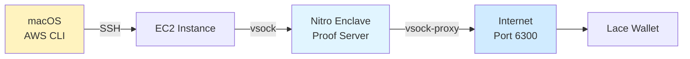

# AWS Nitro Quick Start Guide

The **fastest** way to deploy Midnight Proof Server to AWS Nitro Enclaves using AWS CLI with SSO from macOS.

## Prerequisites

- [ ] AWS CLI v2 installed (`brew install awscli`)
- [ ] AWS SSO configured (`aws configure sso`)
- [ ] EC2 SSH key pair created
- [ ] Docker image built locally (optional)

## One-Command Deployment (from macOS)

```bash
cd ~/code/midnight-code/midnight-ledger/tee-proof-server-proto

# This handles ALL local steps:
# - Launches Nitro-enabled EC2 instance
# - Configures security groups
# - Optionally transfers Docker image
./scripts/deploy-from-macos.sh
```

The script will:
1. ✅ Check prerequisites (AWS CLI, SSO login)
2. ✅ Gather configuration (region, SSH key, instance type)
3. ✅ Launch EC2 instance with Nitro Enclave support
4. ✅ Configure security groups (SSH + port 6300)
5. ✅ Optionally save and transfer Docker image
6. ✅ Save instance details to `~/midnight-nitro-instance.txt`

## Then On EC2 Instance

After the script completes, SSH to EC2:

```bash
# SSH command is saved in ~/midnight-nitro-instance.txt
ssh -i ~/.ssh/your-key.pem ec2-user@YOUR_INSTANCE_IP
```

### On EC2: Install Dependencies

```bash
# Install Nitro CLI and Docker
sudo amazon-linux-extras install aws-nitro-enclaves-cli -y
sudo yum install aws-nitro-enclaves-cli-devel docker -y

# Configure enclave resources
sudo tee /etc/nitro_enclaves/allocator.yaml > /dev/null <<EOF
cpu_count: 2
memory_mib: 4096
EOF

# Start services
sudo systemctl restart nitro-enclaves-allocator
sudo systemctl enable --now docker

# Add user to groups
sudo usermod -aG ne,docker ec2-user

# Re-login for group changes
exit
```

Re-connect to EC2 after logout:

```bash
ssh -i ~/.ssh/your-key.pem ec2-user@YOUR_INSTANCE_IP
```

### On EC2: Deploy to Nitro

**Option A: Build on EC2 (Recommended)**

```bash
# Clone repo
git clone https://github.com/your-org/midnight-code.git
cd midnight-code/midnight-ledger/tee-proof-server-proto

# Build and deploy in one command
./scripts/aws-nitro-deploy.sh --build
```

**Option B: Use Transferred Image**

```bash
# Load image (if transferred via deploy-from-macos.sh)
gunzip midnight-proof-server.tar.gz
docker load < midnight-proof-server.tar

# Clone repo for deployment script
git clone https://github.com/your-org/midnight-code.git
cd midnight-code/midnight-ledger/tee-proof-server-proto

# Deploy to Nitro
./scripts/aws-nitro-deploy.sh
```

### On EC2: Setup Network Access

```bash
# Install vsock-proxy
sudo yum install -y vsock-proxy

# Get enclave CID
ENCLAVE_CID=$(nitro-cli describe-enclaves | jq -r '.[0].EnclaveCID')

# Start proxy (forwards host:6300 to enclave:6300)
nohup vsock-proxy 6300 vsock://${ENCLAVE_CID}:6300 > /tmp/vsock-proxy.log 2>&1 &

# Test locally
curl http://localhost:6300/health
```

## Test from macOS

```bash
# Get your instance IP
PUBLIC_IP=$(cat ~/midnight-nitro-instance.txt | grep "Public IP" | cut -d' ' -f3)

# Test proof server
curl http://${PUBLIC_IP}:6300/health
curl http://${PUBLIC_IP}:6300/version
curl http://${PUBLIC_IP}:6300/attestation | jq
```

## Success Checklist

- [ ] EC2 instance launched with Enclave support
- [ ] Nitro CLI and Docker installed
- [ ] Enclave running: `nitro-cli describe-enclaves`
- [ ] vsock proxy running: `ps aux | grep vsock-proxy`
- [ ] Local test passes: `curl localhost:6300/health` (on EC2)
- [ ] Remote test passes: `curl PUBLIC_IP:6300/health` (from macOS)

## Architecture



## Management Commands

**From macOS:**

```bash
# Get instance details
cat ~/midnight-nitro-instance.txt

# SSH to instance
PUBLIC_IP=$(cat ~/midnight-nitro-instance.txt | grep "Public IP" | cut -d' ' -f3)
ssh -i ~/.ssh/your-key.pem ec2-user@${PUBLIC_IP}

# Terminate instance (when done)
INSTANCE_ID=$(cat ~/midnight-nitro-instance.txt | grep "Instance ID" | cut -d' ' -f3)
aws ec2 terminate-instances --instance-ids $INSTANCE_ID
```

**On EC2:**

```bash
# View enclave status
nitro-cli describe-enclaves

# View enclave logs
ENCLAVE_ID=$(nitro-cli describe-enclaves | jq -r '.[0].EnclaveID')
nitro-cli console --enclave-id $ENCLAVE_ID

# Restart enclave
nitro-cli terminate-enclave --enclave-id $ENCLAVE_ID
./scripts/aws-nitro-deploy.sh

# Check vsock proxy
ps aux | grep vsock-proxy
```

## Troubleshooting

| Problem | Solution |
|---------|----------|
| AWS SSO login expired | `aws sso login --profile YOUR_PROFILE` |
| Instance not launching | Check AWS quotas for instance type |
| Can't SSH | Wait 30s after launch, check security group |
| nitro-cli not found | Install: `sudo amazon-linux-extras install aws-nitro-enclaves-cli` |
| Enclave won't start | Check allocator: `cat /etc/nitro_enclaves/allocator.yaml` |
| Can't access port 6300 | Check vsock-proxy running, check security group |
| "Permission denied" errors | Re-login after adding user to groups |

## Complete Documentation

- **AWS-NITRO-DEPLOYMENT.md** - Full deployment guide with all details
- **DEPLOYMENT-CHECKLIST.md** - Step-by-step checklist
- **BUILD-REFERENCE.md** - Build commands reference

## Estimated Time

- macOS setup: 5 minutes
- EC2 launch: 2 minutes
- EC2 configuration: 5 minutes
- Docker build (on EC2): 3-5 minutes
- Nitro deployment: 2 minutes
- **Total: ~15-20 minutes**

## Cost Estimate

**c6i.2xlarge** in us-east-1:
- On-demand: $0.34/hour (~$245/month)
- 1-year Reserved: ~$170/month (40% savings)
- 3-year Reserved: ~$115/month (70% savings)

**Recommended:** Use Reserved Instance or Savings Plan for production.

## Security Checklist

- [ ] Restrict SSH (port 22) to your IP only
- [ ] Enable authentication: `MIDNIGHT_PROOF_SERVER_DISABLE_AUTH=false`
- [ ] Set API key: `MIDNIGHT_PROOF_SERVER_API_KEY=...`
- [ ] Use HTTPS with ALB or nginx reverse proxy
- [ ] Enable CloudWatch logging
- [ ] Document PCR values for client verification
- [ ] Regular updates and patches

## Quick Commands Summary

**All Local (macOS):**
```bash
# Deploy
./scripts/deploy-from-macos.sh

# Test
PUBLIC_IP=$(cat ~/midnight-nitro-instance.txt | grep "Public IP" | cut -d' ' -f3)
curl http://${PUBLIC_IP}:6300/health

# Cleanup
INSTANCE_ID=$(cat ~/midnight-nitro-instance.txt | grep "Instance ID" | cut -d' ' -f3)
aws ec2 terminate-instances --instance-ids $INSTANCE_ID
```

**All Remote (EC2):**
```bash
# Build & deploy
git clone https://github.com/your-org/midnight-code.git
cd midnight-code/midnight-ledger/tee-proof-server-proto
./scripts/aws-nitro-deploy.sh --build

# Setup proxy
sudo yum install -y vsock-proxy
ENCLAVE_CID=$(nitro-cli describe-enclaves | jq -r '.[0].EnclaveCID')
nohup vsock-proxy 6300 vsock://${ENCLAVE_CID}:6300 > /tmp/vsock-proxy.log 2>&1 &

# Test
curl http://localhost:6300/health
```

---

**Quick Reference:**
- 💻 = Run on macOS
- 📦 = Run on EC2
- ⚠️ = Important/Required step
- ✅ = Verification step
