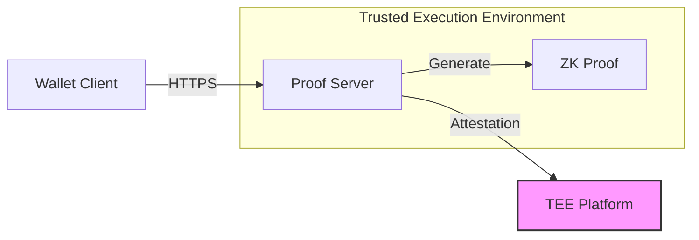

# Midnight TEE Proof Server

[]()
[]()

A production-grade zero-knowledge proof server for the Midnight blockchain, designed to run in Trusted Execution Environments (TEEs) with cryptographic attestation support.

## Overview

The Midnight TEE Proof Server enables secure, verifiable zero-knowledge proof generation for the Midnight blockchain. It runs within isolated compute environments (AWS Nitro Enclaves, GCP Confidential VMs, Azure Confidential VMs) to ensure proof integrity and prevent manipulation.

### Key Features

- **TEE Support** - AWS Nitro, GCP Confidential VMs, Azure Confidential VMs
- **Cryptographic Attestation** - Verifiable proof of execution environment
- **High Performance** - Multi-threaded worker pool with async I/O
- **Production Ready** - Rate limiting, authentication, monitoring
- **Zero Trust** - No persistent storage, memory encryption

## Quick Start

### Prerequisites

- Rust 1.75 or later
- **This project is part of the midnight-ledger repository**
- All Midnight ledger dependencies are automatically available within the workspace
- 16+ CPU cores recommended for production

### Clone the Repository

```bash
# Clone the midnight-ledger repository
git clone https://github.com/midnight/midnight-ledger.git
cd midnight-ledger/tee-proof-server-proto
```

### Build

```bash
# From the tee-proof-server-proto directory
./build.sh

# Or build from the workspace root
cd ..
cargo build --release -p midnight-proof-server-prototype
```

### Run

```bash
# Development mode (no authentication)
./proof-server/target/release/midnight-proof-server-prototype \
  --port 6300 \
  --disable-auth

# Production mode (with API key)
./proof-server/target/release/midnight-proof-server-prototype \
  --port 6300 \
  --api-key "your-secure-api-key-here"
```

### Test

```bash
# Run all tests
./test-server.sh

# Test specific endpoint
./test-prove-endpoint.sh
```

## Architecture



The server runs entirely within a TEE, ensuring:
- Memory encryption at rest and in transit
- No persistent storage access
- Cryptographic attestation of code identity
- Isolation from host operating system

## Project Structure

```
tee-prover-proto/
├── proof-server/          # Core proof server implementation
│   ├── src/
│   │   ├── main.rs        # Server entry point
│   │   ├── lib.rs         # API endpoints and routing
│   │   ├── attestation.rs # TEE attestation logic
│   │   └── worker_pool.rs # Proof generation workers
│   └── Cargo.toml         # Dependencies
├── tools/                 # Operational tools
│   └── diagnose.sh        # System diagnostics
├── docs/                  # Documentation
│   ├── deployment-overview.md
│   ├── deploy-aws-nitro.md
│   ├── deploy-gcp-confidential.md
│   ├── deploy-azure-confidential.md
│   ├── operations-monitoring.md
│   ├── troubleshooting.md
│   └── pcr-publication-guide.md
├── build.sh              # Build script
├── test-server.sh        # Integration tests
└── test-prove-endpoint.sh # Proof endpoint tests
```

## API Endpoints

### Core Endpoints

- `GET /health` - Health check
- `GET /version` - Server version information
- `POST /prove` - Generate zero-knowledge proof
- `GET /attestation` - Get TEE attestation document

### Example: Health Check

```bash
curl http://localhost:6300/health
# Response: {"status":"ok","timestamp":"2025-12-19T..."}
```

### Example: Attestation

```bash
curl "http://localhost:6300/attestation?nonce=$(openssl rand -hex 32)"
# Response: {"platform":"AWS Nitro Enclaves","format":"CBOR","attestation":"...","nonce":"..."}
```

### Example: Proof Generation

```bash
curl -X POST http://localhost:6300/prove \
  -H "Content-Type: application/json" \
  -H "X-API-Key: your-api-key" \
  -d '{"transaction":"base64-encoded-tx-data"}'
```

See [proof-server/README.md](proof-server/README.md) for complete API documentation.

## Deployment

### Cloud TEE Platforms

Choose your deployment platform:

- **[AWS Nitro Enclaves](docs/deploy-aws-nitro.md)** - Recommended for AWS infrastructure
- **[GCP Confidential VMs](docs/deploy-gcp-confidential.md)** - Recommended for GCP infrastructure
- **[Azure Confidential VMs](docs/deploy-azure-confidential.md)** - Recommended for Azure infrastructure

See [Deployment Overview](docs/deployment-overview.md) for platform comparison.

### Verification

All production deployments publish PCR (Platform Configuration Register) values that allow clients to cryptographically verify the server is running authentic, unmodified code.

See [PCR Publication Guide](docs/pcr-publication-guide.md) for details.

## Configuration

### Environment Variables

| Variable | Description | Default |
|----------|-------------|---------|
| `MIDNIGHT_PROOF_SERVER_PORT` | Server port | `6300` |
| `MIDNIGHT_PROOF_SERVER_API_KEY` | API authentication key(s) | None (required) |
| `MIDNIGHT_PROOF_SERVER_DISABLE_AUTH` | Disable auth (dev only) | `false` |
| `MIDNIGHT_PROOF_SERVER_RATE_LIMIT` | Requests/sec per IP | `10` |
| `MIDNIGHT_PROOF_SERVER_NUM_WORKERS` | Worker threads | `16` |
| `MIDNIGHT_PROOF_SERVER_MAX_PAYLOAD_SIZE` | Max request size (bytes) | `10485760` (10MB) |

### Command Line Options

```bash
./midnight-proof-server-prototype --help
```

See [proof-server/README.md](proof-server/README.md) for complete configuration options.

## Monitoring & Operations

### Health Monitoring

```bash
# Basic health check
curl http://localhost:6300/health

# Detailed diagnostics
./tools/diagnose.sh
```

### Logs

The server uses structured JSON logging via `tracing`. Configure log levels:

```bash
export RUST_LOG=info  # or debug, warn, error
```

### Metrics

See [Operations & Monitoring Guide](docs/operations-monitoring.md) for:
- CloudWatch integration
- Custom metrics
- Alerting setup
- Performance tuning

## Security

### Authentication

Production deployments **MUST** use API key authentication:

```bash
# Generate secure API key
openssl rand -base64 32

# Use in server
export MIDNIGHT_PROOF_SERVER_API_KEY="your-generated-key"
./midnight-proof-server-prototype
```

### Rate Limiting

Built-in per-IP rate limiting prevents abuse:

```bash
# 10 requests/second (default)
./midnight-proof-server-prototype --rate-limit 10
```

### TEE Security

- Memory encryption enforced
- No persistent storage access
- Cryptographic attestation enabled
- Debug mode disabled in production

**⚠️ CRITICAL:** Never run with `--disable-auth` in production!

## Troubleshooting

### Common Issues

1. **Server won't start**
   - Check Midnight ledger dependencies are installed
   - Verify port 6300 is available: `lsof -i :6300`
   - Check logs: `RUST_LOG=debug ./midnight-proof-server-prototype`

2. **Attestation fails**
   - Ensure running in a supported TEE environment
   - Check platform detection logs
   - See [Troubleshooting Guide](docs/troubleshooting.md)

3. **Performance issues**
   - Increase worker threads: `--num-workers 32`
   - Monitor CPU/memory with `./tools/diagnose.sh`
   - See [Operations Guide](docs/operations-monitoring.md)

### Getting Help

- 📖 [Troubleshooting Guide](docs/troubleshooting.md)
- 📖 [Debugging Guide](docs/debugging-guide.md)

## Development

### Running Tests

```bash
# Unit tests
cd proof-server
cargo test

# Integration tests
./test-server.sh

# Automated test suite
./automated-test.sh
```

5. 

## Version History

- **v6.2.0-alpha.1** (Current)
  - Initial TEE-enabled proof server
  - Multi-platform attestation support
  - Worker pool implementation
  - Production security features

---

**⚠️ IMPORTANT:** This is an alpha release. Do not use in production without proper security review and testing.
