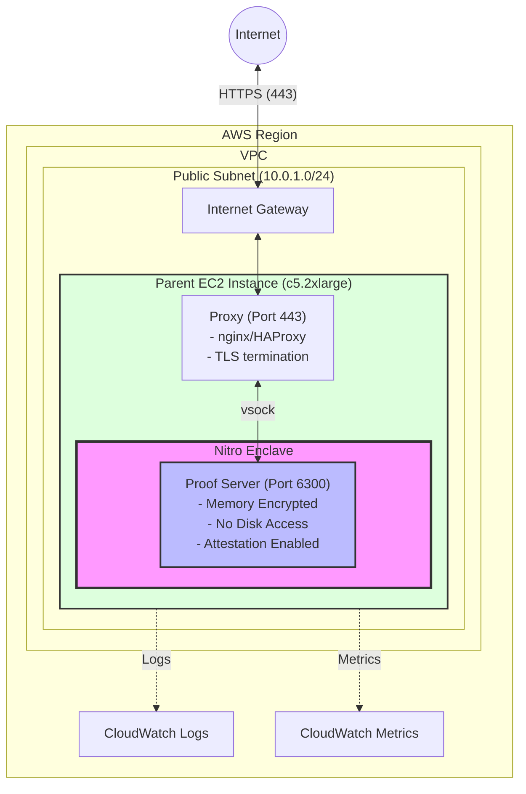
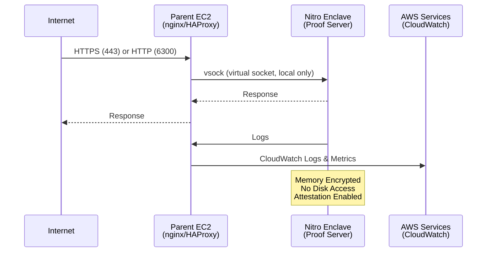

# AWS Nitro Enclaves Deployment Guide

## Guide to Deploying Midnight TEE Proof Server on AWS Nitro Enclaves

❌❌❌❌❌❌❌❌❌❌❌❌❌❌❌❌❌❌❌❌❌❌❌❌❌❌❌❌❌❌❌❌❌❌❌❌❌❌

## DANGER ZONE: All of the below is experimental, not yet tested ##

❌❌❌❌❌❌❌❌❌❌❌❌❌❌❌❌❌❌❌❌❌❌❌❌❌❌❌❌❌❌❌❌❌❌❌❌❌

## Document Control

| Version | Date       | Author               | Changes       |
| ------- | ---------- | -------------------- | ------------- |
| 1.0     | 2025-12-19 | Bob Blessing-Hartley | Initial draft |


---

## Table of Contents

1. [Overview](#overview)
2. [Prerequisites](#prerequisites)
3. [Architecture](#architecture)
4. [Step-by-Step Deployment](#step-by-step-deployment)
5. [PCR Extraction and Publication](#pcr-extraction-and-publication)
6. [Monitoring and Logging](#monitoring-and-logging)
7. [Security Best Practices](#security-best-practices)
8. [Cost Optimization](#cost-optimization)
9. [Troubleshooting](#troubleshooting)
10. [Maintenance and Updates](#maintenance-and-updates)

---

## Overview

AWS Nitro Enclaves provide isolated compute environments with cryptographic attestation. This guide covers deploying the Midnight Proof Server in a Nitro Enclave for maximum security.

### What You'll Deploy

- **Parent EC2 Instance** - Hosts the enclave and manages networking
- **Nitro Enclave** - Isolated environment running the proof server
- **Network Infrastructure** - VPC, subnets, security groups
- **Monitoring** - CloudWatch logs and metrics
- **Optional:** Application Load Balancer, Auto Scaling

### Key Benefits

✅ **Hardware-based isolation** - Memory encryption by AWS Nitro silicon
✅ **Cryptographic attestation** - Prove to users what code is running
✅ **No persistent storage** - Enclave has no disk access
✅ **Auditable** - PCR values prove exact code version

---

## Prerequisites

### 1. AWS Account Requirements

- AWS account with appropriate permissions
- IAM user or role with these policies:
  - `AmazonEC2FullAccess`
  - `AmazonVPCFullAccess`
  - `CloudWatchLogsFullAccess`
  - `IAMReadOnlyAccess`

### 2. Local Tools

```bash
# Install AWS CLI
brew install awscli  # macOS
# or
pip install awscli  # Linux/Windows

# Configure AWS CLI
aws configure
# Enter: Access Key ID, Secret Access Key, Region (e.g., us-east-1), Output format (json)

# Verify setup
aws sts get-caller-identity

# Install Nitro CLI (on your local machine for testing)
brew tap aws/tap
brew install aws-nitro-enclaves-cli
```

### 3. Required Files

Ensure you have:
- ✅ Proof server source code (`.`)
- ✅ Dockerfile for enclave build
- ✅ GPG key for signing PCRs (or generate one)

### 4. Knowledge Prerequisites

- Basic AWS experience (EC2, VPC, security groups)
- Docker fundamentals
- Linux command line
- SSH and key management

---

## Architecture

### High-Level Architecture



### Communication Flow



---

## Step-by-Step Deployment

### Phase 1: Infrastructure Setup (30 minutes)

#### Step 1.1: Create VPC and Networking

```bash
# Set variables
export AWS_REGION="us-east-1"
export PROJECT_NAME="midnight-proof-server"
export VPC_CIDR="10.0.0.0/16"
export SUBNET_CIDR="10.0.1.0/24"

# Create VPC
VPC_ID=$(aws ec2 create-vpc \
  --cidr-block $VPC_CIDR \
  --region $AWS_REGION \
  --tag-specifications "ResourceType=vpc,Tags=[{Key=Name,Value=$PROJECT_NAME-vpc}]" \
  --query 'Vpc.VpcId' \
  --output text)

echo "VPC ID: $VPC_ID"

# Enable DNS hostnames
aws ec2 modify-vpc-attribute \
  --vpc-id $VPC_ID \
  --enable-dns-hostnames \
  --region $AWS_REGION

# Create Internet Gateway
IGW_ID=$(aws ec2 create-internet-gateway \
  --region $AWS_REGION \
  --tag-specifications "ResourceType=internet-gateway,Tags=[{Key=Name,Value=$PROJECT_NAME-igw}]" \
  --query 'InternetGateway.InternetGatewayId' \
  --output text)

echo "Internet Gateway ID: $IGW_ID"

# Attach IGW to VPC
aws ec2 attach-internet-gateway \
  --vpc-id $VPC_ID \
  --internet-gateway-id $IGW_ID \
  --region $AWS_REGION

# Create Public Subnet
SUBNET_ID=$(aws ec2 create-subnet \
  --vpc-id $VPC_ID \
  --cidr-block $SUBNET_CIDR \
  --availability-zone ${AWS_REGION}a \
  --region $AWS_REGION \
  --tag-specifications "ResourceType=subnet,Tags=[{Key=Name,Value=$PROJECT_NAME-public-subnet}]" \
  --query 'Subnet.SubnetId' \
  --output text)

echo "Subnet ID: $SUBNET_ID"

# Enable auto-assign public IP
aws ec2 modify-subnet-attribute \
  --subnet-id $SUBNET_ID \
  --map-public-ip-on-launch \
  --region $AWS_REGION

# Create Route Table
RTB_ID=$(aws ec2 create-route-table \
  --vpc-id $VPC_ID \
  --region $AWS_REGION \
  --tag-specifications "ResourceType=route-table,Tags=[{Key=Name,Value=$PROJECT_NAME-public-rtb}]" \
  --query 'RouteTable.RouteTableId' \
  --output text)

echo "Route Table ID: $RTB_ID"

# Create route to Internet Gateway
aws ec2 create-route \
  --route-table-id $RTB_ID \
  --destination-cidr-block 0.0.0.0/0 \
  --gateway-id $IGW_ID \
  --region $AWS_REGION

# Associate Route Table with Subnet
aws ec2 associate-route-table \
  --subnet-id $SUBNET_ID \
  --route-table-id $RTB_ID \
  --region $AWS_REGION
```

#### Step 1.2: Create Security Group

```bash
# Create Security Group
SG_ID=$(aws ec2 create-security-group \
  --group-name $PROJECT_NAME-sg \
  --description "Security group for Midnight Proof Server" \
  --vpc-id $VPC_ID \
  --region $AWS_REGION \
  --query 'GroupId' \
  --output text)

echo "Security Group ID: $SG_ID"

# Allow HTTPS (443)
aws ec2 authorize-security-group-ingress \
  --group-id $SG_ID \
  --protocol tcp \
  --port 443 \
  --cidr 0.0.0.0/0 \
  --region $AWS_REGION

# Allow HTTP (6300) - for testing, remove in production
aws ec2 authorize-security-group-ingress \
  --group-id $SG_ID \
  --protocol tcp \
  --port 6300 \
  --cidr 0.0.0.0/0 \
  --region $AWS_REGION

# Allow SSH (22) - restrict to your IP in production
aws ec2 authorize-security-group-ingress \
  --group-id $SG_ID \
  --protocol tcp \
  --port 22 \
  --cidr 0.0.0.0/0 \
  --region $AWS_REGION

echo "Security Group configured"
```

#### Step 1.3: Create EC2 Key Pair

```bash
# Create key pair
aws ec2 create-key-pair \
  --key-name $PROJECT_NAME-keypair \
  --region $AWS_REGION \
  --query 'KeyMaterial' \
  --output text > ~/.ssh/$PROJECT_NAME-keypair.pem

# Set permissions
chmod 400 ~/.ssh/$PROJECT_NAME-keypair.pem

echo "Key pair created: ~/.ssh/$PROJECT_NAME-keypair.pem"
```

---

### Phase 2: Build Enclave Image (45 minutes)

#### Step 2.1: Create Dockerfile for Enclave

Create `Dockerfile.enclave` in the proof server directory:

```dockerfile
# Dockerfile.enclave - Optimized for AWS Nitro Enclaves
FROM rust:1.75-slim as builder

# Install dependencies
RUN apt-get update && apt-get install -y \
    pkg-config \
    libssl-dev \
    build-essential \
    && rm -rf /var/lib/apt/lists/*

# Set working directory
WORKDIR /app

# Copy source code
COPY . .

# Build release binary
RUN cargo build --release --bin midnight-proof-server-prototype

# Runtime stage - minimal image
FROM debian:bookworm-slim

# Install runtime dependencies
RUN apt-get update && apt-get install -y \
    ca-certificates \
    libssl3 \
    && rm -rf /var/lib/apt/lists/*

# Copy binary from builder
COPY --from=builder /app/target/release/midnight-proof-server-prototype /usr/local/bin/

# Create non-root user
RUN useradd -m -u 1000 proofserver && \
    chown -R proofserver:proofserver /usr/local/bin

USER proofserver

# Expose port
EXPOSE 6300

# Health check
HEALTHCHECK --interval=30s --timeout=5s --start-period=60s --retries=3 \
    CMD curl -f http://localhost:6300/health || exit 1

# Run server
ENTRYPOINT ["/usr/local/bin/midnight-proof-server-prototype"]
CMD ["--port", "6300", "--disable-auth"]
```

#### Step 2.2: Build Docker Image Locally

```bash
cd ./proof-server

# Build Docker image
docker build -f Dockerfile.enclave -t midnight-proof-server:latest .

# Test the image locally
docker run -p 6300:6300 midnight-proof-server:latest &
sleep 10

# Test health endpoint
curl http://localhost:6300/health

# Stop test container
docker stop $(docker ps -q --filter ancestor=midnight-proof-server:latest)
```

#### Step 2.3: Launch Parent EC2 Instance

```bash
# Find latest Amazon Linux 2023 AMI with Nitro Enclaves support
AMI_ID=$(aws ec2 describe-images \
  --owners amazon \
  --filters "Name=name,Values=al2023-ami-*-x86_64" \
            "Name=state,Values=available" \
  --region $AWS_REGION \
  --query 'sort_by(Images, &CreationDate)[-1].ImageId' \
  --output text)

echo "Using AMI: $AMI_ID"

# Launch EC2 instance
# Note: c5.2xlarge provides good balance of CPU and enclave resources
INSTANCE_ID=$(aws ec2 run-instances \
  --image-id $AMI_ID \
  --instance-type c5.2xlarge \
  --key-name $PROJECT_NAME-keypair \
  --security-group-ids $SG_ID \
  --subnet-id $SUBNET_ID \
  --enclave-options 'Enabled=true' \
  --block-device-mappings '[{"DeviceName":"/dev/xvda","Ebs":{"VolumeSize":100,"VolumeType":"gp3"}}]' \
  --tag-specifications "ResourceType=instance,Tags=[{Key=Name,Value=$PROJECT_NAME-instance}]" \
  --region $AWS_REGION \
  --query 'Instances[0].InstanceId' \
  --output text)

echo "Instance ID: $INSTANCE_ID"

# Wait for instance to be running
echo "Waiting for instance to start..."
aws ec2 wait instance-running \
  --instance-ids $INSTANCE_ID \
  --region $AWS_REGION

# Get public IP
PUBLIC_IP=$(aws ec2 describe-instances \
  --instance-ids $INSTANCE_ID \
  --region $AWS_REGION \
  --query 'Reservations[0].Instances[0].PublicIpAddress' \
  --output text)

echo "Instance Public IP: $PUBLIC_IP"
echo "SSH command: ssh -i ~/.ssh/$PROJECT_NAME-keypair.pem ec2-user@$PUBLIC_IP"
```

#### Step 2.4: Setup Parent Instance

```bash
# SSH into instance
ssh -i ~/.ssh/$PROJECT_NAME-keypair.pem ec2-user@$PUBLIC_IP

# Once on the instance, run these commands:

# Install Docker
sudo yum install -y docker
sudo systemctl start docker
sudo systemctl enable docker
sudo usermod -a -G docker ec2-user

# Install Nitro CLI
sudo yum install -y aws-nitro-enclaves-cli aws-nitro-enclaves-cli-devel

# Configure Nitro Enclaves allocator
# Allocate 24GB RAM and 8 CPUs to enclave
sudo sed -i 's/^memory_mib:.*/memory_mib: 24576/' /etc/nitro_enclaves/allocator.yaml
sudo sed -i 's/^cpu_count:.*/cpu_count: 8/' /etc/nitro_enclaves/allocator.yaml

# Enable and start Nitro Enclaves allocator
sudo systemctl start nitro-enclaves-allocator.service
sudo systemctl enable nitro-enclaves-allocator.service

# Verify allocator
nitro-cli describe-enclaves

# Re-login to apply docker group membership
exit
```

#### Step 2.5: Transfer and Build Enclave Image

```bash
# Back on your local machine - create a tarball
cd .
tar -czf proof-server.tar.gz proof-server/

# Transfer to EC2
scp -i ~/.ssh/$PROJECT_NAME-keypair.pem proof-server.tar.gz ec2-user@$PUBLIC_IP:~/

# SSH back into instance
ssh -i ~/.ssh/$PROJECT_NAME-keypair.pem ec2-user@$PUBLIC_IP

# Extract and build
tar -xzf proof-server.tar.gz
cd proof-server

# Build Docker image
docker build -f Dockerfile.enclave -t midnight-proof-server:latest .

# Build Nitro Enclave Image (.eif file)
nitro-cli build-enclave \
  --docker-uri midnight-proof-server:latest \
  --output-file midnight-proof-server.eif

# This will output PCR values - SAVE THESE!
# Example output:
# Enclave Image successfully created.
# {
#   "Measurements": {
#     "HashAlgorithm": "Sha384 { ... }",
#     "PCR0": "abc123...",
#     "PCR1": "def456...",
#     "PCR2": "789xyz..."
#   }
# }

# Save measurements to file
nitro-cli describe-eif --eif-path midnight-proof-server.eif > pcr-measurements.json
```

---

### Phase 3: Run Enclave (15 minutes)

#### Step 3.1: Start the Enclave

```bash
# On the parent EC2 instance

# Run the enclave
# - 24GB RAM (24576 MB)
# - 8 vCPUs
# - Debug mode OFF (critical for production)
nitro-cli run-enclave \
  --eif-path midnight-proof-server.eif \
  --memory 24576 \
  --cpu-count 8 \
  --enclave-cid 16 \
  --debug-mode false

# Verify enclave is running
nitro-cli describe-enclaves

# Should show:
# [
#   {
#     "EnclaveID": "i-xxxxx-enc-yyyyy",
#     "ProcessID": 12345,
#     "EnclaveCID": 16,
#     "NumberOfCPUs": 8,
#     "CPUIDs": [...],
#     "MemoryMiB": 24576,
#     "State": "RUNNING",
#     "Flags": "NONE"
#   }
# ]
```

#### Step 3.2: Setup vsock Proxy

Create `/home/ec2-user/vsock-proxy.sh`:

```bash
#!/bin/bash
# vsock-proxy.sh - Proxy requests from parent to enclave

# Install socat if not present
if ! command -v socat &> /dev/null; then
    sudo yum install -y socat
fi

# Forward port 6300 from parent to enclave CID 16, port 6300
socat TCP-LISTEN:6300,reuseaddr,fork VSOCK-CONNECT:16:6300 &

echo "vsock proxy started (PID: $!)"
echo "Parent port 6300 -> Enclave CID 16 port 6300"
```

```bash
# Make executable and run
chmod +x /home/ec2-user/vsock-proxy.sh
/home/ec2-user/vsock-proxy.sh
```

#### Step 3.3: Test the Enclave

```bash
# On parent instance - test via vsock proxy
curl http://localhost:6300/health

# Should return:
# {"status":"ok","timestamp":"2025-12-18T..."}

# Test version
curl http://localhost:6300/version

# Test from outside (on your local machine)
curl http://$PUBLIC_IP:6300/health
```

---

### Phase 4: TLS/SSL Setup (20 minutes)

#### Step 4.1: Install nginx

```bash
# On parent EC2 instance
sudo yum install -y nginx

# Create nginx config
sudo tee /etc/nginx/conf.d/proof-server.conf > /dev/null <<'EOF'
upstream proof_server {
    server 127.0.0.1:6300;
}

server {
    listen 80;
    server_name proof.example.com;  # Change to your domain

    # Redirect to HTTPS
    return 301 https://$server_name$request_uri;
}

server {
    listen 443 ssl http2;
    server_name proof.example.com;  # Change to your domain

    # SSL certificates (will be configured with certbot)
    ssl_certificate /etc/letsencrypt/live/proof.example.com/fullchain.pem;
    ssl_certificate_key /etc/letsencrypt/live/proof.example.com/privkey.pem;

    # SSL settings
    ssl_protocols TLSv1.2 TLSv1.3;
    ssl_ciphers HIGH:!aNULL:!MD5;
    ssl_prefer_server_ciphers on;

    # Security headers
    add_header Strict-Transport-Security "max-age=31536000; includeSubDomains" always;
    add_header X-Content-Type-Options "nosniff" always;
    add_header X-Frame-Options "DENY" always;

    # Proxy settings
    location / {
        proxy_pass http://proof_server;
        proxy_http_version 1.1;
        proxy_set_header Upgrade $http_upgrade;
        proxy_set_header Connection 'upgrade';
        proxy_set_header Host $host;
        proxy_set_header X-Real-IP $remote_addr;
        proxy_set_header X-Forwarded-For $proxy_add_x_forwarded_for;
        proxy_set_header X-Forwarded-Proto $scheme;
        proxy_cache_bypass $http_upgrade;

        # Timeouts for long-running proof generation
        proxy_connect_timeout 660s;
        proxy_send_timeout 660s;
        proxy_read_timeout 660s;
    }

    # Health check endpoint
    location /health {
        proxy_pass http://proof_server/health;
        access_log off;
    }
}
EOF
```

#### Step 4.2: Install SSL Certificate (Let's Encrypt)

```bash
# Install certbot
sudo yum install -y certbot python3-certbot-nginx

# Obtain certificate (replace with your domain)
sudo certbot --nginx -d proof.example.com --non-interactive --agree-tos -m admin@example.com

# Test renewal
sudo certbot renew --dry-run

# Enable auto-renewal
sudo systemctl enable certbot-renew.timer
```

#### Step 4.3: Start nginx

```bash
# Start nginx
sudo systemctl start nginx
sudo systemctl enable nginx

# Test
curl https://proof.example.com/health
```

---

## PCR Extraction and Publication

### Step 1: Extract PCR Values

```bash
# On parent EC2 instance
cd /home/ec2-user/proof-server

# PCR values were saved during build
cat pcr-measurements.json

# Example output:
# {
#   "Measurements": {
#     "HashAlgorithm": "Sha384 { ... }",
#     "PCR0": "abc123def456...",  # Enclave image hash
#     "PCR1": "789012abc345...",  # Kernel hash
#     "PCR2": "def678ghi901..."   # Application hash
#   }
# }
```

### Step 2: Format for Publication

Create `pcr-values.json`:

```json
{
  "version": "6.2.0-alpha.1",
  "build_date": "2025-12-18",
  "platform": "aws-nitro",
  "instance_type": "c5.2xlarge",
  "pcrs": {
    "0": "abc123def456...",
    "1": "789012abc345...",
    "2": "def678ghi901..."
  },
  "enclave_config": {
    "memory_mib": 24576,
    "cpu_count": 8,
    "debug_mode": false
  },
  "docker_image": {
    "name": "midnight-proof-server",
    "tag": "latest",
    "digest": "sha256:..."
  }
}
```

### Step 3: Sign with GPG

```bash
# If you don't have a GPG key, create one
gpg --full-generate-key
# Choose RSA, 4096 bits, no expiration
# Name: Midnight Proof Server
# Email: security@example.com

# Sign the PCR file
gpg --armor --detach-sign pcr-values.json

# This creates pcr-values.json.asc

# Export public key for verification
gpg --armor --export security@example.com > midnight-proof-server-pubkey.asc
```

### Step 4: Publish to GitHub

```bash
# Create GitHub release with PCR values
gh release create v6.2.0-alpha.1 \
  pcr-values.json \
  pcr-values.json.asc \
  midnight-proof-server-pubkey.asc \
  --title "Midnight Proof Server v6.2.0-alpha.1 - AWS Nitro" \
  --notes "AWS Nitro Enclave deployment

## PCR Values
See attached \`pcr-values.json\` for complete PCR measurements.

## Verification
\`\`\`bash
# Download files
wget https://github.com/midnight/proof-server/releases/download/v6.2.0-alpha.1/pcr-values.json
wget https://github.com/midnight/proof-server/releases/download/v6.2.0-alpha.1/pcr-values.json.asc
wget https://github.com/midnight/proof-server/releases/download/v6.2.0-alpha.1/midnight-proof-server-pubkey.asc

# Import public key
gpg --import midnight-proof-server-pubkey.asc

# Verify signature
gpg --verify pcr-values.json.asc pcr-values.json
\`\`\`
"
```

---

## Monitoring and Logging

### CloudWatch Logs Setup

```bash
# Install CloudWatch agent on parent instance
sudo yum install -y amazon-cloudwatch-agent

# Create CloudWatch config
sudo tee /opt/aws/amazon-cloudwatch-agent/etc/config.json > /dev/null <<'EOF'
{
  "logs": {
    "logs_collected": {
      "files": {
        "collect_list": [
          {
            "file_path": "/var/log/messages",
            "log_group_name": "/aws/ec2/midnight-proof-server/system",
            "log_stream_name": "{instance_id}"
          },
          {
            "file_path": "/var/log/nginx/access.log",
            "log_group_name": "/aws/ec2/midnight-proof-server/nginx-access",
            "log_stream_name": "{instance_id}"
          },
          {
            "file_path": "/var/log/nginx/error.log",
            "log_group_name": "/aws/ec2/midnight-proof-server/nginx-error",
            "log_stream_name": "{instance_id}"
          }
        ]
      }
    }
  },
  "metrics": {
    "namespace": "MidnightProofServer",
    "metrics_collected": {
      "cpu": {
        "measurement": [
          {
            "name": "cpu_usage_idle",
            "rename": "CPU_IDLE",
            "unit": "Percent"
          }
        ],
        "metrics_collection_interval": 60
      },
      "disk": {
        "measurement": [
          {
            "name": "used_percent",
            "rename": "DISK_USED",
            "unit": "Percent"
          }
        ],
        "metrics_collection_interval": 60
      },
      "mem": {
        "measurement": [
          {
            "name": "mem_used_percent",
            "rename": "MEM_USED",
            "unit": "Percent"
          }
        ],
        "metrics_collection_interval": 60
      }
    }
  }
}
EOF

# Start CloudWatch agent
sudo /opt/aws/amazon-cloudwatch-agent/bin/amazon-cloudwatch-agent-ctl \
  -a fetch-config \
  -m ec2 \
  -s \
  -c file:/opt/aws/amazon-cloudwatch-agent/etc/config.json
```

### Enclave Logging

```bash
# View enclave console logs
nitro-cli console --enclave-id $(nitro-cli describe-enclaves | jq -r '.[0].EnclaveID')

# Save logs to file
nitro-cli console --enclave-id $(nitro-cli describe-enclaves | jq -r '.[0].EnclaveID') > enclave.log &
```

### Custom Metrics Script

Create `/home/ec2-user/monitor-enclave.sh`:

```bash
#!/bin/bash
# monitor-enclave.sh - Custom monitoring for enclave

ENCLAVE_ID=$(nitro-cli describe-enclaves | jq -r '.[0].EnclaveID')
NAMESPACE="MidnightProofServer"

while true; do
    # Check if enclave is running
    STATE=$(nitro-cli describe-enclaves | jq -r '.[0].State')

    if [ "$STATE" == "RUNNING" ]; then
        aws cloudwatch put-metric-data \
            --namespace $NAMESPACE \
            --metric-name EnclaveRunning \
            --value 1 \
            --region $AWS_REGION

        # Test health endpoint
        if curl -sf http://localhost:6300/health > /dev/null; then
            aws cloudwatch put-metric-data \
                --namespace $NAMESPACE \
                --metric-name HealthCheckSuccess \
                --value 1 \
                --region $AWS_REGION
        else
            aws cloudwatch put-metric-data \
                --namespace $NAMESPACE \
                --metric-name HealthCheckSuccess \
                --value 0 \
                --region $AWS_REGION
        fi
    else
        aws cloudwatch put-metric-data \
            --namespace $NAMESPACE \
            --metric-name EnclaveRunning \
            --value 0 \
            --region $AWS_REGION
    fi

    sleep 60
done
```

```bash
# Make executable and run in background
chmod +x /home/ec2-user/monitor-enclave.sh
nohup /home/ec2-user/monitor-enclave.sh > /dev/null 2>&1 &
```

---

## Security Best Practices

### 1. Network Security

```bash
# Restrict SSH access to your IP only
MY_IP=$(curl -s https://ifconfig.me)
aws ec2 revoke-security-group-ingress \
  --group-id $SG_ID \
  --protocol tcp \
  --port 22 \
  --cidr 0.0.0.0/0 \
  --region $AWS_REGION

aws ec2 authorize-security-group-ingress \
  --group-id $SG_ID \
  --protocol tcp \
  --port 22 \
  --cidr $MY_IP/32 \
  --region $AWS_REGION
```

### 2. IAM Role (Instead of API Keys)

```bash
# Create IAM role for EC2 instance
aws iam create-role \
  --role-name MidnightProofServerRole \
  --assume-role-policy-document '{
    "Version": "2012-10-17",
    "Statement": [{
      "Effect": "Allow",
      "Principal": {"Service": "ec2.amazonaws.com"},
      "Action": "sts:AssumeRole"
    }]
  }'

# Attach policies
aws iam attach-role-policy \
  --role-name MidnightProofServerRole \
  --policy-arn arn:aws:iam::aws:policy/CloudWatchAgentServerPolicy

# Create instance profile
aws iam create-instance-profile \
  --instance-profile-name MidnightProofServerProfile

aws iam add-role-to-instance-profile \
  --instance-profile-name MidnightProofServerProfile \
  --role-name MidnightProofServerRole

# Attach to instance
aws ec2 associate-iam-instance-profile \
  --instance-id $INSTANCE_ID \
  --iam-instance-profile Name=MidnightProofServerProfile \
  --region $AWS_REGION
```

### 3. Enable Debug Mode ONLY for Testing

**⚠️ CRITICAL:** Debug mode disables memory encryption!

```bash
# Production (secure)
nitro-cli run-enclave --debug-mode false ...

# Development ONLY
nitro-cli run-enclave --debug-mode true ...
```

### 4. Regular Updates

```bash
# Update parent instance
sudo yum update -y

# Rebuild enclave image regularly
# Update source code, rebuild Docker image, rebuild EIF
```

---

## Cost Optimization

### Estimated Monthly Costs (us-east-1)

| Resource | Configuration | Estimated Cost |
|----------|--------------|----------------|
| EC2 c5.2xlarge | On-Demand | $248/month |
| EC2 c5.2xlarge | 1-year Reserved | $155/month (37% savings) |
| EC2 c5.2xlarge | 3-year Reserved | $103/month (58% savings) |
| EBS gp3 100GB | Storage | $8/month |
| Data Transfer | 1TB/month | $90/month |
| CloudWatch Logs | 10GB/month | $5/month |
| **Total (On-Demand)** | | **~$351/month** |
| **Total (1-year Reserved)** | | **~$258/month** |

### Cost Optimization Tips

1. **Use Reserved Instances** - Save 37-58% with commitments
2. **Right-size Instance** - Start with c5.xlarge if traffic is low
3. **Use Spot Instances** - For non-production (60-90% savings)
4. **Optimize Data Transfer** - Use CloudFront for caching
5. **Log Retention** - Set to 30 days instead of indefinite

```bash
# Set log retention to 30 days
aws logs put-retention-policy \
  --log-group-name /aws/ec2/midnight-proof-server/system \
  --retention-in-days 30 \
  --region $AWS_REGION
```

---

## Troubleshooting

### Issue 1: Enclave Won't Start

**Symptoms:**
```
Error: Insufficient memory available
```

**Solution:**
```bash
# Check allocator config
cat /etc/nitro_enclaves/allocator.yaml

# Reduce memory allocation
sudo sed -i 's/^memory_mib:.*/memory_mib: 16384/' /etc/nitro_enclaves/allocator.yaml
sudo systemctl restart nitro-enclaves-allocator.service

# Try starting with less memory
nitro-cli run-enclave --memory 16384 --cpu-count 4 ...
```

### Issue 2: Cannot Connect to Enclave

**Symptoms:**
```
curl: (7) Failed to connect to localhost port 6300
```

**Solution:**
```bash
# Check enclave is running
nitro-cli describe-enclaves

# Check vsock proxy
ps aux | grep socat

# Restart vsock proxy
pkill socat
socat TCP-LISTEN:6300,reuseaddr,fork VSOCK-CONNECT:16:6300 &

# Test direct vsock connection
nitro-cli console --enclave-id $(nitro-cli describe-enclaves | jq -r '.[0].EnclaveID')
```

### Issue 3: High Memory Usage

**Symptoms:**
- Enclave crashes
- Out of memory errors

**Solution:**
```bash
# Check enclave memory allocation
nitro-cli describe-enclaves

# Increase memory allocation
nitro-cli terminate-enclave --enclave-id $(nitro-cli describe-enclaves | jq -r '.[0].EnclaveID')

sudo sed -i 's/^memory_mib:.*/memory_mib: 32768/' /etc/nitro_enclaves/allocator.yaml
sudo systemctl restart nitro-enclaves-allocator.service

nitro-cli run-enclave --memory 32768 --cpu-count 8 ...
```

### Issue 4: Attestation Document Invalid

**Symptoms:**
- Wallet verification fails
- PCR mismatch errors

**Solution:**
```bash
# Verify PCRs match published values
nitro-cli describe-eif --eif-path midnight-proof-server.eif

# Compare with published values
curl https://github.com/midnight/proof-server/releases/download/v6.2.0-alpha.1/pcr-values.json

# If mismatch, rebuild enclave image
docker build -f Dockerfile.enclave -t midnight-proof-server:latest .
nitro-cli build-enclave --docker-uri midnight-proof-server:latest --output-file midnight-proof-server.eif
```

### Issue 5: SSL Certificate Issues

**Symptoms:**
```
SSL certificate problem: unable to get local issuer certificate
```

**Solution:**
```bash
# Renew certificate
sudo certbot renew --force-renewal

# Check certificate validity
sudo certbot certificates

# Restart nginx
sudo systemctl restart nginx
```

---

## Maintenance and Updates

### Weekly Tasks

- [ ] Check CloudWatch logs for errors
- [ ] Verify enclave is running: `nitro-cli describe-enclaves`
- [ ] Test health endpoint: `curl https://proof.example.com/health`
- [ ] Check disk usage: `df -h`

### Monthly Tasks

- [ ] Update parent instance: `sudo yum update -y`
- [ ] Review CloudWatch costs
- [ ] Check SSL certificate expiration
- [ ] Review security group rules

### Quarterly Tasks

- [ ] Rebuild enclave with latest dependencies
- [ ] Publish new PCR values
- [ ] Security audit
- [ ] Cost optimization review

### Update Procedure

```bash
# 1. Build new enclave image
docker build -f Dockerfile.enclave -t midnight-proof-server:v6.3.0 .
nitro-cli build-enclave --docker-uri midnight-proof-server:v6.3.0 --output-file midnight-proof-server-v6.3.0.eif

# 2. Extract and publish new PCRs
nitro-cli describe-eif --eif-path midnight-proof-server-v6.3.0.eif > pcr-measurements-v6.3.0.json

# 3. Terminate old enclave
nitro-cli terminate-enclave --enclave-id $(nitro-cli describe-enclaves | jq -r '.[0].EnclaveID')

# 4. Start new enclave
nitro-cli run-enclave \
  --eif-path midnight-proof-server-v6.3.0.eif \
  --memory 24576 \
  --cpu-count 8 \
  --enclave-cid 16 \
  --debug-mode false

# 5. Verify
curl http://localhost:6300/health
curl http://localhost:6300/version
```

---

## Backup and Disaster Recovery

### Backup Strategy

```bash
# Create AMI of parent instance
aws ec2 create-image \
  --instance-id $INSTANCE_ID \
  --name "midnight-proof-server-backup-$(date +%Y%m%d)" \
  --description "Backup of Midnight Proof Server" \
  --region $AWS_REGION

# Backup enclave image
aws s3 cp midnight-proof-server.eif s3://your-backup-bucket/enclaves/midnight-proof-server-$(date +%Y%m%d).eif

# Backup configuration
tar -czf config-backup.tar.gz /etc/nginx /home/ec2-user/proof-server
aws s3 cp config-backup.tar.gz s3://your-backup-bucket/configs/
```

### Disaster Recovery

```bash
# Restore from backup
# 1. Launch new instance from AMI
# 2. Download enclave image from S3
# 3. Start enclave
# 4. Update DNS to point to new instance
```

---

## Production Checklist

Before going to production:

### Security
- [ ] Debug mode is **false**
- [ ] SSH restricted to specific IPs
- [ ] API keys properly configured
- [ ] SSL/TLS enabled
- [ ] Security groups properly configured
- [ ] IAM roles instead of API keys
- [ ] Regular security updates enabled

### Monitoring
- [ ] CloudWatch logs configured
- [ ] CloudWatch metrics enabled
- [ ] Custom enclave monitoring running
- [ ] Alerts configured for critical metrics
- [ ] Log retention policy set

### Operations
- [ ] PCR values published and signed
- [ ] Documentation complete
- [ ] Backup strategy implemented
- [ ] Disaster recovery plan documented
- [ ] On-call rotation established
- [ ] Runbooks created

### Performance
- [ ] Load testing completed
- [ ] Instance size appropriate for traffic
- [ ] Auto-scaling configured (if needed)
- [ ] CDN/caching considered

---

## Support and Resources

### AWS Resources
- [AWS Nitro Enclaves Documentation](https://docs.aws.amazon.com/enclaves/)
- [AWS Support](https://aws.amazon.com/support/)

### Midnight Resources
- [GitHub Repository](https://github.com/midnight/proof-server)
- [Discord Community](https://discord.gg/midnight)
- Email: ops@midnight.network

### Emergency Contacts
- AWS Support: Via AWS Console
- Midnight Ops Team: ops@midnight.network
- Security Issues: security@midnight.network

---

**Document Version:** 1.0
**Last Updated:** 2025-12-18
**Next Review:** 2026-01-18

---

## Quick Reference Commands

```bash
# Check enclave status
nitro-cli describe-enclaves

# View enclave logs
nitro-cli console --enclave-id $(nitro-cli describe-enclaves | jq -r '.[0].EnclaveID')

# Restart enclave
nitro-cli terminate-enclave --enclave-id $(nitro-cli describe-enclaves | jq -r '.[0].EnclaveID')
nitro-cli run-enclave --eif-path midnight-proof-server.eif --memory 24576 --cpu-count 8 --enclave-cid 16 --debug-mode false

# Test health
curl http://localhost:6300/health
curl https://proof.example.com/health

# View logs
tail -f /var/log/nginx/access.log
tail -f /var/log/messages

# Check certificates
sudo certbot certificates

# Update system
sudo yum update -y
```

---

END OF AWS NITRO ENCLAVES DEPLOYMENT GUIDE
