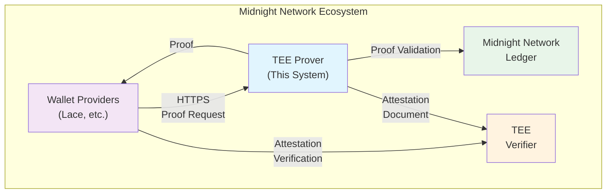
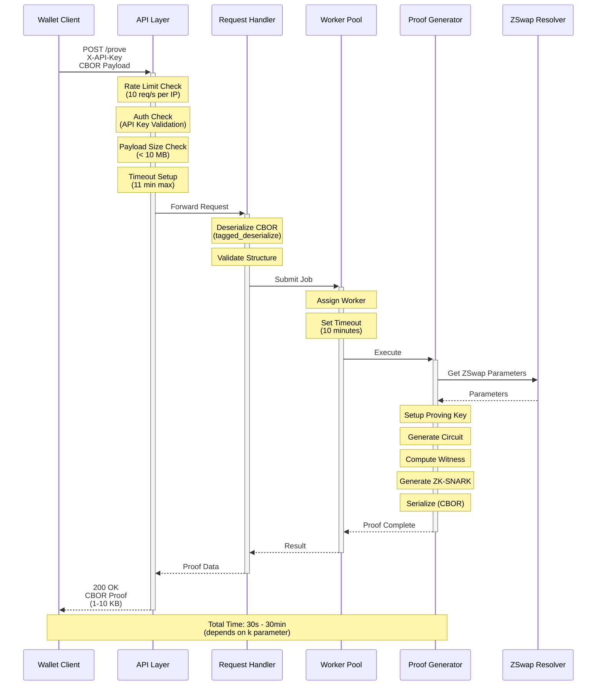
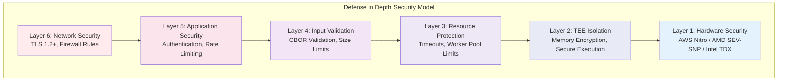
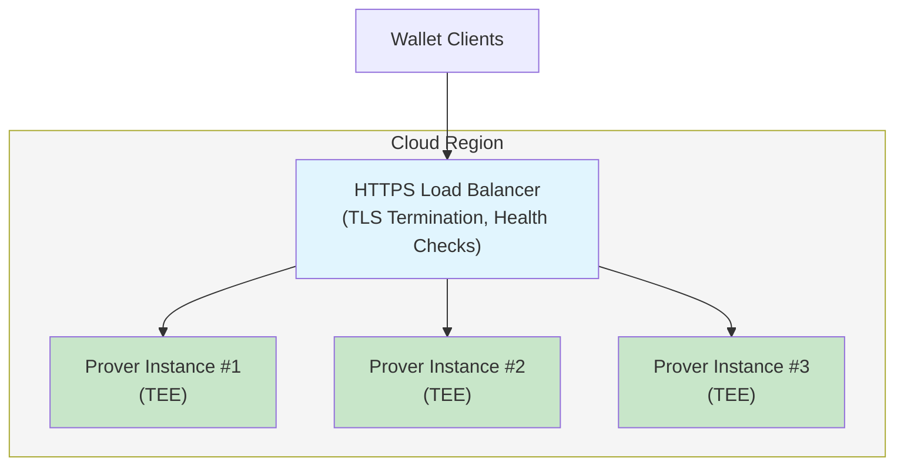
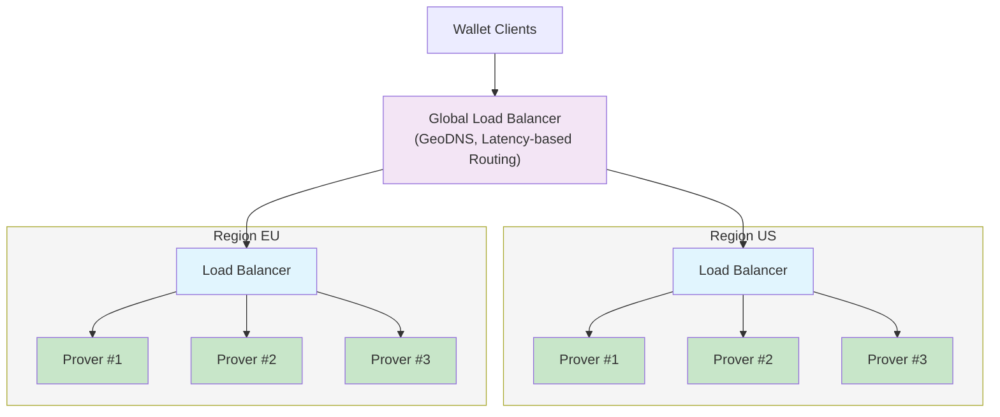

# TEE Prover Technical Specification

**Midnight Network Zero-Knowledge Proof Server**

---

## Document Control

| Version | Date | Author | Changes |
|---------|------|--------|---------|
| 1.0 | 2025-12-18 | Bob Blessing-Hartley | Initial release |

### Distribution List

- 

### Document Review

| Role | Name | Signature | Date |
|------|------|-----------|------|
| Chief Architect | | | |
| Engineering | | | |
|  | | | |

---

## Table of Contents

1. [Executive Summary](#executive-summary)
2. [System Overview](#system-overview)
3. [Architecture](#architecture)
4. [Functional Requirements](#functional-requirements)
5. [Non-Functional Requirements](#non-functional-requirements)
6. [API Specification](#api-specification)
7. [Security Architecture](#security-architecture)
8. [Data Specifications](#data-specifications)
9. [Deployment Architecture](#deployment-architecture)
10. [Operational Requirements](#operational-requirements)
11. [Testing Requirements](#testing-requirements)
12. [Compliance and Standards](#compliance-and-standards)
13. [Appendices](#appendices)

---

## 1. Executive Summary

### 1.1 Purpose

This document specifies the technical architecture, requirements, and implementation details for the Midnight Network TEE-based Zero-Knowledge Proof Server (hereinafter "TEE Prover"). The TEE Prover provides cryptographically verified proof generation services to Midnight Network wallet providers, enabling trustless transaction validation.

### 1.2 Scope

This specification covers:

- System architecture and component design
- Hardware and software requirements
- API interfaces and data formats
- Security requirements and attestation mechanisms
- Deployment architecture for multiple cloud providers
- Operational and monitoring requirements
- Testing and quality assurance requirements
- Compliance with cryptographic and security standards

Out of scope:
- Wallet implementation details (see Wallet Provider Integration Specification)
- Midnight Network consensus mechanisms
- Client-side user interfaces

### 1.3 Intended Audience

- Software architects and engineers implementing the TEE Prover
- Security engineers responsible for attestation and verification
- Operations engineers deploying and maintaining the infrastructure
- Quality assurance engineers developing test suites
- Compliance and audit teams

### 1.4 Key Requirements Summary

| Category | Requirement | Target |
|----------|-------------|--------|
| **Performance** | Proof generation latency (k=18) | < 10 minutes (p95) |
| **Throughput** | Concurrent proof requests | 16+ simultaneous |
| **Availability** | System uptime | 99.9% (3 nines) |
| **Security** | TEE attestation verification | 100% mandatory |
| **Scalability** | Horizontal scaling | Supported via load balancing |
| **Compliance** | Apache 2.0 licensing | Open source |

---

## 2. System Overview

### 2.1 System Context

The TEE Prover operates as a critical component in the Midnight Network ecosystem, providing zero-knowledge proof generation services for transaction validation.



### 2.2 High-Level Architecture

```mermaid
graph TD
    subgraph TEE["TEE Prover System"]
        subgraph API["API Layer"]
            Auth["Auth<br/>Middleware"]
            Rate["Rate<br/>Limiting"]
            Timeout["Timeout<br/>Handler"]
            CORS["CORS<br/>Handler"]
        end

        subgraph Router["Request Router & Handler"]
            Health["/health"]
            Prove["/prove"]
            Attestation["/attestation"]
            FetchParams["/fetch-params"]
            K["/k"]
        end

        subgraph WorkerPool["Worker Pool Manager (Tokio)"]
            W1["Worker 1"]
            W2["Worker 2"]
            WN["Worker N"]
        end

        subgraph Ledger["Midnight Ledger Integration"]
            ZKProver["ZK-SNARK<br/>Prover"]
            ZSwap["ZSwap<br/>Resolver"]
            ParamMgr["Parameter<br/>Manager"]
        end

        subgraph TEEModule["TEE Attestation Module"]
            AWS["AWS Nitro"]
            GCP["GCP vTPM"]
            Azure["Azure Attestation"]
        end

        API --> Router
        Router --> WorkerPool
        WorkerPool --> Ledger
        Ledger --> TEEModule
    end

    style TEE fill:#f5f5f5
    style API fill:#e3f2fd
    style Router fill:#e8f5e9
    style WorkerPool fill:#fff3e0
    style Ledger fill:#f3e5f5
    style TEEModule fill:#fce4ec
```



### 2.3 Technology Stack

| Layer | Technology | Version | Purpose |
|-------|------------|---------|---------|
| **Language** | Rust | 1.75+ | Core implementation |
| **Web Framework** | Axum | 0.7+ | HTTP server and routing |
| **Async Runtime** | Tokio | 1.35+ | Asynchronous task execution |
| **Serialization** | Serde, Bincode | 1.0+ | Data marshalling |
| **Cryptography** | midnight-ledger | 6.2.0+ | ZK-SNARK proof generation |
| **TEE** | AWS Nitro / AMD SEV-SNP / Intel TDX | N/A | Trusted execution |
| **Observability** | Tracing | 0.1+ | Logging and instrumentation |
| **Container** | Docker | 20.10+ | Application packaging |

---

## 3. Architecture

### 3.1 Architectural Principles

1. **Defense in Depth**: Multiple layers of security (TEE, TLS, authentication, rate limiting)
2. **Fail-Safe Defaults**: Secure by default configuration, explicit opt-in for less secure modes
3. **Principle of Least Privilege**: Minimal permissions, restricted access
4. **Separation of Concerns**: Clear boundaries between layers
5. **Stateless Design**: No persistent state, horizontal scalability
6. **Observable**: Comprehensive logging, metrics, and tracing

### 3.2 Component Architecture

#### 3.2.1 API Layer

**Responsibility**: HTTP request handling, middleware processing

**Components**:
- Authentication middleware (API key validation)
- Rate limiting middleware (per-IP throttling)
- Request timeout handler (prevent resource exhaustion)
- CORS handler (cross-origin request control)
- Request body size limiter (prevent DoS)

**Technology**: Axum framework with Tower middleware

**Configuration Parameters**:
```rust
struct SecurityConfig {
    api_keys: Vec<String>,           // Accepted API keys
    disable_auth: bool,              // DANGEROUS: Only for development
    rate_limit: u32,                 // Requests per second per IP
    max_payload_size: usize,         // Maximum request body size (bytes)
}
```

#### 3.2.2 Request Router

**Responsibility**: Route HTTP requests to appropriate handlers

**Endpoints**:

| Endpoint | Method | Auth | Purpose |
|----------|--------|------|---------|
| `/` | GET | No | Health check (alias) |
| `/health` | GET | No | Health status |
| `/ready` | GET | No | Readiness + queue stats |
| `/version` | GET | No | Server version info |
| `/proof-versions` | GET | No | Supported proof formats |
| `/attestation` | GET | No | TEE attestation document |
| `/fetch-params/:k` | GET | Optional | Pre-fetch ZSwap parameters |
| `/check` | POST | Yes | Validate proof preimage |
| `/prove` | POST | Yes | Generate ZK-SNARK proof |
| `/prove-tx` | POST | Yes | Prove transaction (deprecated) |
| `/k` | POST | Yes | Extract k parameter from ZKIR |

#### 3.2.3 Worker Pool Manager

**Responsibility**: Manage concurrent proof generation tasks

**Design**:
- Fixed-size thread pool (configurable, default: 16 workers)
- Async task queue (FIFO)
- Job timeout enforcement (configurable, default: 600s)
- Job status tracking (pending, in_progress, completed, failed)

**Implementation**:
```rust
pub struct WorkerPool {
    workers: usize,               // Number of worker threads
    capacity: usize,              // Queue capacity (0 = unlimited)
    timeout: Duration,            // Maximum job execution time
    job_tx: async_channel::Sender<Job>,
    status_broadcast: broadcast::Sender<JobUpdate>,
}
```

**Thread Safety**: Lock-free queue with async channels

#### 3.2.4 Midnight Ledger Integration

**Responsibility**: Interface with midnight-ledger for proof generation

**Components**:
- **ZK-SNARK Prover**: Core proof generation engine
- **ZSwap Resolver**: Resolves ZSwap parameters on-demand or pre-fetched
- **Parameter Manager**: Caches cryptographic parameters (k=10 to k=24)

**Dependencies**:
```toml
ledger = { package = "midnight-ledger", version = "6.2.0+" }
zswap = { package = "midnight-zswap" }
base-crypto = { package = "midnight-base-crypto" }
transient-crypto = { package = "midnight-transient-crypto" }
zkir_v2 = { package = "zkir" }
```

**Parameter Storage**:
- Location: `$HOME/.cache/midnight/`
- Size: Variable (k=10: ~50MB, k=24: ~10GB)
- Fetch Strategy: On-demand or pre-warmed via `/fetch-params/:k`

#### 3.2.5 TEE Attestation Module

**Responsibility**: Generate platform-specific attestation documents

**Supported Platforms**:

| Platform | TEE Technology | Attestation Format | Output |
|----------|----------------|-------------------|--------|
| AWS Nitro Enclaves | Custom Nitro silicon | CBOR | PCR0, PCR1, PCR2 + signature |
| GCP Confidential VM | AMD SEV-SNP | TPM 2.0 Quote | PCR0-9 + TPM signature |
| Azure Confidential VM | AMD SEV-SNP | JWT | PCR0-12 + Azure signature |

**Platform Detection**:
```rust
enum TeePlatformType {
    AwsNitro,           // Detected via /dev/vsock
    GcpConfidential,    // Detected via GCP metadata
    AzureConfidential,  // Detected via Azure IMDS
    Unknown,            // Development/testing
}
```

### 3.3 Data Flow

#### Proof Generation Request Flow



### 3.4 Error Handling

**Error Categories**:

| Category | HTTP Status | Description | Recovery Action |
|----------|-------------|-------------|-----------------|
| Client Error | 400 | Invalid request format | Client fixes request |
| Unauthorized | 401 | Missing/invalid API key | Client provides valid key |
| Rate Limited | 429 | Too many requests | Client backs off |
| Timeout | 504 | Proof generation exceeded timeout | Client retries with larger timeout |
| Server Error | 500 | Internal server error | Check logs, contact support |
| Service Unavailable | 503 | Server overloaded | Client retries with backoff |

**Error Response Format**:
```json
{
  "error": "BadRequest",
  "message": "Failed to deserialize proof preimage",
  "details": "Invalid CBOR encoding at byte offset 42",
  "request_id": "550e8400-e29b-41d4-a716-446655440000"
}
```

---

## 4. Functional Requirements

### FR-1: Proof Generation

**ID**: FR-1
**Priority**: Critical
**Description**: The system SHALL generate zero-knowledge proofs from valid proof preimages.

**Acceptance Criteria**:
1. System accepts `ProofPreimageVersioned` as input
2. System returns `ProofVersioned` as output
3. Generated proofs are verifiable by Midnight Network nodes
4. System supports proof versions: V1 (current)
5. System handles optional `ProvingKeyMaterial` and `BindingInput`

**Performance**:
- k=10: < 30 seconds (p95)
- k=14: < 2 minutes (p95)
- k=18: < 10 minutes (p95)
- k=20: < 20 minutes (p95)
- k=24: < 60 minutes (p95)

### FR-2: Parameter Management

**ID**: FR-2
**Priority**: High
**Description**: The system SHALL manage ZSwap parameters for k values 10-24.

**Acceptance Criteria**:
1. System fetches parameters on-demand when first needed
2. System caches parameters after first fetch
3. System supports pre-warming via `/fetch-params/:k`
4. System validates k parameter range (10 ≤ k ≤ 24)
5. System handles fetch failures gracefully

**Storage Requirements**:
- Minimum: 50 MB (k=10)
- Recommended: 5 GB (k=10 through k=20)
- Maximum: 50 GB (k=10 through k=24)

### FR-3: Proof Preimage Validation

**ID**: FR-3
**Priority**: High
**Description**: The system SHALL validate proof preimages before generating proofs.

**Acceptance Criteria**:
1. System validates CBOR structure integrity
2. System validates tagged serialization format
3. System validates proof preimage version compatibility
4. System returns detailed error messages on validation failure
5. Validation completes in < 100ms

### FR-4: TEE Attestation

**ID**: FR-4
**Priority**: Critical
**Description**: The system SHALL provide cryptographic attestation of TEE integrity.

**Acceptance Criteria**:
1. System detects TEE platform (AWS/GCP/Azure)
2. System generates platform-specific attestation documents
3. System includes PCR measurements in attestation
4. System accepts optional nonce for freshness
5. System returns attestation in < 5 seconds

**Attestation Components**:
- Platform identifier
- Attestation format (CBOR/TPM/JWT)
- PCR measurements (platform-specific)
- Cryptographic signature
- Timestamp
- Optional nonce (client-provided)

### FR-5: Health Monitoring

**ID**: FR-5
**Priority**: Medium
**Description**: The system SHALL expose health and readiness endpoints.

**Acceptance Criteria**:
1. `/health` endpoint returns 200 OK when server is running
2. `/ready` endpoint returns queue statistics (queue_size, active_workers)
3. Health checks complete in < 50ms
4. System distinguishes between liveness and readiness
5. Endpoints are accessible without authentication

### FR-6: Version Information

**ID**: FR-6
**Priority**: Low
**Description**: The system SHALL expose version and capability information.

**Acceptance Criteria**:
1. `/version` endpoint returns server version
2. `/proof-versions` endpoint returns supported proof formats
3. Version information includes git commit hash (if available)
4. Endpoints accessible without authentication

---

## 5. Non-Functional Requirements

### NFR-1: Performance

**ID**: NFR-1
**Priority**: Critical

| Metric | Requirement | Measurement Method |
|--------|-------------|-------------------|
| Response Time (health) | < 50ms (p95) | Load testing with k6 |
| Response Time (proof, k=18) | < 10 min (p95) | Production monitoring |
| Throughput | ≥ 16 concurrent proofs | Load testing |
| Queue Latency | < 1 second (p95) | Internal metrics |
| Parameter Fetch (k=10) | < 30 seconds | Integration testing |
| Parameter Fetch (k=24) | < 60 minutes | Integration testing |

### NFR-2: Scalability

**ID**: NFR-2
**Priority**: High

**Requirements**:
1. System SHALL support horizontal scaling via load balancing
2. System SHALL support 1-100+ instances simultaneously
3. System SHALL be stateless (no shared state between instances)
4. System SHALL handle 10,000+ requests per hour per instance
5. Worker pool SHALL scale linearly with CPU cores (up to 64 workers)

**Scalability Limits**:
- Single instance: 16 concurrent proofs (default), 64 (maximum)
- Cluster: Unlimited (limited by load balancer)
- Memory per worker: ~4 GB (k=20), ~16 GB (k=24)

### NFR-3: Availability

**ID**: NFR-3
**Priority**: Critical

| Metric | Requirement | Measurement Period |
|--------|-------------|--------------------|
| Uptime | ≥ 99.9% (3 nines) | Monthly |
| MTBF (Mean Time Between Failures) | > 720 hours (30 days) | Quarterly |
| MTTR (Mean Time To Recovery) | < 15 minutes | Per incident |
| Planned Downtime | < 4 hours per month | Monthly maintenance |

**High Availability Strategy**:
- Multi-instance deployment with load balancing
- Health checks with automatic failover
- Blue-green deployment for updates
- Multi-region deployment (optional)

### NFR-4: Security

**ID**: NFR-4
**Priority**: Critical

**Requirements**:

1. **Authentication**
   - API key authentication MUST be enabled in production
   - API keys MUST be ≥ 256 bits of entropy
   - Failed authentication attempts MUST be logged

2. **Encryption**
   - TLS 1.2 or higher MUST be used for all external communication
   - Perfect Forward Secrecy (PFS) cipher suites MUST be supported
   - Certificate validity MUST be verified

3. **TEE Integrity**
   - Debug mode MUST be disabled in production
   - PCR measurements MUST match published values
   - Attestation MUST be verifiable by clients

4. **Input Validation**
   - All inputs MUST be validated before processing
   - Request payloads MUST be size-limited (10 MB default)
   - Invalid inputs MUST be rejected with 400 errors

5. **Rate Limiting**
   - Rate limiting MUST be applied per source IP
   - Default: 10 requests per second per IP
   - Exceeded limits MUST return 429 errors

### NFR-5: Maintainability

**ID**: NFR-5
**Priority**: Medium

**Requirements**:
1. Code coverage MUST be ≥ 70%
2. All public APIs MUST be documented
3. Critical functions MUST have unit tests
4. Integration tests MUST cover all endpoints
5. Code MUST pass linting (clippy) with no warnings
6. Dependencies MUST be kept up-to-date (< 6 months old)

**Documentation Requirements**:
- Architecture diagrams (high-level and component-level)
- API reference with examples
- Deployment guides for all supported platforms
- Operational runbooks
- Troubleshooting guides

### NFR-6: Observability

**ID**: NFR-6
**Priority**: High

**Logging Requirements**:
- Log Level: INFO (production), DEBUG (troubleshooting)
- Log Format: Structured (JSON preferred)
- Log Rotation: Automatic, size-limited (100 MB per file)
- Log Retention: 30 days minimum

**Metrics Requirements**:
- Request count (by endpoint, status code)
- Request duration (histogram with p50, p95, p99)
- Queue size (gauge)
- Active workers (gauge)
- Error rate (counter)
- Proof generation time by k parameter (histogram)

**Tracing Requirements**:
- Distributed tracing support (OpenTelemetry compatible)
- Trace sampling: 100% for errors, 1% for success (configurable)

### NFR-7: Compliance

**ID**: NFR-7
**Priority**: High

**Requirements**:
1. Source code MUST be licensed under Apache 2.0
2. All dependencies MUST use compatible open-source licenses
3. No proprietary or restrictive licenses
4. Attribution MUST be provided for all third-party code
5. Security vulnerabilities MUST be disclosed responsibly

**License Compatibility**:
- Allowed: Apache 2.0, MIT, BSD, ISC
- Allowed with caution: LGPL (dynamic linking only)
- Prohibited: GPL, AGPL, proprietary

---

## 6. API Specification

### 6.1 API Overview

**Base URL**: `https://proof.midnight.network`
**Protocol**: HTTPS only (TLS 1.2+)
**Content-Type**: `application/octet-stream` (CBOR) or `application/json`
**Authentication**: API key via `X-API-Key` header (protected endpoints)

### 6.2 Common Headers

**Request Headers**:
```http
X-API-Key: <base64-encoded-key>     # Required for protected endpoints
Content-Type: application/octet-stream
Content-Length: <bytes>
User-Agent: <client-identifier>     # Recommended
```

**Response Headers**:
```http
Content-Type: application/octet-stream
Content-Length: <bytes>
X-Request-ID: <uuid>                # For troubleshooting
```

### 6.3 Endpoint Specifications

#### 6.3.1 GET /health

**Description**: Health check endpoint for load balancers and monitoring systems.

**Authentication**: None
**Rate Limiting**: None

**Request**:
```http
GET /health HTTP/1.1
Host: proof.midnight.network
```

**Response** (200 OK):
```http
HTTP/1.1 200 OK
Content-Type: application/json

{
  "status": "healthy",
  "timestamp": "2025-12-18T10:30:00Z"
}
```

**Error Responses**: None (always returns 200 if server is running)

---

#### 6.3.2 GET /ready

**Description**: Readiness check with queue statistics.

**Authentication**: None
**Rate Limiting**: None

**Request**:
```http
GET /ready HTTP/1.1
Host: proof.midnight.network
```

**Response** (200 OK):
```http
HTTP/1.1 200 OK
Content-Type: application/json

{
  "status": "ready",
  "queue_size": 5,
  "active_workers": 12,
  "total_workers": 16,
  "timestamp": "2025-12-18T10:30:00Z"
}
```

**Response Fields**:
- `status`: "ready" or "not_ready"
- `queue_size`: Number of pending jobs in queue
- `active_workers`: Number of workers currently processing jobs
- `total_workers`: Total worker pool size

---

#### 6.3.3 GET /version

**Description**: Server version information.

**Authentication**: None
**Rate Limiting**: None

**Request**:
```http
GET /version HTTP/1.1
Host: proof.midnight.network
```

**Response** (200 OK):
```http
HTTP/1.1 200 OK
Content-Type: application/json

{
  "name": "midnight-proof-server-prototype",
  "version": "6.2.0-alpha.1",
  "git_commit": "abc123def456",
  "build_date": "2025-12-18",
  "rust_version": "1.75.0"
}
```

---

#### 6.3.4 GET /proof-versions

**Description**: Supported proof format versions.

**Authentication**: None
**Rate Limiting**: None

**Request**:
```http
GET /proof-versions HTTP/1.1
Host: proof.midnight.network
```

**Response** (200 OK):
```http
HTTP/1.1 200 OK
Content-Type: application/json

["V1"]
```

**Response**: JSON array of supported proof version identifiers.

---

#### 6.3.5 GET /attestation

**Description**: TEE attestation document for verifying server integrity.

**Authentication**: None
**Rate Limiting**: None

**Request**:
```http
GET /attestation?nonce=<hex-encoded-nonce> HTTP/1.1
Host: proof.midnight.network
```

**Query Parameters**:
- `nonce` (optional): 32-byte hex-encoded nonce for freshness verification

**Response** (200 OK):
```http
HTTP/1.1 200 OK
Content-Type: application/json

{
  "platform": "AWS Nitro Enclaves",
  "format": "CBOR",
  "nonce": "abcdef1234567890...",
  "attestation": "<base64-encoded-attestation-document>",
  "metadata": {
    "instructions": "Verify using nitro-cli on parent EC2 instance",
    "pcr_publication": "https://github.com/midnight/proof-server/releases"
  }
}
```

**Platform-Specific Formats**:

| Platform | Format | Attestation Content |
|----------|--------|---------------------|
| AWS Nitro | CBOR | PCR0, PCR1, PCR2 + certificate chain |
| GCP Confidential | TPM 2.0 | PCR0-9 + TPM quote + signature |
| Azure Confidential | JWT | PCR0-12 + JWT token |

---

#### 6.3.6 GET /fetch-params/:k

**Description**: Pre-fetch ZSwap parameters for given k value.

**Authentication**: Optional (controlled by `--enable-fetch-params` flag)
**Rate Limiting**: 1 request per IP per hour per k value

**Request**:
```http
GET /fetch-params/18 HTTP/1.1
Host: proof.midnight.network
```

**Path Parameters**:
- `k`: Security parameter (10-24 inclusive)

**Response** (200 OK):
```http
HTTP/1.1 200 OK
Content-Type: text/plain

success
```

**Error Responses**:
```http
HTTP/1.1 400 Bad Request
Content-Type: application/json

{
  "error": "BadRequest",
  "message": "k=25 out of range (must be 10-24)"
}
```

**Performance Note**: k=24 can take 10-60 minutes to fetch (~10 GB of data).

---

#### 6.3.7 POST /prove

**Description**: Generate zero-knowledge proof from proof preimage.

**Authentication**: Required (X-API-Key header)
**Rate Limiting**: 10 requests per second per IP

**Request**:
```http
POST /prove HTTP/1.1
Host: proof.midnight.network
X-API-Key: your-api-key-here
Content-Type: application/octet-stream
Content-Length: 12345

<CBOR-encoded-payload>
```

**Request Body** (CBOR, tagged serialization):
```rust
(
  ProofPreimageVersioned,      // Proof preimage
  Option<ProvingKeyMaterial>,  // Optional proving key material
  Option<Fr>                   // Optional binding input
)
```

**Response** (200 OK):
```http
HTTP/1.1 200 OK
Content-Type: application/octet-stream
Content-Length: 5678

<CBOR-encoded-proof>
```

**Response Body** (CBOR, tagged serialization):
```rust
ProofVersioned  // Generated proof
```

**Error Responses**:

```http
HTTP/1.1 401 Unauthorized
{
  "error": "Unauthorized",
  "message": "Missing or invalid API key"
}

HTTP/1.1 400 Bad Request
{
  "error": "BadRequest",
  "message": "Failed to deserialize proof preimage"
}

HTTP/1.1 504 Gateway Timeout
{
  "error": "Timeout",
  "message": "Proof generation exceeded timeout (600s)"
}

HTTP/1.1 500 Internal Server Error
{
  "error": "InternalError",
  "message": "Proof generation failed"
}
```

**Performance**:
- Timeout: 600 seconds (configurable)
- Expected duration: 30 seconds to 30 minutes (depends on k)

---

#### 6.3.8 POST /check

**Description**: Validate proof preimage without generating proof.

**Authentication**: Required
**Rate Limiting**: 10 requests per second per IP

**Request**:
```http
POST /check HTTP/1.1
Host: proof.midnight.network
X-API-Key: your-api-key-here
Content-Type: application/octet-stream

<CBOR-encoded-proof-preimage>
```

**Response** (200 OK):
```http
HTTP/1.1 200 OK
Content-Type: application/octet-stream

<CBOR-encoded-validation-result>
```

**Validation Result**:
```rust
Vec<Result<u64, String>>  // Success with indices or error messages
```

---

#### 6.3.9 POST /k

**Description**: Extract k parameter from ZKIR.

**Authentication**: Required
**Rate Limiting**: 10 requests per second per IP

**Request**:
```http
POST /k HTTP/1.1
Host: proof.midnight.network
X-API-Key: your-api-key-here
Content-Type: application/octet-stream

<CBOR-encoded-ZKIR>
```

**Response** (200 OK):
```http
HTTP/1.1 200 OK
Content-Type: text/plain

18
```

**Response Body**: ASCII decimal k value (10-24).

---

### 6.4 Error Handling

**Standard Error Response**:
```json
{
  "error": "<ErrorType>",
  "message": "<human-readable-description>",
  "details": "<optional-technical-details>",
  "request_id": "<uuid>"
}
```

**Error Types**:
- `BadRequest`: Client error (400)
- `Unauthorized`: Authentication failure (401)
- `TooManyRequests`: Rate limit exceeded (429)
- `Timeout`: Request timeout (504)
- `InternalError`: Server error (500)
- `ServiceUnavailable`: Server overloaded (503)

---

## 7. Security Architecture

### 7.1 Security Layers



### 7.2 Threat Model

For comprehensive threat analysis of the TEE Prover system, please refer to the standalone threat model document:

**[TEE Prover Threat Model](./TEE_PROVER_THREAT_MODEL.md)**

**NOTE THe THREAT MODEL DOCUMENT IS SECURED ELSEWHERE RIGHT NOW**

This document provides:
- Complete STRIDE threat analysis
- Trust boundaries and attack vectors
- Detailed attack scenarios with mitigations
- Risk prioritization matrix
- Security controls summary
- Incident response procedures
- Security testing requirements

**Key Security Highlights**:
- **Critical Risk**: Request flooding DoS (P0 priority)
- **High Risk**: Data interception, code tampering, TEE compromise, API key spoofing
- **Primary Mitigations**: TLS 1.2+, API key authentication, TEE hardware isolation, rate limiting
- **Security Metrics**: MTTD < 5 min, MTTR < 15 min (P0), < 1 hour (P1)

### 7.3 TEE Security Requirements

#### 7.3.1 AWS Nitro Enclaves

**Requirements**:
1. Debug mode MUST be disabled (`--debug-mode false`)
2. Enclave MUST run on supported instance types (c5, m5, r5, c6i, m6i, r6i)
3. Parent EC2 instance MUST have enclave support enabled
4. Enclave image (.eif) MUST be built from verified source
5. PCR0, PCR1, PCR2 MUST match published values

**PCR Measurements**:
- **PCR0**: Enclave kernel measurement (most critical)
- **PCR1**: Kernel configuration
- **PCR2**: Application code (proof server binary)

**Attestation Verification**:
1. Request attestation document from Nitro hypervisor
2. Verify certificate chain to AWS root CA
3. Verify PCR values match published values
4. Verify debug mode is false
5. Verify timestamp is fresh (< 5 minutes)

#### 7.3.2 GCP Confidential VMs

**Requirements**:
1. Confidential Computing MUST be enabled
2. Virtual TPM (vTPM) MUST be enabled
3. Secure Boot MUST be enabled
4. Integrity Monitoring MUST be enabled
5. Maintenance policy MUST be set to TERMINATE

**PCR Measurements**:
- **PCR0-7**: UEFI and boot components
- **PCR8-9**: Linux kernel and initrd
- All measurements MUST match published values

**Attestation Verification**:
1. Request TPM 2.0 quote with nonce
2. Verify quote signature against TPM certificate
3. Verify TPM certificate chains to Google CA
4. Verify PCR values match published values
5. Verify nonce matches request

#### 7.3.3 Azure Confidential VMs

**Requirements**:
1. Security type MUST be "ConfidentialVM"
2. OS disk encryption MUST be enabled (VMGuestStateOnly)
3. Virtual TPM MUST be enabled
4. Secure Boot MUST be enabled
5. Azure Attestation Service MUST be configured

**PCR Measurements**:
- **PCR0-12**: UEFI, boot, and OS components
- All measurements MUST match published values

**Attestation Verification**:
1. Request JWT token from Azure Attestation Service with nonce
2. Decode JWT token (3 parts: header.payload.signature)
3. Verify JWT signature against Azure public key
4. Extract PCR values from JWT payload
5. Verify PCR values match published values
6. Verify nonce matches request
7. Verify issuer is Azure Attestation Service

### 7.4 Authentication and Authorization

#### 7.4.1 API Key Authentication

**Format**: Base64-encoded random bytes (≥ 256 bits)

**Generation**:
```bash
openssl rand -base64 32
```

**Storage**:
- Server: Environment variable or secrets manager (AWS Secrets Manager, GCP Secret Manager, Azure Key Vault)
- Client: Secure storage (encrypted at rest)

**Transmission**: HTTPS only, via `X-API-Key` header

**Validation**:
```rust
fn validate_api_key(provided_key: &str, valid_keys: &[String]) -> bool {
    // Constant-time comparison to prevent timing attacks
    valid_keys.iter().any(|key| {
        subtle::ConstantTimeEq::ct_eq(
            provided_key.as_bytes(),
            key.as_bytes()
        ).into()
    })
}
```

**Rotation Policy**:
- Frequency: Every 90 days (recommended)
- Grace Period: 7 days overlap for key rotation
- Emergency Rotation: Within 1 hour if compromised

#### 7.4.2 Rate Limiting

**Strategy**: Token bucket algorithm per source IP

**Default Limits**:
- Requests per second: 10
- Burst capacity: 20
- Window: 1 second sliding window

**Configuration**:
```rust
struct RateLimitConfig {
    requests_per_second: u32,  // Token refill rate
    burst: u32,                // Bucket size (optional)
}
```

**429 Response**:
```http
HTTP/1.1 429 Too Many Requests
Retry-After: 1
Content-Type: application/json

{
  "error": "TooManyRequests",
  "message": "Rate limit exceeded",
  "retry_after": 1
}
```

### 7.5 Network Security

#### 7.5.1 TLS Configuration

**Minimum Version**: TLS 1.2
**Recommended Version**: TLS 1.3

**Cipher Suites** (in order of preference):
1. TLS_AES_256_GCM_SHA384 (TLS 1.3)
2. TLS_CHACHA20_POLY1305_SHA256 (TLS 1.3)
3. TLS_AES_128_GCM_SHA256 (TLS 1.3)
4. TLS_ECDHE_RSA_WITH_AES_256_GCM_SHA384 (TLS 1.2)
5. TLS_ECDHE_RSA_WITH_AES_128_GCM_SHA256 (TLS 1.2)

**Prohibited**:
- SSL v2, SSL v3, TLS 1.0, TLS 1.1
- Export ciphers
- NULL ciphers
- Anonymous ciphers (aNULL)
- DES, 3DES, RC4

**Certificate Requirements**:
- Key Size: ≥ 2048 bits RSA or ≥ 256 bits ECC
- Signature Algorithm: SHA-256 or stronger
- Validity Period: ≤ 398 days
- Subject Alternative Names (SAN): Required
- Certificate Transparency: Recommended

#### 7.5.2 Firewall Rules

**Inbound**:
| Port | Protocol | Source | Purpose |
|------|----------|--------|---------|
| 443 | TCP | 0.0.0.0/0 | HTTPS (public) |
| 22 | TCP | Admin IP only | SSH (management) |
| 6300 | TCP | Load balancer only | Health checks |

**Outbound**:
| Port | Protocol | Destination | Purpose |
|------|----------|-------------|---------|
| 443 | TCP | IPFS/HTTP | Parameter fetch |
| 53 | UDP | DNS servers | Name resolution |

**Default Policy**: Deny all (whitelist approach)

### 7.6 Secrets Management

**Secrets Types**:
1. API Keys (authentication)
2. TLS Certificates (HTTPS)
3. Cloud Provider Credentials (deployment)

**Storage**:
- AWS: AWS Secrets Manager or Parameter Store
- GCP: Secret Manager
- Azure: Key Vault

**Access Control**:
- Principle of Least Privilege
- IAM roles/managed identities (no long-lived credentials)
- Audit logging enabled

**Rotation**:
- Automated where possible
- Manual rotation documented in runbooks
- Rotation tested quarterly

---

## 8. Data Specifications

### 8.1 Data Formats

**Primary Serialization**: Tagged CBOR (Concise Binary Object Representation)

**Advantages**:
- Compact binary format (smaller than JSON)
- Self-describing (tagged types)
- Supports complex nested structures
- Industry standard (RFC 8949)

**Tagged Serialization Functions**:
```rust
fn tagged_serialize<T: Serialize>(
    value: &T,
    writer: &mut impl Write
) -> Result<(), SerializationError>;

fn tagged_deserialize<T: Deserialize>(
    reader: &[u8]
) -> Result<T, DeserializationError>;
```

### 8.2 Data Structures

#### 8.2.1 ProofPreimageVersioned

**Description**: Versioned proof preimage input

**Structure**:
```rust
pub enum ProofPreimageVersioned {
    V1(ProofPreimageV1),
    // Future versions...
}

pub struct ProofPreimageV1 {
    pub binding_input: Fr,              // Binding input field element
    pub public_inputs: Vec<Fr>,         // Public inputs
    pub zkir: ZkirV2,                   // Zero-knowledge intermediate representation
    // Additional fields...
}
```

**Serialization**: Tagged CBOR

**Size**: Variable (typically 1 KB to 1 MB)

#### 8.2.2 ProofVersioned

**Description**: Versioned zero-knowledge proof output

**Structure**:
```rust
pub enum ProofVersioned {
    V1(ProofV1),
    // Future versions...
}

pub struct ProofV1 {
    pub proof: Groth16Proof,            // Groth16 ZK-SNARK proof
    pub public_inputs: Vec<Fr>,         // Public inputs
    // Additional fields...
}
```

**Serialization**: Tagged CBOR

**Size**: Variable (typically 1-10 KB)

#### 8.2.3 ZkirV2

**Description**: Zero-Knowledge Intermediate Representation (version 2)

**Structure**:
```rust
pub struct ZkirV2 {
    pub k: u8,                          // Security parameter (10-24)
    pub constraints: Vec<Constraint>,   // Circuit constraints
    pub witnesses: Vec<Witness>,        // Witness values
    // Additional fields...
}
```

**k Parameter**:
- Range: 10 to 24 (inclusive)
- Meaning: Security parameter (higher = more secure, slower)
- Recommended: 18 for production

#### 8.2.4 AttestationResponse

**Description**: TEE attestation document

**Structure**:
```rust
pub struct AttestationResponse {
    pub platform: String,               // "AWS Nitro Enclaves", "GCP Confidential VM", "Azure Confidential VM"
    pub format: String,                 // "CBOR", "TPM 2.0", "JWT"
    pub nonce: Option<String>,          // Client-provided nonce (hex-encoded)
    pub attestation: Option<String>,    // Base64-encoded attestation document
    pub error: Option<String>,          // Error message if attestation failed
    pub metadata: Option<Value>,        // Additional platform-specific metadata
}
```

**Serialization**: JSON

### 8.3 PCR Data Format

**Purpose**: Platform Configuration Registers (PCR) measurements for TEE verification

**AWS Nitro Format**:
```json
{
  "version": "1.0.0",
  "cloud_provider": "AWS",
  "tee_type": "Nitro Enclaves",
  "timestamp": "2025-12-18T10:30:00Z",
  "git_commit": "abc123def456",
  "docker_image": "midnight-proof-server:v1.0.0",
  "pcr_values": {
    "PCR0": "0123456789abcdef...",
    "PCR1": "0123456789abcdef...",
    "PCR2": "0123456789abcdef..."
  },
  "security": {
    "debug_mode": false,
    "production": true
  }
}
```

**GCP/Azure Format**: Similar structure with appropriate PCR values (PCR0-9 for GCP, PCR0-12 for Azure)

**Distribution**: Published as GitHub releases with GPG signatures

---

## 9. Deployment Architecture

### 9.1 Supported Platforms

| Platform | TEE Technology | Status | Documentation |
|----------|----------------|--------|---------------|
| AWS Nitro Enclaves | Custom Nitro silicon | Production | deploy-aws-nitro.md |
| GCP Confidential VMs | AMD SEV-SNP | Production | deploy-gcp-confidential.md |
| Azure Confidential VMs | AMD SEV-SNP | Production | deploy-azure-confidential.md |

### 9.2 Deployment Topologies

#### 9.2.1 Single-Region Deployment



**Characteristics**:
- Availability: 99.9% (3 nines)
- Latency: Low (single region)
- Cost: Moderate
- Use Case: Single geographic market

#### 9.2.2 Multi-Region Deployment



**Characteristics**:
- Availability: 99.95%+ (active-active)
- Latency: Optimized per region
- Cost: High
- Use Case: Global deployment

### 9.3 Infrastructure Requirements

#### 9.3.1 Compute Resources

**Minimum**:
- vCPU: 4 cores
- Memory: 16 GB RAM
- Disk: 100 GB SSD
- Network: 1 Gbps

**Recommended (k≤20)**:
- vCPU: 8 cores
- Memory: 32 GB RAM
- Disk: 200 GB SSD
- Network: 10 Gbps

**High-Performance (k=24)**:
- vCPU: 16 cores
- Memory: 64 GB RAM
- Disk: 500 GB SSD
- Network: 25 Gbps

#### 9.3.2 Instance Types

**AWS**:
- Minimum: c5.xlarge (4 vCPU, 8 GB)
- Recommended: c5.2xlarge (8 vCPU, 16 GB)
- High-Performance: c5.4xlarge (16 vCPU, 32 GB)

**GCP**:
- Minimum: n2d-standard-4 (4 vCPU, 16 GB)
- Recommended: n2d-standard-8 (8 vCPU, 32 GB)
- High-Performance: n2d-standard-16 (16 vCPU, 64 GB)

**Azure**:
- Minimum: Standard_DC2s_v3 (2 vCPU, 16 GB)
- Recommended: Standard_DC4s_v3 (4 vCPU, 32 GB)
- High-Performance: Standard_DC8s_v3 (8 vCPU, 64 GB)

### 9.4 Deployment Process

**Stages**:

1. **Build**
   - Compile Rust binary (`cargo build --release`)
   - Build Docker image
   - Scan for vulnerabilities
   - Sign image (optional)

2. **Package** (Cloud-Specific)
   - AWS: Build .eif enclave image (`nitro-cli build-enclave`)
   - GCP/Azure: Push Docker image to registry

3. **Deploy**
   - Create infrastructure (VPC, subnets, security groups)
   - Launch TEE instance (enclave/confidential VM)
   - Configure secrets (API keys)
   - Configure monitoring and logging

4. **Verify**
   - Extract PCR values
   - Verify PCR values match expected
   - Request attestation
   - Test health endpoints
   - Load test with sample requests

5. **Publish**
   - Sign PCR values with GPG
   - Publish to GitHub releases
   - Update documentation
   - Notify wallet providers

**Deployment Automation**:
- Infrastructure as Code: Terraform (recommended)
- CI/CD: GitHub Actions, GitLab CI, or Jenkins
- Configuration Management: Ansible (optional)

### 9.5 High Availability Configuration

**Load Balancer**:
- Health Check: `/health` endpoint every 30 seconds
- Unhealthy Threshold: 3 consecutive failures
- Healthy Threshold: 2 consecutive successes
- Timeout: 5 seconds

**Auto-Scaling** (optional):
- Metric: Queue size > 50
- Scale Out: Add 1 instance
- Scale In: Remove 1 instance when queue < 10
- Cooldown: 5 minutes

**Failover**:
- Detection: 3 failed health checks (90 seconds)
- Action: Remove from load balancer
- Recovery: Automatic when health checks pass

---

## 10. Operational Requirements

### 10.1 Monitoring

**Required Metrics**:

| Metric | Type | Threshold | Alert Level |
|--------|------|-----------|-------------|
| Request Rate | Counter | N/A | Info |
| Error Rate | Counter | > 5% | Warning |
| Response Time (p95) | Histogram | > 15 min | Warning |
| Queue Size | Gauge | > 100 | Warning |
| Active Workers | Gauge | < 2 | Warning |
| Memory Usage | Gauge | > 90% | Critical |
| CPU Usage | Gauge | > 95% for 5 min | Warning |
| Disk Usage | Gauge | > 85% | Warning |

**Monitoring Platforms**:
- AWS: CloudWatch
- GCP: Cloud Monitoring
- Azure: Azure Monitor
- Third-party: Datadog, Prometheus+Grafana

### 10.2 Logging

**Log Levels**:
- Production: INFO
- Troubleshooting: DEBUG
- Development: TRACE

**Log Destinations**:
- AWS: CloudWatch Logs
- GCP: Cloud Logging
- Azure: Log Analytics Workspace
- Alternative: Elasticsearch, Splunk

**Log Retention**:
- Production Logs: 30 days minimum
- Debug Logs: 7 days
- Audit Logs: 90 days minimum

### 10.3 Backup and Recovery

**Stateless Design**: No data backups required (server is stateless)

**Configuration Backup**:
- Infrastructure as Code templates (Terraform state)
- Configuration files (committed to version control)
- Secrets (stored in secrets manager with versioning)

**Recovery Time Objective (RTO)**: < 15 minutes
**Recovery Point Objective (RPO)**: N/A (stateless)

**Disaster Recovery**:
1. Deploy to backup region
2. Update DNS to point to backup
3. Verify health checks pass
4. Notify users (if necessary)

### 10.4 Maintenance

**Regular Maintenance**:
- Security Updates: Monthly (critical patches within 7 days)
- Dependency Updates: Quarterly
- Certificate Renewal: 30 days before expiration
- API Key Rotation: Every 90 days

**Maintenance Window**:
- Preferred: Tuesday-Thursday, 02:00-06:00 UTC
- Duration: < 4 hours per month
- Notification: 48 hours advance notice

**Update Process**:
1. Deploy new version to staging
2. Run integration tests
3. Blue-green deployment to production
4. Verify health checks
5. Monitor for 1 hour
6. Rollback if issues detected

---

## 11. Testing Requirements

### 11.1 Unit Testing

**Coverage Target**: ≥ 70%

**Required Tests**:
- Authentication validation
- Rate limiting logic
- Request deserialization
- Error handling
- PCR comparison logic

**Framework**: Rust built-in testing (`#[test]`, `#[cfg(test)]`)

### 11.2 Integration Testing

**Required Tests**:

1. **Health Endpoints**
   - `/health` returns 200
   - `/ready` returns queue stats
   - `/version` returns version info

2. **Proof Generation**
   - Valid proof preimage generates valid proof
   - Invalid proof preimage returns 400
   - Timeout enforced (mock slow proof)

3. **Authentication**
   - Valid API key accepted
   - Invalid API key rejected (401)
   - Missing API key rejected (401)

4. **Rate Limiting**
   - Requests within limit accepted
   - Requests exceeding limit rejected (429)

5. **Attestation**
   - Attestation document generated
   - Nonce included in response
   - Platform correctly detected

**Framework**: `tokio-test`, `reqwest` (for HTTP testing)

### 11.3 Load Testing

**Tool**: k6, Apache JMeter, or Gatling

**Scenarios**:

1. **Sustained Load**
   - Duration: 1 hour
   - RPS: 10 requests/second
   - Expected: No errors, stable latency

2. **Spike Test**
   - Ramp up: 0 to 50 RPS in 1 minute
   - Duration: 5 minutes at 50 RPS
   - Ramp down: 50 to 0 RPS in 1 minute
   - Expected: < 5% error rate during spike

3. **Stress Test**
   - Ramp up: 0 to 100 RPS over 10 minutes
   - Expected: Graceful degradation (429 errors, no crashes)

**Success Criteria**:
- p95 latency < 15 minutes (k=18)
- Error rate < 1% (excluding rate limits)
- No memory leaks (stable memory usage over time)
- No crashes or panics

### 11.4 Security Testing

**Required Tests**:

1. **Vulnerability Scanning**
   - Tool: `cargo audit`, Trivy, or Snyk
   - Frequency: Weekly
   - Action: Patch critical vulnerabilities within 7 days

2. **Penetration Testing**
   - Frequency: Annually (or before major release)
   - Scope: API endpoints, authentication, rate limiting
   - Responsible Disclosure: Bug bounty program (optional)

3. **Attestation Verification**
   - Verify PCR values match published
   - Verify debug mode disabled
   - Verify certificate chain valid

4. **TLS Testing**
   - Tool: testssl.sh, ssllabs.com
   - Verify TLS 1.2+ only
   - Verify no weak ciphers

---

## 12. Compliance and Standards

### 12.1 Licensing

**License**: Apache License 2.0

**Attribution**: All third-party dependencies properly attributed

**Compliance Check**:
```bash
cargo license --all-features
```

### 12.2 Cryptographic Standards

**ZK-SNARK Proofs**:
- Algorithm: Groth16
- Curve: BLS12-381
- Implementation: midnight-ledger (audited)

**Hash Functions**:
- SHA-256 (certificate verification)
- SHA-384 (PCR measurements on AWS Nitro)

**Random Number Generation**:
- Source: OsRng (operating system entropy)
- Usage: Proof generation, nonce generation

### 12.3 Security Standards

**Compliance**:
- OWASP Top 10 (Web Application Security)
- CWE Top 25 (Software Weaknesses)
- NIST Cybersecurity Framework (optional)

**Security Audits**:
- Code Review: Before each major release
- Third-Party Audit: Annually (recommended)
- Penetration Testing: Annually

### 12.4 Data Protection

**Data Classification**:
- Public: Health status, version info, attestation documents
- Confidential: API keys, TLS private keys
- Restricted: None (no user PII)

**Data Retention**:
- Logs: 30 days (production), 7 days (debug)
- Metrics: 90 days
- No persistent user data stored

---

## 13. Appendices

### Appendix A: Glossary

| Term | Definition |
|------|------------|
| **TEE** | Trusted Execution Environment - Hardware-isolated secure computing |
| **PCR** | Platform Configuration Register - Cryptographic measurement of code/config |
| **ZK-SNARK** | Zero-Knowledge Succinct Non-Interactive Argument of Knowledge |
| **ZKIR** | Zero-Knowledge Intermediate Representation |
| **CBOR** | Concise Binary Object Representation (RFC 8949) |
| **Groth16** | Zero-knowledge proof system |
| **k Parameter** | Security parameter for ZK proofs (10-24) |

### Appendix B: References

1. AWS Nitro Enclaves Documentation: https://docs.aws.amazon.com/enclaves/
2. GCP Confidential Computing: https://cloud.google.com/confidential-computing
3. Azure Confidential Computing: https://azure.microsoft.com/solutions/confidential-compute/
4. Midnight Network Documentation: https://docs.midnight.network/
5. Apache License 2.0: https://www.apache.org/licenses/LICENSE-2.0
6. CBOR RFC 8949: https://www.rfc-editor.org/rfc/rfc8949.html
7. Groth16 Paper: https://eprint.iacr.org/2016/260

### Appendix C: Document Review Schedule

- **Minor Review**: Quarterly (or after minor releases)
- **Major Review**: Annually (or after major architectural changes)
- **Security Review**: After any security incident

---

