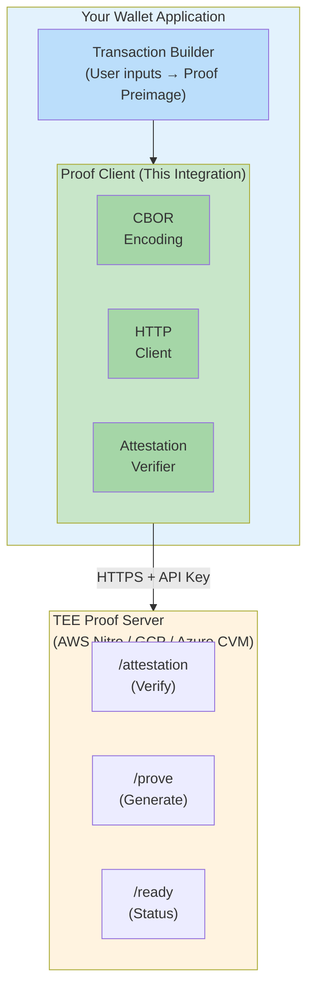
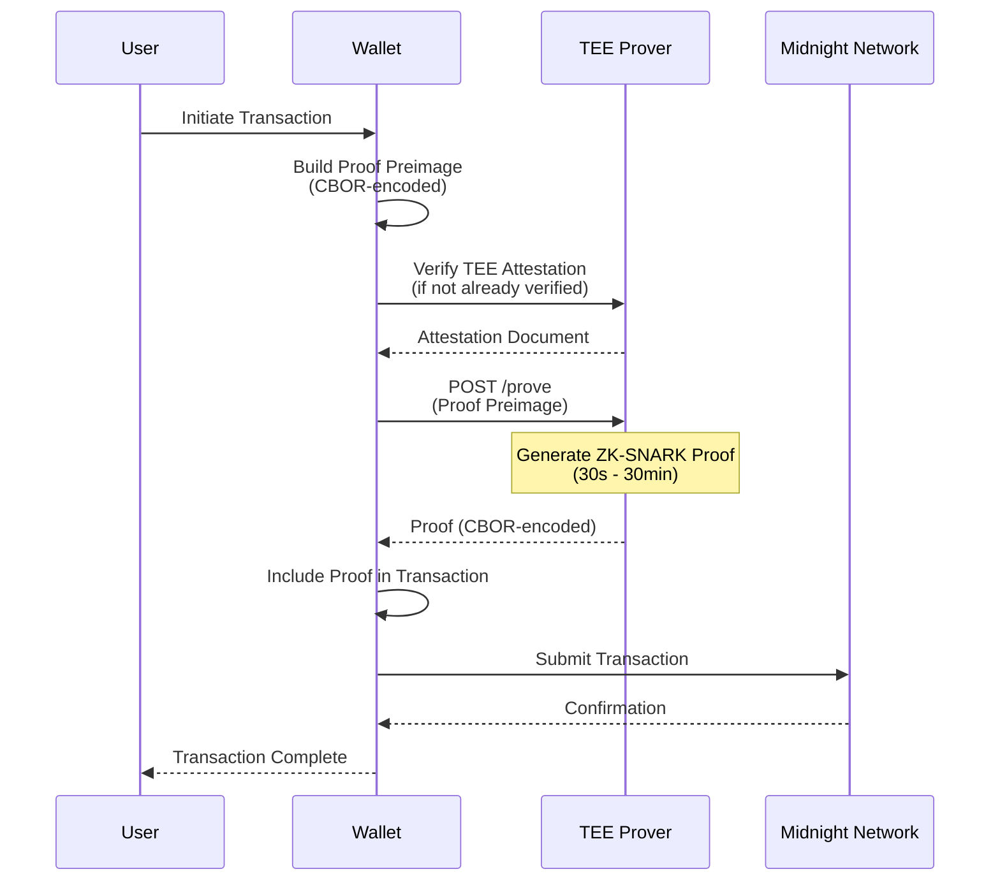
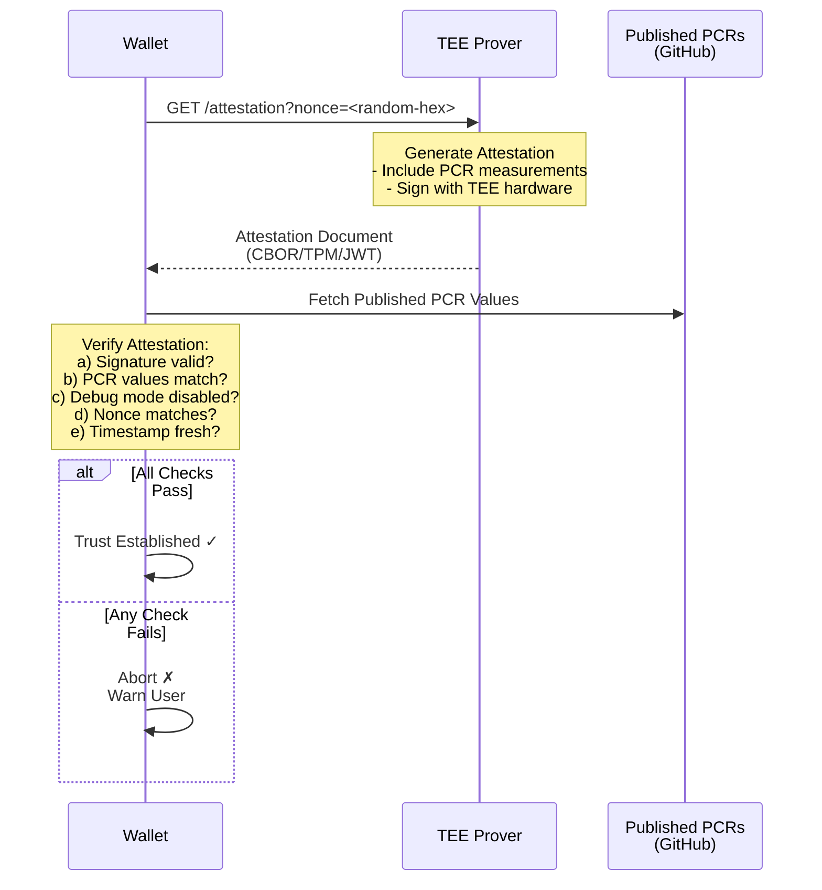

# Wallet Provider Integration Specification

**Midnight Network TEE-Based Proof Server Integration Guide**

---

## Document Control

| Version | Date | Author | Changes |
|---------|------|--------|---------|
| 1.0 | 2025-12-18 | Bob Blessing-Hartley | Initial release |

---

## Table of Contents

1. [Executive Summary](#executive-summary)
2. [Getting Started](#getting-started)
3. [Integration Overview](#integration-overview)
4. [API Client Implementation](#api-client-implementation)
5. [Attestation Verification](#attestation-verification)
6. [Proof Generation Workflow](#proof-generation-workflow)
7. [Security Best Practices](#security-best-practices)
8. [Error Handling and Retry Logic](#error-handling-and-retry-logic)
9. [Testing and Certification](#testing-and-certification)
10. [Performance Optimization](#performance-optimization)
11. [Multi-Cloud Considerations](#multi-cloud-considerations)
12. [Code Examples](#code-examples)
13. [Troubleshooting](#troubleshooting)
15. [Appendices](#appendices)

---

## 1. Executive Summary

### 1.1 Purpose

This document provides comprehensive guidance for wallet providers integrating with the Midnight Network TEE-based Proof Server. It covers API integration, security verification, attestation validation, and best practices for production deployments.

### 1.2 Intended Audience

- Wallet developers (Lace, browser extensions, mobile wallets)
- Third-party integration partners
- Security auditors evaluating wallet implementations
- DevOps engineers deploying wallet infrastructure

### 1.3 Prerequisites

**Technical Knowledge**:
- Understanding of HTTP/REST APIs
- Familiarity with CBOR serialization
- Basic cryptography concepts (signatures, hashing)
- Knowledge of zero-knowledge proofs (helpful but not required)

**Development Environment**:
- Programming language: TypeScript, JavaScript, Rust, Python, or similar
- CBOR library for your language
- HTTP client library (fetch, axios, reqwest, etc.)
- Testing framework

**Midnight Network Dependencies**:
- midnight-ledger client library (optional, for local CBOR encoding)
- midnight-wallet-sdk (if using official SDK)

### 1.4 Integration Checklist

Before going to production, ensure you have completed:

- [ ] API client implementation with authentication
- [ ] Attestation verification (verify PCR values)
- [ ] Error handling and retry logic
- [ ] Rate limiting and backoff strategy
- [ ] Logging and monitoring integration
- [ ] Security audit of API key storage
- [ ] Load testing with production-like traffic
- [ ] Disaster recovery plan (fallback prover)
- [ ] User communication strategy (long proof times)
- [ ] Terms of service acceptance (if required)

---

## 2. Getting Started

### 2.1 Obtaining API Access

**Step 1: Register Your Wallet**

Contact Midnight Foundation to register your wallet and receive:
- API endpoint URL (e.g., `https://proof.midnight.network`)
- API key for authentication
- Documentation and support access

**Step 2: Review Terms of Service**

Understand:
- Rate limits (default: 10 requests/second per IP)
- Fair use policy
- Service level agreements (99.9% uptime)
- Support channels

**Step 3: Set Up Development Environment**

```bash
# Example: Set up environment variables
export PROOF_SERVER_URL="https://proof-dev.midnight.network"
export PROOF_SERVER_API_KEY="your-api-key-here"
```

### 2.2 Quick Start: First Proof Generation

**Step-by-Step Example (TypeScript)**:

```typescript
import { generateProof } from './proof-client';

async function firstProof() {
  try {
    // 1. Create proof preimage (from your transaction)
    const proofPreimage = await createProofPreimage(transaction);

    // 2. Generate proof via TEE Prover
    const proof = await generateProof(proofPreimage, {
      apiKey: process.env.PROOF_SERVER_API_KEY,
      baseUrl: process.env.PROOF_SERVER_URL,
      timeout: 600000, // 10 minutes
    });

    // 3. Verify attestation (first time only)
    const attestation = await verifyAttestation();
    console.log('TEE verified:', attestation.platform);

    // 4. Use proof in your transaction
    await submitTransaction(proof);

    console.log('Success! Proof generated and submitted.');
  } catch (error) {
    console.error('Proof generation failed:', error);
  }
}
```

### 2.3 Development vs Production

**Development Environment**:
- Endpoint: `https://proof-dev.midnight.network`
- Smaller k values (k=10, faster proofs)
- More lenient rate limits
- Debug mode enabled (detailed error messages)

**Production Environment**:
- Endpoint: `https://proof.midnight.network`
- Production k values (k=18 recommended)
- Standard rate limits (10 req/s per IP)
- Attestation verification REQUIRED
- TLS certificate pinning RECOMMENDED

---

## 3. Integration Overview

### 3.1 Architecture Overview



### 3.2 Integration Points

**Required Endpoints**:
1. **POST /prove** - Generate zero-knowledge proof
2. **GET /attestation** - Verify TEE integrity (once per session)
3. **GET /ready** - Check server availability and queue status

**Optional Endpoints**:
4. **GET /health** - Simple health check
5. **POST /check** - Validate proof preimage without generating proof
6. **POST /k** - Extract k parameter from ZKIR

### 3.3 Data Flow



**Timing Considerations**:
- k=10: ~30 seconds (development/testing)
- k=14: ~2 minutes
- k=18: ~5-10 minutes (production recommended)
- k=20: ~10-20 minutes
- k=24: ~30-60 minutes (high security)

---

## 4. API Client Implementation

### 4.1 HTTP Client Configuration

**Required Headers**:
```http
POST /prove HTTP/1.1
Host: proof.midnight.network
X-API-Key: <your-api-key>
Content-Type: application/octet-stream
Content-Length: <payload-size>
User-Agent: YourWalletName/1.0.0
```

**TLS Requirements**:
- Minimum: TLS 1.2
- Recommended: TLS 1.3
- Certificate verification: MUST be enabled
- Certificate pinning: RECOMMENDED for production

**Timeout Configuration**:
```typescript
const httpConfig = {
  timeout: 600000,        // 10 minutes for proof generation
  keepAlive: true,        // Reuse connections
  maxSockets: 10,         // Connection pooling
  retries: 3,             // Retry on network errors
  retryDelay: 1000,       // 1 second between retries
};
```

### 4.2 TypeScript/JavaScript Client

**Installation**:
```bash
npm install axios cbor-x
# or
yarn add axios cbor-x
```

**Implementation**:

```typescript
import axios, { AxiosInstance } from 'axios';
import { encode, decode } from 'cbor-x';
import https from 'https';

export interface ProofClientConfig {
  baseUrl: string;
  apiKey: string;
  timeout?: number;
  retries?: number;
  verifyCertificate?: boolean;
}

export class ProofClient {
  private client: AxiosInstance;
  private config: ProofClientConfig;

  constructor(config: ProofClientConfig) {
    this.config = {
      timeout: 600000, // 10 minutes default
      retries: 3,
      verifyCertificate: true,
      ...config,
    };

    this.client = axios.create({
      baseURL: this.config.baseUrl,
      timeout: this.config.timeout,
      headers: {
        'X-API-Key': this.config.apiKey,
        'User-Agent': 'MidnightWallet/1.0.0',
      },
      httpsAgent: new https.Agent({
        rejectUnauthorized: this.config.verifyCertificate,
        keepAlive: true,
      }),
    });
  }

  /**
   * Generate a zero-knowledge proof
   */
  async generateProof(
    proofPreimage: any,
    provingKeyMaterial?: any,
    bindingInput?: any
  ): Promise<any> {
    // Encode as CBOR (tagged serialization)
    const payload = encode([proofPreimage, provingKeyMaterial, bindingInput]);

    try {
      const response = await this.client.post('/prove', payload, {
        headers: {
          'Content-Type': 'application/octet-stream',
        },
        responseType: 'arraybuffer',
      });

      // Decode CBOR response
      const proof = decode(new Uint8Array(response.data));
      return proof;
    } catch (error) {
      throw this.handleError(error);
    }
  }

  /**
   * Get TEE attestation document
   */
  async getAttestation(nonce?: string): Promise<AttestationResponse> {
    try {
      const params = nonce ? { nonce } : {};
      const response = await this.client.get('/attestation', { params });
      return response.data;
    } catch (error) {
      throw this.handleError(error);
    }
  }

  /**
   * Check server readiness and queue status
   */
  async getReadiness(): Promise<ReadinessResponse> {
    try {
      const response = await this.client.get('/ready');
      return response.data;
    } catch (error) {
      throw this.handleError(error);
    }
  }

  /**
   * Validate proof preimage without generating proof
   */
  async checkProofPreimage(proofPreimage: any): Promise<any> {
    const payload = encode(proofPreimage);

    try {
      const response = await this.client.post('/check', payload, {
        headers: {
          'Content-Type': 'application/octet-stream',
        },
        responseType: 'arraybuffer',
      });

      return decode(new Uint8Array(response.data));
    } catch (error) {
      throw this.handleError(error);
    }
  }

  /**
   * Extract k parameter from ZKIR
   */
  async extractKParameter(zkir: any): Promise<number> {
    const payload = encode(zkir);

    try {
      const response = await this.client.post('/k', payload, {
        headers: {
          'Content-Type': 'application/octet-stream',
        },
        responseType: 'text',
      });

      return parseInt(response.data, 10);
    } catch (error) {
      throw this.handleError(error);
    }
  }

  private handleError(error: any): Error {
    if (error.response) {
      // Server responded with error status
      const status = error.response.status;
      const data = error.response.data;

      switch (status) {
        case 400:
          return new Error(`Bad Request: ${data.message || 'Invalid input'}`);
        case 401:
          return new Error('Unauthorized: Invalid or missing API key');
        case 429:
          return new Error('Rate limit exceeded. Please retry later.');
        case 504:
          return new Error('Proof generation timeout. Try a smaller k value.');
        case 503:
          return new Error('Service unavailable. Server is overloaded.');
        default:
          return new Error(`Server error (${status}): ${data.message || 'Unknown error'}`);
      }
    } else if (error.request) {
      // Request made but no response received
      return new Error('Network error: No response from server');
    } else {
      // Error setting up the request
      return new Error(`Request setup error: ${error.message}`);
    }
  }
}

// Type definitions
export interface AttestationResponse {
  platform: string;
  format: string;
  nonce?: string;
  attestation?: string;
  error?: string;
  metadata?: any;
}

export interface ReadinessResponse {
  status: string;
  queue_size: number;
  active_workers: number;
  total_workers: number;
  timestamp: string;
}
```

**Usage Example**:

```typescript
import { ProofClient } from './proof-client';

// Initialize client
const proverClient = new ProofClient({
  baseUrl: 'https://proof.midnight.network',
  apiKey: process.env.PROOF_SERVER_API_KEY!,
  timeout: 600000, // 10 minutes
});

// Generate proof
async function generateTransactionProof(transaction: Transaction) {
  try {
    // 1. Build proof preimage from transaction
    const proofPreimage = await buildProofPreimage(transaction);

    // 2. Check queue status (optional)
    const readiness = await proverClient.getReadiness();
    console.log(`Queue size: ${readiness.queue_size}, Active workers: ${readiness.active_workers}`);

    // 3. Generate proof
    console.log('Generating proof... This may take 5-10 minutes.');
    const proof = await proverClient.generateProof(proofPreimage);

    console.log('Proof generated successfully!');
    return proof;
  } catch (error) {
    console.error('Failed to generate proof:', error);
    throw error;
  }
}
```

### 4.3 Rust Client

**Cargo.toml**:
```toml
[dependencies]
reqwest = { version = "0.11", features = ["json", "rustls-tls"] }
serde = { version = "1.0", features = ["derive"] }
serde_json = "1.0"
bincode = "1.3"
tokio = { version = "1.35", features = ["full"] }
anyhow = "1.0"
```

**Implementation**:

```rust
use reqwest::{Client, Response, StatusCode};
use serde::{Deserialize, Serialize};
use anyhow::{Result, Context, anyhow};
use std::time::Duration;

pub struct ProofClient {
    client: Client,
    base_url: String,
    api_key: String,
}

impl ProofClient {
    pub fn new(base_url: String, api_key: String) -> Result<Self> {
        let client = Client::builder()
            .timeout(Duration::from_secs(600)) // 10 minutes
            .user_agent("MidnightWallet/1.0.0")
            .build()?;

        Ok(Self {
            client,
            base_url,
            api_key,
        })
    }

    /// Generate a zero-knowledge proof
    pub async fn generate_proof(
        &self,
        proof_preimage: &[u8],
    ) -> Result<Vec<u8>> {
        let url = format!("{}/prove", self.base_url);

        let response = self
            .client
            .post(&url)
            .header("X-API-Key", &self.api_key)
            .header("Content-Type", "application/octet-stream")
            .body(proof_preimage.to_vec())
            .send()
            .await
            .context("Failed to send request")?;

        self.handle_response(response).await
    }

    /// Get TEE attestation document
    pub async fn get_attestation(
        &self,
        nonce: Option<&str>,
    ) -> Result<AttestationResponse> {
        let mut url = format!("{}/attestation", self.base_url);
        if let Some(n) = nonce {
            url.push_str(&format!("?nonce={}", n));
        }

        let response = self
            .client
            .get(&url)
            .send()
            .await
            .context("Failed to get attestation")?;

        if response.status().is_success() {
            Ok(response.json().await?)
        } else {
            Err(anyhow!("Attestation request failed: {}", response.status()))
        }
    }

    /// Check server readiness
    pub async fn get_readiness(&self) -> Result<ReadinessResponse> {
        let url = format!("{}/ready", self.base_url);

        let response = self
            .client
            .get(&url)
            .send()
            .await
            .context("Failed to check readiness")?;

        if response.status().is_success() {
            Ok(response.json().await?)
        } else {
            Err(anyhow!("Readiness check failed: {}", response.status()))
        }
    }

    async fn handle_response(&self, response: Response) -> Result<Vec<u8>> {
        let status = response.status();

        if status.is_success() {
            let bytes = response.bytes().await?;
            Ok(bytes.to_vec())
        } else {
            let error_text = response.text().await?;
            Err(match status {
                StatusCode::BAD_REQUEST => anyhow!("Bad request: {}", error_text),
                StatusCode::UNAUTHORIZED => anyhow!("Unauthorized: Invalid API key"),
                StatusCode::TOO_MANY_REQUESTS => anyhow!("Rate limit exceeded"),
                StatusCode::GATEWAY_TIMEOUT => anyhow!("Proof generation timeout"),
                StatusCode::SERVICE_UNAVAILABLE => anyhow!("Service unavailable"),
                _ => anyhow!("Server error ({}): {}", status, error_text),
            })
        }
    }
}

#[derive(Debug, Deserialize)]
pub struct AttestationResponse {
    pub platform: String,
    pub format: String,
    pub nonce: Option<String>,
    pub attestation: Option<String>,
    pub error: Option<String>,
    pub metadata: Option<serde_json::Value>,
}

#[derive(Debug, Deserialize)]
pub struct ReadinessResponse {
    pub status: String,
    pub queue_size: u32,
    pub active_workers: u32,
    pub total_workers: u32,
    pub timestamp: String,
}
```

**Usage**:

```rust
use proof_client::ProofClient;

#[tokio::main]
async fn main() -> Result<()> {
    let client = ProofClient::new(
        "https://proof.midnight.network".to_string(),
        std::env::var("PROOF_SERVER_API_KEY")?,
    )?;

    // Check attestation (first time)
    let attestation = client.get_attestation(None).await?;
    println!("TEE Platform: {}", attestation.platform);

    // Generate proof
    let proof_preimage = build_proof_preimage()?;
    let proof = client.generate_proof(&proof_preimage).await?;

    println!("Proof generated: {} bytes", proof.len());
    Ok(())
}
```

### 4.4 Python Client

**Requirements**:
```bash
pip install requests cbor2
```

**Implementation**:

```python
import requests
import cbor2
import time
from typing import Optional, Dict, Any, Tuple
from dataclasses import dataclass

@dataclass
class AttestationResponse:
    platform: str
    format: str
    nonce: Optional[str]
    attestation: Optional[str]
    error: Optional[str]
    metadata: Optional[Dict[str, Any]]

@dataclass
class ReadinessResponse:
    status: str
    queue_size: int
    active_workers: int
    total_workers: int
    timestamp: str

class ProofClient:
    def __init__(
        self,
        base_url: str,
        api_key: str,
        timeout: int = 600,
        retries: int = 3
    ):
        self.base_url = base_url.rstrip('/')
        self.api_key = api_key
        self.timeout = timeout
        self.retries = retries

        self.session = requests.Session()
        self.session.headers.update({
            'X-API-Key': api_key,
            'User-Agent': 'MidnightWallet/1.0.0'
        })

    def generate_proof(
        self,
        proof_preimage: Any,
        proving_key_material: Optional[Any] = None,
        binding_input: Optional[Any] = None
    ) -> Any:
        """Generate a zero-knowledge proof."""
        # Encode as CBOR
        payload = cbor2.dumps([proof_preimage, proving_key_material, binding_input])

        url = f"{self.base_url}/prove"
        headers = {'Content-Type': 'application/octet-stream'}

        for attempt in range(self.retries):
            try:
                response = self.session.post(
                    url,
                    data=payload,
                    headers=headers,
                    timeout=self.timeout
                )

                if response.status_code == 200:
                    # Decode CBOR response
                    return cbor2.loads(response.content)
                else:
                    self._handle_error(response)

            except requests.exceptions.Timeout:
                if attempt < self.retries - 1:
                    time.sleep(2 ** attempt)  # Exponential backoff
                    continue
                raise TimeoutError("Proof generation timeout after retries")
            except requests.exceptions.RequestException as e:
                if attempt < self.retries - 1:
                    time.sleep(2 ** attempt)
                    continue
                raise

    def get_attestation(self, nonce: Optional[str] = None) -> AttestationResponse:
        """Get TEE attestation document."""
        url = f"{self.base_url}/attestation"
        params = {'nonce': nonce} if nonce else {}

        response = self.session.get(url, params=params, timeout=30)

        if response.status_code == 200:
            data = response.json()
            return AttestationResponse(**data)
        else:
            self._handle_error(response)

    def get_readiness(self) -> ReadinessResponse:
        """Check server readiness and queue status."""
        url = f"{self.base_url}/ready"
        response = self.session.get(url, timeout=10)

        if response.status_code == 200:
            data = response.json()
            return ReadinessResponse(**data)
        else:
            self._handle_error(response)

    def check_proof_preimage(self, proof_preimage: Any) -> Any:
        """Validate proof preimage without generating proof."""
        payload = cbor2.dumps(proof_preimage)
        url = f"{self.base_url}/check"
        headers = {'Content-Type': 'application/octet-stream'}

        response = self.session.post(url, data=payload, headers=headers, timeout=30)

        if response.status_code == 200:
            return cbor2.loads(response.content)
        else:
            self._handle_error(response)

    def extract_k_parameter(self, zkir: Any) -> int:
        """Extract k parameter from ZKIR."""
        payload = cbor2.dumps(zkir)
        url = f"{self.base_url}/k"
        headers = {'Content-Type': 'application/octet-stream'}

        response = self.session.post(url, data=payload, headers=headers, timeout=30)

        if response.status_code == 200:
            return int(response.text)
        else:
            self._handle_error(response)

    def _handle_error(self, response: requests.Response):
        """Handle HTTP error responses."""
        status_code = response.status_code

        try:
            error_data = response.json()
            message = error_data.get('message', response.text)
        except:
            message = response.text

        if status_code == 400:
            raise ValueError(f"Bad Request: {message}")
        elif status_code == 401:
            raise PermissionError("Unauthorized: Invalid or missing API key")
        elif status_code == 429:
            raise RuntimeError("Rate limit exceeded. Please retry later.")
        elif status_code == 504:
            raise TimeoutError(f"Proof generation timeout: {message}")
        elif status_code == 503:
            raise RuntimeError("Service unavailable. Server is overloaded.")
        else:
            raise RuntimeError(f"Server error ({status_code}): {message}")
```

**Usage**:

```python
import os
from proof_client import ProofClient

# Initialize client
client = ProofClient(
    base_url=os.environ['PROOF_SERVER_URL'],
    api_key=os.environ['PROOF_SERVER_API_KEY'],
    timeout=600  # 10 minutes
)

# Generate proof
try:
    # Verify attestation (first time)
    attestation = client.get_attestation()
    print(f"TEE Platform: {attestation.platform}")

    # Check server status
    readiness = client.get_readiness()
    print(f"Queue size: {readiness.queue_size}")

    # Generate proof
    print("Generating proof... (this may take 5-10 minutes)")
    proof = client.generate_proof(proof_preimage)
    print("Proof generated successfully!")

except Exception as e:
    print(f"Error: {e}")
```

---

## 5. Attestation Verification

### 5.1 Why Attestation Matters

**Attestation Purpose**:
- Proves the proof server is running in a genuine TEE (Trusted Execution Environment)
- Verifies the exact code running inside the TEE matches published source code
- Prevents malicious server operators from stealing secrets or generating fake proofs
- Provides cryptographic proof that cannot be forged

**When to Verify**:
- ✅ On first connection to proof server
- ✅ Periodically (e.g., every 24 hours)
- ✅ After any security incident or alert
- ✅ When PCR values are updated (new deployment)
- ❌ NOT on every proof request (too expensive)

### 5.2 Attestation Workflow



❌❌❌❌❌❌❌❌❌❌❌❌❌❌❌❌❌❌❌❌❌❌❌❌❌❌❌❌❌❌❌❌❌❌❌❌❌❌

## DANGER ZONE: All of the below is experimental, not yet tested ##

❌❌❌❌❌❌❌❌❌❌❌❌❌❌❌❌❌❌❌❌❌❌❌❌❌❌❌❌❌❌❌❌❌❌❌❌❌


### 5.3 PCR Verification

**PCR Values Location**:
Published PCR values are available at:

- GitHub Releases: `https://github.com/midnight/proof-server/releases`
- Each release includes `pcr-values.json` signed with GPG

**PCR Values Format**:
```json
{
  "version": "1.0.0",
  "cloud_provider": "AWS",
  "tee_type": "Nitro Enclaves",
  "timestamp": "2025-12-18T10:30:00Z",
  "git_commit": "abc123def456",
  "docker_image": "midnight-proof-server:v1.0.0",
  "pcr_values": {
    "PCR0": "0123456789abcdef0123456789abcdef0123456789abcdef0123456789abcdef",
    "PCR1": "fedcba9876543210fedcba9876543210fedcba9876543210fedcba9876543210",
    "PCR2": "1111222233334444555566667777888899990000aaaabbbbccccddddeeeeffff"
  },
  "security": {
    "debug_mode": false,
    "production": true
  }
}
```

**Verification Steps**:

```typescript
import crypto from 'crypto';

async function verifyPCRValues(attestation: AttestationResponse): Promise<boolean> {
  // 1. Fetch published PCR values
  const publishedPCRs = await fetchPublishedPCRs();

  // 2. Extract PCR values from attestation
  const attestedPCRs = extractPCRsFromAttestation(attestation);

  // 3. Compare each PCR value
  const pcrNames = ['PCR0', 'PCR1', 'PCR2']; // AWS Nitro
  // For GCP: PCR0-PCR9
  // For Azure: PCR0-PCR12

  for (const pcrName of pcrNames) {
    const published = publishedPCRs.pcr_values[pcrName];
    const attested = attestedPCRs[pcrName];

    if (published !== attested) {
      console.error(`PCR mismatch: ${pcrName}`);
      console.error(`  Expected: ${published}`);
      console.error(`  Received: ${attested}`);
      return false;
    }
  }

  // 4. Verify debug mode is disabled
  if (publishedPCRs.security.debug_mode !== false) {
    console.error('Debug mode is enabled - INSECURE!');
    return false;
  }

  console.log('PCR verification passed ✓');
  return true;
}

async function fetchPublishedPCRs(): Promise<any> {
  // Fetch from GitHub releases
  const response = await fetch(
    'https://github.com/midnight/proof-server/releases/latest/download/pcr-values.json'
  );

  if (!response.ok) {
    throw new Error('Failed to fetch published PCR values');
  }

  return await response.json();
}

function extractPCRsFromAttestation(attestation: AttestationResponse): Record<string, string> {
  // Platform-specific PCR extraction
  if (attestation.platform === 'AWS Nitro Enclaves') {
    return extractAWSNitroPCRs(attestation);
  } else if (attestation.platform === 'GCP Confidential VM') {
    return extractGCPPCRs(attestation);
  } else if (attestation.platform === 'Azure Confidential VM') {
    return extractAzurePCRs(attestation);
  } else {
    throw new Error(`Unknown platform: ${attestation.platform}`);
  }
}
```

### 5.4 AWS Nitro Attestation Verification

**AWS Nitro Format**: CBOR-encoded attestation document

```typescript
import cbor from 'cbor';
import crypto from 'crypto';
import { X509Certificate } from 'crypto';

async function verifyAWSNitroAttestation(attestation: AttestationResponse): Promise<boolean> {
  if (!attestation.attestation) {
    throw new Error('No attestation document provided');
  }

  // 1. Decode base64 attestation
  const attestationBuffer = Buffer.from(attestation.attestation, 'base64');

  // 2. Parse CBOR (AWS Nitro uses COSE Sign1)
  const attestationDoc = cbor.decode(attestationBuffer);

  // 3. Verify certificate chain
  const certificateChain = attestationDoc.cabundle;
  if (!verifyCertificateChain(certificateChain, 'AWS')) {
    console.error('Certificate chain verification failed');
    return false;
  }

  // 4. Verify signature
  const payload = attestationDoc.payload;
  const signature = attestationDoc.signature;
  if (!verifySignature(payload, signature, certificateChain[0])) {
    console.error('Signature verification failed');
    return false;
  }

  // 5. Extract PCR values
  const decodedPayload = cbor.decode(payload);
  const pcrs = {
    PCR0: decodedPayload.pcrs[0].toString('hex'),
    PCR1: decodedPayload.pcrs[1].toString('hex'),
    PCR2: decodedPayload.pcrs[2].toString('hex'),
  };

  // 6. Verify debug mode is disabled
  const userData = decodedPayload.user_data;
  if (userData && userData.debug === true) {
    console.error('Debug mode is enabled - INSECURE!');
    return false;
  }

  // 7. Verify nonce (if provided)
  if (attestation.nonce && decodedPayload.nonce) {
    const expectedNonce = Buffer.from(attestation.nonce, 'hex');
    const actualNonce = Buffer.from(decodedPayload.nonce);
    if (!expectedNonce.equals(actualNonce)) {
      console.error('Nonce mismatch');
      return false;
    }
  }

  // 8. Verify timestamp freshness (< 5 minutes)
  const timestamp = new Date(decodedPayload.timestamp);
  const now = new Date();
  const diffMinutes = (now.getTime() - timestamp.getTime()) / 1000 / 60;
  if (diffMinutes > 5) {
    console.error(`Attestation is stale (${diffMinutes.toFixed(1)} minutes old)`);
    return false;
  }

  // 9. Compare PCRs with published values
  const publishedPCRs = await fetchPublishedPCRs();
  for (const [key, value] of Object.entries(pcrs)) {
    if (publishedPCRs.pcr_values[key] !== value) {
      console.error(`PCR mismatch: ${key}`);
      return false;
    }
  }

  console.log('AWS Nitro attestation verified ✓');
  return true;
}

function verifyCertificateChain(certs: Buffer[], expectedIssuer: string): boolean {
  try {
    // Verify each certificate in chain
    for (let i = 0; i < certs.length - 1; i++) {
      const cert = new X509Certificate(certs[i]);
      const issuerCert = new X509Certificate(certs[i + 1]);

      // Verify signature
      if (!cert.verify(issuerCert.publicKey)) {
        return false;
      }

      // Verify validity period
      if (new Date() < new Date(cert.validFrom) || new Date() > new Date(cert.validTo)) {
        return false;
      }
    }

    // Verify root CA is from expected issuer (AWS)
    const rootCert = new X509Certificate(certs[certs.length - 1]);
    if (!rootCert.issuer.includes(expectedIssuer)) {
      return false;
    }

    return true;
  } catch (error) {
    console.error('Certificate chain verification error:', error);
    return false;
  }
}

function verifySignature(payload: Buffer, signature: Buffer, certificate: Buffer): boolean {
  try {
    const cert = new X509Certificate(certificate);
    const verify = crypto.createVerify('SHA384');
    verify.update(payload);
    return verify.verify(cert.publicKey, signature);
  } catch (error) {
    console.error('Signature verification error:', error);
    return false;
  }
}
```

### 5.5 GCP Confidential VM Attestation Verification

**GCP Format**: TPM 2.0 Quote

```typescript
async function verifyGCPAttestation(attestation: AttestationResponse): Promise<boolean> {
  if (!attestation.attestation) {
    throw new Error('No attestation document provided');
  }

  // 1. Decode base64 TPM quote
  const tpmQuoteBuffer = Buffer.from(attestation.attestation, 'base64');

  // 2. Parse TPM 2.0 quote (simplified - use tpm2-tools library in production)
  const tpmQuote = parseTpmQuote(tpmQuoteBuffer);

  // 3. Verify TPM certificate chain to Google CA
  if (!verifyCertificateChain(tpmQuote.certificates, 'Google')) {
    console.error('TPM certificate verification failed');
    return false;
  }

  // 4. Verify quote signature
  if (!verifyTpmQuoteSignature(tpmQuote)) {
    console.error('TPM quote signature verification failed');
    return false;
  }

  // 5. Verify nonce (if provided)
  if (attestation.nonce && tpmQuote.nonce) {
    if (attestation.nonce !== tpmQuote.nonce) {
      console.error('Nonce mismatch');
      return false;
    }
  }

  // 6. Extract and verify PCR values
  const pcrs = tpmQuote.pcrs;
  const publishedPCRs = await fetchPublishedPCRs();

  for (let i = 0; i <= 9; i++) {
    const pcrName = `PCR${i}`;
    if (publishedPCRs.pcr_values[pcrName] !== pcrs[i]) {
      console.error(`PCR mismatch: ${pcrName}`);
      return false;
    }
  }

  console.log('GCP Confidential VM attestation verified ✓');
  return true;
}

function parseTpmQuote(buffer: Buffer): any {
  // Simplified TPM 2.0 quote parsing
  // In production, use a TPM library like tpm2-tss or node-tpm2

  // TPM 2.0 quote structure:
  // - Quoted information (PCRs, nonce, etc.)
  // - Signature
  // - Certificate chain

  // For full implementation, see:
  // https://github.com/google/go-attestation

  throw new Error('TPM quote parsing not implemented - use tpm2-tools library');
}

function verifyTpmQuoteSignature(tpmQuote: any): boolean {
  // Verify TPM quote signature using TPM public key
  // For full implementation, use tpm2-tools library
  throw new Error('TPM signature verification not implemented');
}
```

### 5.6 Azure Confidential VM Attestation Verification

**Azure Format**: JWT (JSON Web Token)

```typescript
import jwt from 'jsonwebtoken';
import jwksClient from 'jwks-rsa';

async function verifyAzureAttestation(attestation: AttestationResponse): Promise<boolean> {
  if (!attestation.attestation) {
    throw new Error('No attestation document provided');
  }

  // 1. Decode JWT (don't verify yet)
  const jwtToken = Buffer.from(attestation.attestation, 'base64').toString('utf-8');
  const decoded = jwt.decode(jwtToken, { complete: true });

  if (!decoded) {
    console.error('Failed to decode JWT');
    return false;
  }

  // 2. Get Azure public key for JWT verification
  const client = jwksClient({
    jwksUri: 'https://sharedeus.eus.attest.azure.net/certs',
    cache: true,
    cacheMaxAge: 86400000, // 24 hours
  });

  const key = await client.getSigningKey(decoded.header.kid);
  const publicKey = key.getPublicKey();

  // 3. Verify JWT signature
  try {
    const verified = jwt.verify(jwtToken, publicKey, {
      algorithms: ['RS256'],
      issuer: 'https://sharedeus.eus.attest.azure.net', // Or your attestation provider
    });

    if (!verified) {
      console.error('JWT signature verification failed');
      return false;
    }
  } catch (error) {
    console.error('JWT verification error:', error);
    return false;
  }

  // 4. Extract claims
  const payload = decoded.payload as any;

  // 5. Verify nonce
  if (attestation.nonce && payload.nonce) {
    const expectedNonce = Buffer.from(attestation.nonce, 'hex').toString('base64');
    if (payload.nonce !== expectedNonce) {
      console.error('Nonce mismatch');
      return false;
    }
  }

  // 6. Verify timestamp freshness
  const now = Math.floor(Date.now() / 1000);
  if (now - payload.iat > 300) { // 5 minutes
    console.error('JWT is stale');
    return false;
  }

  // 7. Extract and verify PCR values
  const pcrs = payload['x-ms-runtime'].pcrs;
  const publishedPCRs = await fetchPublishedPCRs();

  for (let i = 0; i <= 12; i++) {
    const pcrName = `PCR${i}`;
    const pcrValueBase64 = pcrs[i];
    const pcrValueHex = Buffer.from(pcrValueBase64, 'base64').toString('hex');

    if (publishedPCRs.pcr_values[pcrName] !== pcrValueHex) {
      console.error(`PCR mismatch: ${pcrName}`);
      return false;
    }
  }

  // 8. Verify Confidential VM claim
  if (payload['x-ms-ver'] !== 'VM guest attested') {
    console.error('Not a confidential VM attestation');
    return false;
  }

  console.log('Azure Confidential VM attestation verified ✓');
  return true;
}
```

### 5.7 Complete Attestation Verification Example

```typescript
export class AttestationVerifier {
  private publishedPCRs: any = null;
  private lastVerification: Date | null = null;
  private verificationCacheDuration = 24 * 60 * 60 * 1000; // 24 hours

  async verify(attestation: AttestationResponse, nonce?: string): Promise<boolean> {
    // Check if we need to reverify (cache expired)
    if (
      this.lastVerification &&
      Date.now() - this.lastVerification.getTime() < this.verificationCacheDuration
    ) {
      console.log('Using cached attestation verification');
      return true;
    }

    // Fetch published PCR values (with caching)
    if (!this.publishedPCRs) {
      this.publishedPCRs = await this.fetchPublishedPCRs();
    }

    // Verify based on platform
    let verified = false;
    switch (attestation.platform) {
      case 'AWS Nitro Enclaves':
        verified = await verifyAWSNitroAttestation(attestation);
        break;
      case 'GCP Confidential VM':
        verified = await verifyGCPAttestation(attestation);
        break;
      case 'Azure Confidential VM':
        verified = await verifyAzureAttestation(attestation);
        break;
      default:
        console.warn(`Unknown platform: ${attestation.platform}`);
        return false;
    }

    if (verified) {
      this.lastVerification = new Date();
      console.log('✓ TEE attestation verified successfully');
    } else {
      console.error('✗ TEE attestation verification FAILED');
      // In production: Alert user, refuse to use proof server
    }

    return verified;
  }

  private async fetchPublishedPCRs(): Promise<any> {
    const response = await fetch(
      'https://github.com/midnight/proof-server/releases/latest/download/pcr-values.json'
    );

    if (!response.ok) {
      throw new Error('Failed to fetch published PCR values');
    }

    const pcrs = await response.json();

    // Optionally: Verify GPG signature
    // await this.verifyGPGSignature(pcrs);

    return pcrs;
  }
}
```

---

## 6. Proof Generation Workflow

### 6.1 End-to-End Workflow

```typescript
import { ProofClient } from './proof-client';
import { AttestationVerifier } from './attestation-verifier';

export class ProofGenerator {
  private client: ProofClient;
  private verifier: AttestationVerifier;

  constructor(baseUrl: string, apiKey: string) {
    this.client = new ProofClient({ baseUrl, apiKey });
    this.verifier = new AttestationVerifier();
  }

  async generateProofForTransaction(transaction: Transaction): Promise<Proof> {
    // Step 1: Verify TEE attestation (once per session)
    await this.verifyTEEIntegrity();

    // Step 2: Check server capacity
    await this.checkServerCapacity();

    // Step 3: Build proof preimage
    const proofPreimage = await this.buildProofPreimage(transaction);

    // Step 4: Validate preimage (optional, fast check)
    await this.validatePreimage(proofPreimage);

    // Step 5: Generate proof
    const proof = await this.generateProof(proofPreimage);

    // Step 6: Validate proof locally (optional)
    await this.validateProof(proof);

    return proof;
  }

  private async verifyTEEIntegrity(): Promise<void> {
    console.log('Verifying TEE integrity...');

    // Generate fresh nonce for replay protection
    const nonce = this.generateNonce();

    // Request attestation
    const attestation = await this.client.getAttestation(nonce);

    // Verify attestation
    const verified = await this.verifier.verify(attestation, nonce);

    if (!verified) {
      throw new Error(
        'TEE attestation verification failed! Server may be compromised. Refusing to generate proof.'
      );
    }

    console.log(`✓ TEE verified: ${attestation.platform}`);
  }

  private async checkServerCapacity(): Promise<void> {
    const readiness = await this.client.getReadiness();

    if (readiness.queue_size > 50) {
      console.warn(`Warning: Server queue is large (${readiness.queue_size} pending jobs)`);
      console.warn('Proof generation may take longer than usual');
    }

    if (readiness.active_workers < readiness.total_workers * 0.5) {
      console.warn(`Warning: Only ${readiness.active_workers}/${readiness.total_workers} workers active`);
    }

    console.log(`Server status: ${readiness.queue_size} in queue, ${readiness.active_workers} active workers`);
  }

  private async buildProofPreimage(transaction: Transaction): Promise<any> {
    // This depends on your transaction structure
    // Typically involves:
    // 1. Creating ZKIR from transaction
    // 2. Collecting public inputs
    // 3. Creating binding inputs

    // Example (pseudo-code):
    const zkir = await transaction.toZKIR();
    const publicInputs = transaction.getPublicInputs();
    const bindingInput = transaction.getBindingInput();

    return {
      V1: {
        binding_input: bindingInput,
        public_inputs: publicInputs,
        zkir: zkir,
      },
    };
  }

  private async validatePreimage(proofPreimage: any): Promise<void> {
    console.log('Validating proof preimage...');

    try {
      const validationResult = await this.client.checkProofPreimage(proofPreimage);
      console.log('✓ Proof preimage is valid');
    } catch (error) {
      console.error('✗ Proof preimage validation failed:', error);
      throw new Error('Invalid proof preimage');
    }
  }

  private async generateProof(proofPreimage: any): Promise<Proof> {
    console.log('Generating proof... (this may take 5-10 minutes)');

    // Show progress indicator to user
    const progressInterval = this.startProgressIndicator();

    try {
      const startTime = Date.now();
      const proof = await this.client.generateProof(proofPreimage);
      const duration = ((Date.now() - startTime) / 1000).toFixed(1);

      console.log(`✓ Proof generated in ${duration} seconds`);
      return proof;
    } catch (error) {
      console.error('✗ Proof generation failed:', error);
      throw error;
    } finally {
      clearInterval(progressInterval);
    }
  }

  private async validateProof(proof: Proof): Promise<void> {
    // Optional: Validate proof locally before submission
    // This requires importing the verification logic from midnight-ledger
    console.log('Proof validation skipped (implement if needed)');
  }

  private generateNonce(): string {
    // Generate 32 bytes of random data
    const bytes = new Uint8Array(32);
    crypto.getRandomValues(bytes);
    return Array.from(bytes)
      .map(b => b.toString(16).padStart(2, '0'))
      .join('');
  }

  private startProgressIndicator(): NodeJS.Timer {
    let elapsed = 0;
    return setInterval(() => {
      elapsed += 10;
      const minutes = Math.floor(elapsed / 60);
      const seconds = elapsed % 60;
      process.stdout.write(`\rGenerating proof... ${minutes}:${seconds.toString().padStart(2, '0')}`);
    }, 10000); // Update every 10 seconds
  }
}
```

### 6.2 User Experience Considerations

**Long-Running Proofs**:
Proof generation can take 5-30 minutes. Provide good UX:

```typescript
// Show progress to user
function showProofProgress() {
  // Option 1: Indeterminate progress bar
  showSpinner('Generating secure proof...');

  // Option 2: Estimated time remaining
  showMessage('Estimated time: 5-10 minutes\nYou can continue using your wallet.');

  // Option 3: Allow backgrounding
  const canBackground = await askUser('This will take a few minutes. Continue in background?');
  if (canBackground) {
    generateProofInBackground();
  }
}

// Handle user cancellation
function allowCancellation(proofPromise: Promise<Proof>) {
  return Promise.race([
    proofPromise,
    new Promise((_, reject) => {
      cancelButton.onClick(() => reject(new Error('User cancelled')));
    }),
  ]);
}

// Explain to user why it's slow
function explainProofGeneration() {
  showInfoDialog({
    title: 'Why does this take so long?',
    message:
      'Zero-knowledge proofs provide maximum privacy by proving your transaction is valid ' +
      'without revealing any details. This cryptographic process is computationally intensive ' +
      'but ensures your financial data remains completely private.',
  });
}
```

### 6.3 Handling Queue Wait Times

```typescript
async function generateProofWithQueueAwareness(proofPreimage: any): Promise<Proof> {
  // Check queue status
  const readiness = await client.getReadiness();

  // Estimate wait time based on queue size
  const estimatedWaitMinutes = readiness.queue_size * 7; // Assume 7 min per proof

  if (readiness.queue_size > 10) {
    const proceed = await confirm(
      `The proof server is busy (${readiness.queue_size} jobs ahead of you). ` +
      `Estimated wait time: ${estimatedWaitMinutes} minutes. Continue?`
    );

    if (!proceed) {
      throw new Error('User cancelled due to long queue');
    }
  }

  // Generate proof
  return await client.generateProof(proofPreimage);
}
```

---

## 7. Security Best Practices

### 7.1 API Key Management

**DO**:
- ✅ Store API keys in secure storage (OS keychain, encrypted database)
- ✅ Use environment variables for server-side wallets
- ✅ Rotate keys every 90 days
- ✅ Use different keys for development and production
- ✅ Monitor API key usage for anomalies

**DON'T**:
- ❌ Hardcode API keys in source code
- ❌ Commit API keys to version control
- ❌ Share API keys between different wallets
- ❌ Log API keys (even in debug mode)
- ❌ Send API keys over unencrypted connections

**Secure Storage Example (Browser)**:

```typescript
// Use IndexedDB with encryption for browser wallets
import { openDB } from 'idb';

async function storeAPIKey(apiKey: string): Promise<void> {
  const db = await openDB('midnight-wallet', 1, {
    upgrade(db) {
      db.createObjectStore('secrets');
    },
  });

  // Encrypt API key before storing
  const encryptedKey = await encryptWithUserPassword(apiKey);
  await db.put('secrets', encryptedKey, 'proof_server_api_key');
}

async function retrieveAPIKey(): Promise<string> {
  const db = await openDB('midnight-wallet', 1);
  const encryptedKey = await db.get('secrets', 'proof_server_api_key');

  if (!encryptedKey) {
    throw new Error('API key not found');
  }

  // Decrypt API key
  return await decryptWithUserPassword(encryptedKey);
}
```

**Secure Storage Example (Node.js)**:

```typescript
// Use environment variables
const apiKey = process.env.PROOF_SERVER_API_KEY;

if (!apiKey) {
  throw new Error('PROOF_SERVER_API_KEY environment variable not set');
}

// For production, use a secrets manager:
// - AWS Secrets Manager
// - GCP Secret Manager
// - Azure Key Vault
// - HashiCorp Vault
```

### 7.2 TLS Certificate Pinning

**Why Pin Certificates?**:
- Prevents man-in-the-middle attacks
- Protects against compromised Certificate Authorities
- Recommended for high-security wallets

**Implementation (Node.js)**:

```typescript
import https from 'https';
import crypto from 'crypto';
import fs from 'fs';

// Expected certificate fingerprint (SHA-256)
const EXPECTED_CERT_FINGERPRINT = 'AA:BB:CC:DD:EE:FF:00:11:22:33:44:55:66:77:88:99';

function createPinnedHTTPSAgent() {
  return new https.Agent({
    checkServerIdentity: (hostname, cert) => {
      // Verify certificate fingerprint
      const fingerprint = crypto
        .createHash('sha256')
        .update(cert.raw)
        .digest('hex')
        .match(/.{2}/g)!
        .join(':')
        .toUpperCase();

      if (fingerprint !== EXPECTED_CERT_FINGERPRINT) {
        throw new Error(`Certificate fingerprint mismatch!\n  Expected: ${EXPECTED_CERT_FINGERPRINT}\n  Received: ${fingerprint}`);
      }

      // Continue with default hostname verification
      return undefined;
    },
  });
}

// Use pinned agent with HTTP client
const client = axios.create({
  baseURL: 'https://proof.midnight.network',
  httpsAgent: createPinnedHTTPSAgent(),
});
```

**Note**: Certificate fingerprints must be updated when the server certificate is renewed.

### 7.3 Input Validation

**Validate Before Sending**:

```typescript
function validateProofPreimage(proofPreimage: any): void {
  // Check structure
  if (!proofPreimage.V1) {
    throw new Error('Invalid proof preimage: missing version');
  }

  const v1 = proofPreimage.V1;

  // Check required fields
  if (!v1.zkir) {
    throw new Error('Invalid proof preimage: missing ZKIR');
  }

  if (!v1.public_inputs || !Array.isArray(v1.public_inputs)) {
    throw new Error('Invalid proof preimage: invalid public inputs');
  }

  // Check ZKIR structure
  if (!v1.zkir.k || v1.zkir.k < 10 || v1.zkir.k > 24) {
    throw new Error('Invalid proof preimage: k parameter out of range');
  }

  // Check size limits (prevent sending huge payloads)
  const serialized = encode(proofPreimage);
  if (serialized.length > 10 * 1024 * 1024) { // 10 MB
    throw new Error('Proof preimage too large (> 10 MB)');
  }
}
```

### 7.4 Rate Limiting and Backoff

**Implement Client-Side Rate Limiting**:

```typescript
class RateLimitedProofClient {
  private lastRequestTime = 0;
  private minInterval = 100; // 100ms = max 10 req/s

  async generateProof(proofPreimage: any): Promise<Proof> {
    // Wait if we're sending too fast
    const now = Date.now();
    const timeSinceLastRequest = now - this.lastRequestTime;

    if (timeSinceLastRequest < this.minInterval) {
      await sleep(this.minInterval - timeSinceLastRequest);
    }

    this.lastRequestTime = Date.now();
    return await this.client.generateProof(proofPreimage);
  }
}
```

**Exponential Backoff for Retries**:

```typescript
async function generateProofWithRetry(
  proofPreimage: any,
  maxRetries = 3
): Promise<Proof> {
  let lastError;

  for (let attempt = 0; attempt < maxRetries; attempt++) {
    try {
      return await client.generateProof(proofPreimage);
    } catch (error: any) {
      lastError = error;

      // Don't retry on client errors
      if (error.message.includes('Bad Request') || error.message.includes('Unauthorized')) {
        throw error;
      }

      // Don't retry on timeout (proof already being generated)
      if (error.message.includes('timeout')) {
        throw error;
      }

      // Exponential backoff: 1s, 2s, 4s, ...
      const backoffMs = Math.pow(2, attempt) * 1000;
      console.log(`Attempt ${attempt + 1} failed, retrying in ${backoffMs}ms...`);
      await sleep(backoffMs);
    }
  }

  throw lastError;
}

function sleep(ms: number): Promise<void> {
  return new Promise(resolve => setTimeout(resolve, ms));
}
```

### 7.5 Secure Logging

**DO Log**:
- Request timestamps
- Response status codes
- Proof generation duration
- Queue sizes
- Attestation verification results (success/failure only)

**DON'T Log**:
- API keys
- Proof preimages (may contain sensitive data)
- Full error responses (may leak internal details)
- User identifiers

**Example**:

```typescript
class SecureLogger {
  log(level: string, message: string, metadata?: any) {
    // Sanitize metadata
    const sanitized = this.sanitize(metadata);

    console.log(JSON.stringify({
      timestamp: new Date().toISOString(),
      level,
      message,
      ...sanitized,
    }));
  }

  private sanitize(metadata: any): any {
    if (!metadata) return {};

    // Remove sensitive fields
    const sanitized = { ...metadata };
    delete sanitized.apiKey;
    delete sanitized.api_key;
    delete sanitized.proofPreimage;
    delete sanitized.proof;

    return sanitized;
  }
}

// Usage
logger.log('info', 'Proof generated successfully', {
  duration: 305.2,
  queueSize: 5,
  platform: 'AWS Nitro',
});
```

### 7.6 Fallback Strategies

**Multiple Proof Servers**:

```typescript
const PROOF_SERVERS = [
  { url: 'https://proof-us.midnight.network', region: 'US' },
  { url: 'https://proof-eu.midnight.network', region: 'EU' },
  { url: 'https://proof-asia.midnight.network', region: 'Asia' },
];

async function generateProofWithFallback(proofPreimage: any): Promise<Proof> {
  let lastError;

  for (const server of PROOF_SERVERS) {
    try {
      console.log(`Trying server: ${server.region}`);
      const client = new ProofClient({
        baseUrl: server.url,
        apiKey: process.env.PROOF_SERVER_API_KEY!,
      });

      return await client.generateProof(proofPreimage);
    } catch (error) {
      console.warn(`Server ${server.region} failed:`, error);
      lastError = error;
      // Continue to next server
    }
  }

  throw new Error(`All proof servers failed. Last error: ${lastError}`);
}
```

---

## 8. Threat Model for Wallet Integrations

For comprehensive threat analysis specific to wallet implementations integrating with TEE-based proof servers, please refer to the standalone threat model document:

**[Wallet Provider Threat Model](./WALLET_PROVIDER_THREAT_MODEL.md)**

This document provides:
- Complete STRIDE threat analysis from a wallet perspective (28 threats identified)
- Trust boundaries showing wallet-specific attack surfaces
- Detailed attack scenarios with wallet-specific countermeasures
- Security checklist for pre-launch validation
- Incident response procedures for wallet developers
- Privacy considerations (GDPR/CCPA compliance)
- Security testing suite with code examples

**Key Security Highlights**:
- **Critical Risks**: API key theft, malware on user devices, fake proof servers
- **High Risks**: Proof preimage exposure, MITM attacks, XSS vulnerabilities
- **Primary Mitigations**: OS keychain storage, TLS + certificate pinning, attestation verification, input validation
- **Wallet Responsibilities**: Secure key storage, attestation verification, user privacy protection

---

## 9. Error Handling and Retry Logic

### 9.1 Error Categories

| Error Type | HTTP Status | Retry? | User Action |
|------------|-------------|--------|-------------|
| Invalid Request | 400 | No | Fix input data |
| Unauthorized | 401 | No | Check API key |
| Rate Limited | 429 | Yes (with backoff) | Wait and retry |
| Timeout | 504 | Maybe | Try smaller k value |
| Server Error | 500 | Yes (limited) | Contact support |
| Service Unavailable | 503 | Yes (with backoff) | Wait for capacity |
| Network Error | N/A | Yes | Check connection |

### 8.2 Comprehensive Error Handler

```typescript
class ProofGenerationError extends Error {
  constructor(
    message: string,
    public readonly code: string,
    public readonly retryable: boolean,
    public readonly userMessage: string
  ) {
    super(message);
    this.name = 'ProofGenerationError';
  }
}

function handleProofError(error: any): ProofGenerationError {
  // Network errors
  if (error.code === 'ECONNREFUSED' || error.code === 'ETIMEDOUT') {
    return new ProofGenerationError(
      'Network error',
      'NETWORK_ERROR',
      true,
      'Unable to connect to proof server. Please check your internet connection.'
    );
  }

  // HTTP errors
  if (error.response) {
    const status = error.response.status;
    const data = error.response.data;

    switch (status) {
      case 400:
        return new ProofGenerationError(
          data.message || 'Bad request',
          'BAD_REQUEST',
          false,
          'Invalid transaction data. Please check your transaction and try again.'
        );

      case 401:
        return new ProofGenerationError(
          'Unauthorized',
          'UNAUTHORIZED',
          false,
          'Authentication failed. Please check your wallet configuration.'
        );

      case 429:
        return new ProofGenerationError(
          'Rate limit exceeded',
          'RATE_LIMITED',
          true,
          'Too many requests. Please wait a moment and try again.'
        );

      case 504:
        return new ProofGenerationError(
          'Proof generation timeout',
          'TIMEOUT',
          false,
          'Proof generation took too long. This transaction may be too complex.'
        );

      case 503:
        return new ProofGenerationError(
          'Service unavailable',
          'SERVICE_UNAVAILABLE',
          true,
          'Proof server is temporarily unavailable. Please try again in a few minutes.'
        );

      case 500:
      default:
        return new ProofGenerationError(
          data.message || 'Server error',
          'SERVER_ERROR',
          true,
          'An error occurred while generating your proof. Please try again.'
        );
    }
  }

  // Unknown error
  return new ProofGenerationError(
    error.message || 'Unknown error',
    'UNKNOWN_ERROR',
    false,
    'An unexpected error occurred. Please contact support if this persists.'
  );
}
```

### 8.3 Retry Strategy

```typescript
interface RetryConfig {
  maxRetries: number;
  initialDelay: number;
  maxDelay: number;
  backoffMultiplier: number;
}

const DEFAULT_RETRY_CONFIG: RetryConfig = {
  maxRetries: 3,
  initialDelay: 1000,    // 1 second
  maxDelay: 30000,       // 30 seconds
  backoffMultiplier: 2,  // Exponential backoff
};

async function generateProofWithSmartRetry(
  proofPreimage: any,
  config: RetryConfig = DEFAULT_RETRY_CONFIG
): Promise<Proof> {
  let lastError: ProofGenerationError;
  let delay = config.initialDelay;

  for (let attempt = 0; attempt <= config.maxRetries; attempt++) {
    try {
      if (attempt > 0) {
        console.log(`Retry attempt ${attempt}/${config.maxRetries} after ${delay}ms delay...`);
        await sleep(delay);
      }

      return await client.generateProof(proofPreimage);
    } catch (error) {
      lastError = handleProofError(error);

      // Don't retry non-retryable errors
      if (!lastError.retryable) {
        throw lastError;
      }

      // Don't retry if we've exhausted attempts
      if (attempt === config.maxRetries) {
        throw lastError;
      }

      // Exponential backoff
      delay = Math.min(delay * config.backoffMultiplier, config.maxDelay);
    }
  }

  throw lastError!;
}
```

### 8.4 Circuit Breaker Pattern

```typescript
enum CircuitState {
  CLOSED,    // Normal operation
  OPEN,      // Failing, stop sending requests
  HALF_OPEN, // Testing if service recovered
}

class CircuitBreaker {
  private state = CircuitState.CLOSED;
  private failureCount = 0;
  private successCount = 0;
  private lastFailureTime = 0;

  constructor(
    private readonly failureThreshold = 5,
    private readonly timeout = 60000, // 1 minute
    private readonly halfOpenAttempts = 3
  ) {}

  async execute<T>(fn: () => Promise<T>): Promise<T> {
    // If circuit is OPEN, check if timeout has elapsed
    if (this.state === CircuitState.OPEN) {
      if (Date.now() - this.lastFailureTime > this.timeout) {
        console.log('Circuit breaker: Transitioning to HALF_OPEN');
        this.state = CircuitState.HALF_OPEN;
        this.successCount = 0;
      } else {
        throw new Error('Circuit breaker is OPEN. Service is unavailable.');
      }
    }

    try {
      const result = await fn();

      // Success
      if (this.state === CircuitState.HALF_OPEN) {
        this.successCount++;
        if (this.successCount >= this.halfOpenAttempts) {
          console.log('Circuit breaker: Transitioning to CLOSED');
          this.state = CircuitState.CLOSED;
          this.failureCount = 0;
        }
      } else {
        this.failureCount = 0;
      }

      return result;
    } catch (error) {
      this.failureCount++;
      this.lastFailureTime = Date.now();

      if (this.state === CircuitState.HALF_OPEN) {
        console.log('Circuit breaker: Transitioning to OPEN');
        this.state = CircuitState.OPEN;
      } else if (this.failureCount >= this.failureThreshold) {
        console.log('Circuit breaker: Transitioning to OPEN');
        this.state = CircuitState.OPEN;
      }

      throw error;
    }
  }

  getState(): CircuitState {
    return this.state;
  }
}

// Usage
const circuitBreaker = new CircuitBreaker();

async function generateProofWithCircuitBreaker(proofPreimage: any): Promise<Proof> {
  return await circuitBreaker.execute(async () => {
    return await client.generateProof(proofPreimage);
  });
}
```

---

## 9. Testing and Certification

### 9.1 Integration Testing

**Test Checklist**:

```typescript
describe('Proof Server Integration', () => {
  let client: ProofClient;
  let testProofPreimage: any;

  beforeAll(() => {
    client = new ProofClient({
      baseUrl: process.env.PROOF_SERVER_URL_TEST!,
      apiKey: process.env.PROOF_SERVER_API_KEY_TEST!,
    });

    testProofPreimage = createTestProofPreimage();
  });

  test('Health check returns 200', async () => {
    const response = await fetch(`${process.env.PROOF_SERVER_URL_TEST}/health`);
    expect(response.status).toBe(200);
  });

  test('Readiness returns queue status', async () => {
    const readiness = await client.getReadiness();
    expect(readiness.status).toBe('ready');
    expect(readiness.queue_size).toBeGreaterThanOrEqual(0);
    expect(readiness.active_workers).toBeGreaterThanOrEqual(0);
  });

  test('Attestation returns TEE platform', async () => {
    const attestation = await client.getAttestation();
    expect(attestation.platform).toBeDefined();
    expect(['AWS Nitro Enclaves', 'GCP Confidential VM', 'Azure Confidential VM']).toContain(
      attestation.platform
    );
  });

  test('Invalid API key returns 401', async () => {
    const badClient = new ProofClient({
      baseUrl: process.env.PROOF_SERVER_URL_TEST!,
      apiKey: 'invalid-key',
    });

    await expect(
      badClient.generateProof(testProofPreimage)
    ).rejects.toThrow('Unauthorized');
  });

  test('Generate proof with valid preimage', async () => {
    const proof = await client.generateProof(testProofPreimage);
    expect(proof).toBeDefined();
    expect(proof.V1).toBeDefined();
  }, 600000); // 10 minute timeout

  test('Invalid proof preimage returns 400', async () => {
    const invalidPreimage = { invalid: 'data' };

    await expect(
      client.generateProof(invalidPreimage)
    ).rejects.toThrow('Bad Request');
  });

  test('Check endpoint validates proof preimage', async () => {
    const result = await client.checkProofPreimage(testProofPreimage);
    expect(result).toBeDefined();
  });

  test('Extract k parameter from ZKIR', async () => {
    const k = await client.extractKParameter(testProofPreimage.V1.zkir);
    expect(k).toBeGreaterThanOrEqual(10);
    expect(k).toBeLessThanOrEqual(24);
  });

  test('Rate limiting returns 429 after threshold', async () => {
    // Send 11 requests rapidly (limit is 10 req/s)
    const promises = [];
    for (let i = 0; i < 11; i++) {
      promises.push(client.getReadiness());
    }

    await expect(Promise.all(promises)).rejects.toThrow('Rate limit exceeded');
  }, 10000);
});
```

### 9.2 Load Testing

**k6 Load Test Script**:

```javascript
import http from 'k6/http';
import { check, sleep } from 'k6';
import { Rate } from 'k6/metrics';

const errorRate = new Rate('errors');

export const options = {
  stages: [
    { duration: '1m', target: 10 },  // Ramp up to 10 users
    { duration: '5m', target: 10 },  // Stay at 10 users
    { duration: '1m', target: 0 },   // Ramp down
  ],
  thresholds: {
    errors: ['rate<0.05'],  // Error rate < 5%
    http_req_duration: ['p(95)<15000'],  // 95% under 15 seconds (for /health)
  },
};

const BASE_URL = __ENV.PROOF_SERVER_URL;
const API_KEY = __ENV.PROOF_SERVER_API_KEY;

export default function () {
  // Test health endpoint
  const healthRes = http.get(`${BASE_URL}/health`);
  check(healthRes, {
    'health status is 200': (r) => r.status === 200,
  }) || errorRate.add(1);

  sleep(1);

  // Test readiness endpoint
  const readyRes = http.get(`${BASE_URL}/ready`);
  check(readyRes, {
    'ready status is 200': (r) => r.status === 200,
    'has queue_size field': (r) => JSON.parse(r.body).queue_size !== undefined,
  }) || errorRate.add(1);

  sleep(1);

  // Test attestation endpoint
  const attestRes = http.get(`${BASE_URL}/attestation`);
  check(attestRes, {
    'attestation status is 200': (r) => r.status === 200,
    'has platform field': (r) => JSON.parse(r.body).platform !== undefined,
  }) || errorRate.add(1);

  sleep(10);
}
```

**Run Load Test**:
```bash
k6 run --env PROOF_SERVER_URL=https://proof-dev.midnight.network \
       --env PROOF_SERVER_API_KEY=your-api-key \
       loadtest.js
```

### 9.3 Security Testing

**Vulnerability Scan**:

```bash
# Scan dependencies for vulnerabilities
npm audit
# or
yarn audit

# Check for known security issues
npm install -g snyk
snyk test
```

**Penetration Testing Checklist**:

- [ ] Test with invalid API keys (should return 401)
- [ ] Test with missing API keys (should return 401)
- [ ] Test with malformed CBOR payloads (should return 400)
- [ ] Test with extremely large payloads (should return 413 or 400)
- [ ] Test rapid-fire requests (should return 429)
- [ ] Test SQL injection in query parameters (should be safe)
- [ ] Test XSS in error messages (should be escaped)
- [ ] Verify TLS version (should be >= 1.2)
- [ ] Verify weak cipher suites rejected
- [ ] Test certificate validation (MITM attempt should fail)

### 9.4 Certification Requirements

**Before Production Launch**:

1. **Functional Testing** ✓
   - All endpoints tested
   - Happy path and error cases covered
   - Edge cases handled

2. **Integration Testing** ✓
   - End-to-end workflow verified
   - Attestation verification working
   - Error handling validated

3. **Load Testing** ✓
   - Handle expected transaction volume
   - No memory leaks
   - Response times acceptable

4. **Security Audit** ✓
   - API key management reviewed
   - TLS configuration validated
   - Attestation verification tested
   - No critical vulnerabilities

5. **User Acceptance Testing** ✓
   - Real users test the flow
   - UX for long proof times validated
   - Error messages clear and actionable

6. **Documentation** ✓
   - Integration guide complete
   - Error codes documented
   - Support contacts provided

---

## 10. Performance Optimization

### 10.1 Caching Strategies

**Cache Attestation**:

```typescript
class CachedAttestationVerifier {
  private cache = new Map<string, { verified: boolean; expiry: number }>();
  private cacheDuration = 24 * 60 * 60 * 1000; // 24 hours

  async verify(attestation: AttestationResponse): Promise<boolean> {
    const cacheKey = attestation.platform;
    const cached = this.cache.get(cacheKey);

    if (cached && Date.now() < cached.expiry) {
      console.log('Using cached attestation verification');
      return cached.verified;
    }

    const verified = await this.performVerification(attestation);

    this.cache.set(cacheKey, {
      verified,
      expiry: Date.now() + this.cacheDuration,
    });

    return verified;
  }

  private async performVerification(attestation: AttestationResponse): Promise<boolean> {
    // Actual verification logic
    return true;
  }
}
```

**Connection Pooling**:

```typescript
const client = axios.create({
  baseURL: 'https://proof.midnight.network',
  httpAgent: new http.Agent({ keepAlive: true, maxSockets: 10 }),
  httpsAgent: new https.Agent({ keepAlive: true, maxSockets: 10 }),
});
```

### 10.2 Parallel Proof Generation

**Batch Processing**:

```typescript
async function generateMultipleProofs(transactions: Transaction[]): Promise<Proof[]> {
  // Generate proofs in parallel (up to concurrency limit)
  const concurrency = 5; // Max 5 concurrent requests
  const results: Proof[] = [];

  for (let i = 0; i < transactions.length; i += concurrency) {
    const batch = transactions.slice(i, i + concurrency);
    const proofs = await Promise.all(
      batch.map(tx => generateProofForTransaction(tx))
    );
    results.push(...proofs);
  }

  return results;
}
```

### 10.3 Request Prioritization

**Priority Queue**:

```typescript
enum ProofPriority {
  LOW = 0,
  NORMAL = 1,
  HIGH = 2,
  URGENT = 3,
}

class PriorityProofQueue {
  private queues: Map<ProofPriority, Array<() => Promise<Proof>>> = new Map([
    [ProofPriority.LOW, []],
    [ProofPriority.NORMAL, []],
    [ProofPriority.HIGH, []],
    [ProofPriority.URGENT, []],
  ]);

  private activeCount = 0;
  private maxConcurrent = 3;

  async enqueue(
    fn: () => Promise<Proof>,
    priority: ProofPriority = ProofPriority.NORMAL
  ): Promise<Proof> {
    return new Promise((resolve, reject) => {
      this.queues.get(priority)!.push(async () => {
        try {
          const result = await fn();
          resolve(result);
          return result;
        } catch (error) {
          reject(error);
          throw error;
        }
      });

      this.processQueue();
    });
  }

  private async processQueue() {
    if (this.activeCount >= this.maxConcurrent) {
      return;
    }

    // Get next task from highest priority queue
    let task: (() => Promise<Proof>) | undefined;
    for (const priority of [ProofPriority.URGENT, ProofPriority.HIGH, ProofPriority.NORMAL, ProofPriority.LOW]) {
      const queue = this.queues.get(priority)!;
      if (queue.length > 0) {
        task = queue.shift();
        break;
      }
    }

    if (!task) {
      return;
    }

    this.activeCount++;
    try {
      await task();
    } finally {
      this.activeCount--;
      this.processQueue(); // Process next task
    }
  }
}

// Usage
const proofQueue = new PriorityProofQueue();

// Urgent: User waiting for transaction
await proofQueue.enqueue(
  () => generateProof(tx),
  ProofPriority.URGENT
);

// Low priority: Prefetching proofs
await proofQueue.enqueue(
  () => generateProof(tx),
  ProofPriority.LOW
);
```

### 10.4 Prefetching Parameters

**Pre-warm Parameters**:

```typescript
async function prewarmParameters(kValues: number[]): Promise<void> {
  console.log('Pre-warming ZSwap parameters...');

  for (const k of kValues) {
    try {
      await fetch(`${BASE_URL}/fetch-params/${k}`, {
        method: 'GET',
        headers: {
          'X-API-Key': API_KEY,
        },
      });
      console.log(`✓ Parameters for k=${k} pre-warmed`);
    } catch (error) {
      console.warn(`Failed to pre-warm k=${k}:`, error);
    }
  }
}

// On wallet startup
await prewarmParameters([10, 14, 18]); // Common k values
```

---

## 11. Multi-Cloud Considerations

### 11.1 Cloud-Specific Differences

| Feature | AWS Nitro | GCP Confidential | Azure Confidential |
|---------|-----------|------------------|-------------------|
| Attestation Format | CBOR | TPM 2.0 Quote | JWT |
| PCR Count | 3 (PCR0-2) | 10 (PCR0-9) | 13 (PCR0-12) |
| Verification Complexity | Medium | High | Low |
| Attestation Speed | Fast (~1s) | Medium (~2s) | Fast (~1s) |
| Documentation | Excellent | Good | Excellent |

### 11.2 Multi-Cloud Client

```typescript
interface CloudConfig {
  platform: 'aws' | 'gcp' | 'azure';
  endpoint: string;
  pcrCount: number;
}

const CLOUD_CONFIGS: Record<string, CloudConfig> = {
  'AWS Nitro Enclaves': {
    platform: 'aws',
    endpoint: 'https://proof-aws.midnight.network',
    pcrCount: 3,
  },
  'GCP Confidential VM': {
    platform: 'gcp',
    endpoint: 'https://proof-gcp.midnight.network',
    pcrCount: 10,
  },
  'Azure Confidential VM': {
    platform: 'azure',
    endpoint: 'https://proof-azure.midnight.network',
    pcrCount: 13,
  },
};

class MultiCloudProofClient {
  private clients = new Map<string, ProofClient>();

  constructor(apiKey: string) {
    for (const [platform, config] of Object.entries(CLOUD_CONFIGS)) {
      this.clients.set(
        platform,
        new ProofClient({
          baseUrl: config.endpoint,
          apiKey,
        })
      );
    }
  }

  async generateProof(proofPreimage: any, preferredCloud?: string): Promise<Proof> {
    const clouds = preferredCloud
      ? [preferredCloud, ...Object.keys(CLOUD_CONFIGS).filter(c => c !== preferredCloud)]
      : Object.keys(CLOUD_CONFIGS);

    for (const cloud of clouds) {
      const client = this.clients.get(cloud);
      if (!client) continue;

      try {
        console.log(`Trying cloud: ${cloud}`);
        return await client.generateProof(proofPreimage);
      } catch (error) {
        console.warn(`Cloud ${cloud} failed:`, error);
        // Continue to next cloud
      }
    }

    throw new Error('All clouds failed');
  }
}
```

### 11.3 Geographic Routing

**Latency-Based Routing**:

```typescript
async function selectFastestCloud(): Promise<string> {
  const clouds = Object.entries(CLOUD_CONFIGS);

  const pingResults = await Promise.all(
    clouds.map(async ([name, config]) => {
      const start = Date.now();
      try {
        await fetch(`${config.endpoint}/health`, { signal: AbortSignal.timeout(5000) });
        const latency = Date.now() - start;
        return { name, latency };
      } catch {
        return { name, latency: Infinity };
      }
    })
  );

  // Sort by latency
  pingResults.sort((a, b) => a.latency - b.latency);

  console.log('Cloud latencies:', pingResults);
  return pingResults[0].name;
}

// Usage
const preferredCloud = await selectFastestCloud();
const proof = await multiCloudClient.generateProof(proofPreimage, preferredCloud);
```

---

## 12. Code Examples

### 12.1 Complete TypeScript Example

```typescript
/**
 * Complete example: Generate proof for Midnight transaction
 */

import { ProofClient, AttestationVerifier, ProofGenerator } from './lib';

async function main() {
  // 1. Initialize
  const proofGen = new ProofGenerator(
    process.env.PROOF_SERVER_URL!,
    process.env.PROOF_SERVER_API_KEY!
  );

  // 2. Create transaction
  const transaction = createTransaction({
    from: 'wallet_address',
    to: 'recipient_address',
    amount: 100,
  });

  try {
    // 3. Generate proof
    console.log('Generating proof...');
    const proof = await proofGen.generateProofForTransaction(transaction);

    // 4. Submit transaction with proof
    console.log('Submitting transaction...');
    const txHash = await submitTransaction(transaction, proof);

    console.log(`Success! Transaction hash: ${txHash}`);
  } catch (error: any) {
    console.error('Error:', error.message);

    // Handle specific errors
    if (error.code === 'RATE_LIMITED') {
      console.log('Please wait and try again');
    } else if (error.code === 'TIMEOUT') {
      console.log('Transaction is too complex, try simplifying');
    } else {
      console.log('Please contact support');
    }
  }
}

main();
```

### 12.2 Complete Rust Example

```rust
//! Complete example: Generate proof for Midnight transaction

use proof_client::{ProofClient, AttestationVerifier};
use anyhow::Result;

#[tokio::main]
async fn main() -> Result<()> {
    // 1. Initialize
    let client = ProofClient::new(
        std::env::var("PROOF_SERVER_URL")?,
        std::env::var("PROOF_SERVER_API_KEY")?,
    )?;

    let verifier = AttestationVerifier::new();

    // 2. Verify TEE attestation
    println!("Verifying TEE integrity...");
    let attestation = client.get_attestation(None).await?;
    let verified = verifier.verify(&attestation).await?;

    if !verified {
        anyhow::bail!("TEE verification failed!");
    }

    println!("✓ TEE verified: {}", attestation.platform);

    // 3. Create transaction
    let transaction = create_transaction()?;

    // 4. Build proof preimage
    let proof_preimage = build_proof_preimage(&transaction)?;

    // 5. Generate proof
    println!("Generating proof... (this may take 5-10 minutes)");
    let proof = client.generate_proof(&proof_preimage).await?;

    println!("✓ Proof generated: {} bytes", proof.len());

    // 6. Submit transaction
    let tx_hash = submit_transaction(&transaction, &proof).await?;

    println!("Success! Transaction hash: {}", tx_hash);

    Ok(())
}

fn create_transaction() -> Result<Transaction> {
    // Your transaction creation logic
    Ok(Transaction::default())
}

fn build_proof_preimage(tx: &Transaction) -> Result<Vec<u8>> {
    // Your proof preimage building logic
    Ok(vec![])
}

async fn submit_transaction(tx: &Transaction, proof: &[u8]) -> Result<String> {
    // Your transaction submission logic
    Ok("0xabc123...".to_string())
}

#[derive(Default)]
struct Transaction;
```

### 12.3 Complete Python Example

```python
"""
Complete example: Generate proof for Midnight transaction
"""

import os
import sys
from proof_client import ProofClient, AttestationVerifier, ProofGenerationError

def main():
    # 1. Initialize
    client = ProofClient(
        base_url=os.environ['PROOF_SERVER_URL'],
        api_key=os.environ['PROOF_SERVER_API_KEY'],
        timeout=600
    )

    verifier = AttestationVerifier()

    try:
        # 2. Verify TEE attestation
        print("Verifying TEE integrity...")
        attestation = client.get_attestation()
        verified = verifier.verify(attestation)

        if not verified:
            raise RuntimeError("TEE verification failed!")

        print(f"✓ TEE verified: {attestation.platform}")

        # 3. Create transaction
        transaction = create_transaction()

        # 4. Build proof preimage
        proof_preimage = build_proof_preimage(transaction)

        # 5. Generate proof
        print("Generating proof... (this may take 5-10 minutes)")
        proof = client.generate_proof(proof_preimage)

        print(f"✓ Proof generated")

        # 6. Submit transaction
        tx_hash = submit_transaction(transaction, proof)

        print(f"Success! Transaction hash: {tx_hash}")

    except ProofGenerationError as e:
        print(f"Error: {e.user_message}", file=sys.stderr)

        if e.code == 'RATE_LIMITED':
            print("Please wait and try again", file=sys.stderr)
        elif e.code == 'TIMEOUT':
            print("Transaction is too complex", file=sys.stderr)
        else:
            print("Please contact support", file=sys.stderr)

        sys.exit(1)

    except Exception as e:
        print(f"Unexpected error: {e}", file=sys.stderr)
        sys.exit(1)

def create_transaction():
    # Your transaction creation logic
    return {}

def build_proof_preimage(transaction):
    # Your proof preimage building logic
    return {}

def submit_transaction(transaction, proof):
    # Your transaction submission logic
    return "0xabc123..."

if __name__ == '__main__':
    main()
```

---

## 13. Troubleshooting

### 13.1 Common Issues

#### Issue: "Unauthorized: Invalid or missing API key"

**Cause**: API key is incorrect, missing, or malformed

**Solution**:
```bash
# Verify API key is set
echo $PROOF_SERVER_API_KEY

# Check for whitespace
printf "%s" "$PROOF_SERVER_API_KEY" | xxd

# Test with curl
curl -H "X-API-Key: $PROOF_SERVER_API_KEY" \
     https://proof.midnight.network/ready
```

#### Issue: "Rate limit exceeded"

**Cause**: Sending too many requests too quickly

**Solution**:
```typescript
// Add client-side rate limiting
const rateLimiter = new RateLimiter(10); // 10 req/s max

await rateLimiter.schedule(async () => {
  return await client.generateProof(preimage);
});
```

#### Issue: "Proof generation timeout"

**Cause**: Transaction is too complex (large k value)

**Solution**:
1. Check k parameter: `const k = await client.extractKParameter(zkir);`
2. If k > 20, consider simplifying transaction
3. Increase timeout: `client.setTimeout(900000); // 15 minutes`

#### Issue: "TEE attestation verification failed"

**Cause**: PCR values don't match published values

**Solution**:
1. Fetch latest PCR values: `curl https://github.com/midnight/proof-server/releases/latest/download/pcr-values.json`
2. Check server version: `curl https://proof.midnight.network/version`
3. Contact support if mismatch persists

#### Issue: "Network error: No response from server"

**Cause**: Network connectivity issue or server is down

**Solution**:
```typescript
// Check connectivity
await fetch('https://proof.midnight.network/health')
  .then(r => console.log('Server reachable:', r.status))
  .catch(e => console.error('Cannot reach server:', e));

// Try fallback server
const fallbackUrl = 'https://proof-backup.midnight.network';
```

### 13.2 Debugging Checklist

- [ ] API key is correct and not expired
- [ ] Server URL is correct (no typos)
- [ ] TLS certificate verification is enabled
- [ ] Request timeout is sufficient (10+ minutes for proofs)
- [ ] Proof preimage is valid CBOR format
- [ ] Network connectivity is stable
- [ ] Server is responsive (check /health endpoint)
- [ ] Queue is not overloaded (check /ready endpoint)
- [ ] Client-side rate limiting is implemented
- [ ] Error handling includes all status codes

### 13.3 Enable Debug Logging

```typescript
// Enable detailed logging
import debug from 'debug';

const log = debug('proof-client');
log.enabled = true;

// Log all requests
axios.interceptors.request.use(request => {
  log('Request:', {
    method: request.method,
    url: request.url,
    headers: { ...request.headers, 'X-API-Key': '[REDACTED]' },
  });
  return request;
});

// Log all responses
axios.interceptors.response.use(
  response => {
    log('Response:', {
      status: response.status,
      data: response.data,
    });
    return response;
  },
  error => {
    log('Error:', {
      status: error.response?.status,
      data: error.response?.data,
    });
    return Promise.reject(error);
  }
);
```


---

## 14. Appendices

### Appendix A: Glossary

| Term | Definition |
|------|------------|
| **TEE** | Trusted Execution Environment - Hardware-isolated secure computing |
| **Attestation** | Cryptographic proof of TEE integrity |
| **PCR** | Platform Configuration Register - Measurement of code/config |
| **ZK-SNARK** | Zero-Knowledge Succinct Non-Interactive Argument of Knowledge |
| **CBOR** | Concise Binary Object Representation (RFC 8949) |
| **k Parameter** | Security parameter for ZK proofs (10-24) |
| **Proof Preimage** | Input data for proof generation |
| **Circuit Breaker** | Pattern to prevent cascading failures |
| **Nonce** | Number used once, for replay attack prevention |

### Appendix B: HTTP Status Codes

| Status | Name | Meaning |
|--------|------|---------|
| 200 | OK | Request succeeded |
| 400 | Bad Request | Invalid request format |
| 401 | Unauthorized | Missing/invalid API key |
| 429 | Too Many Requests | Rate limit exceeded |
| 500 | Internal Server Error | Server error |
| 503 | Service Unavailable | Server overloaded |
| 504 | Gateway Timeout | Request timeout |

### Appendix C: Error Codes

| Code | Retryable | User Action |
|------|-----------|-------------|
| BAD_REQUEST | No | Fix request data |
| UNAUTHORIZED | No | Check API key |
| RATE_LIMITED | Yes | Wait and retry |
| TIMEOUT | No | Simplify transaction |
| SERVER_ERROR | Yes | Retry with backoff |
| SERVICE_UNAVAILABLE | Yes | Wait for capacity |
| NETWORK_ERROR | Yes | Check connection |

### Appendix D: Performance Targets

| Metric | Target | Notes |
|--------|--------|-------|
| Proof Generation (k=18) | < 10 min | p95 |
| Attestation Verification | < 5 sec | One-time cost |
| Queue Status | < 100ms | Per request |
| Health Check | < 50ms | Per request |
| Rate Limit | 10 req/s | Per IP |

### Appendix E: Change Log

| Version | Date | Changes |
|---------|------|---------|
| 1.0 | 2025-12-18 | Initial release |

### Appendix F: License

This specification is licensed under Apache License 2.0.

Copyright (C) 2025 Midnight Foundation

